# Sendloom Production Documentation

## Documentation Status

Documentation verified against `bbbea8ee0980237e123adec02e2ea80ede32951d` on `feature/overview-redesign-analysis-foundation` on `2026-08-04`.

| Field | Value |
| --- | --- |
| Verified on | 2026-08-04 |
| Branch | `feature/overview-redesign-analysis-foundation` |
| HEAD commit | `bbbea8e` — *Filter Sequences from the Overview metric cards* |
| Documentation baseline | `de665f08` (last commit touching `README.md`, 2026-07-04) and `effaf5cf` (last commit touching `DOCUMENTATION.md`, 2026-07-05) |
| Range audited | `de665f08..HEAD` — 228 commits, 274 changed files |

Behavior in this document was verified by reading the current source, Prisma schema, migrations, and Vitest suites on this branch. Commit messages were used only to locate changes, never as evidence. Nothing here describes planned work, design mockups, or code that exists only on another branch.

Verification commands run for this revision: `npm test` (135 files, 2,105 tests, all passing), `npm run typecheck` (clean), `git diff --check` (clean), and a Mermaid parse of all 15 diagrams across both documents.

## Table Of Contents

- [1. Executive Summary](#1-executive-summary)
- [2. Product Purpose](#2-product-purpose)
- [3. Version History](#3-version-history)
- [4. Current Product Surface](#4-current-product-surface)
- [5. User Journey](#5-user-journey)
- [6. Admin Journey](#6-admin-journey)
- [7. Architecture Overview](#7-architecture-overview)
- [8. Route Map](#8-route-map)
- [9. Data Model Documentation](#9-data-model-documentation)
- [10. Gmail Sending System](#10-gmail-sending-system)
- [11. Gmail Safety Controls](#11-gmail-safety-controls)
- [12. Sequence Scheduling](#12-sequence-scheduling)
- [13. Storage System](#13-storage-system)
- [14. Compliance, Eligibility, And Anti-Abuse](#14-compliance-eligibility-and-anti-abuse)
- [15. Security Controls](#15-security-controls)
- [16. UI/UX Documentation](#16-uiux-documentation)
- [17. Environment Variables](#17-environment-variables)
- [18. Local Development](#18-local-development)
- [19. Deployment Notes](#19-deployment-notes)
- [20. Operational Runbook](#20-operational-runbook)
- [21. Known Limitations](#21-known-limitations)
- [22. Roadmap / Future Improvements](#22-roadmap--future-improvements)
- [23. Prospect Graph Backend (Local GraphQL Prototype)](#23-prospect-graph-backend-local-graphql-prototype)
- [24. Dashboard Help System (in-app guided tours)](#24-dashboard-help-system-in-app-guided-tours)
- [25. Error Recovery and Incident Reporting](#25-error-recovery-and-incident-reporting)
- [26. Automatic Delivery-Failure Detection (Gmail Bounce Monitoring)](#26-automatic-delivery-failure-detection-gmail-bounce-monitoring)
- [27. Analysis Workspace](#27-analysis-workspace)
- [28. Account Workspace And Sender Management](#28-account-workspace-and-sender-management)
- [29. Attachment Lifecycle](#29-attachment-lifecycle)
- [30. Sequences Workspace](#30-sequences-workspace)
- [31. Navigation And Shared Page Shell](#31-navigation-and-shared-page-shell)

## 1. Executive Summary

Sendloom is a full-stack outreach operations platform where users import contacts, write templates, connect Gmail, build sequences, schedule sends, track recipient activity, and manage controlled business outreach.

In production terms, Sendloom is the system of record for a user's outbound run. A sequence is assembled from an import, a mapping, a template, a connected Gmail sender, optional attachments, and a schedule. The platform validates that configuration, creates recipient-level jobs, sends through the user's OAuth-connected Gmail account, records delivery state, applies retry and pacing rules, and surfaces opens, clicks, replies, failures, and safety pauses back into the dashboard.

The current codebase is a Next.js App Router application with React, TypeScript, Prisma, PostgreSQL, Redis, BullMQ-compatible queues, Gmail OAuth, Hunter integration, Apify-backed prospect discovery, optional OpenAI assistance, Recharts visualizations, and local or Cloudflare R2 object storage. The active product surface includes the Overview dashboard, Finder, Discover, Imports, Templates, Sequences, the five-page Analysis workspace, the Account workspace, Eligibility verification, Legal / Anti-Abuse pages, and Admin workspaces.

The npm package name remains `mergepilot`, but the product, UI, routes, and documentation identify the application as Sendloom.

## 2. Product Purpose

Sendloom exists to reduce the operational mess around personalized outreach. Without a unified tool, users commonly manage leads in spreadsheets, find missing emails in Hunter, draft messages in documents, send manually from Gmail, set reminders elsewhere, and track replies in a separate sheet. Sendloom brings those steps into one controlled workflow.

Target users include founders, students, recruiters, small teams, agencies, and operators who need structured, low-volume to moderate-volume business outreach from their own Gmail account.

The main workflow is:

1. Create an account and complete eligibility confirmation.
2. Upload a CSV/XLS/XLSX contact list.
3. Map spreadsheet columns into reserved fields and merge variables.
4. Use Finder/Hunter if contact emails are missing.
5. Create a template in plain text, HTML, or JSON.
6. Connect a Gmail sender through Google OAuth.
7. Create, validate, launch, schedule, or retry a sequence.
8. Monitor progress, replies, opens, clicks, failures, and safety pauses.

Sendloom is not:

- An email warming tool.
- A spam, blast, or anonymous mail relay.
- A product for minors. Current onboarding requires 18+ confirmation.
- A native lead database. It stores user-provided imports and Hunter search history, but it does not ship with a built-in lead database.
- A guarantee of deliverability. Gmail, recipient servers, recipient behavior, and email clients can still reject, throttle, or hide activity.

## 3. Version History

The repository contains formal tags `V1.0`, `V1.1`, and `V1.2`. No formal `V2` git tag was found. This document therefore treats `V2/current` as an inferred production-hardening era reconstructed from commit order, tag ranges, and the current codebase state.

Required history inspection was performed with:

```bash
git tag --list --sort=creatordate
git log --reverse --oneline
git log --reverse --stat
git log --decorate --oneline --all --graph --max-count=100
git show --stat 59c71c6
git show --stat V1.0
git show --stat V1.1
git show --stat V1.2
git show --stat 99e1bae
git show --stat afaf337
```

### Formal Tags

| Tag | Tag / Commit Date | Commit | Commit Subject | Notes |
| --- | --- | --- | --- | --- |
| `V1.0` | 2026-04-20 10:46:56 -0400 | `6432744` | Reset template assist state when switching templates | Lightweight tag on a template-assist fix. The broader V1 product is reconstructed from earlier commits. |
| `V1.1` | 2026-05-01 19:59:04 -0400 | `455cc35` | Fix manual help tooltip tail | Lightweight tag near the workflow manual/onboarding period. |
| `V1.2` | 2026-05-21 11:16:24 -0700 | `e84bacb` | Fix Mermaid parse error in sequence diagram | Lightweight tag immediately after Cloudflare R2, security, admin, route, and README diagram work. |
| Current `master` | 2026-06-15 15:42:29 -0700 | `afaf337` | Merge pull request #9 from `fix-past-scheduled-sequence-relaunch` | Current head at documentation time. Inferred V2/current state. |

### Timeline

| Version / Commit Range | Area | What Changed | Production Impact |
| --- | --- | --- | --- |
| `59c71c6` initial project, 2026-03-25 | Foundation | Created the core Sendloom app with imports, mappings, templates, campaigns, sender profiles, tracking routes, suppressions, PostgreSQL/Prisma, Redis/BullMQ helpers, services, workers, and upload support. | Established the first usable product: upload contacts, map fields, create templates, connect senders, build campaigns, send, track, and suppress recipients. |
| `60ce739` through `8536588` | Vercel processing | Fixed deployment/storage issues, Redis client usage, and refactored campaign processing for Vercel/serverless execution with `/api/cron/campaigns`. | Made campaign processing viable outside a single long-running local worker. |
| `52476d4` through `c65ccd9` | Landing and theme | Added a Three.js marketing landing page, dark/system theme behavior, theme switcher movement, and landing navbar theme toggle. | Shifted the product from bare app screens toward a public branded site. |
| `37b47a8` and `d62def8` | Auth/legal | Added signup, auth-safe 404, privacy page, and terms page. | Created a public account flow and baseline legal surface. |
| `a6e6368` through `8bdf11a` | Sequence detail and attachments | Redesigned campaign detail and added attachment preview/download route with back buttons. | Improved sequence monitoring and allowed attached files in outreach. |
| Pre-`V1.0` through `6432744` | Templates, UI, scheduling, AI, imports | Added saved template editing, sequence builder polish, timezone selection, inline AI template enhancement, inline spam checks, template pagination, template format modes, import management polish, recipient activity pagination, and Gmail reply metrics. | V1.0 represents the first broad, usable Sendloom product: imports, templates, sequences, scheduling, AI copy help, and operator dashboards. |
| `V1.0..V1.1` | Per-user send limits, replies, dashboard, manual | Expanded README, scoped send windows per user, hid active suppression UI, improved reply sync and reply matching, refreshed overview analytics, and added a workflow manual/onboarding system. | Made the app more coherent for real operators and reduced cross-user send-window leakage. |
| `V1.1..V1.2` | Admin, scheduling, security, R2, diagrams | Improved admin scalability, added schedule editing, fixed server-side scheduled processing, supported external cron on Hobby deployments, supported multiple weekdays for recurring schedules, added CSRF/rate limits, added Cloudflare R2 storage, bumped Node runtime to 22.x, and added sequence diagrams. | Turned V1 into a more production-oriented system with safer API boundaries, object storage, route docs, and better scheduled sends. |
| `0714f10` through `0963316` | Landing/admin redesign | Redesigned landing page, moved admin sections into sidebar navigation, added system health recheck, and updated README for admin routes. | Clarified product positioning and improved admin workflows. |
| `99e1bae` through `6688f29` | Gmail daily safety cap | Added `SendLedger`, rolling 24-hour Gmail send safety limit, backfills, missing-table tolerance, safety-pause UI, fixed window counting, and confirmed send-time counting. | Prevented runaway Gmail sends and paused runs before daily sender caps are exceeded. |
| `377b738` and `7053605` | Large-sequence reliability | Added Gmail error diagnostics, retryable throttle/temporary classification, safer pacing, bounded sender concurrency, and recipient activity states for retrying/paused sends. | Reduced mass permanent failures on 100+ recipient sequences when Gmail throttles mid-run. |
| `031bc2e` and `0a04145` | Retry failed recipients | Added a manual retry action that requeues only eligible failed recipients through the same safe send pipeline. | Operators can recover transient failures without duplicating successful sends. |
| `c98fa9f` through `c2a5b0d` | Per-sender Gmail pacing | Added `GMAIL_SENDS_PER_MINUTE` default 3/minute per sender, atomic Redis per-minute windows, fair sharing across parallel sequences for one sender, and waiting-not-failing behavior. | Large sequences now wait for sender capacity instead of burning retry budget or marking paced recipients permanent. |
| `3b705d0` and PR #5 | Admin activity log | Added `AuditLog` expansion, admin activity workspace, user search, user summaries, and audit logging across auth/import/template/sequence/finder/admin actions. | Admins gained operational visibility and per-user audit trails. |
| `3b86e52` and PR #6 | Dependency security | Upgraded dependencies to resolve Dependabot alerts, including Next.js, Nodemailer, SheetJS, Vitest, Vite, Prisma, BullMQ, sanitize-html, and PostCSS override. | Reduced known dependency risk. |
| `bc43aef`, `cde970b`, `8f4b1b4`, `d3b7f17` | Eligibility and anti-abuse | Added 18+ verification, policy acceptance, ineligible-account blocking, `/abuse`, updated `/terms` and `/privacy`, API enforcement, and admin restriction/unrestriction flows. | Made responsible-use controls part of the access path, not only public copy. |
| `179d654` and PR #8 | Auth redesign | Redesigned auth pages, added pointer effects/video preview, and added password visibility toggles. | Improved onboarding presentation without changing core auth rules. |
| `6d227d0` through `4e129e0` | Footer/legal presentation | Replaced inline marketing/legal footers with a reusable animated glass `MarketingFooter`, full-width behavior, and theme-aware styling. | Unified public/legal navigation and presentation. |
| `d97c3b4`, `0ce62cf`, `cad7688`, `afaf337` | Past schedule relaunch and overview filters | Added confirmation for relaunching past one-time schedules, conversion to immediate on opt-in, launch tests, schedule-type filter for Recent Sequences, and dropdown layout fixes. | Prevented stale past schedules from blocking relaunch and improved recent-sequence scanning. |
| `de665f08..b7e2237` (2026-07-04 → 2026-08-04) | Documentation refresh era — see the table below | Overview redesign, Analysis workspace, Sequences dashboard redesign, Account workspace, attachment dedupe, automatic bounce monitoring, Discover refinements. | Documented in this revision. |

### 2026-07 / 2026-08 Documentation Refresh

The 227 commits between the previous documentation baseline and this revision group into the following areas. This lists shipped, user-visible or operator-visible behavior, not every commit.

| Area | What changed |
| --- | --- |
| Product navigation | Analysis added to the operator sidebar with a nested, expandable five-item submenu; Account added as a footer utility item below the theme control; Discover split into a list route and a detail route; a shared `WorkspacePageHeader` now provides the title/subtitle/actions block on list and dashboard pages. |
| Overview | `/workspace` was rebuilt around a compact page header, a four-cell operational summary strip, quick actions, a three-row recent-sequence preview with client-side search, a Gmail send-window card, and a derived recent-activity feed. The previous analytics-pulse and overview-summary modules were removed. Summary metrics now link into the Sequences dashboard with a preselected status filter. |
| Analysis | New five-page reporting workspace (`/analysis`, `/analysis/engagement`, `/analysis/sequences`, `/analysis/reliability`, `/analysis/senders`) with a shared shell, 7/30-day presets, prior-period comparisons, per-metric information tooltips, Recharts visualizations, a `GET /api/analysis/[page]` aggregation endpoint, a client-side CSV export, and a six-step guided tour. |
| Sequences | `/campaigns` was rebuilt as a dashboard-only surface: four summary cards, a health panel, a control bar with search plus Status and Email-account dropdowns, 5-row pagination, and full URL state. `/campaigns/new` became a dedicated creation route. Sequence detail gained a **Check bounces** action and reworked delivery metrics. |
| Account | New `/account` workspace with profile details, password set/change (session-rotating), and connected-sender management, backed by `GET /api/account`, `POST /api/account/password`, and `DELETE /api/account/senders/[id]`. |
| Imports | The imports route now hosts both a searchable library and an explicit, URL-identifiable Upload → Map fields → Review workflow, with a unified per-import editor and a custom import picker for template fields. |
| Discover | Per-search person allocations became the ownership boundary against the shared cache; company-level grouping, canonical role-group keys with duplicate collapse, role-label normalization, inline same-company search with role/location filters, autocomplete with conservative typo correction, derived email-confidence display, and a typed email-format discovery status. |
| Help system | The premium help button, guide menu, and coachmark engine were extended to Analysis; a manual **Report issue** dialog was added to the guide menu on every dashboard route. |
| Attachments | Attachment uploads became content-addressed and deduplicated per user through the new `AttachmentAsset` model, with campaign snapshots unchanged for backward compatibility. |
| Sending reliability | Automatic per-sequence bounce monitoring now runs on every cron/scheduler tick; send-time invalid-recipient rejections are classified as skipped rather than failed; open/click tracking can no longer resurrect terminal recipient outcomes. |
| Infrastructure | The boot splash was replaced with a readiness-driven overlay; `.env.example` was added to the repository; the scheduler and cron route gained isolated error handling for monitoring work. |
| Security and legal | Signed-in visitors are redirected away from the public landing and auth pages; the incident-report path gained a user-initiated entry point; legal, privacy, and FAQ copy was updated. |

### Inferred Version Summary

| Inferred Version | Meaning | Representative State |
| --- | --- | --- |
| V1 | Initial usable Sendloom product | Import files, map fields, create templates, connect Gmail, build sequences, track opens/clicks/replies, and monitor dashboards. |
| V1.x | Workflow expansion | Finder/Hunter, saved templates, template formats, AI/spam assistance, admin controls, manual onboarding, schedule editing, R2, CSRF/rate limiting, and improved dashboards. |
| V2/current | Production hardening | Gmail daily cap, per-sender pacing, large-sequence resilience, retry failed recipients, audit log, eligibility/anti-abuse controls, redesigned auth/landing/legal surfaces, admin health/activity, and past schedule relaunch fixes. |

## 4. Current Product Surface

### Product Navigation Map

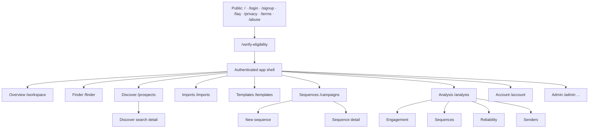

Seven items appear in the operator product nav (Overview, Finder, Discover, Imports, Templates, Sequences, Analysis). Account sits in the sidebar footer as a utility item rather than in the product nav. Admin accounts see the admin nav instead of the operator nav. Public and legal pages are outside the shell and carry the marketing navigation.

### Overview

The operator overview lives at `/workspace` and is rendered by the `OverviewCommandCenter` server component (`src/components/dashboard/overview-command-center.tsx`).

Layout, top to bottom:

1. **Page header** — title "Overview", subtitle "Here's what's happening with your outreach.", and two actions: **Create Sequence** (`/campaigns`) and **Import List** (`/imports`).
2. **Summary strip** — four cells split by hairlines, each a link:

   | Cell | Value | Meaning | Links to |
   | --- | --- | --- | --- |
   | Active sequences | Campaigns whose status is `RUNNING`, or that own a `QUEUED`/`RUNNING` run holding an `executionSlotClaimedAt` | "Running or queued" | `/campaigns?status=active` |
   | Sent (24h) | Confirmed sends in the rolling 24-hour window from `SendLedger`, with a trend label against the preceding 24 hours | Confirmed Gmail sends, not delivered mail | `/campaigns?status=sent` |
   | Needs attention | Sequences with a failed run, failed sends, or invalid recipients | "Action required" / "All clear" | `/campaigns?status=needs-attention` |
   | Lists ready | Processed imports that already carry a field mapping | "Ready to launch" | `/imports` |

3. **Quick actions** — Create sequence, Import list, Create template.
4. **Recent sequences** — the three most recently updated sequences with a client-side search over name and summary, per-row status/progress/metrics, row actions (view, pause/resume, relaunch, delete), and a "View all sequences" link. Refresh polls every 4 seconds while a run is live, pauses while the tab is hidden, and resumes shortly after the tab becomes visible again.
5. **Gmail send window card** — rolling 24-hour usage for the combined user window plus the primary connected sender, with a tone of Healthy / Near limit / Blocked / Paused. "Near limit" starts at 80% of the configured per-sender limit.
6. **Recent activity** — derived from domain tables (runs, imports, templates, Discover searches and expansions, Finder domain searches, prepared Discover exports, and confirmed permanent delivery failures). It is not the admin audit console; only two audit actions (`hunter.email_search`, `discover.results_exported`) are read, because those activities have no durable domain row.

Empty states: each section renders its own empty copy rather than hiding; the send-window card renders an unavailable state when the send ledger table cannot be read. Both themes are supported through the shared token layer; no Overview surface is light- or dark-only.

Guided help auto-opens a contextual onboarding phase at most once per visit, chosen from a state snapshot built entirely from data already loaded on the page — the tour never issues its own backend requests.

#### Metric-to-filter navigation

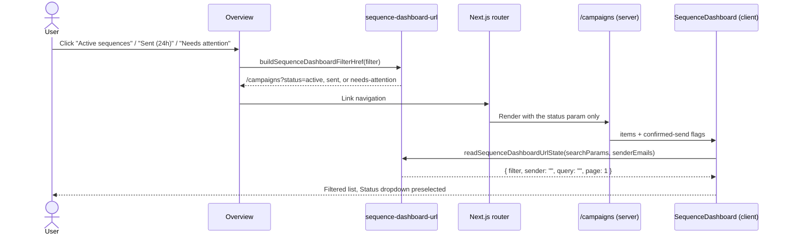

Because the generated href carries only `status`, the search box starts empty and pagination starts at page 1. The dashboard then normalizes the URL with `history.replaceState`, so the filtered view is deep-linkable and reload-safe while browser Back still returns to Overview. Unknown or malformed `status` values fall back to `all`. The parameter `sent-24h` is accepted as an alias of `sent`.

The "Sent (24h)" metric and the `sent` filter read the same confirmed-send source (`listCampaignIdsWithConfirmedSendsSince`, backed by `SendLedger`), so the number and the filtered list cannot disagree. Confirmed sends recorded before campaign attribution existed carry no campaign id and therefore appear in the count but in no sequence row.

Important routes:

- UI: `/workspace`
- API: `/api/send-window`, `/api/campaigns/[id]/status`
- Data: `Campaign`, `CampaignRun`, `RecipientJob`, `SendLedger`, `SenderProfile`, `Import`, `Template`, `Suppression`, `ProspectSearch`, `HunterDomainSearch`

Production notes:

- Rendering `/workspace` calls `resumeCampaignRunsBlockedByDailyLimit` and schedules pending campaign work, so an active workspace tab advances runs even without cron.
- Send-window status is per connected Gmail sender plus a user rollup.
- Schedule type is normalized to `immediate`, `once`, or `recurring`; legacy null values fall back to immediate in dashboard display.

### Analysis

The reporting workspace lives at `/analysis` with four sibling routes. All five render the same client shell (`AnalysisWorkspace`) with a different `page` prop. Full detail is in [§27](#27-analysis-workspace).

Important routes:

- UI: `/analysis`, `/analysis/engagement`, `/analysis/sequences`, `/analysis/reliability`, `/analysis/senders`
- API: `GET /api/analysis/[page]`
- Data: `SendLedger`, `RecipientJob`, `CampaignRun`, `Campaign`, `Template`, `InboundReply`, `ProviderEvent`, `SenderProfile`, `AuditLog`

### Account

The account workspace lives at `/account`: profile summary, password set/change, and connected Gmail sender management. Full detail is in [§28](#28-account-workspace-and-sender-management).

Important routes:

- UI: `/account`
- API: `GET /api/account`, `POST /api/account/password`, `DELETE /api/account/senders/[id]`, `GET /api/auth/google/connect`
- Data: `User`, `SenderProfile`, `Campaign`, `AuditLog`

### Finder

Finder lives at `/finder` and uses Hunter through server-side API routes. Users can save their own Hunter API key, find one email by name and domain, run domain searches, review saved domain search history, group domain results by inferred department, select contacts, and export selected contacts to CSV in the browser.

Important routes:

- UI: `/finder`
- API: `/api/save-api-key`, `/api/email-finder`, `/api/domain-search`, `/api/domain-search/[id]`
- Data: `User.hunterApiKeyEncrypted`, `User.hunterApiKeyLast4`, `HunterDomainSearch`

Production notes:

- Hunter keys are AES-256-GCM encrypted with `HUNTER_KEY_ENCRYPTION_SECRET` in production.
- Domain search history is stored per user when the `HunterDomainSearch` table exists.
- The code gracefully returns empty history if the saved-search table is missing, which helps during partial migrations.

### Imports

Imports are the contact-ingestion module. Users upload CSV/XLS/XLSX files, preview rows, inspect columns, choose template fields, and save field mappings.

The route hosts two modes behind one URL:

- **Library** — the default. A searchable list of finalized imports, each with row count, linked-sequence count, selected template fields, preview rows, a single pencil-icon editor (rename plus template fields in one dialog), and a delete action.
- **Workflow** — a three-step flow: **Upload** → **Map fields** → **Review**. The step strip is clickable, but step 2 requires an import and step 3 requires a saved mapping.

The active mode is derived from the URL, not from component state alone: an import context id (including Discover's `pendingImportId`) or `step=upload` opens the workflow, and a context id that cannot be resolved still opens it so the "import not found" state is shown instead of silently falling back. Leaving the workflow uses `router.replace`, so a subsequent browser Back press does not re-enter it.

Discover can stage a **pending import** — an `Import` row created with status `UPLOADING` and an empty mapping — which is finalized to `PROCESSED` when template fields are saved.

Important routes:

- UI: `/imports`
- API: `/api/imports`, `/api/imports/[id]`, `/api/imports/[id]/columns`, `/api/imports/[id]/mapping`, `/api/imports/[id]/template-fields`
- Data: `Import`, `ImportColumn`, `ImportRow`, `Mapping`

Production notes:

- Uploads are limited to 25 MB.
- Allowed extensions are `.csv`, `.xlsx`, and `.xls`.
- Import object keys are scoped as `users/<userId>/imports/<importId>/<filename>`.
- Import deletion removes dependent mappings/campaigns and best-effort deletes the stored import object.

### Templates

Templates live at `/templates`. Users can create or edit saved templates with subject, body, merge variables, preview payload, and body format.

Current formats:

- `PLAIN_TEXT`
- `HTML`
- `JSON`

Important routes:

- UI: `/templates`
- API: `/api/templates`, `/api/templates/enhance`
- Data: `Template`

Production notes:

- Plain-text rendering preserves paragraphs, unordered lists, and ordered lists.
- JSON templates are validated as JSON and rendered into email HTML from structured values.
- Preview HTML is sanitized with `sanitize-html`.
- AI enhancement uses OpenAI Responses API when `OPENAI_API_KEY` is configured.
- Spam-risk scoring is local heuristic analysis; AI fix-spam uses the latest spam signals as prompt context.

### Sequences

The active sequence workspace is `/campaigns`, with a dedicated creation route at `/campaigns/new` and a detail route at `/campaigns/[id]`. `/sequences`, `/sequences/new`, and `/sequences/[id]` are aliases — the index redirects (preserving query parameters) and the other two re-export the campaign pages. Full detail is in [§30](#30-sequences-workspace).

A sequence is built from:

- Import
- Mapping
- Template
- Sender profile
- Schedule rule
- Optional attachments

Important routes:

- UI: `/campaigns`, `/campaigns/[id]`, `/sequences`, `/sequences/[id]`
- API: `/api/campaigns`, `/api/campaigns/[id]`, `/api/campaigns/[id]/validate`, `/api/campaigns/[id]/launch`, `/api/campaigns/[id]/wait-for-slot`, `/api/campaigns/[id]/pause`, `/api/campaigns/[id]/resume`, `/api/campaigns/[id]/retry-failed`, `/api/campaigns/[id]/sync-bounces`, `/api/campaigns/[id]/status`, `/api/campaigns/[id]/recipient-activity`, `/api/campaigns/[id]/attachments/[attachmentIndex]`
- Data: `Campaign`, `CampaignRun`, `RecipientJob`, `InboundReply`, `ProviderEvent`, `Suppression`, `SendLedger`

Production notes:

- Attachments are limited to 10 MB each and are deduplicated per user by content ([§29](#29-attachment-lifecycle)).
- Setup editing is blocked while a run is actively sending.
- Validation checks system health, sender connection, mapping, template variables, invalid recipients, suppressions, schedule validity, and attachment readability.
- Relaunching a past one-time schedule returns `PAST_SCHEDULE_CONFIRMATION_REQUIRED` until the user confirms conversion to immediate send.
- Sequence detail exposes a **Check bounces** action that reads the connected sender's Gmail delivery-status notifications on demand ([§26](#26-automatic-delivery-failure-detection-gmail-bounce-monitoring)).

### Eligibility Verification

Non-admin users must complete `/verify-eligibility` before using the app shell. The page requires 18+ confirmation, Terms/Privacy acceptance, and Anti-Abuse acceptance. Users can self-report ineligibility, which blocks the account and clears the session.

Important routes:

- UI: `/verify-eligibility`
- API: `/api/auth/eligibility-status`, `/api/auth/verify-eligibility`, `/api/auth/report-ineligible`
- Data: `User.adultVerifiedAt`, `termsAcceptedAt`, `privacyAcceptedAt`, `antiAbuseAcceptedAt`, `policyVersion`, `ageGateVersion`, `eligibilityBlockedAt`, `restrictedAt`

Production notes:

- `requireApiUser()` blocks unverified, blocked, restricted, or capability-disabled users from protected API routes.
- Admin users are not redirected to eligibility verification.

### Legal / Anti-Abuse

Public legal pages live at `/terms`, `/privacy`, and `/abuse`. These pages include 18+ requirements, lawful-use language, recipient-data expectations, Google data boundaries, anti-abuse rules, and legal review notices.

Production note: this document describes product behavior and repository contents. It is not legal advice.

### Admin

Admin users are routed to the admin surface and see admin navigation in the sidebar.

Current admin routes:

- `/admin`
- `/admin/users`
- `/admin/restrictions`
- `/admin/system-health`
- `/admin/activity`

Admin capabilities include user listing, account restrictions, per-capability disables, session revocation, account data deletion, system health inspection, user activity search, and audit-log review.

## 5. User Journey

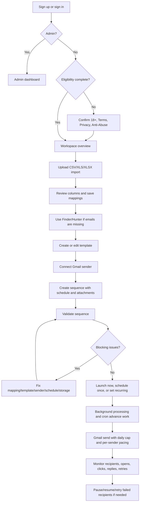

Normal user flow:

1. The user signs up with email/password or Google, or logs in.
2. Non-admin users are redirected to `/verify-eligibility` until they confirm adult eligibility and accept policies.
3. The user uploads a CSV/XLS/XLSX import at `/imports`.
4. Sendloom parses columns, sample rows, normalized rows, and creates an initial mapping.
5. The user maps reserved fields and template variables.
6. The user uses Finder if needed, saving a Hunter key and running email/domain searches.
7. The user creates a template in `/templates`, optionally using spam analysis and AI enhancement.
8. The user connects Gmail through `/api/auth/google/connect`.
9. The user creates a sequence in `/campaigns`.
10. Sendloom validates sender, import, mapping, template, schedule, suppression, storage, and system health.
11. The user launches immediately, schedules once, or configures recurring sends.
12. `processPendingCampaignWork()` creates recipient jobs, sends due jobs, handles pacing/caps, retries transient errors, and finalizes runs.
13. The user monitors Overview and sequence detail pages.
14. Reply sync checks connected Gmail inboxes and matches replies back to recipient jobs.
15. If a finished run has eligible failures, the user can retry failed recipients without resending successful recipients.

## 6. Admin Journey

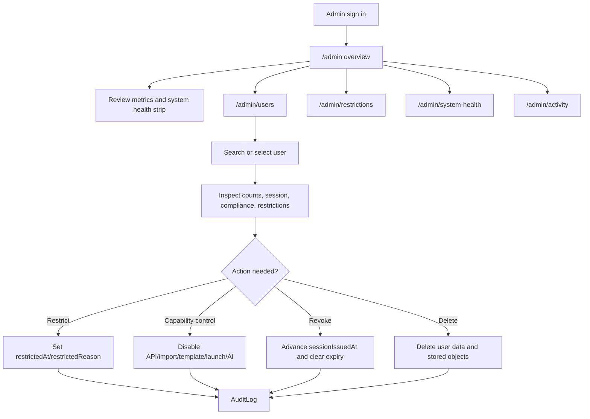

Admin overview shows aggregate metrics, user status, sender-domain breakdowns, and a system health strip.

User management lets an admin inspect account state, session state, counts, compliance fields, and restriction flags. Admins can:

- Disable all API access.
- Disable import writes.
- Disable template writes.
- Disable campaign launches.
- Disable AI enhancements.
- Revoke user sessions.
- Restrict or unrestrict accounts with a reason.
- Delete all account data for a non-admin user.

Admin-only enforcement:

- Admin page access uses `requireAdminUser()`.
- Admin API access uses `requireAdminApiUser()`.
- Admin authority comes from `User.isAdmin`, not an environment-email match at request time.
- Admin accounts and the acting admin's own account are protected from restriction/deletion flows.
- Non-admin admin API attempts are audit logged as security events.

Activity logs:

- `/admin/activity` uses user search, summaries, and paginated audit events.
- `AuditLog` metadata is sanitized on write and again on read.
- Legacy audit rows may lack newer fields; activity lookup matches by `actorUserId` or legacy `actorEmail`.

## 7. Architecture Overview

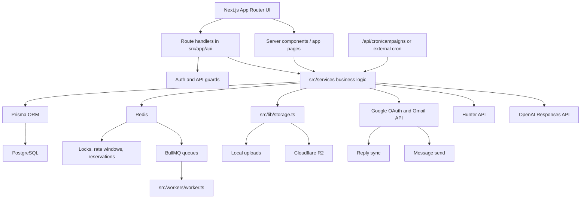

Runtime shape:

| Layer | Current Technology | Notes |
| --- | --- | --- |
| Web app | Next.js 15 App Router, React 19 | Server and client components under `src/app` and `src/components`. |
| Language | TypeScript | Shared route, service, lib, and UI types. |
| Database | PostgreSQL with Prisma | `prisma/schema.prisma` and migrations under `prisma/migrations`. |
| Redis | ioredis | Locks, rate limits, daily reservations, and BullMQ connection. |
| Queues | BullMQ | `validation`, `launch`, `send`, and `webhook` queues exist; serverless path also processes inline/cron. |
| Email sending | Gmail API via OAuth2 and Nodemailer `MailComposer` | Current production sending path is Gmail-centered. |
| Reply sync | Gmail readonly API | Lists inbox messages and matches replies by references/thread fallback. |
| Finder | Hunter API | User-provided API keys encrypted at rest. |
| AI assistance | OpenAI Responses API | Optional subject/body enhancement and spam copy cleanup. |
| Storage | Local filesystem or Cloudflare R2 | Separate buckets/key namespaces for imports and attachments. |
| Security | JWT sessions, CSRF, Redis rate limits, CSP/security headers | Details in [Security Controls](#15-security-controls). |

## 8. Route Map

### Public Routes

| Route | Purpose | Auth | Notes |
| --- | --- | --- | --- |
| `/` | Marketing landing page | Public; redirects signed-in visitors to `/workspace` | Product narrative, workflow, capabilities, trust points, CTA. |
| `/signup` | Account creation | Public; redirects if already signed in | Email/password signup plus Google path via auth page. |
| `/login` | Account sign-in | Public; redirects if already signed in | Email/password and Google sign-in. |
| `/faq` | Frequently asked questions | Public | Uses marketing/legal nav and footer. |
| `/privacy` | Privacy Policy | Public | Includes Google data, 18+ policy, minimization, legal review notice. |
| `/terms` | Terms of Service | Public | Includes lawful-use, sender responsibility, age requirement. |
| `/abuse` | Anti-Abuse Policy | Public | Prohibited uses, enforcement, reporting, minors prohibition. |
| `/verify-eligibility` | Eligibility confirmation | Signed-in user expected | Redirects unauthenticated users to login through API status check. |
| `/track/open/[token]` | Open pixel | Public signed token | Invalid tokens still return a pixel without DB update. Advances only `SENT` recipients. |
| `/track/click/[token]` | Click redirect | Public signed token | Redirect is constrained to same-origin URL. Advances only `SENT`/`OPENED` recipients. |
| `/unsubscribe/[token]` | Legacy unsubscribe route | Public signed token | Adds suppression for the campaign owner if token is valid. |

### Authenticated Operator Routes

| Route | Purpose | Auth | Notes |
| --- | --- | --- | --- |
| `/workspace` | Overview dashboard | Verified non-admin user | Admin users redirect to admin surface. |
| `/finder` | Hunter Finder | Verified user | Requires saved Hunter key for searches. |
| `/prospects` | Discover — Search History | Verified user | One row per company, grouped from that company's searches. Feature-flagged by `PROSPECT_GRAPH_ENABLED`; consumes `POST /api/graphql`; server-paginated at 10/page. |
| `/prospects/[searchId]` | Discover — search detail | Verified owner | Company summary, email-format editor, role groups, people table, inline same-company search, Add 10 more, XLSX export. |
| `/imports` | Import library and workflow | Verified user | CSV/XLS/XLSX upload, mapping, and template fields; mode is URL-identifiable. |
| `/templates` | Template workspace | Verified user | Plain text, HTML, JSON, AI/spam assistance. |
| `/campaigns` | Sequences dashboard | Verified user | Summary cards, health panel, filterable/paginated list. |
| `/campaigns/new` | Sequence creation wizard | Verified user | Import + mapping + template + sender + schedule + attachments. |
| `/campaigns/[id]` | Sequence detail | Verified owner | Setup editor, schedule editor, launch controls, bounce check, activity, replies. |
| `/analysis` | Analysis — Summary | Verified user | Shared Analysis shell; see [§27](#27-analysis-workspace). |
| `/analysis/engagement` | Analysis — Engagement | Verified user | Opens, unopened, replies, timing heatmap, schedule mix. |
| `/analysis/sequences` | Analysis — Sequences | Verified user | Sequence and template comparison. |
| `/analysis/reliability` | Analysis — Reliability | Verified user | Failure categories, run states, operational events, pacing, attention rules. |
| `/analysis/senders` | Analysis — Senders | Verified user | Per-sender capacity, volume, reply rate, health, recent changes. |
| `/account` | Account workspace | Verified user | Profile, password, connected senders; see [§28](#28-account-workspace-and-sender-management). |
| `/sequences` | Alias to campaigns | Verified user | Server redirect that preserves query parameters. |
| `/sequences/new` | Alias to campaign creation | Verified user | Re-exports `/campaigns/new`. |
| `/sequences/[id]` | Alias to campaign detail | Verified owner | Re-exports `/campaigns/[id]`. |
| `/suppressions` | Hidden/internal suppression UI | Verified user | Redirects to `/workspace`; backend APIs remain. |

The app shell also blocks compact touch devices for the dashboard with a desktop-only guidance screen.

### Admin Routes

| Route | Purpose | Auth | Notes |
| --- | --- | --- | --- |
| `/admin` | Admin overview | Admin only | Metrics, user-status chart, health strip. |
| `/admin/users` | User management | Admin only | Searchable/paginated users, inspector, controls, deletion. |
| `/admin/restrictions` | Restriction management | Admin only | Dedicated restriction picker and panel. |
| `/admin/system-health` | System health UI | Admin only | Database, Redis, storage, OAuth, mail provider, cron checks. |
| `/admin/activity` | User activity logs | Admin only | Search users and inspect audit events. |
| `/admin/incidents` | Incident report triage | Admin only | Review privacy-preserving error and manual issue reports. |

### API Routes

| Route | Purpose | Auth Requirement | Notes |
| --- | --- | --- | --- |
| `POST /api/auth/signup` | Email/password account creation | Public + CSRF + rate limit | 5/hour per IP. |
| `POST /api/auth/login` | Email/password login | Public + CSRF + rate limit | 10/min IP and 5/min email. |
| `POST /api/auth/logout` | Logout and session revocation | Session best effort + CSRF | 30/min IP. |
| `GET /api/auth/google/login` | Start Google sign-in | Public | Uses state cookie. |
| `GET /api/auth/google/login/callback` | Finish Google sign-in | Public with state | Rejects unverified Google email and password-account merge. |
| `GET /api/auth/google/connect` | Start Gmail sender connect | Signed-in user | Same-origin navigation defense plus state cookie. |
| `GET /api/auth/google/callback` | Store connected Gmail sender | Signed-in user with state | Upserts `SenderProfile`. |
| `GET /api/auth/eligibility-status` | Read eligibility state | Signed-in user | Used by verification page. |
| `POST /api/auth/verify-eligibility` | Accept 18+/policies | Signed-in user + CSRF | Writes compliance timestamps. |
| `POST /api/auth/report-ineligible` | Self-report under 18 | Signed-in user + CSRF | Blocks user and clears session. |
| `GET /api/account` | Account profile + connected senders | Verified user | Returns `hasPassword` only — never a hash; never an OAuth token. |
| `POST /api/account/password` | Set or change the password | Verified user + CSRF | 10/15min per IP, 5/15min per user. Changing an existing password requires the current one. Rotates the session on success. Errors are generic. |
| `DELETE /api/account/senders/[id]` | Remove a connected sender | Verified owner + CSRF | 404 not found; 409 when it is the only sender or active/scheduled sequences reference it. Deletes when unreferenced, otherwise detaches and revokes send access. Audit logged. |
| `POST /api/imports` | Upload import | Verified user + `importsWrite` | 25 MB, CSV/XLS/XLSX, 10/min user. |
| `PATCH /api/imports/[id]` | Rename import | Verified owner + `importsWrite` | Audit logged. |
| `DELETE /api/imports/[id]` | Delete import | Verified owner + `importsWrite` | Deletes dependent sequences and object. |
| `GET /api/imports/[id]/columns` | Inspect import columns | Verified owner | Returns sample rows/columns. |
| `POST /api/imports/[id]/mapping` | Save mapping | Verified owner + `importsWrite` | Audit logged. |
| `POST /api/imports/[id]/template-fields` | Save template fields | Verified owner + `importsWrite` | Up to 10 selected columns. |
| `GET /api/templates` | List templates | Verified user | User-scoped. |
| `POST /api/templates` | Create/update template | Verified user + `templatesWrite` | 30/min user. |
| `POST /api/templates/enhance` | AI enhance/fix spam | Verified user + `aiEnhance` | 20/min user; requires `OPENAI_API_KEY`. |
| `POST /api/campaigns` | Create sequence | Verified user | Upload attachments, optionally auto-launch/schedule. |
| `PATCH /api/campaigns/[id]` | Update setup or schedule | Verified owner | Schedule updates require launch permission. |
| `DELETE /api/campaigns/[id]` | Delete sequence | Verified owner | Audit logged. |
| `POST /api/campaigns/[id]/validate` | Validate sequence | Verified owner | Stores validation snapshot. |
| `POST /api/campaigns/[id]/launch` | Launch/relaunch | Verified owner + `campaignLaunch` | Handles past once-schedule confirmation. |
| `POST /api/campaigns/[id]/pause` | Pause run | Verified owner | Audit logged. |
| `POST /api/campaigns/[id]/resume` | Resume run | Verified owner | Schedule-aware resume behavior. |
| `POST /api/campaigns/[id]/retry-failed` | Retry eligible failed recipients | Verified owner + `campaignLaunch` | Does not duplicate successful recipients. |
| `GET /api/campaigns/[id]/status` | Read/advance status | Verified owner | Ownership checked before background work. |
| `GET /api/campaigns/[id]/recipient-activity` | Paginated recipient activity | Verified owner | Requires run id. |
| `POST /api/campaigns/[id]/wait-for-slot` | Enter the execution waiting queue | Verified owner + `campaignLaunch` | Used when concurrency capacity is full. |
| `POST /api/campaigns/[id]/sync-bounces` | Manual delivery-status check | Verified owner + CSRF | 6/min per user, `maxDuration` 60s. Returns counts only — never Gmail message content. 409 for non-Gmail or disconnected senders, 503 for a transient Gmail failure. Audit logged. |
| `GET /api/campaigns/[id]/attachments/[attachmentIndex]` | Authenticated attachment download | Verified owner | Private/no-store, safe content disposition, inline only for image/audio/video, PDF, and plain text. |
| `GET /api/analysis/[page]` | Aggregated Analysis payload | Verified user | `page` ∈ `overview`, `engagement`, `sequences`, `reliability`, `senders`; unknown values 404. `from`/`to` are UTC date keys; unsupported ranges normalize to the last 7 days rather than erroring. `Cache-Control: private, no-store`. Aggregation failure returns a generic 500. |
| `POST /api/senders/[id]/sync-bounces` | Per-sender delivery-status sync | Verified owner + CSRF | Bounded, incremental Gmail history read. |
| `POST /api/incidents` | File an incident report | Verified user + CSRF | Used by the automatic error recovery flow and the manual Report issue dialog. Idempotency key per open. |
| `POST /api/incidents/events` | Record incident lifecycle events | Verified user + CSRF | Supporting telemetry for the recovery flow. |
| `GET /api/prospects/exports/[id]` | Download a prepared prospect export | Verified owner | XLSX; 404 when `PROSPECT_GRAPH_ENABLED` is false. Row count capped by `PROSPECT_EXPORT_MAX_ROWS`. |
| `DELETE /api/prospects/exports/[id]` | Discard a prepared export | Verified owner | Same feature gate. |
| `POST /api/graphql` | Discover graph | Verified user | Gated by `PROSPECT_GRAPH_ENABLED`; see [§23](#23-prospect-graph-backend-local-graphql-prototype). |
| `GET /api/send-window` | Gmail daily send windows | Verified user | Per sender plus user rollup. |
| `POST /api/send` | Test email to own account | Verified user | Locked to authenticated user's email, not a relay. |
| `POST /api/save-api-key` | Save Hunter API key | Verified user | 10/min user, encrypted at rest. |
| `POST /api/email-finder` | Hunter email finder | Verified user | 60/min user. |
| `POST /api/domain-search` | Hunter domain search | Verified user | 30/min user, saves history. |
| `GET /api/domain-search/[id]` | Load saved domain search | Verified owner | User-scoped. |
| `GET /api/suppressions` | List suppressions | Verified user | Backend remains although UI is hidden. |
| `POST /api/suppressions` | Add suppression | Verified user | Manual/internal use. |
| `DELETE /api/suppressions/[id]` | Delete suppression | Verified owner | Manual/internal use. |
| `GET /api/admin/users` | List users | Admin API | Admin only. |
| `PATCH /api/admin/users/[id]` | Update controls/restrict/unrestrict | Admin API | Rate limited and audit logged. |
| `DELETE /api/admin/users/[id]` | Delete account data | Admin API | Protected against self/admin deletion. |
| `GET /api/admin/users/search` | Search users for activity | Admin API | 60/min admin. |
| `GET /api/admin/users/[id]/summary` | User activity summary | Admin API | Audit logs view action. |
| `GET /api/admin/users/[id]/activity` | Paginated activity events | Admin API | Filters category/severity/type/search/date. |
| `GET /api/admin/incidents` | List incident reports | Admin API | Triage queue for automatic and manual reports. |
| `PATCH /api/admin/incidents/[id]` | Update incident state | Admin API | Triage status changes. |
| `GET /api/admin/system-health` | Detailed health report | Admin API | Detailed checks hidden from public health. |
| `GET /api/health` | Public health | Public | Returns only `{ status: "ok" }`. |
| `GET /api/csrf` | Issue CSRF cookie/token | Public | Used by fetch patch and verification page. |

### Cron, Webhook, Tracking

| Route | Purpose | Auth Requirement | Notes |
| --- | --- | --- | --- |
| `GET /api/cron/campaigns` | Campaign work, reply sync, watch renewal, bounce sync, disposition repair, automatic bounce monitoring | `Authorization: Bearer <CRON_SECRET>` or `x-cron-secret` | Fails closed in production when the secret is missing. Each stage is individually guarded and reports into the response; monitoring runs last and never blocks send work. |
| `POST /api/cron/campaigns` | Same as GET | Same | Useful for external cron services. |
| `POST /api/webhooks/gmail-pubsub` | Gmail mailbox watch push | Shared-secret query token or Pub/Sub OIDC token | Rejects everything unless `GMAIL_PUBSUB_VERIFICATION_TOKEN` or `GMAIL_PUBSUB_AUDIENCE` is configured. |
| `POST /api/webhooks/resend` | Normalize Resend events | HMAC signature with `RESEND_WEBHOOK_SECRET` | Present even though current send path is Gmail-centered. |
| `GET /track/open/[token]` | Open tracking pixel | Signed tracking token | Conditional write: advances `SENT` → `OPENED` only. Terminal outcomes are never resurrected. |
| `GET /track/click/[token]` | Click tracking redirect | Signed tracking token | Conditional write: advances `SENT`/`OPENED` → `CLICKED` only; same-origin redirect. The redirect still happens even when the status is not advanced. |
| `GET /unsubscribe/[token]` | Unsubscribe/suppress | Signed tracking token | Adds `UNSUBSCRIBED` suppression. |

## 9. Data Model Documentation

| Model | Purpose | Key Relationships | Production Notes |
| --- | --- | --- | --- |
| `User` | Account, auth state, admin flag, Hunter key metadata, restrictions, eligibility/policy timestamps. | Owns senders, imports, mappings, templates, campaigns, suppressions, Hunter searches. | Admin authority is `isAdmin`. Eligibility fields gate app/API access for non-admins. Hunter key is encrypted in `hunterApiKeyEncrypted`. |
| `SenderProfile` | Connected Gmail sender identity. | Belongs to `User`; used by `Campaign`; has `InboundReply` records. | `fromEmail` is unique. `oauthRefreshToken` null means reconnect required. Stores reply sync timestamps/errors. |
| `Import` | Uploaded spreadsheet metadata and storage pointer. | Belongs to `User`; has `ImportColumn`, `ImportRow`, `Mapping`, `Campaign`. | `storagePath` points to local/R2 key. `status` is `UPLOADING`, `PROCESSED`, or `FAILED`. |
| `ImportColumn` | Column metadata from uploaded file. | Belongs to `Import`. | Stores original source name, normalized name, sample type, sample value. |
| `ImportRow` | Row-level audience data. | Belongs to `Import`; referenced by recipient jobs via `importRowId`. | Stores raw payload and normalized JSON. Indexed by import/row and import/email. |
| `Mapping` | Field mapping between import columns and template variables. | Belongs to `User` and `Import`; used by `Campaign`. | Contains `reservedFieldMap` and `variableMap`; latest mapping is used in setup edits. |
| `Template` | Saved subject/body template. | Belongs to `User`; used by `Campaign`. | Supports `format` text values: `PLAIN_TEXT`, `HTML`, `JSON`. `version` increments on edit. |
| `Campaign` | Sequence definition. | Belongs to `User`; references `Import`, `Mapping`, `Template`, `SenderProfile`; has `CampaignRun`. | Stores snapshots of template/mapping/sender at creation/update so runs are stable. `scheduleType` and `scheduleConfig` drive scheduling. |
| `CampaignRun` | One execution of a sequence. | Belongs to `Campaign`; has many `RecipientJob`. | Tracks status, scheduled time, counts, `progressSnapshot`, and replied count. Safety pauses are stored in `progressSnapshot`. |
| `RecipientJob` | Per-recipient delivery unit. | Belongs to `CampaignRun`; can have `InboundReply`. | Stores rendered subject/body, unique dedupe key, status, retry count, next retry, provider id, reply count, and diagnostics metadata. |
| `InboundReply` | Gmail reply matched back to a sent recipient job. | Belongs to `SenderProfile`; optionally belongs to `RecipientJob`. | `gmailMessageId` unique prevents duplicate reply records. |
| `ProviderEvent` | Normalized provider webhook events. | Matched to `RecipientJob` by provider message id. | Deduped by provider/message/event type. Used mostly for Resend webhook compatibility and tracking states. |
| `Suppression` | Suppressed recipient email per user. | Belongs to `User`. | Unique per `(userId, email)`. UI hidden but backend used for unsubscribe, hard bounce, complaint, invalid/manual block. |
| `RateLimitWindow` | Legacy/model support for rate windows. | No direct current service dependency for Redis-backed limits. | Present in schema; Redis is the active rate-limit backend. |
| `SendLedger` | Source of truth for confirmed Gmail sends. | Stores optional user/sender/campaign/run/recipient references. | Used for rolling 24-hour daily safety cap. Indexed by sender/time and user/time. |
| `AuditLog` | Admin-grade operational and security audit trail. | References actors by `actorUserId` and/or `actorEmail`. | Metadata is sanitized; older rows may only have legacy fields. |
| `HunterDomainSearch` | Saved Hunter domain search history. | Belongs to `User`. | Unique by `(userId, domain)` and stores result JSON. Code handles missing table gracefully. |
| `AttachmentAsset` | One row per unique attachment file a user has uploaded. | Belongs to `User` (`onDelete: Cascade`). | Unique on `(userId, sha256, sizeBytes, contentType)`; indexed on `(userId, createdAt)`. `storageKey` is content-addressed. Dedupe is per user and never cross-user. Campaign snapshots reference `storageKey`, so many sequences can share one object. |
| `IncidentReport` | Privacy-preserving error and manual issue reports. | Referenced by admin triage. | Reporter identity is stored as an HMAC pseudonym plus an encrypted internal reference; diagnostics are allow-listed and redacted. See [§25](#25-error-recovery-and-incident-reporting). |
| `ProspectSearchPerson` | The per-search allocation grant: one row per person granted to one user-owned search action. | Belongs to `ProspectSearch` and `ProspectPerson`. | Unique on `(searchId, personId)`. This is the ownership boundary between the shared cross-user cache and what a user actually receives; every user-facing count derives from these rows, never from cache pool size. `allocationSource` records `CACHE`, `PROVIDER`, `ADD_MORE_CACHE`, `ADD_MORE_PROVIDER`, or `BACKFILL`. |
| `DiscoverSearchCache` | Shared, cross-user cache of normalized Discover provider results. | Keyed by a canonical search fingerprint. | Stores no requester identity. Carries its own email-format discovery status/TTL fields so people-cache freshness never suppresses a format retry. |
| `DiscoverSearchExpansion` | One "Add 10 more" request against a READY search. | Belongs to `ProspectSearch` and `User`. | Idempotent per client-supplied key, so a retry never consumes a second daily slot. |

Notable field-level changes in this revision:

| Model | Field | Meaning |
| --- | --- | --- |
| `User` | `attachmentAssets` | Relation to the new dedupe rows. |
| `ProspectCompany` | `canonicalKey` | Tenant-local canonical identity. Resolved domains are authoritative; normalized names are a fallback while a domain is unknown. Replaces `(userId, normalizedName)` as the unique key; `normalizedName` remains indexed. |
| `ProspectCompany` | `emailFormatAuthority` | `MANUAL`, `SOURCE`, `AI`, `SHARED_CACHE`, or `UNRESOLVED`. Prevents a lower-authority update from erasing stronger evidence. |
| `ProspectCompany` | `emailFormatDiscoveryStatus` / `...Reason` / `...At` | Typed outcome of the most recent discovery attempt, so provider, config, and parser failures stay distinct from genuine no-evidence. |
| `DiscoverSearchCache` | `emailFormatDiscoveryStatus` / `...Reason` / `...At` / `...ExpiresAt` | Independent email-format discovery state and TTL, indexed on status. |
| `ProspectPerson` | `allocations` | Relation to `ProspectSearchPerson`. |
| `CampaignRun` | `progressSnapshot.bounceMonitor` | Automatic bounce-monitoring cadence checkpoint. Schema-free JSON slot shared with the daily-limit pause info; every writer spread-merges so the keys coexist. |

### Important Migrations

| Migration | What It Adds | Operational Importance |
| --- | --- | --- |
| `20260324154336_init` | Core enums and tables: users, senders, imports, mappings, templates, campaigns, runs, jobs, provider events, suppressions, audit log. | First database foundation. |
| `20260324200000_google_oauth_senders` | Sender `userId`, OAuth refresh token/scope, sender user index. | Connected Gmail sender ownership and sending. |
| `20260324213000_user_scoped_data` | `userId` on imports, mappings, templates, campaigns, suppressions; scoped suppression uniqueness. | Multi-user ownership boundaries. |
| `20260327143000_template_format_modes` | `Template.format`. | Plain text / HTML / JSON template modes. |
| `20260328193000_admin_dashboard_controls` | Admin flag, restriction flags, session timestamps. | Admin controls and session visibility. |
| `20260330173000_gmail_reply_sync` | Reply sync columns and `InboundReply`. | Gmail reply matching and reply metrics. |
| `20260404132000_user_hunter_api_keys` | Encrypted Hunter key columns. | Per-user Hunter integration. |
| `20260419140500_hunter_domain_search_history` | `HunterDomainSearch`. | Saved domain search history. |
| `20260524090000_send_ledger` | `SendLedger`. | Rolling Gmail daily safety cap. |
| `20260524113500_backfill_send_ledger` | Legacy ledger backfill from sent recipient jobs. | Makes safety windows aware of older successful sends. |
| `20260525013000_repair_send_ledger_timestamps` | Repairs legacy ledger sent times from recipient metadata. | Improves accuracy of rolling 24-hour window. |
| `20260609170000_audit_event_log` | Admin-grade audit fields, indexes, backfill/categorization. | User activity logs and admin audit UI. |
| `20260612235800_user_compliance_fields` | Eligibility, policy, block, and restriction columns. | 18+ gate, policy acceptance, anti-abuse enforcement. |
| `20260627120000_add_incident_reporting` | Incident report storage. | Privacy-preserving error and issue reports. |
| `20260701120000_gmail_bounce_monitoring` | Gmail watch/history/bounce-sync columns on `SenderProfile`. | Delivery-status notification pipeline. |
| `20260704090000_free_sequence_limits` | Execution slot claim and waiting-queue columns. | Retained-sequence and concurrency limits. |
| `20260704120000_discover_search_person_allocations` | `ProspectSearchPerson` plus backfill. | Caps each Discover search at its granted people and hides the shared pool. |
| `20260704200000_canonical_company_email_format` | `ProspectCompany.canonicalKey`, `emailFormatAuthority`, new unique key. | Collapses duplicate company rows and protects email-format evidence. |
| `20260706003000_fresh_discover_email_format_status` | Typed email-format discovery status/reason/timestamps on company and cache. | Stops empty discoveries from being stamped as fresh, which previously produced "Ready but unavailable" formats. |
| `20260707120000_attachment_assets` | `AttachmentAsset` table, unique dedupe index, user index, cascade FK. | Per-user content-addressed attachment deduplication. |

## 10. Gmail Sending System

### Connected Sender Profiles

Users connect Gmail through Google OAuth:

- Login scopes: `openid`, `email`, `profile`.
- Gmail connect scopes: login scopes plus `https://www.googleapis.com/auth/gmail.send` and `https://www.googleapis.com/auth/gmail.readonly`.
- Connect route: `/api/auth/google/connect`.
- Connect callback: `/api/auth/google/callback`.

The connect callback verifies the OAuth state cookie, exchanges the code, reads Google user info, and upserts a `SenderProfile` with `provider = "google_oauth"`, `providerRef`, `fromEmail`, `name`, `oauthRefreshToken`, `oauthScope`, and profile metadata.

### Gmail Send Path

The main send path is:

1. `launchCampaign()` creates or resumes a `CampaignRun`.
2. `ensureRecipientJobs()` creates one `RecipientJob` per eligible import row.
3. Templates are rendered with the mapping payload.
4. An open-tracking pixel is appended to rendered HTML.
5. `processPendingCampaignWork()` or the BullMQ send worker picks due jobs.
6. Daily capacity is reserved with `reserveSendCapacity()`.
7. Per-sender send window is consumed with `consumeSendWindow()`.
8. Attachments are loaded from R2/local storage if present.
9. `sendEmail()` builds a raw MIME message with Nodemailer `MailComposer`.
10. A Google access token is refreshed from the stored refresh token.
11. Gmail API `users/me/messages/send` sends the base64url raw message.
12. The recipient job is marked `SENT`.
13. `recordSendOnLedger()` writes the confirmed send and releases the Redis reservation.

### Attachment Handling

Attachments can be uploaded with sequences and stored as object keys in the `templateSnapshot.attachments` array. At send time, `src/lib/provider.ts` resolves each attachment either from `contentBase64` or from object storage using `getObjectBuffer("attachments", storagePath)`.

Authenticated downloads use `/api/campaigns/[id]/attachments/[attachmentIndex]`. The route verifies campaign ownership, reads the stored object, derives a conservative content type, sets `Cache-Control: private, no-store`, sets `X-Content-Type-Options: nosniff`, and forces download for unsafe MIME types.

### Reply Sync

Reply sync runs through `src/services/replies.ts`:

- Candidate senders are Gmail OAuth senders with refresh tokens and prior sends.
- Sync is throttled per sender with Redis locks and minimum intervals.
- Gmail inbox messages are fetched after the last sync time, with overlap.
- Metadata headers are read for `From`, `Subject`, `Date`, `In-Reply-To`, and `References`.
- Replies are matched first by referenced message ids and then by Gmail thread fallback.
- Matched replies create `InboundReply` records and increment `RecipientJob.replyCount`.
- Touched run counts are resynced.

The cron route also calls `syncConnectedSenderReplies()` after campaign processing.

### Tracking

Open tracking:

- `appendTrackingMarkup()` adds a 1x1 pixel URL.
- `/track/open/[token]` verifies the signed token and updates the recipient job to `OPENED`.
- Invalid open tokens return a transparent pixel without mutating state.

Click tracking:

- `/track/click/[token]` verifies the signed token and updates status to `CLICKED`.
- Redirect destinations must resolve to the same origin as `APP_BASE_URL`, preventing open redirects.

Unsubscribe:

- `/unsubscribe/[token]` verifies a token and upserts an `UNSUBSCRIBED` suppression for the campaign owner.
- The operator-facing suppression page is hidden, but backend suppression still affects validation and recipient job creation.

### Error Classification And Diagnostics

Gmail errors are classified by `src/lib/retry-policy.ts` and `src/lib/gmail-errors.ts`.

Retryable categories include:

- `GMAIL_RATE_LIMITED`
- `GMAIL_TEMPORARY_FAILURE`
- queue/database/reply/tracking transient failures

Reconnect categories include:

- expired/revoked token
- invalid grant
- refresh-token failure
- missing required Gmail send permission

Permanent/rejected categories include true recipient rejections or non-retryable Gmail send rejection.

Provider diagnostics are written to `RecipientJob.metadata` with redaction for token/secret-shaped strings. The system intentionally stores provider status/code/reason/message, retryability, attempt timestamps, and next retry data, but not OAuth tokens or raw message bodies in audit logs.

## 11. Gmail Safety Controls

Sendloom has two separate Gmail protections:

1. Rolling 24-hour daily safety cap.
2. Per-minute per-sender pacing.

They are independent and both are enforced.

### Daily Rolling 24-Hour Cap

| Setting | Value |
| --- | --- |
| Env var | `GMAIL_DAILY_SEND_SAFETY_LIMIT` |
| Default | `450` |
| Scope | Prefer `SenderProfile`; fallback to user/global only when sender scope is missing |
| Window | Rolling 24 hours from now, not midnight reset |
| Source of truth | `SendLedger` plus legacy confirmed recipient data |

Before every Gmail call, `reserveSendCapacity()` checks the ledger-backed rolling count and atomically reserves one Redis slot. If no capacity remains, the run is paused with `progressSnapshot.pauseReason = "DAILY_SEND_LIMIT"`, the in-flight recipient stays `PENDING`, and the UI can display an automatic resume time.

What counts:

- Confirmed Gmail sends recorded via `recordSendOnLedger()`.
- Initial sends and future follow-up send kinds if recorded.
- Successful recipient states that remain confirmed sent/opened/clicked in the rolling ledger logic.

What does not count:

- Failed send attempts.
- Suppressed recipients.
- Invalid recipients.
- Skipped recipients with unresolved template variables.
- Per-minute pacing waits, because Gmail is not called.

If the ledger table is missing during partial deployment, the code reports the ledger unavailable rather than silently over-sending.

### Per-Minute Gmail Pacing

| Setting | Value |
| --- | --- |
| Env var | `GMAIL_SENDS_PER_MINUTE` |
| Default | `3` |
| Scope | Per connected sender (`SenderProfile`) |
| Redis key | `gmail-send-rate:sender:<id>` |
| Concurrency env | `GMAIL_SENDER_CONCURRENCY` |
| Concurrency default | `2` |

The pacing window is an atomic Redis per-minute counter. When the sender window is full:

- Gmail is not called.
- Daily send reservation is released.
- Recipient job stays `PENDING`.
- `retryCount` is not incremented.
- `nextRetryAt` is set to the next send window.
- Metadata includes `blockedBy: "GMAIL_SENDER_PACING"`.
- UI can show the recipient as queued/waiting, not failed/permanent.

Fairness:

- Parallel sequences using the same sender share the sender's minute window.
- Processing groups due runs by sender and splits the sender's capacity across competing runs.
- A sender that fills its window does not block other senders.

Throttle handling:

- Gmail may still return 429, quota, backend, or temporary errors.
- Retryable throttles are retried with backoff or cause a sender-limit pause.
- The documentation must not be read as a guarantee that Gmail errors can never happen.

## 12. Sequence Scheduling

Supported schedule types:

| Schedule Type | Stored Value | Behavior |
| --- | --- | --- |
| Send immediately | `immediate` | Launch queues a run for immediate processing. |
| Schedule once | `once` | Requires future `scheduledFor`; creates one due run. |
| Repeat schedule | `recurring` | Supports daily or weekly schedules, time, timezone, and multiple weekdays for weekly schedules. |

Scheduling implementation:

- `src/lib/schedule.ts` converts local date/time and timezone into UTC run dates.
- Recurring weekly schedules normalize `daysOfWeek`.
- `src/lib/campaign-scheduling.ts` decides whether a scheduled campaign needs a run.
- `queueScheduledRuns()` scans schedulable campaigns and creates due runs under a Redis lock.
- `processPendingCampaignWork()` processes due queued/running runs.

Validation before launch checks:

- Sender ownership and reconnect state.
- Import existence and row count.
- Mapping ownership and missing mapped columns.
- Template subject/body and unmapped variables.
- Unresolved variables per row.
- Invalid, duplicate, suppressed, and unsubscribed recipients.
- Schedule validity and future one-time schedules.
- Attachment metadata, readability, and 10 MB limit.
- System health for database, Redis, app base URL, session secret, cron, and Google OAuth.

Relaunch behavior:

- If a paused run exists, launch resumes it.
- If a one-time schedule is in the past, launch returns `PAST_SCHEDULE_CONFIRMATION_REQUIRED`.
- If the user confirms, the route converts the schedule to immediate and launches.
- Completed sequences can have their schedule edited; new scheduled runs can be created when the latest run is terminal.

Pause/resume:

- Manual pause sets active run and campaign status to `PAUSED`.
- Resume is schedule-aware:
  - immediate queues now
  - one-time uses original future time if still future, otherwise queues now
  - recurring advances to next occurrence instead of sending immediately

Background processing:

- The current code supports serverless-style processing through `after()` callbacks and `/api/cron/campaigns`.
- `npm run scheduler` runs a 60-second local loop for long-running environments.
- `npm run worker` starts BullMQ workers for launch/send/webhook queues.

## 13. Storage System

Sendloom supports two object storage modes:

| Mode | Env | Behavior |
| --- | --- | --- |
| Local | `OBJECT_STORAGE_MODE=local` | Writes under `LOCAL_UPLOAD_DIR`; on Vercel local path resolves under `/tmp`. |
| Cloudflare R2 | `OBJECT_STORAGE_MODE=r2` | Uses S3-compatible Cloudflare endpoint and separate imports/attachments buckets. |

Important functions:

- `buildImportKey(userId, importId, fileName)`
- `buildAttachmentKey(userId, fileName)`
- `uploadObject()`
- `getObjectBuffer()`
- `deleteObject()`
- `assertSafeStorageKey()`

Storage keys are sanitized and scoped. Absolute paths, drive-letter paths, traversal segments, empty path segments, and unsafe local resolved paths are rejected.

R2 buckets:

- Imports bucket: `CLOUDFLARE_R2_IMPORTS_BUCKET`
- Attachments bucket: `CLOUDFLARE_R2_ATTACHMENTS_BUCKET`

Authenticated downloads:

- Attachments are not served directly from R2 by default.
- The app downloads attachment bytes server-side after ownership checks.
- `CLOUDFLARE_R2_PUBLIC_BASE_URL` is optional and only used by `getObjectUrl()`, not as the primary secure download path.

Production recommendation:

- Use R2 for production and Vercel-style deployments because local filesystem storage is ephemeral.
- Keep imports and attachments in separate R2 buckets as required by current env validation.

## 14. Compliance, Eligibility, And Anti-Abuse

This section documents implemented product controls. It is not legal advice.

Eligibility controls:

- Non-admin authenticated users without acceptance timestamps are redirected to `/verify-eligibility`.
- Users must confirm:
  - age 18+
  - Terms of Service acceptance
  - Privacy Policy acceptance
  - Anti-Abuse Policy acceptance
- The verification API writes timestamps and version fields to `User`.
- Users who select "I am not eligible" get `eligibilityBlockedAt` and `eligibilityBlockedReason = "self_reported_underage"`.
- Blocked users cannot sign in/use APIs and are shown access unavailable messaging.

Anti-abuse controls:

- `/abuse` lists prohibited uses, including spam, harassment, contacting minors, deception, phishing, credential theft, malware, hate/threat content, child-safety violations, unlawful scraping, suppression bypass, and Google policy violations.
- `requireApiUser()` blocks restricted or unverified users on protected APIs.
- Admins can restrict/unrestrict accounts with an audit trail.
- Admins can disable specific capabilities: API, imports, templates, launches, and AI enhancement.
- Suppression records are still applied in validation and job creation.

Data minimization and retention signals in code/content:

- The Privacy page states Sendloom does not collect exact date of birth, unnecessary location data, device fingerprints, or behavioral analytics from users who have not completed eligibility verification.
- It also states incomplete/unverified onboarding records may be purged after 30 days. The current repository documents this policy language, but no automated purge worker was found in the inspected code.

## 15. Security Controls

### Authentication And Sessions

- Session cookie name: `mergepilot_session`.
- Session token: JWT signed with `SESSION_SECRET`.
- Audience: `sendloom-session`.
- Type claim: `session`.
- Duration: 30 days.
- Cookie: HTTP-only, SameSite Lax, Secure in production.
- DB session timestamps (`sessionIssuedAt`, `sessionExpiresAt`) allow revocation/freshness checks.
- Logout clears the cookie and advances `sessionIssuedAt` to invalidate older JWTs.

### Admin Authority

- Admin status comes from `User.isAdmin`.
- `ADMIN_EMAIL` and `ADMIN_PASSWORD` only bootstrap the first admin through `ensureBootstrapData()`.
- Signup never grants admin based on email.
- Runtime email equality to `ADMIN_EMAIL` does not grant admin.

### API Guards

- `requireApiUser()` requires a valid session and checks:
  - global API disabled
  - capability disabled
  - eligibility blocked
  - restricted account
  - missing eligibility/policy confirmation
- `requireAdminApiUser()` requires a valid admin user and logs denied admin attempts.
- Many service methods use `findFirstOrThrow` with `userId` filters for ownership.

### CSRF

- Middleware enforces CSRF on unsafe same-origin `/api/*` methods except `/api/cron` and `/api/webhooks`.
- Token cookie: `sendloom_csrf`, readable by client, SameSite Lax, Secure in production.
- Header: `x-csrf-token`.
- `CsrfFetchPatch` adds the token to same-origin unsafe fetches.

### Rate Limiting

Redis-backed rate limits protect:

| Area | Key Scope | Limit |
| --- | --- | --- |
| Signup | IP | 5/hour |
| Login | IP | 10/min |
| Login | email | 5/min |
| Logout | IP | 30/min |
| Imports create | user | 10/min |
| Templates write | user | 30/min |
| Template AI enhance | user | 20/min |
| Campaign create/update/delete/validate/pause/resume | user | route-specific 10 to 30/min |
| Campaign launch/retry failed | user | 10/min |
| Finder email search | user | 60/min |
| Domain search | user | 30/min |
| Save Hunter key | user | 10/min |
| Admin user update/delete/search/activity | admin user | route-specific 10 to 120/min |

In production, Redis rate-limit failures throw instead of silently allowing. In development, the code may allow through if Redis is unavailable.

### OAuth State And Google Security

- Google login and Gmail connect both use random state cookies.
- Gmail connect callback requires a signed-in Sendloom user.
- Google login rejects unverified Google emails.
- Google login links a verified Google identity (by stable `sub`) to the existing account with the same verified email, so one account can sign in with password and Google; conflicting identities fail closed.
- Gmail connect prevents a Gmail account from being connected to a different Sendloom user if already owned.

### Secrets And Token Separation

- Session tokens use `SESSION_SECRET`.
- Tracking tokens use `TRACKING_SECRET` in production.
- Hunter keys use `HUNTER_KEY_ENCRYPTION_SECRET` in production.
- Cron uses `CRON_SECRET`.
- Resend webhooks use `RESEND_WEBHOOK_SECRET`.

The code intentionally avoids reusing session secrets for tracking/Hunter keys in production.

### Upload And Storage Protections

- Import file extension allowlist: CSV/XLS/XLSX.
- Import size limit: 25 MB.
- Attachment size limit: 10 MB.
- Storage key validation rejects traversal and absolute paths.
- Attachment downloads derive safe content types and force download for risky MIME types.

### Security Headers

`next.config.mjs` configures:

- Strict-Transport-Security
- X-Content-Type-Options: `nosniff`
- Referrer-Policy: `strict-origin-when-cross-origin`
- Permissions-Policy disabling camera, microphone, geolocation
- X-Frame-Options: `DENY`
- Content-Security-Policy with self defaults and specific external connect targets

## 16. UI/UX Documentation

### Landing Page

The landing page is a branded marketing page with:

- Animated email path background.
- Landing pointer effects.
- Glass/floating nav that changes on scroll.
- Product story around Import, Enrich, Template, Sequence, Follow-up, Track.
- Capability cards for imports, Hunter, templates, Gmail, scheduling, and tracking.
- Responsible-outreach trust points.
- Theme switcher.

History shows multiple landing iterations, including Three.js marketing, later premium landing redesigns, and a major current landing update around "Cold outreach that feels crafted, not sprayed."

### Navbar And Footer

Marketing/legal navigation:

- `LandingNav` supports desktop links, mobile panel, theme switcher, Login and Try it CTAs.
- Legal pages pass specific nav items for Home, Privacy, Terms, Abuse, Contact.

Footer:

- `MarketingFooter` is a reusable public/legal footer.
- It includes Product, Company, Resources columns.
- It includes badges: 18+ only, Google OAuth, User-owned sender, Safe pacing, Anti-abuse controls.
- Motion is progressive enhancement and respects reduced motion.

### Auth Pages

Auth pages use `AuthPage` with:

- Back-to-home control.
- Animated email path.
- Auth pointer effects.
- Preview video panel.
- Google sign-in button.
- Email/password forms.
- Password visibility controls in form code.
- Legal links.

### Dashboard Sidebar

Full behavior is documented in [§31](#31-navigation-and-shared-page-shell). In summary, the sidebar persists its collapsed state in both a cookie and `localStorage`, swaps the entire nav for admin accounts, and blocks compact touch layouts via `AppMobileGate`.

Operator nav:

- Overview (`/workspace`)
- Finder (`/finder`)
- Discover (`/prospects`)
- Imports (`/imports`)
- Templates (`/templates`)
- Sequences (`/campaigns`)
- Analysis (`/analysis`) — expandable to Summary, Engagement, Sequences, Reliability, Senders

Sidebar footer (non-admin): theme control, **Account** (`/account`), logout.

Admin nav:

- Overview
- Users
- Restrictions
- System Health
- Activity Logs
- Incident Reports

### Startup Overlay

A readiness-driven boot overlay covers the first paint. It is dismissed from wall-clock time plus an app-ready signal (`setTimeout` + `Date.now()`), never from animation callbacks, so a hidden or throttled tab cannot leave it stuck. A hard maximum-visible ceiling always removes it, and returning to a hidden tab reconciles the stage and dismisses immediately. It never re-mounts a second overlay.

### Shared Page Header

`WorkspacePageHeader` (`src/components/workspace-page-header.tsx`) renders the canonical title / subtitle / actions block. Its layout comes from the Sequences dashboard, so list and dashboard pages stay aligned without page-specific title systems. The Overview and Analysis pages render their own headers because they carry different controls.

### Sequence Detail UI

The sequence detail surface includes setup state, schedule labels, validation blockers, launch controls, pause/resume, retry failed, attachments, recipient activity, replies, and delivery metrics. Recent updates added:

- Past scheduled relaunch confirmation modal.
- Schedule editing for completed/eligible sequences.
- Locking setup while active runs are sending.
- Recipient activity pagination.
- Better action hierarchy and dropdown controls.

### Light/Dark Theme

Theme support appears across landing, legal pages, dashboard, auth, footer, and loader surfaces through global CSS/theme scripts and `ThemeSwitcher`.

## 17. Environment Variables

| Variable | Required | Purpose | Default | Production Warning |
| --- | --- | --- | --- | --- |
| `DATABASE_URL` | Yes | Prisma/PostgreSQL pooled/runtime connection. | None | Required for app startup and Prisma. |
| `DATABASE_URL_UNPOOLED` | Recommended/Prisma direct URL | Direct database connection used by Prisma schema `directUrl`. | None | Set for managed Postgres migrations when pooling is used. |
| `REDIS_URL` | Yes | Redis for rate limits, locks, reservations, BullMQ. | None | Production rate limits and pacing depend on Redis. |
| `SESSION_SECRET` | Yes | JWT session signing. | None | Must be high entropy and separate from tracking/Hunter secrets. |
| `TRACKING_SECRET` | Required in production | JWT tracking token signing. | Falls back to `SESSION_SECRET` only in dev | Set before sending production tracking links. |
| `MAIL_PROVIDER` | Optional | Provider selector. Current active send path is Gmail. | `gmail` | `resend` is not a complete current sending path in `sendEmail()`. |
| `GOOGLE_CLIENT_ID` | Required for Google login/Gmail | OAuth client id. | None | Configure both login and Gmail connect callbacks. |
| `GOOGLE_CLIENT_SECRET` | Required for Google login/Gmail | OAuth client secret. | None | Enable Gmail API in the Google Cloud project. |
| `OPENAI_API_KEY` | Optional | Template AI enhancement and spam fix. | None | AI endpoint fails with a user error if missing. |
| `HUNTER_KEY_ENCRYPTION_SECRET` | Required in production | Encrypts stored Hunter API keys. | Dev fallback to `SESSION_SECRET` derived key | Set before saving production Hunter keys; rotation requires planning. |
| `CRON_SECRET` | Required in production | Protects `/api/cron/campaigns`. | Dev can run without it | Production cron route fails closed if missing. |
| `RESEND_API_KEY` | Optional | Reserved/provider expansion. | None | Current Gmail send path does not require it. |
| `RESEND_WEBHOOK_SECRET` | Required for Resend webhooks in production | HMAC verification for `/api/webhooks/resend`. | None | Webhook fails closed in production when missing. |
| `APP_BASE_URL` | Yes | Redirects, OAuth callback base, tracking links. | None | Must be exact deployed origin. |
| `OBJECT_STORAGE_MODE` | Optional | `local` or `r2`. | `local` | Use `r2` for production/serverless. |
| `LOCAL_UPLOAD_DIR` | Optional | Local upload root. | `./uploads` | Local storage is ephemeral on Vercel-style platforms. |
| `CLOUDFLARE_R2_ACCOUNT_ID` | Required when R2 | Cloudflare account id. | None | Required when `OBJECT_STORAGE_MODE=r2`. |
| `CLOUDFLARE_R2_IMPORTS_BUCKET` | Required when R2 | Imports bucket. | None | Keep imports separate from attachments. |
| `CLOUDFLARE_R2_ATTACHMENTS_BUCKET` | Required when R2 | Attachments bucket. | None | Keep attachments separate from imports. |
| `CLOUDFLARE_R2_ACCESS_KEY_ID` | Required when R2 | R2 access key id. | None | Server-side only. |
| `CLOUDFLARE_R2_SECRET_ACCESS_KEY` | Required when R2 | R2 secret key. | None | Server-side only. |
| `CLOUDFLARE_R2_PUBLIC_BASE_URL` | Optional | Public URL helper for object keys. | None | Not required for authenticated downloads. |
| `DEFAULT_FROM_EMAIL` | Optional | Default sender metadata. | None | Current Gmail sender profiles usually provide sender address. |
| `DEFAULT_FROM_NAME` | Optional | Default sender display name. | None | Used by test-send fallback. |
| `ADMIN_EMAIL` | Optional | Bootstrap admin email. | None | Does not grant admin at request time. |
| `ADMIN_PASSWORD` | Optional | Bootstrap admin password. | None | Required with admin email for seed/upsert path. |
| `GMAIL_DAILY_SEND_SAFETY_LIMIT` | Optional | Rolling 24-hour successful sends per sender. | `450` | Raising it can exceed Gmail limits. |
| `GMAIL_SENDS_PER_MINUTE` | Optional | Per-minute sends per connected sender. | `3` | Keep conservative. Higher values can mass-fail large sequences. |
| `GMAIL_SENDER_CONCURRENCY` | Optional | Simultaneous Gmail sends in worker. | `2` | Concurrency never bypasses per-minute pacing. |
| `GMAIL_PUBSUB_TOPIC` | For bounce monitoring | Cloud Pub/Sub topic the Gmail mailbox watch publishes to. | None | Without it, mailbox watches cannot be registered and bounce detection falls back to bounded polling. |
| `GMAIL_PUBSUB_VERIFICATION_TOKEN` | One of this or the audience | Shared secret appended to the push endpoint URL (`?token=…`). | None | The webhook rejects every request unless this or `GMAIL_PUBSUB_AUDIENCE` is configured. |
| `GMAIL_PUBSUB_AUDIENCE` | One of this or the token | Expected audience of the Pub/Sub OIDC push token, usually the webhook URL. | None | Preferred over the shared-secret form where OIDC push is available. |
| `GMAIL_PUBSUB_SERVICE_ACCOUNT` | Optional | Service-account email the OIDC push token must carry. | None | Tightens webhook acceptance to one publisher identity. |
| `REPORT_PSEUDONYM_SECRET` | Required in production | HMAC key for the anonymous incident-reporter pseudonym. | Falls back to `SESSION_SECRET` in development | Server-only. Never prefix with `NEXT_PUBLIC_`. Rotating it breaks continuity of existing pseudonyms. |
| `REPORT_IDENTITY_ENCRYPTION_KEY` | Required in production | AES-256-GCM key for the reversible internal reporter reference. | Falls back to `SESSION_SECRET` in development | Server-only. Use a 32-byte random value. Rotating it makes existing encrypted references unreadable. |
| `PROSPECT_EXPORT_MAX_ROWS` | Optional | Maximum rows in one prospect export. | `5000` | Exceeding it returns a forbidden error rather than a partial file. |

Discover and prospect-graph variables (`PROSPECT_GRAPH_ENABLED`, `GRAPHQL_GRAPHIQL_ENABLED`, `LOCAL_PROSPECT_MAX_RESULTS`, the `DISCOVER_*` family, the `PROSPECT_AI_*` family, `PROSPECT_EMAIL_*`, `WEB_SEARCH_PROVIDER`, `SERPER_API_KEY`, `BRAVE_SEARCH_API_KEY`, `APIFY_API_TOKEN`, `APIFY_PROSPECT_ACTOR_ID`) are documented with their defaults in [§23](#23-prospect-graph-backend-local-graphql-prototype) and in the README environment tables. `.env.example` at the repository root is the authoritative starting point; it contains placeholders only.

`GMAIL_USER` and `GMAIL_APP_PASSWORD` still appear in `.env.example` but are not read anywhere in the current source. Gmail sending uses OAuth exclusively.

## 18. Local Development

Prerequisites:

- Node.js 22.x (`.nvmrc` contains `22`; `package.json` requires Node `22.x` and npm `>=10.0.0`).
- PostgreSQL.
- Redis.
- Google OAuth credentials for Google login/Gmail sending.
- Optional Hunter and OpenAI credentials.

Install and run:

```bash
npm install
npm run prisma:generate
npm run prisma:migrate
npm run dev
```

Useful scripts:

| Script | Command | Purpose |
| --- | --- | --- |
| Dev server | `npm run dev` | Start Next.js dev server. |
| Build | `npm run build` | Runs `prisma migrate deploy`, `prisma generate`, and `next build`. |
| Start | `npm run start` | Start production Next.js server. |
| Prisma generate | `npm run prisma:generate` | Generate Prisma client. |
| Prisma migrate | `npm run prisma:migrate` | Run development migrations. |
| Worker | `npm run worker` | Start BullMQ workers. |
| Scheduler | `npm run scheduler` | Run campaign/reply scheduler loop every 60 seconds. |
| Tests | `npm test` | Run Vitest once. |
| Test watch | `npm run test:watch` | Run Vitest watch mode. |

Development notes:

- The app can process campaign work inline during launches/status refreshes.
- A separate worker/scheduler is useful for long-running local testing. The standalone scheduler also runs automatic sequence bounce monitoring after send work, in its own error guard.
- Local uploads default to `./uploads`.
- Copy `.env.example` to `.env` and fill it in. Never commit `.env` files or real secrets.

> **Warning:** `npm run build` runs `prisma migrate deploy` before compiling, so it applies migrations to whatever `DATABASE_URL` points at. Use `npx next build` when you only want to verify that the app compiles.

## 19. Deployment Notes

Hosting assumptions:

- The codebase is compatible with Vercel-style serverless deployment and long-running Node deployment patterns.
- `npm run build` deploys migrations before build through `prisma migrate deploy`.
- No `vercel.json` is present in the current repository, so cron scheduling must be configured in the host dashboard or with an external cron service.

Deployment order:

1. Provision PostgreSQL.
2. Provision Redis.
3. Configure environment variables.
4. Configure Cloudflare R2 if using production object storage.
5. Configure Google OAuth callbacks:
   - `<APP_BASE_URL>/api/auth/google/login/callback`
   - `<APP_BASE_URL>/api/auth/google/callback`
6. Enable Gmail API for the Google Cloud project.
7. Deploy migrations.
8. Deploy app.
9. Configure cron/external scheduler to call `/api/cron/campaigns` with `CRON_SECRET`.
10. Create/bootstrap admin with `ADMIN_EMAIL` and `ADMIN_PASSWORD`, then verify `User.isAdmin`.

Cron:

- Call `GET` or `POST /api/cron/campaigns`.
- Send either `Authorization: Bearer <CRON_SECRET>` or `x-cron-secret: <CRON_SECRET>`.
- The route advances scheduled campaigns, processes recipient jobs, auto-resumes safety pauses, and syncs replies.

R2:

- Set `OBJECT_STORAGE_MODE=r2`.
- Create imports and attachments buckets.
- Use an R2 API token with object read/write permissions for both buckets.
- Do not rely on local uploads in production serverless deployments.

Secrets rotation:

- Rotate `SESSION_SECRET` carefully because it invalidates sessions.
- Rotate `TRACKING_SECRET` carefully because old email tracking/unsubscribe links become invalid.
- Rotate `HUNTER_KEY_ENCRYPTION_SECRET` only with a plan to re-encrypt or invalidate stored Hunter keys.
- Rotate Google OAuth client secret in both app environment and Google Cloud console.

## 20. Operational Runbook

| Issue | Symptom | Likely Cause | Where To Inspect | Safe Remediation |
| --- | --- | --- | --- | --- |
| Sequence stuck queued | Run stays `QUEUED`; no recipient progress. | Cron not running, Redis lock stuck briefly, scheduled time not due, sender disconnected, import not processed. | `/admin/system-health`, `/api/cron/campaigns` response, `CampaignRun.scheduledFor`, `SenderProfile.oauthRefreshToken`. | Trigger cron manually with secret, verify Redis, reconnect sender, confirm schedule is due. |
| Gmail daily cap reached | Sequence shows paused by Gmail safety limit. | Rolling 24-hour `SendLedger` count reached `GMAIL_DAILY_SEND_SAFETY_LIMIT`. | `/api/send-window`, `CampaignRun.progressSnapshot.pauseReason`, `SendLedger`. | Wait for `pauseResumesAt`; do not manually mark recipients failed. Lower send volume or use another sender. |
| Per-minute pacing waits | Recipient activity says queued/waiting for send window. | `GMAIL_SENDS_PER_MINUTE` window is full for that sender. | `RecipientJob.nextRetryAt`, metadata `blockedBy`, Redis key `gmail-send-rate:sender:<id>`. | Wait. Pacing is not failure. Increase env only after testing mailbox tolerance. |
| Gmail rate limit despite pacing | Run pauses or recipients retry with Gmail rate-limit metadata. | Gmail returned throttle/quota/temporary error anyway. | `RecipientJob.metadata.lastInternalError`, logs `[campaign-send] Gmail send failed`. | Let backoff/auto-resume run. Consider lower `GMAIL_SENDS_PER_MINUTE`. |
| Sender disconnected | Launch fails or queued jobs fail with reconnect message. | Google refresh token revoked/expired or missing scopes. | `SenderProfile.oauthRefreshToken`, `lastError`, user-facing Gmail reconnect errors. | User reconnects Gmail through `/api/auth/google/connect`. |
| Redis down | Rate limits fail in production; scheduler locks/reservations fail. | Redis outage or bad `REDIS_URL`. | `/admin/system-health`, app logs, Redis provider status. | Restore Redis before sending; production should fail closed for pacing/rate-limit critical paths. |
| R2 upload failure | Import or attachment upload fails. | Missing R2 env, bad bucket/token, storage outage. | `/admin/system-health`, storage env vars, R2 dashboard, route response. | Fix R2 credentials/buckets; retry upload. Local mode can be used only where filesystem persistence is acceptable. |
| Cron not running | Scheduled sequences do not start; replies not syncing. | External cron/Vercel cron not configured or wrong secret. | `/admin/system-health` cron check, host cron logs, `/api/cron/campaigns` status. | Configure cron with correct `CRON_SECRET`; test GET/POST manually. |
| OpenAI unavailable | AI enhance/fix-spam returns error. | Missing/invalid `OPENAI_API_KEY` or API outage. | `/api/templates/enhance` response, logs. | Save template manually; retry later; verify key. |
| Hunter unavailable | Finder returns Hunter errors. | Missing key, invalid key, Hunter 429/5xx, malformed domain. | Finder UI error, `/api/email-finder`, `/api/domain-search`, Hunter dashboard. | Update Hunter key, wait out rate limit, retry with normalized domain. |
| Admin restriction issue | User cannot call APIs or launch sequences. | Admin toggled restriction/capability or `restrictedAt` set. | `/admin/users`, `/admin/restrictions`, `User` flags, `AuditLog`. | Admin unrestricts or re-enables specific capability. |
| Eligibility gate issue | User loops to `/verify-eligibility` or API returns forbidden. | Missing acceptance timestamps, self-reported ineligible, or restricted. | `User` compliance fields, `/api/auth/eligibility-status`, audit logs. | If eligible, complete gate; if incorrectly restricted, admin reviews and unrestricts. Blocked under-18 self-report should not be bypassed casually. |
| Tracking not updating | Opens/clicks do not appear. | Email client blocks images, token expired/invalid, tracking secret rotated, click target rejected. | Tracking route logs, `RecipientJob.status`, `TRACKING_SECRET`, recipient email client behavior. | Do not rely on tracking as definitive; verify secret rotation impact. |
| Replies not syncing | Reply count remains zero. | Gmail readonly scope missing/revoked, sync interval, Gmail API issue, reply lacks reference headers/thread match. | `SenderProfile.lastReplySyncAt`, `lastReplySyncError`, `InboundReply`, cron response `replySync`. | Reconnect sender with readonly scope, run cron, inspect sync error. |
| Retry failed unavailable | Retry button returns no failures/run active/sender disconnected. | Latest run active/paused, no eligible failed jobs, sender disconnected, daily cap active. | `/api/campaigns/[id]/retry-failed` response, latest `CampaignRun`, `RecipientJob.metadata`. | Wait for active run, resume paused sequence, reconnect sender, or wait for daily cap reset. |
| Validation blocks launch | Launch returns 409 with validation report. | Missing sender/import/mapping/template/schedule/storage/system config. | Validation UI, `validationSnapshot`, `/api/campaigns/[id]/validate`. | Fix primary blocker and revalidate. |
| Attachment download 404 | User cannot preview/download attachment. | Wrong owner, missing object, unsafe key, attachment index changed. | Campaign `templateSnapshot.attachments`, storage bucket, route response. | Re-upload attachment through sequence setup. |
| Analysis page shows a different range than requested | The date range snaps back to the last 7 days. | Only the 7-day and 30-day presets are queryable; anything else normalizes. | `normalizeAnalysisDateRange` in `src/lib/analysis.ts`, the `from`/`to` query parameters. | Use one of the two presets. This is intended behavior, not a failure. |
| Analysis shows fewer sequences than expected | A sequence is missing from a ranked list or template comparison. | Rankings require at least 20 confirmed sends in the period. | `ANALYSIS_MIN_RANKING_SENDS`, the sequence's confirmed sends in `SendLedger`. | None needed. Low-volume sequences are excluded to avoid misleading rates. |
| Analysis fails to load | The workspace shows "Analysis couldn't load." with a retry button. | Aggregation error or an interrupted request. | `[analysis] Failed to aggregate page.` in server logs, `GET /api/analysis/[page]` response. | Retry from the inline button. Investigate the logged aggregation error; the endpoint never returns internals to the browser. |
| Bounce check reports a Gmail failure | **Check bounces** returns "Couldn't check bounces. Please try again." | Transient Gmail outage, rate limit, or stale authorization for that sender. | `POST /api/campaigns/[id]/sync-bounces` response code, `SenderProfile.oauthRefreshToken`, `bounceLastSyncedAt`. | Retry later, or reconnect Gmail if the response code is `SENDER_DISCONNECTED`. The check never sends email and is safe to repeat. |
| Automatic bounce monitoring appears idle | A sequence's invalid recipients are not being reclassified. | The run is not `RUNNING` or recently completed, the per-run cadence has not elapsed, or the completion checks are already consumed. | `CampaignRun.progressSnapshot.bounceMonitor`, cron response `bounceMonitor`. | Use the manual **Check bounces** button. Automatic checks stop by design once a run has been completed for more than 24 hours. |
| Sender cannot be removed | `/account` refuses removal with a 409. | It is the user's only connected sender, or active/scheduled sequences reference it. | `SenderProfile` count for the user, `Campaign.status` and run statuses for that sender. | Connect another Gmail account first, or pause/repoint the referencing sequences. Both checks are enforced server-side regardless of the button state. |
| Attachment appears reused unexpectedly | Two sequences point at the same stored object. | Intended: attachments are deduplicated per user by content hash. | `AttachmentAsset` row, campaign `templateSnapshot.attachments[].assetId`. | No action. Display name and content type are preserved per upload, so recipients see what was uploaded. |

## 21. Known Limitations

- No formal `V2` git tag exists. Current V2/current history is inferred from commits after `V1.2`.
- Gmail can still throttle, reject, or delay messages even with daily caps and per-minute pacing.
- Sendloom cannot guarantee deliverability, inbox placement, opens, clicks, or replies.
- Reply sync depends on Gmail access, Gmail API availability, message headers, and thread matching.
- Open tracking depends on the recipient's email client loading images.
- Click tracking depends on links being generated through same-origin tracking URLs; current code mainly shows the route and token support.
- Finder depends on the user's Hunter API key and Hunter's provider limits/data.
- Suppression backend exists, but the operator suppression UI is hidden and `/suppressions` redirects to `/workspace`.
- Public legal pages include retention/minimization language, but no automated 30-day purge worker was found in the current code.
- Old historical audit logs may not include newer actor/category/severity/IP/user-agent fields.
- Local filesystem uploads are not suitable for durable production storage on ephemeral hosts.
- The app workspace is intentionally blocked on compact touch/mobile layouts.
- `MAIL_PROVIDER` includes `resend`, and a Resend webhook exists, but current `sendEmail()` throws for `MAIL_PROVIDER=resend`; Gmail is the active send path.
- `RateLimitWindow` remains in the schema, while active rate limiting uses Redis.
- Admin activity logs sanitize metadata, but audit completeness begins only when events were actually recorded by the code at that time.
- Analysis supports only 7-day and 30-day presets. There is no custom range and no 90-day option; anything else normalizes to the last 7 days.
- Analysis is computed in UTC from stored data. It is not real-time: sender capacity is a current rolling value, but every other number reflects what has already been persisted.
- Analysis "Sent" counts confirmed sends, "Opened" counts tracked opens, and "Replied" counts matched replies. None of the three proves inbox delivery, human reading, or complete reply capture.
- Analysis click metrics only appear when at least one click was recorded in the period; otherwise the click series is suppressed rather than shown as zero.
- Analysis export is generated in the browser from the payload already on screen. There is no server-side export endpoint and no cross-page or multi-range export.
- Automatic bounce monitoring is bounded per tick (at most 3 sequences, ~25 s budget) and stops for runs completed more than 24 hours ago; the manual button owns those.
- Attachment deduplication is scoped per user. Identical files uploaded by different users are stored separately, by design.
- Removing a sender that historical sequences reference detaches and revokes it rather than deleting the row, because the campaign foreign key is `Restrict`.
- The account page shows no display name because `User` has no name column; it is surfaced as null rather than invented.

## 22. Roadmap / Future Improvements

Grounded future work that is not currently claimed as done:

- Add a stronger audit-log export and retention UI for admins.
- Re-introduce a polished suppression/unsubscribe management workspace if compliance workflows need an operator-facing surface.
- Extend Analysis beyond the 7/30-day presets (custom ranges, longer periods) and add recipient-domain performance, which the current five pages do not cover.
- Add a server-side Analysis export so exports are not limited to the payload already rendered in the browser.
- Add sender reputation guidance and pre-launch capacity recommendations based on historical Gmail throttling.
- Add better retry controls, including retry-by-failure-category and retry preview before action.
- Add team/workspace support if multi-seat collaboration becomes a goal.
- Add explicit data-retention cleanup jobs for unverified accounts if the privacy policy retention language becomes an enforceable product requirement.
- Add R2 object lifecycle policies and admin storage diagnostics.
- Add production smoke tests for cron, Gmail OAuth, R2, Redis, and database after deployment.
- Add legal review and counsel-approved policy text before relying on policy pages in regulated contexts.
- Add SOC 2/security readiness work: access reviews, secret rotation playbooks, backup/restore drills, incident response, logging retention, and vendor inventory.

## 23. Prospect Graph Backend (Local GraphQL Prototype)

> **Phase status: feature-flagged, disabled by default (and in production).**
> The surface is now split into a Search History list at `/prospects` and a
> per-search detail workspace at `/prospects/[searchId]` (see 23.8). It supports
> reviewing results, editing the company email format, adding people to an
> import, and exporting to XLSX. It still creates no sequences and sends no
> outreach automatically. It is exercised through the dashboard, GraphiQL,
> Vitest, and a local CLI script. Environment variables are listed in the
> [README](./README.md#discover-and-prospect-graph).

### 23.1 Purpose

Given a company name, job titles, and locations, the backend discovers
professional profiles and exposes them as a graph:

```text
Company → Position category → People (with an inferred, never verified, business email)
```

GraphQL is the Sendloom backend API layer; it **calls** Apify and OpenAI rather
than replacing them. The `/prospects` frontend consumes it for local review and
company graph cleanup (see 23.8).

### 23.2 Pipeline

`createProspectSearch` → resolve company website identity → run Apify actor →
normalize + de-duplicate profiles → exclude current-company mismatches
(alias-tolerant; see 23.2.5) → classify unique titles into position categories
→ upsert position nodes and assign people → infer the employee email domain and
email pattern from evidence → generate each person's email deterministically →
mark search `READY`.
Ownership/not-found errors throw;
provider/AI failures are persisted as a structured `FAILED` search (with
`errorCode`) rather than crashing the request. A timeout bounds the synchronous
run.

### 23.2.2 Add 10 more (search expansion)

`addMoreDiscoverPeople(searchId, idempotencyKey)` extends an existing **READY**
search with up to `DISCOVER_EXPANSION_BATCH_SIZE` (10) **new unique** people.
`DiscoverExpansionService` runs the workflow (the resolver stays thin): load +
own the search → confirm READY with canonical company/roles/locations → create an
idempotent `DiscoverSearchExpansion` record → reserve **one** daily Discover slot
(the existing quota service, idempotent on the expansion id) → materialize unused
people from the shared cache **before** any provider call → if still short and not
exhausted, continue Apify from the saved `providerNextPage` → dedupe → add only
new people to the same search → extend the shared cache → update the search People
count. Order, idempotency, and concurrency guarantees:

- **No new history row.** It extends the selected search; existing people,
  selections, and pagination (10/page) are untouched — new people land on later
  pages.
- **Quota.** One slot per request (cached or not). Retries reuse the expansion id
  so they never double-charge; a failed expansion can be retried without another
  charge. The internal/unlimited exemption is unchanged.
- **Provider continuation.** Continuation state (`providerNextPage`,
  `providerPagesFetched`, `providerExhausted`, `lastProviderFetchAt`) lives on the
  shared `DiscoverSearchCache` entry. Add More never restarts at page 1; a
  `DISCOVER_EXPANSION_MAX_PROVIDER_PAGES` (5) cap bounds one expansion. Provider
  people are appended to the cache (not capped at 10) for reuse by other users.
- **Identity / dedupe.** Stable identity is the normalized provider profile id,
  then the normalized LinkedIn URL (never the name), enforced server-side by the
  `ProspectPerson (userId, sourceProfileId)` unique key.
- **Concurrency.** A per-search lock (`discover:expansion:{searchId}`) allows one
  active expansion per search; the existing per-fingerprint shared-cache lock
  ensures at most one provider continuation runs for an identical canonical query,
  and the cache is re-checked after the lock is acquired.
- **Exhaustion.** When the provider confirms no further pages/unique results,
  `providerExhausted` is persisted; the search reports `exhausted: true` and the
  UI hides Add 10 more. New people use the existing role classification and the
  company-level email format (no email-format AI re-run); emails stay inferred.

### 23.2.1 Email-format discovery (GPT-5.5 web search)

The primary email-format discovery path is **AI web search**. When
`PROSPECT_EMAIL_DISCOVERY_PROVIDER=openai_web_search` (default),
`PROSPECT_EMAIL_FORMAT_WEB_SEARCH_ENABLED=true`, `PROSPECT_AI_ENABLED=true`, and
`OPENAI_API_KEY` is set, `OpenAIEmailFormatDiscoveryService` calls **GPT-5.5 via
the OpenAI Responses API with the built-in `web_search` tool** (model overridable
with `PROSPECT_AI_MODEL`; defaults to `gpt-5.5`). The request sets
`tool_choice: "required"`, and diagnostics verify that a `web_search_call`
output item actually occurred. Ambiguous stored/source-URL
claims may instead use the compact structured resolver. Neither path uses Chat
Completions, and no Serper/Brave/Google CSE is added to the primary path.

The pipeline is deterministic first. Existing/public-source evidence is reduced
to structured claims (company, website domain, claimed email domain, supported
normalized pattern, percentage, one example when available, source URL, and
label), deduplicated, and ranked in normal TypeScript. Clear consensus, a strong
dominant source, or a matching example is resolved without an AI call. Raw HTML,
page boilerplate, navigation, employee lists, and previously generated prose are
never included in the resolver payload.

AI is used only when structured evidence is unavailable or genuinely ambiguous.
The web-search response and ambiguity resolver both use strict JSON schemas with
supported pattern enums, confidence enums, source counts, and a decision code;
they do not request or store a `reasonSummary`, narrative, quote, rationale, or
chain-of-thought. Resolver input is capped at five unique structured sources,
web-search output is capped at 1,600 tokens (enough for the evidence schema
without truncating JSON), and ambiguity-resolution output at 300 tokens. Invalid
structured output receives at most one JSON-only correction
attempt using the same compact payload; transport failures are not retried as
validation failures. Provider/configuration/auth/rate-limit/network/response/
parser outcomes remain typed and are never collapsed into an empty object.

`validateDiscoveryResult` rejects unsupported patterns, personal/aggregator
domains (gmail, yahoo, outlook, icloud, rocketreach.co, hunter.io, linkedin.com,
…), extra narrative fields, and any selection absent from its source claims.
Conflicting evidence lowers confidence. Website and employee email domains stay
separate, so Applied Materials can resolve to website `appliedmaterials.com`,
email domain `amat.com`, and pattern `first_last`. Inferred addresses are never
marked verified.

High-confidence structured results are cached for 30 days using normalized
company/domain identity plus a discovery version. Browser refreshes, navigation,
people selection, export, and Imports reuse the stored result. Explicit **Refresh
with AI** is coalesced per company and reuses fresh stored source claims when
available; stale/missing evidence may run one new web search. Safe logs include
only operation, model, actual token counts when supplied by the SDK, source count,
cache hit/miss, whether AI ran, and decision code — never prompts, source-page
content, private people data, generated email lists, or credentials. Per-user
hour/day limits remain (`PROSPECT_EMAIL_FORMAT_AI_HOURLY_LIMIT` /
`PROSPECT_EMAIL_FORMAT_AI_DAILY_LIMIT`, default 5/20).

People-search caching and email-format caching are independent. A fresh shared
people cache entry may be reused without Apify, but a missing, stale, or
transiently-failed format still runs format discovery before user records are
materialized. `FOUND` is cached for 30 days, genuine `NO_EVIDENCE` for one day,
and configuration/auth/rate-limit/network/provider/parser failures are not
reusable negative cache hits. Retrying format discovery neither starts Apify nor
consumes another Discover quota slot.

**Fallbacks.** Pasting a specific public **source URL** routes to the deterministic
`EmailFormatDiscoveryService` parser (no web search runs); a **manual override**
sets the format by hand; and the legacy `WEB_SEARCH_PROVIDER=serper|brave`
scraper can still supply evidence if configured. The legacy/source-URL fetcher is
conservative: only `http`/`https`, no localhost, loopback, private/metadata IPs,
credentials, cookies, JavaScript, browser automation, or Google HTML scraping;
redirects are capped, responses time out after ~9 seconds, and only small
text/HTML responses are parsed. If AI discovery is unavailable (no key or the
flag is off), the UI surfaces a clear message and the manual/source-URL paths
still work.

**Canonical ownership and regeneration.** The authoritative employee email
domain/pattern belongs to the user's canonical company (`ProspectCompany`), not
to an individual role search. `canonicalKey` prefers the normalized resolved
domain and falls back to normalized identity only while no domain is known, so
Walmart / Walmart Inc. searches on `walmart.com` share one format while similar
names on different domains stay isolated. Update precedence is manual correction
→ trusted parsed source → AI/public evidence → existing valid format → unresolved;
null, stale shared-cache, and lower-confidence role-search snapshots cannot erase
a valid company format. Source, manual, and AI mutations regenerate all eligible
people for that canonical company and the detail UI refetches the company plus
the active role page immediately.

AI resolves a company format at most once when genuinely needed. Individual
addresses are generated deterministically from structured first/last name,
supported pattern, and current company domain; no per-person AI call occurs.
GraphQL people reads, export, and Add to Imports use this same derivation, so a
stale persisted `UNAVAILABLE` value cannot outrank a currently valid company
format. Verified/non-pattern-source addresses and invalid, suppressed,
unsubscribed, or hard-bounced candidates are preserved. The shared cross-user
cache is intentionally not rewritten by a private correction; materialization
always overlays the user's canonical company format, which makes stale cache
snapshots harmless. Migration `20260704200000_canonical_company_email_format`
repairs true same-user/same-domain duplicate companies by repointing searches and
people before removing duplicate company/position rows; it never deletes people
or searches and does not merge different domains.

**Failed / empty discovery must never poison the company (freshness invariant).**
A `Find with AI`, `Use source URL`, or initial-search email-format resolution
that finds no usable evidence must NOT look like a completed result.
`applyCanonicalCompanyEmailFormat` is the single choke point for all three write
paths, and it only advances `emailFormatDiscoveredAt` (the "last checked"
freshness marker) when the *resolved* format is genuinely usable
(`hasUsableCompanyEmailFormat`). An empty result therefore: preserves any
existing valid format, leaves `emailFormatDiscoveredAt` untouched (null for a
never-resolved company, so the UI never shows a bogus "last checked" date on an
`Unavailable` format), never blocks a later retry, and never marks people as a
completed `UNAVAILABLE` state. Each correction emits one privacy-safe
`[discover-email-format]` log line (action, `providerConfigured`,
the typed `resultStatus`, and safe booleans — never emails, names,
model output, page contents, or keys); a `NO_EVIDENCE` outcome that leaves the
company without a format is logged as a warning so it is diagnosable. AI that is
not configured (no `OPENAI_API_KEY`, provider `none`, or the web-search flag
off) returns `NOT_CONFIGURED` in-app rather than silently persisting
`Unavailable`; `Use source URL` and manual override never depend on AI.
The company GraphQL surface exposes the typed discovery status/reason so the UI
distinguishes genuine no-evidence from provider/configuration/parser failures.

**Source-URL parser.** `Use source URL` fetches the page server-side (the same
conservative SSRF-guarded fetcher) and first parses explicit bracket-style
format tables (RocketReach/Hunter style). When a page has no such table, it
falls back to inferring the domain + pattern from two or more consistent public
work-email examples drawn from visible text and `mailto:` hrefs — separator-based
structures only (`first.last`, `first_last`, `f.last`, `f_last`, `first.l`; the
ambiguous separatorless `flast`/`firstlast` are never inferred), personal
mailboxes and role accounts (`info@`, `careers@`, …) excluded, at MEDIUM
confidence (HIGH with three or more agreeing examples). If nothing usable is
found it reports "No supported email format was found on that page" and persists
nothing.

**Repairing already-poisoned companies.** `scripts/repair-email-format-freshness.ts`
(`--scan` bounded to the newest 100, or explicit `--companies <ids>`; dry-run by
default, `--apply` to write) clears only the false-positive
`emailFormatDiscoveredAt`/authority markers on companies that have people but no
usable format. It never invents a domain/pattern, never reruns Apify, never
consumes Discover quota, never touches people rows, and is idempotent.

### 23.2.2 Daily usage limits (Discover quota)

Discover enforces a fixed, server-side product quota that is independent of (and
runs alongside) normal API rate limiting:

- **Result count is fixed.** Each processed search returns up to
  `DISCOVER_RESULTS_PER_SEARCH` people (default 10). The user can never choose
  the count: the modal has no "Max results" field, `createProspectSearch`
  discards any supplied `maxResults` (validation + `createSearch` force the
  value, persisting `10`), and the Apify call always runs with `maxItems: 10`,
  `takePages: 1` — even when re-processing a legacy record persisted with a
  larger `maxResults`. A hand-crafted GraphQL request with `maxResults: 1000`
  therefore cannot raise the ceiling.
- **Searches per day.** Ordinary users get `DISCOVER_DAILY_SEARCH_LIMIT`
  processed searches per daily window (default 4) — a maximum of 40 requested
  people/day.
- **Drafts are free; processing consumes the quota.** `createProspectSearch`
  never touches the quota. `processProspectSearch` reserves one slot atomically
  **after** ownership/state validation and **before** the paid pipeline starts
  (`reserveDiscoverSearchSlot` in `src/lib/discover-quota.ts`, a single Lua eval
  so concurrent requests cannot exceed the limit).
- **Idempotent per search.** A `discover:quota:search:{searchId}` marker means
  the same search can be reserved repeatedly without consuming a second slot —
  double clicks, browser/network retries, refreshing a `READY` search, and
  re-processing a `FAILED` search are all free. Pagination, Excel export, Add to
  Imports, and the email-format AI refresh do not consume a Discover slot.
- **Window + reset.** The counter is a UTC calendar-day fixed window
  (`discover:quota:{userId}:{quotaDate}`) whose key expires at the next UTC
  midnight; `resetAt` is exposed so the UI can show when access returns.
- **Limit error.** When the daily quota is spent, `processProspectSearch`
  returns a structured `DISCOVER_DAILY_LIMIT_REACHED` GraphQL error whose
  message carries only the limit and reset time — never Redis keys, counters,
  user ids, stack traces, or provider details.
- **Status query.** `discoverQuota` (authenticated) returns
  `{ resultsPerSearch, dailySearchLimit, searchesUsed, searchesRemaining,
  resetAt, unlimited }` for the dashboard indicator. `unlimited` is
  presentation-only — the backend re-decides exemption during processing.
- **Owner exemption (daily only).** Accounts whose authenticated session email
  is in the **server-only** `DISCOVER_QUOTA_EXEMPT_EMAILS` allowlist
  (comma-separated, compared after trim + lowercase) bypass the daily limit only.
  The email is resolved from the session/user record — never from a request
  body, GraphQL input, or local storage — so a request cannot claim the
  exemption. The allowlist is never sent to the client (no `NEXT_PUBLIC_`
  prefix). Exempt accounts still use the fixed per-search count and remain
  subject to authentication, ownership, CSRF, suppression, and normal rate
  limiting. `kush.ahir2024@gmail.com` is the configured owner account.

### 23.2.3 Shared 30-day result cache

To avoid paying Apify for the same search many times, identical canonical
Discover searches share an internal cross-user result cache
(`DiscoverSearchCache` + `DiscoverSearchCachePerson`,
`src/services/prospects/discover-cache-service.ts`).

- **Canonical fingerprint** (`discover-cache-fingerprint.ts`). The cache key is a
  SHA-256 of `{ companyKey, roles, locations, resultLimit, cacheVersion }`.
  `companyKey` prefers the resolved LinkedIn company slug, then the official
  domain, then the normalized name — so "Apple"/"Apple Inc."/"APPLE" share an
  entry once resolution confirms the same identity, but similarly-named different
  companies never merge. Roles use the same `normalizeTitle` normalization used
  elsewhere; locations are trimmed/casefolded; both are de-duplicated and sorted
  before hashing, so order and duplicates never split entries. `resultLimit` (10)
  and `cacheVersion` (`DISCOVER_SHARED_CACHE_VERSION`, default `v1`) are part of
  the key. Matching is exact: a different company, role, or location — including
  `California` vs `United States` — is a different entry. No broad fuzzy or
  geographic equivalence is applied.
- **Lifecycle.** `DiscoverSearchCacheService.getOrRefresh` returns a fresh
  (`status = READY`, `expiresAt > now`) entry without calling Apify, or runs the
  provider behind an atomic lock. Freshness is computed from the entry's own
  `fetchedAt`/`expiresAt` (= `fetchedAt + DISCOVER_SHARED_CACHE_TTL_DAYS`,
  default 30), never the requester's search date. `cleanupExpired` drops entries
  abandoned more than one TTL past expiry (cascade-removing their people); it is
  called opportunistically after a provider refresh and is safe to wire to a
  cron.
- **Stampede prevention.** A Redis lock (`discover:shared-cache-lock:{fingerprint}`,
  `SET … NX EX`, owner-token release in `finally`, TTL-bounded so a crashed
  worker can't block forever) ensures only the lock owner calls Apify. Other
  concurrent requests poll (bounded) for the entry to become `READY` and reuse
  it; if the holder never finishes, the waiter falls back to running the provider
  so the request never hangs.
- **Atomic refresh.** New rows are written inside a transaction that upserts the
  entry (`status = READY`, new `fetchedAt`/`expiresAt`/`resultCount`) and
  replaces the people rows, so readers never see an empty cache mid-refresh. A
  provider failure marks the entry `FAILED` with a safe `lastErrorCode`, **keeps
  the previous rows**, and never marks stale data fresh; the user's search then
  fails through the normal provider-failure path.
- **Privacy / tenancy.** The shared rows hold only normalized public people data
  and evidence-backed company email-format metadata — no requester user id, no
  search history, selections, exports, imports, manual overrides, or suppression.
  On every search the resolved dataset (cache or provider) is **materialized**
  into the requesting user's own `ProspectCompany`/`ProspectCompanyPosition`/
  `ProspectPerson` records (deduped by the existing `userId + sourceProfileId`
  rule), and the user's `ProspectSearch` records the provenance
  (`resultSource = CACHE | PROVIDER`, `sharedCacheId`, `cacheFingerprint`,
  `cacheFetchedAt` — internal, never in the GraphQL schema). Per-user suppression
  continues to be applied at export time, so one user's suppression never affects
  another's cached result.
- **Quota.** The daily quota slot is reserved in `processSearch` **before** the
  cache check, so a cache hit, a provider call, and a wait-then-reuse all consume
  exactly one slot; retrying the same search id stays idempotent (it never
  consumes another). The cache cannot be used to get a free search.
- **Observability.** `processProspectSearch` emits structured, privacy-safe logs
  (`DISCOVER_CACHE_HIT` / `_MISS` / `_REFRESHED` / `_REFRESH_FAILED`) with only
  safe metadata (search id, user id, fingerprint-hash prefix, `cacheHit`,
  `cacheAgeDays`, `resultCount`, `providerCalled`, latency) — never people lists,
  generated emails, provider payloads, the requester email, or prompts.

### 23.2.3.1 Semantic role intelligence (pgvector)

Migration `20260820130000_discover_role_semantics` additively enables the
`vector` extension and creates `ProspectRoleSemantic`. It stores one
`vector(1536)` per normalized title + embedding model + dimensions + semantic
policy version. It never adds vectors to `ProspectPerson` or
`DiscoverSearchCachePerson`, and it does not rewrite any existing row.

The database-first order remains: exact fingerprint → fresh same-company pool
→ exact location guard → hybrid role ranking → provider only when no reusable
result exists. Existing category classification remains authoritative.
Specialty/breadth policy rejects incompatible categories before vector ranking,
keeps iOS, Forward Deployed, DevOps, management, and CTO intent narrow, and uses
cosine similarity only as a ranking/acceptance signal inside that deterministic
guard. Exact normalized titles and known aliases always outrank vectors.

On a provider miss, exact requested titles are preserved first, expansions are
added round-robin under both per-role and total caps, and the complete array is
sent in **one** Apify actor request. Provider results are normalized, company
validated, identity-deduped, classified, and role-authorized again before shared
cache persistence. Add More uses the same plan while continuing the saved page;
it never restarts pagination or runs one actor per alias.

`DISCOVER_ROLE_VECTOR_ENABLED=false` performs no embedding or vector query and
preserves the prior cache/provider behavior. With the flag on, OpenAI, extension,
table, or vector-query failures emit privacy-safe fallback logs and preserve
Discover through the deterministic database-first path. Rollback is therefore
only the flag change; the additive extension/table may remain safely.

Backfill is optional for correctness and dry-run-first:

```bash
npx tsx scripts/backfill-discover-role-semantics.ts --dry-run
npx tsx scripts/backfill-discover-role-semantics.ts --apply --batch-size 100 --limit 1000
```

It reads distinct normalized titles only from the shared cache/title
classification cache, batches missing embeddings, and upserts only semantic
rows. It never prints or writes person identity, ownership, email, search,
allocation, or provider payload data. Do not run `--apply` automatically in
production.

No-downtime deployment order: apply the additive migration; deploy with the
feature flag off; verify current Discover; run the dry-run; optionally approve a
bounded apply; enable and verify in staging; then enable in production. Safe
Neon verification queries are:

```sql
SELECT extname, extversion FROM pg_extension WHERE extname = 'vector';
SELECT COUNT(*) AS semantic_title_count FROM "ProspectRoleSemantic";
```

### 23.2.3.2 User-specific allocation and the grouped company dashboard

Four concepts are deliberately separate:

- **Shared candidate cache** — the internal cross-user pool above
  (`DiscoverSearchCache*`). It is a cost-saving store only and may hold far more
  candidates for a company/role/location than any one user is entitled to
  (other users' "Add 10 more" expansions accumulate there). It is never exposed
  through GraphQL, pagination, counts, export, or Imports.
- **Search action** — one user-triggered company + role + location request (one
  `ProspectSearch` row). Every successful action consumes **one** daily usage
  unit — including a same-company different-role search, a cache hit, and an
  Add 10 More — because usage is action-based (keyed by search/expansion id),
  never company-, domain-, or cache-key-based. Two Walmart role searches =
  "2 of 4 searches remaining today".
- **User allocation** (`ProspectSearchPerson`). The grant of one person to one
  user-owned search. An initial search allocates **at most `maxResults`
  (10)** people from the resolved dataset in stable provider order — a new user
  hitting a 30-person cached pool receives exactly 10, and the backend never
  materializes (so can never return) the unallocated remainder. Each Add 10
  More allocates at most one more batch to the TARGET search only. Grants
  record `allocationOrder` and `allocationSource`
  (`CACHE | PROVIDER | ADD_MORE_CACHE | ADD_MORE_PROVIDER | BACKFILL`), are
  unique per `(searchId, personId)` (concurrent duplicates converge), and
  cascade away with their search or person. Retrying a search keeps its
  existing grants and only tops up to the cap. Usage reservation stays
  idempotent per search id, so a failed allocation can be retried without a
  second charge.
- **Grouped company dashboard** (read model only). `discoverCompanyGroups`
  consolidates the current user's searches into one Search History entry per
  resolved company (`companyId`; company resolution already normalizes
  "Walmart"/"Walmart Inc."/walmart.com to one user-owned `ProspectCompany`,
  and unrelated domains never merge). Grouping changes NOTHING underneath: the
  child `ProspectSearch` rows keep their own roles, location, status, usage
  events, allocations, and Add-More history. The grouped `peopleCount` is the
  **unique union** of the user's allocated people across the group (a person
  granted by two role searches counts once); the group status derives as
  Processing → Needs attention (one child failed while another is usable) →
  Ready → Failed (all failed) → Draft; the timestamp is the latest `updatedAt`
  across children. Pagination counts groups. Deleting a grouped entry runs the
  existing user-scoped `deleteCompany` (that user's searches + allocations +
  materialized people only — never the shared cache or another user).

Role-targeted **Add 10 more**: the grouped detail page resolves which child
search the button extends. An active role tab pins the child search whose
allocated people include that category (`ProspectSearch.positionCategories`);
"All people" with several role searches requires an explicit choice in the
dialog — the backend always receives one owned search id and never fans a batch
out to every role search.

**Legacy repair**: pre-allocation searches were backfilled by the
`discover_search_person_allocations` migration (every materialized company
person granted to each of that user's searches for the company — exactly the
old company-scoped behavior, nothing lost). A search that clearly received the
full cached pool (READY, `resultSource = CACHE`, no expansions, more grants
than `maxResults`) can be trimmed to its first 10 with
`npx tsx scripts/repair-discover-allocations.ts --searches <ids> [--apply]` —
explicit ids only, dry-run by default, keeps people granted elsewhere, and
never touches the shared cache or another user.

### 23.2.4 Retrying a failed search and safe error handling

A `FAILED` Discover search can be **retried**, and a retry runs the **real
backend pipeline again** against the **same** user-owned `ProspectSearch` record
— it never re-renders the old failure, never creates a duplicate Search History
row, and never creates a duplicate company/person.

- **A retry is a real run.** `FAILED` is deliberately *not* a terminal status, so
  `processSearch` re-runs company resolution and (when there is no valid reusable
  result) calls the provider again. Company resolution is re-evaluated every time
  — there is no negative-resolution cache, and `COMPANY_UNRESOLVED` is never
  written to the 30-day shared cache (only successful normalized results are).
- **Failed / negative / empty cache never blocks a retry.** Only a genuinely
  successful, reusable entry short-circuits the provider:
  `getFreshDataset` returns a hit only when the entry is `READY`, unexpired, **and
  has at least one person**. A `FAILED`/`REFRESHING` entry, an expired entry, or a
  **zero-result** entry all return `null`, so the retry re-runs the provider. A
  valid non-empty cache is still reused (a retry does not waste a provider call).
- **Stale processing state self-heals.** The shared-cache Redis lock is
  TTL-bounded with owner-token release in `finally`; a crashed holder's lock
  expires and a later retry re-acquires it (waiters fall back to running the
  provider so a request never hangs). Discover processing is **synchronous** —
  there is no queue/job id that could permanently deduplicate a retry.
- **Processing attempts + idempotency.** Each run is a tracked attempt on the
  search (`attemptCount`, `lastAttemptId`, `lastAttemptStartedAt`,
  `lastAttemptCompletedAt` — internal only, never in the GraphQL schema). A
  deliberate Retry click sends a fresh `idempotencyKey` (a **new** attempt); a
  browser/network replay of the same key reuses the current attempt (so it is
  never double-counted). The daily quota stays idempotent per search id, so a
  retry — click, replay, or refresh — never consumes a second slot, and the
  per-fingerprint lock means two rapid clicks still trigger at most one provider
  run.
- **Users only ever see safe product errors.** Internal codes
  (`COMPANY_UNRESOLVED`, `PROVIDER_TIMEOUT`, `APIFY_RUN_FAILED`,
  `CACHE_REFRESH_FAILED`, …), provider names, stack traces, cache keys, and queue
  details are **never** returned to the client. `src/lib/discover-public-error.ts`
  is the single source of truth that maps a raw internal code to a safe public
  category (`COMPANY_NOT_FOUND`, `TRY_AGAIN_LATER`, `INVALID_SEARCH`,
  `LIMIT_REACHED`, `NOT_AVAILABLE`, `UNKNOWN`) plus a clean title/message and a
  `retryable` flag. The GraphQL `ProspectSearch.errorCode`/`errorTitle`/
  `errorMessage`/`retryable` fields are resolved through this mapper; the **raw**
  internal code stays in the database, server logs (`[discover-process]`), and
  audit events (`discover.retry_started`/`_completed`/`_failed`) for engineers.

### 23.2.5 Provider ingestion integrity and zero-result repair

The Apify layer (`src/services/prospects/apify-profile-search.ts`) guarantees a
successful provider run can never be silently lost between the actor's dataset
and the user's search allocation.

- **Run id vs dataset id.** The actor run id (`apifyRunId`) and the run's
  `defaultDatasetId` (`apifyDatasetId`) are stored separately on the search.
  Items are always read from the run's **own** default dataset — never from a
  run id and never from an older run's dataset.
- **Dataset consistency retry.** Immediately after a run reports `SUCCEEDED`,
  the dataset read can transiently return zero items. `readDatasetItemsWithRetry`
  re-reads a bounded number of times (4 attempts, 500ms → 1s → 2s backoff)
  before accepting an empty result. It never re-runs the actor and never polls
  forever; a failed run's empty dataset is surfaced immediately.
- **Current parser schema.** `normalizeProfile` reads the harvestapi
  dataset-item shape (`currentPosition[0].position`/`companyName`/
  `companyLinkedinUrl`, object `location.linkedinText`) plus the documented
  aliases (`profileUrl`/`url`, `fullName`/`name`, `positions`/`experience`,
  headline fallback). A malformed item increments a rejection counter and never
  fails the batch; everything Sendloom does not need is discarded at this
  boundary.
- **Alias-tolerant company matching.** The actor is queried by the canonical
  LinkedIn company URL, so `currentCompanyMatches` must not re-reject its
  results on cosmetic differences. Slugs are compared on their alphanumeric
  identity (LinkedIn serves `jpmorgan-chase` and `jpmorganchase` as the same
  company); when slugs are absent or disagree, `companyNamesAliasMatch` compares
  employer names tolerantly (punctuation, corporate suffixes, camelCase,
  `&`/`and`, and word-boundary shortenings like "JPMorgan" for "JPMorgan Chase
  & Co."), while lookalike prefixes of unrelated names ("Apple" vs
  "Applebee's") and unrelated companies stay rejected. Location filtering is
  delegated to the actor's `locations` input; profile locations are parsed and
  stored, never used to re-reject a returned profile.
- **Ingestion diagnostics.** Every processed dataset logs one privacy-safe
  `[discover-ingestion]` line (counts only: `itemsReturned`, `parsedCandidates`,
  `rejectedBySchema`, `duplicateItems`, `companyMatched`, `rejectedByCompany`,
  `eligiblePeople`) — logged as a **warning** when the provider returned items
  but zero survived, so a legitimate `READY` with zero people is always
  diagnosable and an ingestion bug can never hide. Internal only; never exposed
  to users.
- **Ready-status invariant.** `READY` with zero people is legitimate only when
  the provider genuinely returned nothing or every item was rejected for a
  counted eligibility reason. An ingestion **failure** (parse/persist/allocate
  exception) still becomes a retryable `FAILED` search (23.2.4) — never a
  quiet `READY · 0`.
- **Zero-result reprocessing.**
  `ProspectSearchService.reprocessSearchFromStoredDataset(userId, searchId)`
  rebuilds a search's people from its **stored** dataset: it re-reads the saved
  `apifyDatasetId`, re-runs the corrected normalization/eligibility/
  materialization, and tops the allocation up to the search's own cap through
  the same `(searchId, personId)` grant upserts. It never starts a new actor
  run, never consumes a Discover quota slot, never runs email-format AI (people
  inherit the company's **current** canonical format, so a manual override
  applies immediately), and is idempotent. Operators run it via
  `npx tsx scripts/reprocess-discover-datasets.ts (--scan | --searches <ids>)
  [--apply]` — `--scan` is bounded (newest 50 `READY` searches with a stored
  dataset, recorded provider items > 0, and zero allocations) and dry-run is
  the default.

### 23.3 AI responsibilities and cost controls

AI is used only for company resolution (≤1 call, skipped when a website domain is
provided), one **batched** title-classification call, and one company-level
email-domain/pattern ranking call — roughly **three calls per search, never one
per person**.
Deterministic title rules and a database cache
(`ProspectTitleClassification`) avoid repeat model calls; `AiCallBudget` enforces
the `PROSPECT_AI_MAX_*` ceilings. `PROSPECT_AI_MODEL` selects the model for these
tasks and `PROSPECT_AI_REASONING_EFFORT` defaults to `low` (`none`, `low`,
`medium`, `high`, and `xhigh` are accepted; legacy `minimal` is coerced to
`low`). Every AI response is re-validated with Zod and coerced to the allowed
enums. For email inference, the one company-level AI call is GPT-5.5 web search
that returns public evidence (see §23.2.1); the backend — not the model —
selects the format, and the selected email domain and pattern must already
appear in collected evidence, with website domain alone never enough. Candidate
emails are produced with deterministic TypeScript (`generateEmail`) from
`ProspectCompany.emailDomain` plus `emailPattern`. AI logs record only safe task
metadata such as search id, model, evidence/input counts, selected domain/pattern,
latency, and success — never prompts, personal data, candidate emails, raw
payloads, or keys.

### 23.4 Data model

New Prisma models (migration
`prisma/migrations/20260617120000_add_prospect_graph_backend`):

| Model | Purpose |
| --- | --- |
| `ProspectCompany` | Canonical user-owned company node. `canonicalKey` is domain-first (name fallback); `officialWebsiteDomain`/`officialDomain` track the public website, while `emailDomain`, `emailDomainEvidence`, `emailPattern`, and `patternEvidence` are evidence-backed employee email inference fields. Unique per `(userId, canonicalKey)`. |
| `ProspectCompanyPosition` | One node per position category under a company. Unique per `(companyId, category)`. |
| `ProspectPerson` | A discovered professional, assigned to one position node, with inferred-email metadata. Unique per `(userId, sourceProfileId)`. |
| `ProspectSearch` | A discovery request, its status, Apify run references, and counts. |
| `ProspectSearchPerson` | The allocation grant of one person to one user-owned search (order + source). Unique per `(searchId, personId)`; the boundary between the shared cache pool and what a user's search actually received (see 23.2.3.2). |
| `ProspectTitleClassification` | Global cache of title→category classifications. |
| `ProspectRoleSemantic` | Global deduplicated normalized-title semantic cache (`vector(1536)`), versioned by embedding model/dimensions/policy. |

Category, status, and confidence values are stored as strings (mirroring the
`AuditLog` pattern) and validated against GraphQL enums at the API boundary.

### 23.5 Code map

```text
src/graphql/                     GraphQL layer
  schema.ts                      SDL (enums, types, queries, mutations)
  context.ts                     per-request context (session-based auth)
  loaders.ts                     user-scoped DataLoaders (no N+1)
  pagination.ts                  cursor pagination + max page size (100)
  security.ts                    depth limit, field-count limit, no-introspection
  server.ts                      executable schema + Yoga factory
  resolvers/                     company / person / prospect-search / scalars
src/services/prospects/          provider + business logic (no resolver calls providers directly)
  prospect-search-service.ts     pipeline orchestrator
  apify-profile-search.ts        Apify actor wrapper + profile normalization
  company-resolution-service.ts  AI task 1
  role-classification-service.ts deterministic map + cache + AI task 2
  email-domain-service.ts        email-domain/pattern evidence ranking + AI task 3
  email-pattern-service.ts       compatibility export for email-domain service
  email-generation-service.ts    deterministic email generation
  prospect-validation.ts         create-search input validation
src/app/api/graphql/route.ts     POST /api/graphql (Yoga), feature-flagged
```

### 23.6 Security and compliance

Every operation requires a valid Sendloom session (reuses `getSessionUser()` plus
the REST API restriction/verification checks). All data is user-scoped, so
cross-user access is impossible. Mutations are CSRF-protected by the existing
global middleware. Depth/complexity limits, a max page size of 100, and a hard
feature flag (returns 404 when disabled) apply; introspection is disabled in
production. Only professional fields are stored — photos, phone numbers, personal
emails, education, full employment history, biographies, posts, and connections
are discarded at ingestion. No email is ever sent and no sequence is created in
this phase.

### 23.7 Testing

`npm test` covers the deterministic pieces and provider integration with Apify
and OpenAI mocked (no live calls): normalization, email generation, input
validation, Apify input mapping/normalization/dedupe/company-match, title
classification (batching, deterministic rules, caching, enum coercion), the
full pipeline (positions upserted, people assigned, Applied Materials website
domain `appliedmaterials.com` kept separate from email domain `amat.com`, no
high-confidence emails without email-domain evidence, manual override
regeneration, ~3 AI calls regardless of people count, structured provider
failures), and the GraphQL layer
(authentication, depth limit, pagination bound, cross-user isolation, DataLoader
batching, disabled-feature rejection). Use `npm run prospect:test` for a live
end-to-end smoke test against the real providers.

### 23.8 Frontend surface — "Discover"

The Discover surface is split across two routes. Both are client components that
call `POST /api/graphql` through a small typed helper
(`src/components/prospects/prospect-graphql.ts`); CSRF is handled by the global
`window.fetch` patch, so no token is attached by hand and CSRF is never bypassed.
Pure presentation and branching logic lives in
`src/components/prospects/prospect-view.ts` and is unit-tested in the node
environment with no DOM. When the feature flag is off, both routes render a clean
"Prospect Finder is not available right now." card — never backend or debug
language.

**`/prospects` — Search History list**
(`src/components/prospects/prospects-list-view.tsx`)

- Page intro, a Refresh action, and a single primary **New search** action that
  opens a modal, never an inline form.
- One row per **company**, grouped from all of that user's searches for that
  company, with a header search box that filters the loaded groups.
- Client-side pagination with compact chevron controls.
- The list never renders company details, the People table, or selection and
  export actions — selecting a row navigates to the detail route.

**`/prospects/[searchId]` — search detail**
(`src/components/prospects/prospect-detail-view.tsx`)

- Company summary with separate website and employee email domains shown clearly
  when they differ, plus a derived email-confidence reading computed at render
  time from the usable-address rate rather than stored as a field.
- An exclusive email-format action shell offering **Find with AI**
  (`discoverCompanyEmailFormat`, GPT-5.5 web search — relabelled **Refresh with
  AI** once a format exists, which forces past the cache), **Use source URL** (a
  direct public page parsed deterministically by `refreshCompanyEmailFormat`, no
  web search), and **Fix manually**. On success the card shows email domain,
  pattern, confidence, source chips, and a compact agreement/conflict count. When
  unavailable it explains the three options. All three paths regenerate existing
  people emails as inferred, never `VERIFIED`. Rate-limit and not-configured
  errors surface as safe messages.
- **Search this company** — a header-triggered disclosure, closed by default, that
  runs the same resolved company again with a new role and location. Role and
  location are pill-select filters. A duplicate role + location combination is
  rejected by a resolver shared between the server mutation and the client
  pre-check, so both sides return identical copy.
- **Add 10 more** extends one role group in place; when several groups exist the
  user chooses which one to extend.
- Role-group filters over the People table. Groups are keyed by a canonical
  role + location fold, so formatting differences collapse into one group while
  genuinely different roles and locations stay separate.
- People table with selection, **Export** to XLSX (prepared server-side, then
  downloaded through `/api/prospects/exports/[id]`), and **Add to Imports**, which
  stages a pending `Import` finalized when template fields are saved.
- Inferred emails are labelled **inferred, not verified**; only a real `VERIFIED`
  status uses the green badge. Copy controls render only when an address is
  present; missing addresses show "Unavailable". LinkedIn links open in a new tab
  with `rel="noopener noreferrer"`.
- Addresses with a confirmed permanent delivery failure stay visible with an
  explanatory badge, are never counted as usable, and are skipped by export and
  Add to Imports ([§26](#26-automatic-delivery-failure-detection-gmail-bounce-monitoring)).
- Delete removes the owned company prospect graph and its related searches only.

**Search input suggestions.** Company, role, and location inputs
(`src/components/prospects/suggestion-input.tsx`) offer autocomplete with
conservative typo correction. Ranking and correction are pure and shared by the
server resolver and the client input. Corrections are deliberately hard to
trigger — a minimum query length, a length-scaled edit-distance budget, and an
absolute cap — and never map one distinct value onto another: "Software Engineer"
and "Data Engineer", "Recruiter" and "Recruiting Manager", "India" and "Indiana",
"United States" and "United Kingdom" all stay distinct. Company suggestions are
global across stored companies and the shared cache; roles and locations are
scoped to the requesting user.

Both routes match the dashboard theme in light and dark, and remain usable with
the sidebar open or collapsed; the People table collapses to stacked cards on
narrow viewports.

## 24. Dashboard Help System (in-app guided tours)

Every authenticated dashboard route shares one premium Help button and one
tested coachmark engine. There is **no** per-page tour engine — pages only
register a config and add stable target attributes.

### 24.1 Architecture

```
Authenticated layout (ManualProvider, mounted once in src/app/layout.tsx)
  → ManualButton          floating premium Help button (route-aware label)
  → ManualOverlay         spotlight + coachmark, rendered via createPortal(document.body)
  → getManualForPathname  resolves the current route to a ManualConfig
  → overlayPosition       pure, collision-aware fixed positioning (unit-tested)
```

- `src/components/manual/` — shared engine: `ManualProvider` (context, persistence,
  scroll-lock, focus return), `ManualButton` (premium pill + guide menu),
  `ManualOverlay` (body-portal spotlight + coachmark), `overlayPosition.ts` (pure
  placement math), `manualSteps.ts` (`filterAvailableManualSteps`), `manual.module.css`.
- `src/manuals/` — one `ManualConfig` per route area plus the registry in
  `src/manuals/index.ts` (`getManualForPathname`).

### 24.2 Route registry

`getManualForPathname(pathname)` returns the config for: `/workspace` (Overview),
`/finder`, `/imports`, `/templates`, `/campaigns` (Sequences),
`/campaigns/new` + `/sequences/new` (sequence creation), `/campaigns|/sequences/[id]`
(Sequence detail), `/prospects` + `/prospects/[id]` (Discover list/detail), every
`/analysis*` route (one shared Analysis guide), and every `/admin*` route (one
adaptive admin guide). Public/auth/legal routes return `null`, so the button never
appears off the dashboard.

Match order matters: `/campaigns/new` is tested before the `/campaigns/[id]` pattern
because they share a URL shape.

The Analysis guide is six steps — one introduction on the workspace header (covering
the date selector and Export), then one step per tab. It never navigates between
Analysis routes: each tab step highlights the visible tab in place via
`data-tour="analysis-tab-*"`. Individual charts are deliberately not explained,
because every chart already carries its own information tooltip. Its controls are
Skip plus Next/Done — there is no Back button in any guide.

### 24.2.1 Report issue dialog

The guide menu also opens a manual **Report issue** dialog
(`src/components/incident/help-report-dialog.tsx`), reusing the same authenticated
`/api/incidents` endpoint and privacy guarantees as the automatic error report. The
user chooses an issue type (Bug, Confusing UI, Wrong data, Loading/performance,
Guide/tour issue, Other) and writes a note of at most 1,000 characters. Only that
type, the note, the current pathname, the human page label, a stable machine guide
context (for example `sequences_guide_menu`), coarse browser and platform families,
and a per-open idempotency key are sent. No page data, DOM, cookies, tokens, or
contacts are attached; the server redacts the note and derives everything else.
The dialog is a portal-rendered `role="dialog"`, moves focus to the first control on
open, closes on Escape unless a submit is in flight, tracks online/offline state, and
regenerates its idempotency key on every open.

### 24.3 Premium Help button

`ManualButton` renders the premium variant for every config (set
`helpVariant: "simple"` to opt back to the plain circular control). It is a
fixed-position glass icon that expands into a "&lt;Page&gt; guide" pill on
hover/focus and exposes `aria-label="Help with &lt;Page&gt;"`. Clicking opens a
guide menu when there is more than one action (Quick start when
`helpQuickStart` is set, Full page tour, and What changed when a page publishes
`document.documentElement.dataset.tourChangedStage`); otherwise it starts the full
tour directly. A restrained breathing accent runs until the page's first-time
guide is complete and is disabled under `prefers-reduced-motion`.

### 24.4 Coachmark (layout-safe, non-negotiable)

The spotlight + coachmark render through `createPortal(…, document.body)` — never
inside a card, grid, table, or the target — so opening a guide has **zero layout
impact**. The overlay only reads the target's `getBoundingClientRect()` and scrolls
it with `block: "nearest"`; it never mutates the target. `overlayPosition.ts`
places the card beside the target on the first side with genuine room (≥16px gap),
clamps it ≥20px inside the viewport (`document.documentElement.clientWidth`,
scrollbar-safe), and drops to a detached top/bottom-centre fallback when no side
fits — never covering the target when a clear spot exists. The card is a flex
column (`min(25rem, calc(100vw - 40px))`, `box-sizing: border-box`) whose body is
the only scroll region, so text wraps and the close/Skip/Next controls are always
visible. Placement re-runs on resize, scroll, and a `ResizeObserver` (sidebar
toggle, font load, content reflow); observers are cleaned up on close.

### 24.5 State-aware steps + contextual phases

Steps mark state-dependent targets `optional: true`; `filterAvailableManualSteps`
drops any whose target is missing/hidden, so a tour never points at an absent
control (empty states skip data-only steps; pagination/selection steps appear only
when present). Configs may add `resolveStage`/`resolveSteps` to vary the guide by
page state (Overview, Discover, Admin). Contextual phases (e.g. Overview's
foundations / first-sequence / attention) auto-open once when new data appears,
driven by a small client launcher that reads already-loaded page state — Help
never issues backend requests.

### 24.6 Persistence + accessibility

Completion is stored in `localStorage` under
`sendloom.manual.completed.{id}[.{stage}][.{version}]` — booleans only, no PII,
metrics, or API data. Manual Help clicks always replay the current guide. The
coachmark is a `role="dialog"`; Escape closes it, focus moves into it on open and
returns to the Help button on close.

### 24.7 Adding Help to a new dashboard route

```
1. Register the route → ManualConfig in src/manuals/index.ts
2. Define page state (reuse data already loaded; no new backend calls)
3. Add stable targets: data-<area>-tour="..." (never Tailwind/text/nth-child selectors)
4. Add quick-start steps (helpQuickStart + a "starter" stage) — keep it short
5. Add full-tour steps (mark state-dependent ones optional)
6. Add contextual phases if new data unlocks controls
7. Add focused tests (registration, label, step builders, optional filtering)
8. Verify zero layout shift (the shared portal guarantees it)
```

## 25. Error Recovery and Incident Reporting

A centralized system that turns unexpected operational failures into a polished, context-appropriate recovery experience and (only when the user chooses) a privacy-preserving incident report an admin can triage — without ever exposing the reporter's identity or any personal data.

### Eligible error categories

Normalized in `src/lib/incident/app-error.ts` (`AppErrorCategory`). Operational/unexpected failures are eligible incidents; normal validation is **not**.

| Category | Example | Default recovery |
| --- | --- | --- |
| `NETWORK_OFFLINE` | browser offline | Try again (disabled while offline) + Report |
| `NETWORK_REQUEST_FAILED` | fetch threw | Try again + Report |
| `REQUEST_TIMEOUT` | aborted/timed out | Try again + Report |
| `SERVER_ERROR` / `SERVICE_UNAVAILABLE` | HTTP 500–599 / 503 | Try again + Report |
| `GMAIL_CONNECTION` / `GMAIL_AUTHORIZATION` | reconnect/refresh failed | Reconnect Gmail + Report |
| `GMAIL_SEND` | send failed | Try again + Report |
| `SEQUENCE_CREATE` / `SEQUENCE_LAUNCH` / `SEQUENCE_RELAUNCH` | run could not start | Try again + Report |
| `IMPORT_PROCESSING`, `TEMPLATE_SAVE`, `DISCOVER_PROCESSING` | feature failed unexpectedly | Try again + Report |
| `CLIENT_RENDER` | React render crash | Reload section + Report |
| `UNKNOWN` | unclassified failure | Try again + Report |

**Never an incident** (keep normal validation messages): empty/invalid input, lacking authorization, a record that genuinely does not exist, a documented limit reached, a prohibited duplicate, or a user cancellation. `categoryFromHttpStatus` returns `null` for all 4xx, and `isReportableCode` marks validation-shaped codes non-reportable.

### Centralized error normalization

`normalizeAppError()` always supplies the user-facing title/message from a hardcoded copy table — a raw backend message, stack, SQL, or provider name can never become the visible text. The client maps failures with `normalizeThrownError` / `normalizeResponseError` (`src/lib/incident/normalize-client-error.ts`). Reuse, never rebuild: this mirrors the existing `discover-public-error.ts` mapper pattern.

### Retry integration rules

- `ErrorRecoveryPanel` receives an `onRetry` callback that re-runs the caller's **existing idempotent** operation — the panel never contains business logic.
- Retry is single-flight (disabled + "Retrying…" while running), and disabled while offline.
- Retry must not create a duplicate run/import/template/report or re-send a Gmail message; rely on existing server-side idempotency/eligibility guards (e.g. the launch API's "already running" guard).
- A successful retry clears the panel locally; it does **not** auto-resolve the admin report.

### Report submission lifecycle

1. An eligible failure auto-captures one sanitized `AppErrorEvent` (`POST /api/incidents/events`, deduped by fingerprint, guarded so re-renders don't recapture).
2. Opening the report dialog creates **nothing**.
3. Clicking **Send report** creates/dedupes an `IncidentReport` (`POST /api/incidents`) and returns `INC-XXXXXX`. The button then reads "Reported"; repeat clicks are no-ops (a per-open idempotency key also makes a double-submit idempotent server-side).
4. Offline: Send is disabled with a clear "you need a connection" message — reporting is never faked.

### Anonymous reporter pseudonyms

`reporterPseudonym(userId) = HMAC_SHA256(userId, REPORT_PSEUDONYM_SECRET)`, shown as `U-7F2A-91C4`. Stable per user, different across users, not reversible without the secret, derived **server-side only**. Never the email, never a bare SHA-256, never the raw DB id. It is the only identity an admin sees.

### Encrypted identity references

If a reversible link is needed for internal follow-up, the raw user id is stored AES-256-GCM encrypted (`encryptReporterRef`, keyed by `REPORT_IDENTITY_ENCRYPTION_KEY`, unique IV + auth tag per row, cloning the `hunter-crypto.ts` pattern). The admin-facing DTOs in `src/services/incident-reports.ts` **omit** the `encryptedReporter*` columns entirely; there is no admin "reveal identity" action and plaintext ids are never logged.

### Diagnostic allow-listing and redaction

The stored `sanitizedContext` is **built** from an explicit allow-list (`buildSafeDiagnostics`), not scraped-then-cleaned. Free-text notes pass through `redactFreeText` (emails/phones/tokens removed, ≤1000 chars, no HTML) and a final `sanitizeAuditMetadata` pass. Stored fields are limited to: feature, operation, route pathname (query stripped), HTTP status, safe category/code, correlation id, app version, browser/OS family, online flag, retry count, `gmailConnected` boolean, allow-listed sequence state, sanitized feature flags, and fingerprints. **Never stored:** name, email, raw user id, Gmail address, tokens/cookies/headers, IP, contacts/recipients, subjects/bodies/attachments, raw request bodies, raw provider responses, or SQL.

### Report deduplication

A `diagnosticFingerprint` (category + feature + operation + internal code + route template + stack fingerprint + app version — no PII) groups occurrences. An identical failure from the same pseudonym within **15 minutes** updates the existing report (`occurrenceCount++`, `lastSeenAt` advances, `firstSeenAt` preserved, severity re-derived) instead of creating a new admin row.

### Report rate limits

Per pseudonym (never email/IP): **5 reports/hour, 20/day**; auto error-event capture has its own separate, looser limit. When limited the user sees "This issue has already been recorded. You do not need to submit it again." — no counters or keys are exposed.

### Correlation IDs

GraphQL already mints a per-request UUID (`src/graphql/context.ts`); REST error paths use `newRequestId()` (`req_…`, `src/lib/request-id.ts`). The safe id is returned to the client, captured into the normalized error, and stored on the report so an admin can find the matching server logs without seeing the user.

### Admin incident workflow

`/admin/incidents` (admin nav → "Incident Reports", `requireAdminUser`). The list + detail modal show only safe fields and the anonymous code. Statuses: `NEW → INVESTIGATING → RESOLVED → IGNORED` (reopen supported); admins can add internal notes (never returned to the reporter). Severity (`CRITICAL/HIGH/MEDIUM/LOW`) is derived server-side from category + occurrence count — the client cannot set it. Admin actions audit `incident.viewed`, `incident.status_changed`, `incident.note_added` via the existing `recordAuditEvent` (audit metadata excludes the encrypted reporter identity).

### Privacy guarantees (summary)

Admins never see name, email, username, phone, raw user id, Gmail address, imported-contact identity, IP/geolocation, tokens, message content, or the encrypted-identity columns. Reporter identity is HMAC-pseudonymized; any reversible reference is authenticated-encrypted, server-only, and omitted from every client response.

### Developer integration

Wire a feature's operational failures to the shared panel with the `useErrorRecovery` hook + `ErrorRecoveryPanel`. Validation/4xx keeps its own message; only offline/timeout/5xx escalate.

```tsx
const recovery = useErrorRecovery({ feature: "Sequences", operation: "Launch sequence" });

async function launch() {
  try {
    const res = await fetch(`/api/campaigns/${id}/launch`, { method: "POST" });
    if (!res.ok) {
      const body = await res.json().catch(() => ({}));
      // 5xx → incident panel; 4xx stays your existing inline/toast message.
      if (!recovery.failFromResponse(res, body)) {
        showError(body.error ?? "Could not launch the sequence.");
      }
      return;
    }
    recovery.clear();
    router.refresh();
  } catch (error) {
    recovery.failFromThrown(error); // offline / timeout / network
  }
}

return (
  <>
    <button onClick={() => void launch()}>Launch</button>
    {recovery.error ? <ErrorRecoveryPanel error={recovery.error} variant="inline" onRetry={launch} /> : null}
  </>
);
```

For Gmail authorization failures, render the panel (or `GmailReconnectNotice`) with `category: "GMAIL_AUTHORIZATION"` and pass a sender-specific `reconnectHref`. As a route-level fallback, the app + global error boundaries already render a Report option for `CLIENT_RENDER`.

**Rule:** never pass raw request bodies, user emails, access/refresh tokens, recipient lists, or message content into `context`/`onRetry`. Provide only safe labels (feature, operation) — the backend derives identity, severity, correlation, and the encrypted reference.

### Configuration

`REPORT_PSEUDONYM_SECRET` and `REPORT_IDENTITY_ENCRYPTION_KEY` are server-only (never `NEXT_PUBLIC_`), required in production, and fall back to `SESSION_SECRET` in development. New Prisma models: `AppErrorEvent` and `IncidentReport` (migration `20260627120000_add_incident_reporting`).

## 26. Automatic Delivery-Failure Detection (Gmail Bounce Monitoring)

Gmail can accept a send and only later receive an asynchronous bounce from Mail Delivery Subsystem (e.g. `550 5.1.1 User Unknown`). This system detects those delivery-status notifications (DSNs) automatically, records the permanent failure evidence, marks the recipient **Skipped** (`SUPPRESSED`), adds the address to suppression with a hard-bounce reason, and blocks every future send to it.

### Gmail permission (incremental authorization)

- Sending uses `gmail.send`; bounce detection additionally requires the mailbox-read scope `gmail.readonly` (already part of `GOOGLE_CONNECT_SCOPES`, shared with reply sync). `gmail.metadata` is not sufficient — DSN bodies (`message/delivery-status` parts) are unreadable in metadata format, and `https://mail.google.com/` is deliberately NOT requested.
- Senders connected before the read scope keep sending normally. Their capability shows **Permission required** until they reconnect (`SenderProfile.oauthScope` records what was actually granted; `senderHasBounceReadScope` checks it).
- Google verification/consent copy must state: Sendloom reads only automated delivery-failure notifications (and replies to messages it sent) — never other mailbox content. See the Privacy page (`/privacy`, "How we use Google user data").

### Architecture

```
sender connects (scope granted)
  → users.watch registered on INBOX → Pub/Sub topic (GMAIL_PUBSUB_TOPIC)
  → push → POST /api/webhooks/gmail-pubsub (authenticated, acks in <1s, work runs after the response)
  → history.list from the stored per-sender history id (messageAdded only)
  → per-message DSN filtering (metadata headers only) → format=full fetch for likely DSNs
  → parse → classify → correlate → persist → advance history id
```

Key modules: `src/lib/gmail-dsn.ts` (pure detection/parsing/classification), `src/lib/gmail.ts` (watch/history/message API calls), `src/services/bounces.ts` (orchestration), `src/app/api/webhooks/gmail-pubsub/route.ts` (push endpoint), `src/app/api/senders/[id]/sync-bounces/route.ts` (one-time backfill).

Per-sender state on `SenderProfile`: `gmailWatchHistoryId` (last processed position), `gmailWatchExpiresAt`, `gmailWatchStatus` (`ACTIVE`/`PERMISSION_REQUIRED`/`RECONNECT_REQUIRED`/`RENEWAL_FAILED`), `gmailWatchError` (safe category), `bounceLastSyncedAt`, `bounceBackfillCompletedAt` (migration `20260701120000_gmail_bounce_monitoring`).

### Watch renewal and cron fallback

Gmail watches expire after ~7 days. The existing campaign cron (`/api/cron/campaigns`) calls `renewExpiringGmailWatches()` (re-registers watches missing or expiring within 24h — idempotent, no-ops when nothing is due) and `syncDueSenderBounces()` (history-based fallback sync every ≥10 min per sender, so missed pushes — or a deployment without Pub/Sub — still converge). Persistent authorization failures mark the sender `RECONNECT_REQUIRED`; transient registration failures mark `RENEWAL_FAILED` and are retried on the next tick. Bounce-monitoring failures never block sending.

### Pub/Sub webhook security

`POST /api/webhooks/gmail-pubsub` accepts a push only when the shared URL token matches (`GMAIL_PUBSUB_VERIFICATION_TOKEN`, constant-time compare) or the Pub/Sub OIDC bearer validates (`GMAIL_PUBSUB_AUDIENCE`, optional `GMAIL_PUBSUB_SERVICE_ACCOUNT`). With neither configured it rejects everything. The payload is untrusted: it only names a mailbox; the sender is resolved server-side by `fromEmail` and all reads use that sender's own token. Pub/Sub message ids are deduplicated in Redis; malformed-but-authenticated bodies are acked (204) and dropped so poison messages never loop. Mailbox addresses, tokens, and bodies are never logged.

### History processing, first sync, and bounded recovery

`syncSenderBounces` pages `history.list` (messageAdded records only, capped at 200 messages/run) and advances `gmailWatchHistoryId` only after processing succeeds. A 404 (history id too old) triggers ONE bounded recovery pass: a narrow query (`from:mailer-daemon OR from:postmaster OR subject:"Delivery Status Notification" OR subject:Undeliverable`, `newer_than:7d`, ≤100 messages), then re-anchors at the current profile history id. There is never an unbounded mailbox scan.

**First sync** anchors the cursor at the current profile history id AND runs the same bounded recent DSN scan (7 days, ≤100 messages). Anchor-only initialisation would permanently skip any bounce that arrived before monitoring started — that is exactly how a real `550 5.1.0 Address Rejected` bounce was missed in production. Every branch emits the `[bounce-sync] Processed Gmail delivery notifications.` summary (counts + sender id only, never recipient addresses).

### Reply sync vs bounce sync (independent, never competing)

The two mailbox consumers use fully independent cursors — reply sync windows on `lastReplySyncAt` timestamps (Gmail `q=after:` queries), bounce sync advances the Gmail history id — so neither can consume mailbox events the other still needs, in either execution order. A source-assertion test enforces this.

A bounce arrives in the SAME thread as the original send and carries `References` headers, so it looks exactly like a reply to the reply matcher. `mapReplyCandidate` therefore excludes anything matching `looksLikeDeliveryNotification` (single-signal: mailer-daemon/postmaster sender, Mail-Delivery-Subsystem display name, DSN subject, `multipart/report`, `Auto-Submitted`, or `X-Failed-Recipients`) BEFORE reading references — a DSN is never stored as a human reply. For DSNs that an older deploy already stored as replies, the bounce processor heals them: `removeDeliveryNotificationStoredAsReply` deletes the bogus `InboundReply` and recomputes the job's `replyCount`/`repliedAt` from its remaining genuine replies.

### DSN filtering and parsing

A message is inspected further only with strong signals (`isLikelyDeliveryStatusMessage`): `multipart/report; report-type=delivery-status` alone qualifies; otherwise ≥2 of {mailer-daemon/postmaster sender address, DSN-like subject, `Auto-Submitted`, `X-Failed-Recipients`}. A display name alone never qualifies. Parsing (`parseDeliveryStatusFromGmailMessage`) works on Gmail's already-parsed MIME tree: structured `message/delivery-status` fields first (`Final-Recipient`, `Original-Recipient`, `Action`, `Status`, `Diagnostic-Code`, `Remote-MTA`, `Reporting-MTA`), Gmail text patterns ("Address not found", "User Unknown", …) only as fallback. Size limits: 1 MB per message, 64 KB per decoded part, ≤25 recipients, 500-char fields. Only bounded structured fields leave the parser — raw bodies are never returned or stored.

### Classification (`classifyDeliveryFailure`)

Categories: `HARD_BOUNCE_INVALID_RECIPIENT`, `HARD_BOUNCE_MAILBOX_NOT_FOUND`, `HARD_BOUNCE_DOMAIN_NOT_FOUND`, `HARD_BOUNCE_PERMANENT_MAILBOX_FAILURE`, `SOFT_BOUNCE_MAILBOX_FULL`, `SOFT_BOUNCE_TEMPORARY_FAILURE`, `POLICY_REJECTION`, `SPAM_REJECTION`, `SENDER_AUTHENTICATION_FAILURE`, `SENDER_QUOTA_FAILURE`, `UNKNOWN_DELIVERY_FAILURE`.

- **Permanent recipient failures** (5.1.1/5.1.2/5.1.3/5.1.6/5.1.10 by code; 5.2.1; or a permanent 5.x.x WITH a recipient-fault diagnostic such as "user unknown", "address not found", "address rejected", "domain not found" — this is how Gmail's `550 5.1.0 Address Rejected` qualifies): recipient marked `SUPPRESSED` and displayed as **Skipped** (`HARD_BOUNCE_RECIPIENT` failure code — non-retryable), suppression upserted, queued sends skipped. A bare `5.1.0` without a diagnostic, and the sender-address codes `5.1.7`/`5.1.8`, never suppress.
- **Temporary (4.x.x, mailbox full incl. 5.2.2)**: never suppressed; the already-submitted Gmail message is never re-sent from bounce processing (the receiving server owns retries).
- **Policy/spam (5.7.x)**: the attempt is marked failed with a safe reason; the address is NOT declared invalid and is not suppressed. Manual retry stays available.
- **Sender problems (quota, SPF/DKIM/DMARC, auth)**: the recipient is never suppressed. Reconnect handling stays with the send path.
- **Anything ambiguous**: `UNKNOWN_DELIVERY_FAILURE` — never auto-suppressed.

### Correlation

Matching order (always scoped to the reporting sender's own jobs, ≤30 days): ① original RFC `Message-ID` — Sendloom now generates it at send time (`provider.ts#generateRfcMessageId`, embedded via MailComposer) and stores it in `RecipientJob.metadata.rfcMessageId`; ② Gmail thread association (DSNs arrive in the sent message's thread; thread message ids ↔ `providerMessageId`); ③ normalized failed recipient + sender + bounded window. An unmatched bounce records a safe diagnostic event (no address in the payload) and changes no recipient state.

### Persistence and idempotency

- One DSN Gmail message = one `ProviderEvent` row (`provider: "gmail-dsn"`, `eventType: BOUNCED`, unique key) — the atomic processed-once gate.
- `Suppression` gains structured failure detail: `enhancedStatusCode`, `failureCategory`, `firstFailedAt`, `lastFailedAt`, `failureCount`, `sourceGmailMessageId`. Reprocessing the same Gmail message never increments counts. An existing `UNSUBSCRIBED` record keeps its reason (never relabelled as a failure) while still recording the failure detail.

### Skipped vs Invalid vs Failed (the semantic model)

A hard bounce means the ADDRESS is bad — Sendloom worked correctly and learned the recipient can't be contacted. It is never presented as an application failure:

```
Hard bounce / invalid recipient
→ internal delivery outcome: permanent recipient failure (metadata
  failureCode HARD_BOUNCE_RECIPIENT + failureCategory, ProviderEvent,
  suppression detail — the evidence is never rewritten)
→ sequence disposition: Skipped · Address not found (status SUPPRESSED;
  calm neutral row, no Retry, excluded from Needs attention/Delivered)
→ Overview: Skipped (neutral icon/tone, excluded from Issues and Needs
  attention)
→ Discover quality: Invalid (never counted Usable)
→ future sends: blocked at validation, queue creation, and the final
  worker guard — no Gmail call, no send capacity consumed
```

```
Sendloom/Gmail operational problem (auth expired, queue/server error,
temporary send failure)
→ sequence disposition: Failed / Action required
→ Overview: Needs attention / Issue with a warning icon; Retry or
  Reconnect stays available per existing behavior
```

- **Unsubscribed** = opted out. Shown as "Skipped · Unsubscribed" in sequences; never merged into invalid-address statistics.
- **Suppressed** (manual block / complaint) = "Skipped · On the suppression list".
- Suppression remains the internal enforcement mechanism for all of these; reasons stay distinguishable in the suppression log ("Hard bounce", "Invalid address", "Unsubscribed", …).
- `buildRecipientActivityItem`, `classifyRecipientOverviewDisposition`, and `isPermanentRecipientAddressFailure` share the same permanent-address rule. Rows written as FAILED by the pre-Skipped implementation are normalized at read time, and `repairHardBouncedRecipientDispositions` (run on every cron tick, idempotent) converts them durably so run counts agree.

### Future-send blocking

Layers: sequence validation and queue creation (existing suppression checks), retry-failed re-check (existing), and a **mandatory final worker guard** in `processRecipientJob` — live suppression is re-checked immediately before the Gmail call; a suppressed recipient is marked `SUPPRESSED` with a reason, Gmail is never called, and no daily-cap or per-minute send capacity is consumed. Matching is normalized lowercase.

### Discover integration

Person email statuses are overlaid at read time (`overlayEmailCandidateStatus` precedence: UNSUBSCRIBED → SUPPRESSED → FAILED → stored status), in both the people list and `Company.emailStatusCounts`, so the quality summary and table always agree and re-generating an email can never resurrect a failed address. `FAILED`/`UNSUBSCRIBED` are presentation-only enum values — never stored on person rows. Failed people stay visible (transparency) with the badge hint "This address previously returned a permanent delivery failure and will be skipped", are never counted Usable, appear in the quality meter, and are skipped by export/Add-to-Imports through the existing suppression-aware review.

### One-time recent sync

"Sync recent delivery failures" (sender card on /campaigns → `POST /api/senders/[id]/sync-bounces`) scans only likely DSN messages from the last 30 days, capped at 200, idempotent per message, and marks `bounceBackfillCompletedAt` so it never rescans.

### Per-sequence checks: manual and automatic

Two entry points run the *same* shared service, `checkSequenceBounces`
(`src/services/sequence-bounce-check.ts`): one classifier, one suppression writer,
one rollup resync. Neither ever sends email, and neither returns Gmail message
content — the result is counts only.

The service performs a one-time recent backfill for mailboxes that predate bounce
monitoring (a no-op afterwards), a forced incremental sync from the stored history
position, and a broader but bounded scan limited to the sequence's run window and
scoped to that campaign's jobs. It then repairs stored rows whose evidence already
proves an invalid address, covering bounces an earlier idempotency gate consumed.
Running it twice reports zero updates the second time.

Outcomes are typed: `not_found`, `sender_unavailable` (non-Gmail sender),
`sender_disconnected` (no refresh token), `gmail_unavailable` (transient outage or
rate limit that repaired nothing), or `ok` with a summary of Gmail messages checked,
DSNs found, rows reclassified, recipients newly marked invalid, suppressions written,
whether rollups changed, recipients already known invalid, and how many missing Gmail
messages or threads were skipped.

**Manual.** The **Check bounces** button on sequence detail posts to
`/api/campaigns/[id]/sync-bounces` (6 requests/min per user, `maxDuration` 60 s). It
is deliberately separate from the Refresh-validation action — validation checks setup
*before* a launch, this reads delivery reports for messages already sent — and stays
available for completed sequences.

**Automatic.** `runAutomaticSequenceBounceChecks`
(`src/services/sequence-bounce-monitor.ts`) runs on every backend campaign tick — the
cron route in production, the standalone scheduler locally — *after* send work and in
its own error guard, so monitoring and sending never mask each other's failures. No
browser tab, page poll, or button click is involved.

Cadence is enforced by a per-run checkpoint under
`CampaignRun.progressSnapshot.bounceMonitor`:

| Constant | Value | Meaning |
| --- | --- | --- |
| `ACTIVE_BOUNCE_CHECK_INTERVAL_MS` | 5 minutes | While a run is `RUNNING`, at most one check per interval. |
| `COMPLETION_FOLLOW_UP_DELAY_MS` | 10 minutes | Delay before the single post-completion follow-up, for late-arriving bounces. |
| `MAX_COMPLETION_CHECKS` | 2 | One immediate final check plus one follow-up, then automatic checks stop. |
| `COMPLETED_RUN_LOOKBACK_MS` | 24 hours | Runs completed longer ago than this are left to the manual button. |

Per-tick bounds (at most 3 campaigns, a ~25 s budget, and a 50-candidate scan limit)
keep monitoring from crowding out sending; a backlog simply drains over later ticks.
Selection is purely status- and time-based — no company, domain, sender, or recipient
is ever special-cased.

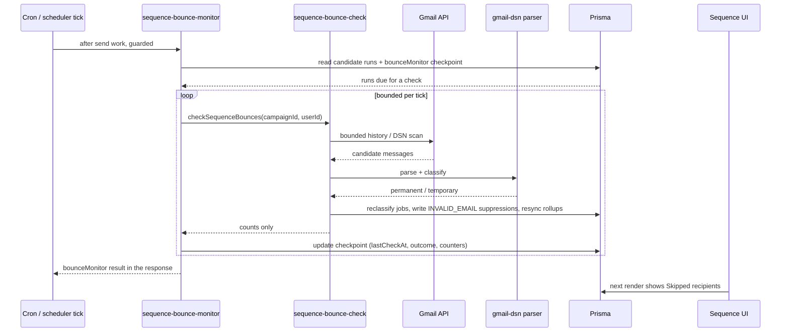

### Troubleshooting

- **Permission required** → the sender predates the read scope; reconnect Gmail.
- **Reconnect required** → Google revoked/expired the refresh token; reconnect (sending shows the same state).
- **Temporarily unavailable / RENEWAL_FAILED** → watch registration failing (check `GMAIL_PUBSUB_TOPIC` + topic IAM: grant `gmail-api-push@system.gserviceaccount.com` the Pub/Sub Publisher role). Cron retries automatically; sending continues.
- **Bounces not appearing with Pub/Sub unconfigured** → the cron fallback still syncs every ~10 min per sender; check `/api/cron/campaigns` output (`watchRenewal`, `bounceSync`).
- **Unmatched bounces** → recorded as `gmail-dsn` ProviderEvents with `matched: false` and logged as `[bounce-sync] Delivery notification could not be correlated.`; no recipient state is changed.
- **No `[bounce-sync]` logs at all** → the sync never ran: check that the deployed environment actually executes `/api/cron/campaigns` (Vercel cron runs only on the production deployment — a branch preview gets no cron), or trigger "Sync recent delivery failures" on the sender card.
- **A bounce shows as a reply** (recipient marked replied) → predates the DSN exclusion; reprocessing the message through any bounce sync heals the stored reply automatically.

## 27. Analysis Workspace

Analysis is the reporting surface: five pages over the user's own stored outreach data, answering "what happened, and is it getting better or worse?". It is read-only. It never sends, retries, pauses, or modifies anything.

### 27.1 Routes and shared shell

| Page | Route | `page` key | Subtitle in the UI |
| --- | --- | --- | --- |
| Summary | `/analysis` | `overview` | A quick view of outreach performance. |
| Engagement | `/analysis/engagement` | `engagement` | Track engagement across your outreach. |
| Sequences | `/analysis/sequences` | `sequences` | Compare sequence and template performance. |
| Reliability | `/analysis/reliability` | `reliability` | Understand failures, pauses, and sending health. |
| Senders | `/analysis/senders` | `senders` | Compare connected Gmail senders and capacity. |

Each route is a thin server component that calls `requireUser()` and renders `<AnalysisWorkspace page="…" />`. Everything else lives in the shared client shell (`src/components/analysis/analysis-workspace.tsx`):

- **Header** — "Analysis", the page subtitle, the date-range control, and the Export button. Carries `data-tour="analysis-header"`.
- **Tab bar** — the five pages as links that preserve the current `from`/`to` in the query string. The active tab is marked `aria-current="page"` and tracked by an animated underline; each tab carries a stable `data-tour="analysis-tab-*"` attribute for the guided tour. The underline is driven by two near-critically-damped springs whose position and velocity live at module scope, because the five routes are separate pages and the workspace remounts on every tab switch. Under `prefers-reduced-motion: reduce` the underline snaps instead of animating.
- **Metric strip** — the page's headline metrics, each with an icon, value, detail line, an information tooltip, and (where meaningful) a prior-period comparison.
- **Visuals** — the page-specific chart grid.
- **Footer note** — an information tooltip about freshness plus the standing caveat that analytics are calculated in UTC and may not reflect real-time data.

States: a skeleton layout while the first payload loads; a full-page error card with **Try again** when nothing has loaded; an inline error strip with **Retry** when a refresh fails but stale data is still on screen; and an "Updating Analysis…" bar during a background refresh. Every metric that cannot be computed renders an em dash rather than a misleading zero.

### 27.2 Architecture

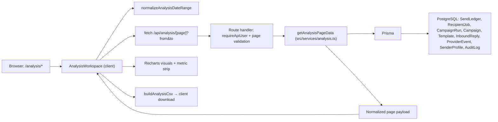

The client owns range state and rendering; the service owns aggregation. The route handler is thin: authenticate, validate the page key, normalize the range, delegate, and return `private, no-store` JSON.

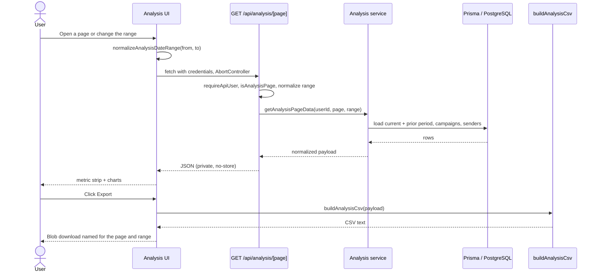

Every fetch is aborted when the page, range, or retry key changes, so a slow request cannot overwrite newer data.

### 27.3 Date range

Only two presets are queryable, defined in `src/lib/analysis.ts`:

| Preset | `days` | Description shown in the picker |
| --- | --- | --- |
| Last 7 days | 7 | Recent outreach performance |
| Last 30 days | 30 | Monthly outreach performance |

`normalizeAnalysisDateRange` accepts `from`/`to` as `YYYY-MM-DD` UTC date keys and falls back to the latest seven UTC calendar days whenever the request is not one of the presets — a reversed range, a future end date, an arbitrary custom span, a period longer than 30 days, or a malformed key. There is no custom-range picker and no 90-day option. The same function runs on the client and inside the API route, so the UI and the payload can never disagree about the effective range.

Ranges are inclusive UTC calendar days. Each range also computes an immediately preceding equal-length **prior period** used for every comparison. Changing the preset rewrites `from`/`to` with `router.replace` (no scroll, no new history entry), so the range survives reload and deep links.

The picker is a `role="menu"` with `menuitemradio` options: Escape closes and returns focus to the trigger, Arrow Up/Down cycle options, and clicking outside closes it.

### 27.4 Metric definitions

These definitions apply across all five pages.

| Term | Precise meaning |
| --- | --- |
| **Confirmed send** | A `SendLedger` row inside the range, deduplicated by recipient job (`job:<recipientJobId>`, or `ledger:<id>` when no job is linked), keeping the earliest send time. Gmail accepted the message. It is **not** proof of delivery to an inbox. |
| **Unique tracked open** | A confirmed-send recipient with a recorded `OPENED` provider event, or (as a fallback) a recipient job whose status is `OPENED` and whose `updatedAt` falls in range. Directional only — image blocking suppresses opens, and proxy prefetching can inflate them. |
| **Open rate** | Unique tracked opens ÷ confirmed sends, as a percentage rounded to one decimal. |
| **Unopened** | Confirmed sends minus unique tracked opens, floored at zero. Engagement page only. |
| **Unique matched reply** | A confirmed-send recipient with at least one `InboundReply` correlated back to their recipient job. Mailbox replies that cannot be matched to a recipient job are not counted. |
| **Reply rate** | Unique matched replies ÷ confirmed sends. |
| **Targeted recipients** | Sum of `CampaignRun.totalRecipients` across runs active in the range — people queued for outreach, before any send occurred. |
| **Needs attention** (Summary) | Permanent failures plus suppressed recipients. Pacing and safety waits are excluded. |
| **Retryable failure** (Reliability) | A recipient diagnostic classified `retryable`: Gmail temporary failures, queue/database errors, explicit rate limits, `RETRYING` status, or `metadata.retryable === true`. |
| **Permanent failure** (Reliability) | A recipient diagnostic classified `permanent`: invalid recipient, missing template variables, sender disconnected, attachment/storage problem, provider rejection, or an unclassifiable `FAILED` row. |
| **Safety pause** | A run whose `progressSnapshot.pauseReason` is `DAILY_SEND_LIMIT` or `GMAIL_SENDER_LIMIT`, paused inside the range. Never a recipient failure. |
| **Sender capacity** | The current rolling 24-hour Sendloom safety window for that sender (`GMAIL_DAILY_SEND_SAFETY_LIMIT`), not Gmail's official quota. Sendloom cannot read Gmail's real quota. |
| **Sequence status** | The status of the sequence's most recently updated run in range, falling back to the campaign status. `WAITING_FOR_SLOT` is displayed as "Waiting". |
| **Schedule type** | `Campaign.scheduleType` normalized to Immediate, Once, or Recurring; unknown or null values become Immediate. |
| **Prior-period comparison** | Counts render as a percentage change; rates render as a percentage-point change. With no prior activity the label is "New activity" or "No prior data"; identical values render "Flat vs prior period". |
| **Ranking minimum** | `ANALYSIS_MIN_RANKING_SENDS = 20`. Sequences, runs, templates, and best-day cells below this are excluded from rankings or marked as not meeting the minimum, so a 1-of-1 reply never shows as a 100% leader. |

Failure classification lives in `classifyAnalysisFailure` and reads only stored diagnostics: `metadata.blockedBy`, failure codes, provider error reason/status, `lastError`, and the recipient status. Pacing markers (`DAILY_SEND_LIMIT`, `GMAIL_SENDER_LIMIT`, `GMAIL_SENDER_PACING`) are classified as *pacing*, never as failures.

### 27.5 Summary (`/analysis`)

Answers: how is outreach performing overall, and what changed?

- **Metrics:** Sent, Opened (with open rate), Replies (with reply rate), Needs attention.
- **Outreach activity** — daily sent/opened/replied series across the range.
- **Outcome mix** — three mutually exclusive categories: Replied, Opened (without a reply), and No tracked engagement. They always sum to confirmed sends.
- **Journey funnel** — Targeted → Sent → Opened → Replied, each stage carrying its conversion against the previous meaningful stage.
- **Best days** — confirmed sends and reply rate by UTC weekday (Monday first), flagged when a day meets the 20-send minimum.
- **Top movers** — up to four qualified sequences ranked by reply-rate change against the prior period; with no prior sample, unique replies break the tie and the detail line says so.

Empty state: with no sends and no targeted recipients, `hasData` is false and the visuals render their own empty copy.

### 27.6 Engagement (`/analysis/engagement`)

Answers: how do recipients interact, and when?

- **Metrics:** Sent, Opened, Unopened, Replied.
- **Engagement trends** and **Rate trends** — absolute counts and open/click/reply rates over the range. The click series appears only when at least one click was recorded in the period (`clickAvailable`); otherwise it is omitted rather than drawn as a flat zero.
- **Engagement journey** — the Summary funnel plus the Unopened stage, with a plain-language insight line.
- **Send-time heatmap** — UTC weekday × six four-hour blocks, coloured by reply rate, with each cell marked for whether it meets the 20-send minimum.
- **Schedule type mix** — confirmed sends split across Immediate, Once, and Recurring.

### 27.7 Sequences (`/analysis/sequences`)

Answers: which sequences and templates actually earn replies?

- **Metrics:** Total sequences (distinct sequences created or carrying run/send activity in range), Running now, Best reply rate (unavailable until a sequence clears 20 sends), Needs review.
- **Needs review** counts sequences with a permanent recipient failure, a failed state, or under a 5% reply rate after clearing the minimum sample.
- **Top sequences by reply rate** — up to six qualified sequences.
- **Volume vs replies scatter** — one point per sequence with sends, carrying targeted count and current status.
- **Template performance** — up to six templates with at least 20 sends, ranked by reply rate, including how many sequences used each.
- **Sequence status mix** — current status distribution of the runs in range.
- **Standout runs** — up to five individual runs with at least 20 sends, ranked by reply rate then volume.

### 27.8 Reliability (`/analysis/reliability`)

Answers: what went wrong, what is retryable, and what is merely waiting?

- **Metrics:** Successful sends, Retryable issues, Permanent failures, Safety pauses.
- **Failure reasons** — the top eight diagnostic categories with counts and shares: Invalid recipient, Gmail temporary failure, Rate limited, Suppressed, Sender disconnected, Missing variables, Permanent provider rejection, Attachment or storage issue, Unknown.
- **Run state distribution** — current state of every run active in range.
- **Operational events** — daily retries, safety pauses, and resumed runs, derived from retry counts, pause snapshots, and audit actions.
- **Pacing** — recipients currently held by pacing rules (a live query, not a range aggregate), send-window pauses in range, and the next recovery time.
- **Attention** — up to four rules raised only when stored diagnostics cross a threshold: high invalid recipients (≥5% of handled recipients), increased safety pauses vs the prior period, rising permanent failures, senders needing reconnect, and mapping-related skips.

Pacing waits are never presented as failures anywhere on this page.

### 27.9 Senders (`/analysis/senders`)

Answers: how is each connected Gmail sender doing?

- **Metrics:** Connected senders, Total sent, Avg reply rate, Remaining capacity (percent of the combined rolling 24-hour window, with the absolute remaining/total in the detail line; unavailable when no connected sender reports a limit).
- **Per-sender rows** carry sent, opened, replied, reply rate, and a capacity block (limit, used, remaining, percent used, reset time, availability).
- **Health** is derived from stored connection facts only:

  | Health | Condition |
  | --- | --- |
  | Reconnect needed | No refresh token, a watch status of `RECONNECT_REQUIRED`/`PERMISSION_REQUIRED`/`RENEWAL_FAILED`, or a stored reply-sync error |
  | Pacing wait | A run in range is paused for this sender with a daily/sender-limit reason |
  | Synced | A recorded reply sync, bounce sync, or an active Gmail watch |
  | Healthy | Connected with none of the above signals |

- **Recent changes** — up to five deduplicated, most-recent-first events inside the range: reconnect required, replies synchronized, delivery-health status refreshed, and sender entered a pacing wait.

Credentials are never returned to this page. Capacity is read per sender through the same rolling-window helper the send path uses; a capacity read failure is logged server-side and the sender simply reports zero limit rather than failing the page.

### 27.10 Export

Export is a client-side CSV built by `buildAnalysisCsv` (`src/lib/analysis-export.ts`) from the payload already on screen. There is no server export endpoint.

- **Scope:** the current page and the current range only.
- **Filename:** `sendloom-analysis-<page>-<from>-to-<to>.csv`.
- **Header block:** a title row with the page key, a UTC date-range row, then a blank row.
- **Metric block:** `Metric, Value, Detail` for every metric in the strip; percentages are written with a `%` suffix.
- **Page block:**

  | Page | Columns |
  | --- | --- |
  | Summary, Engagement | Date, Sent, Opened, Clicked, Replied, Open rate, Click rate, Reply rate |
  | Sequences | Sequence, Sent, Replies, Reply rate, Status |
  | Reliability | Failure / outcome category, Count, Share |
  | Senders | Sender, Sent, Opened, Replied, Reply rate, 24h used, 24h limit, Health |

- Values containing a comma, quote, or newline are quoted and internal quotes doubled.
- With no data the file still contains the header and metric blocks; the page block is simply empty.
- The button is disabled until a payload has loaded, and while loading or exporting.
- Authentication applies to the underlying data fetch. The export itself is a local Blob download and issues no additional request.

### 27.11 Responsive, theme, and accessibility behavior

The workspace is a fluid grid: chart rows collapse from two or three columns to one on narrow viewports, the metric strip scrolls horizontally rather than squeezing, and the tab bar scrolls the active tab into view. Because the sidebar is a layout sibling rather than an overlay, collapsing or expanding it re-measures the tab underline through a `ResizeObserver`, so the indicator stays aligned in both sidebar states.

Colors come from the shared `--analysis-*` token layer scoped to the workspace, so charts read correctly in both light and dark themes. Tooltips rendered through a portal must redeclare those tokens, since they escape the scoping element.

Every metric label carries an `AnalysisInfo` tooltip explaining what the number counts and its known limits; charts carry their own tooltips and short insight lines. The tour deliberately does not repeat that per-chart content.

## 28. Account Workspace And Sender Management

`/account` is the operator's own settings surface. It is not part of the product nav — the sidebar footer links to it below the theme control and above logout. Admin accounts do not get the item.

The page calls `requireOperatorUser()` and renders `AccountDashboard` with a server-built overview.

### 28.1 Profile

| Field | Source | Notes |
| --- | --- | --- |
| Email | `User.email` | Read-only. |
| Name | — | Always `null`. `User` has no name column, so the UI shows no invented value. |
| Account type | Derived from `Boolean(User.passwordHash)` | "Password account" or "Google account". Derived from one stored fact; no linked-Google state is claimed that cannot be proven. |
| Created | `User.createdAt` | |
| Last login | `User.lastLoginAt` | |
| Last seen | `User.lastSeenAt` | |

There are no editable profile fields today. The password hash never leaves the server: `getAccountOverview` returns only the derived `hasPassword` boolean.

### 28.2 Password

`POST /api/account/password` handles both cases.

- **Change** (the account already has a password): the current password is required and verified with bcrypt.
- **Set** (a Google-only account): no current password is required.

Validation is shared with the client through `validatePasswordChange` in `src/lib/account.ts`: minimum 8 characters (mirroring signup), and the new password must match its confirmation. Error copy is a fixed set of user-safe strings.

Security behavior:

- Rate limited at 10 requests / 15 minutes per IP and 5 / 15 minutes per user.
- A wrong current password returns the same generic message as any other failure, so the response never confirms which field was wrong. That attempt is audit logged as `auth.password_change_failed` with `WARNING` severity.
- On success the session is rotated: `sessionIssuedAt` advances (revoking older JWTs everywhere) and a fresh cookie is issued so the current browser stays signed in.
- Success is audit logged as `auth.password_changed` or `auth.password_set`.

### 28.3 Connected senders

Each sender row shows the display name, the from-address, a friendly provider label (`google_oauth` → "Gmail"), a connection status, and the connected-at time. Status is derived from a single stored fact: a sender with no `oauthRefreshToken` is `reconnect_required`, because it cannot send.

Connecting another mailbox reuses the Gmail OAuth kickoff with a return path, so a newly connected sender appears on the account page (`/api/auth/google/connect?next=/account`; the callback appends `?gmail=connected`).

Removal is gated by three rules, all enforced **server-side inside one transaction** — never by the disabled button alone:

1. The sender must belong to the authenticated user.
2. The user must keep at least one sender.
3. No campaign with status `SCHEDULED`, `WAITING_FOR_SLOT`, `RUNNING`, or `PAUSED` — and no run with status `QUEUED`, `WAITING_FOR_SLOT`, `RUNNING`, or `PAUSED` — may reference it.

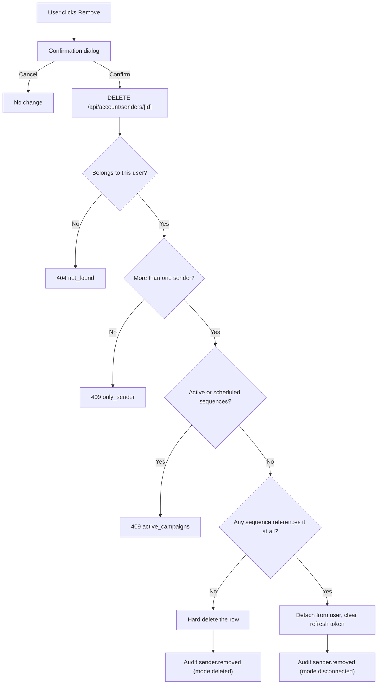

The disconnect path exists because the `Campaign → SenderProfile` foreign key is `Restrict`: deleting a referenced sender would break historical sequences. Detaching sets `userId = null` and clears the refresh token, which removes it from the account and revokes send access while the row and campaign snapshots stay intact. A hard delete is only taken when no sequence references it at all; the sole remaining relation, `InboundReply`, cascades.

Removal confirmation uses the shared `AppConfirmDialog` — the codebase contains no native `window.confirm` calls, and a test enforces that.

## 29. Attachment Lifecycle

Sequence attachments are content-addressed and deduplicated per user, so uploading the same résumé to twenty sequences stores one object.

### 29.1 Model and keys

`AttachmentAsset` holds one row per unique file per user, unique on `(userId, sha256, sizeBytes, contentType)` and indexed on `(userId, createdAt)`. The storage key is `users/<userId>/attachments/<sha256>` in the attachments bucket, so identical bytes always resolve to the identical object.

The dedupe key is the server-computed SHA-256 plus size plus a **normalized** content type (parameters stripped, lowercased), never the filename — so `APPLICATION/PDF` and `application/pdf; charset=utf-8` do not split one file into two rows.

### 29.2 Upload and reuse

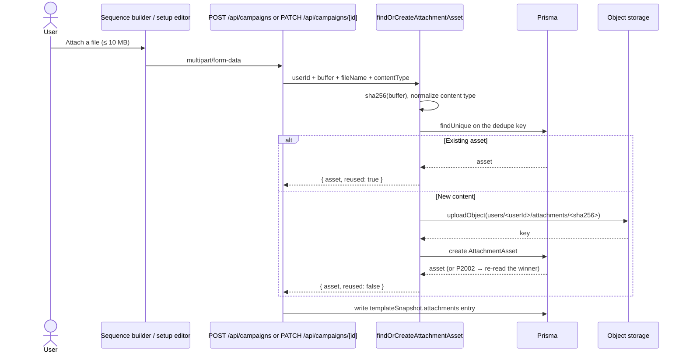

The upload happens **before** the insert on purpose: a failed insert leaves only an idempotent orphan object, healed on the next attach, whereas insert-first could leave a row pointing at a missing object and break sends. Concurrent duplicates write identical bytes to the identical key, so the race is safe; a unique-constraint violation is resolved by re-reading the winning row.

Attachment upload is deliberately deferred until the free-sequence retention gate passes, so a rejected create leaves no draft and no orphaned upload.

### 29.3 Snapshots and backward compatibility

Each campaign's `templateSnapshot.attachments[]` entry keeps the per-upload display name and the raw content type, plus `storagePath`, `assetId`, and `sizeBytes`. Reusing an asset therefore never changes what the user sees or what Gmail receives. Snapshots written before dedupe shipped carry only `fileName`, `storagePath`, and `contentType`, and continue to work unchanged — nothing reads `assetId` as required.

### 29.4 Download and preview

Attachments are always fetched through `GET /api/campaigns/[id]/attachments/[attachmentIndex]`, which requires an authenticated session and campaign ownership before touching storage. There is no public object URL.

- Responses are private and `no-store`.
- Content-Disposition is built RFC 5987/6266-safe: a stripped ASCII `filename=` fallback plus a percent-encoded `filename*=UTF-8''`, with CR/LF rejected in both forms to prevent header injection.
- Only `image/*`, `audio/*`, `video/*`, `application/pdf`, and `text/plain` render `inline`. Everything else is force-downloaded, so an uploaded `.html`, `.svg`, `.xml`, or `.js` file can never render as same-origin content inside the app.
- The in-app preview supports PDFs and images; other types offer download only. Preview navigation uses the shared back-navigation helper so closing a preview returns to the sequence rather than the browser's previous site.

### 29.5 Limits, ownership, and deletion

- 10 MB per attachment, enforced before any upload work. Multipart bodies larger than about 10 MB can fail at the platform layer before the route sees them.
- Assets are owned by the user (`onDelete: Cascade`), so deleting an account removes its asset rows.
- Launch validation reads every attachment from storage and surfaces unreadable objects before sending, which is why the attach path does not perform its own per-attach existence check.
- Deleting a sequence does not delete shared asset rows or objects, because other sequences may still reference the same content. There is no reference-counted garbage collection today; storage lifecycle policies remain the operational lever.

## 30. Sequences Workspace

### 30.1 Dashboard (`/campaigns`)

The page renders a header (`WorkspacePageHeader` with a **New sequence** action), an overview grid, and the sequence list.

**Summary cards.** Active (sequences matching the active filter), Replies (total received), Sent (confirmed sends in the rolling 24-hour window, or an em dash when the send ledger is unreadable), and Scheduled (`QUEUED`/`WAITING_FOR_SLOT` runs).

**Sequences health.** A panel listing at most **two** attention items with a total count badge, each with the sequence name, a title (Run failed / Failed sends detected / Invalid recipients skipped), a plain-language detail, a severity chip, and a "Review sequence" link that carries the current dashboard state as a return path. Critical entries sort before warnings. When more exist, the panel says how many remain under the Needs attention filter. With none, it shows an "All clear" state. Attention items derive only from observed delivery facts — a failed run, failed sends, or invalid recipients. A paused sequence alone is never an alert, because the reason for a manual pause is unknowable.

**Control bar and list.** Result count, a debounced search box, a Status dropdown, and an Email accounts dropdown, over a list of **5 rows per page**. Both dropdowns are custom listbox controls, never a native `select`: the trigger announces the selection, options are real buttons, Arrow/Home/End move focus, and Escape closes and returns focus.

Each row shows the sequence name, list and sender, a status pill, the current state, the created date, a progress bar, and mini performance metrics (delivered, opens, replies), plus a row action menu.

**Filters.** Filters overlap by design — a sequence can match several — and counts are shown per option.

| Filter | Matches |
| --- | --- |
| All | Everything |
| Active | Campaign `RUNNING`/`WAITING_FOR_SLOT`, or latest run `QUEUED`/`WAITING_FOR_SLOT`/`RUNNING` |
| Sent in last 24h | At least one confirmed send in the rolling 24-hour window |
| Paused | Campaign or latest run `PAUSED` |
| Needs attention | Campaign or run `FAILED`, or any failed/invalid recipients |
| Completed | Campaign or latest run `COMPLETED` |
| Scheduled | Campaign `SCHEDULED` or `VALIDATED` |
| Draft | Campaign `DRAFT` — only offered when draft sequences exist |

Each filter has its own empty-state headline, so a filtered list with no rows explains the category it is empty for.

The status **pill** shows one primary tone per sequence, resolved by priority: attention → paused → active → completed → scheduled → draft → idle. A completed run with failures still reads "Needs attention". The **current state** column is a separate human sentence (Sending, Waiting for a send slot, Queued to send, Manually paused, Last run failed, Cancelled, Finished sending, Scheduled, Ready to launch, Draft, Not launched yet) in which run status wins over campaign status, because the run reflects the most recent launch.

**URL state.** Filter, sender, search, and page map to `status`, `sender`, `q`, and `page`. Defaults are omitted from the URL entirely (no `status=all`, no `page=1`). Search is debounced at 200 ms and, like pagination, written with `history.replaceState` so typing and paging do not flood browser history; filter and sender changes use `router.replace`. Changing the filter, the sender, or the search resets to page 1. An out-of-range page clamps into range. Sender values are matched case-insensitively against the senders actually present, so a stale sender in the URL falls back to "All email accounts".

**Sorting.** The list is server-ordered by `Campaign.updatedAt` descending. There is no user-facing sort control on this dashboard.

**Row actions.** View (opens detail with a return path back to the current filtered view), pause/resume, relaunch, and delete. Deletion uses the shared confirmation dialog.

### 30.2 Creation (`/campaigns/new`)

The creation wizard assembles a sequence from a processed import, its mapping, a template, a connected Gmail sender, a schedule, and optional attachments. It validates the selection before allowing a launch, surfaces Gmail connection state inline (including a reconnect prompt and the `?gmail=connected` flash), and reports bounce-monitoring readiness for the chosen sender. Creating a sequence is subject to the free-account retention gate described in [§12](#12-sequence-scheduling); attachment uploads only happen after that gate passes.

### 30.3 Detail (`/campaigns/[id]`)

Layout:

- **Overview** — sequence name, status pill, and meta chips for the import file, template, and sender address.
- **Command centre** — a reconnect notice when the sender's access was revoked; a state grid of Send timing, Validation (with the last validated time), and Current run (with the last update); and a status note that distinguishes waiting-for-slot, a live auto-refreshing run, and an idle sequence.
- **Action bar** — Launch (only when there is no active run, no pause, no daily-limit block, and the sender is connected), Refresh validation, **Check bounces**, Pause/Resume, Edit schedule, Retry failed (when eligible), and Delete as a separated destructive action.
- **Delivery metrics** — audience size (with skipped count), sends, opens, replies, and failures for the displayed run. When the newest run has not processed anyone yet and a previous completed run exists, the previous run's numbers are shown and labelled "Last run".
- **Setup panel** — import, mapping, template, sender, schedule, and attachments, with editing blocked while a run is actively sending.
- **Recipient activity** — paginated per-recipient state including retrying, waiting for the send window, skipped, and failed.

A live run auto-refreshes every 8 seconds. Back navigation honours the `returnTo` parameter written by the dashboard, so returning lands on the same filtered, paged view. The sequence-detail guided tour targets stable `data-tour-sequence-detail` attributes on the overview, run health, actions, delivery stats, setup, and recipient activity regions.

### 30.4 Lifecycle

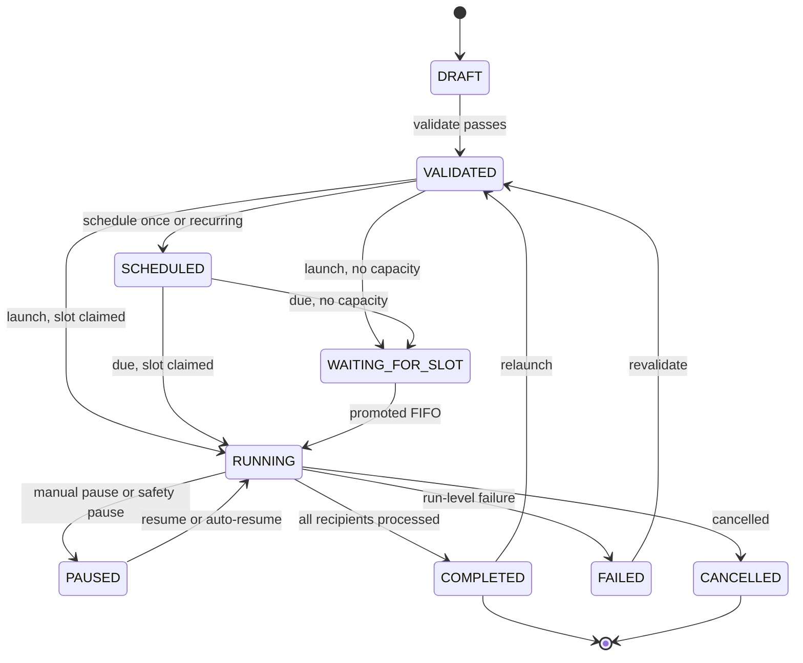

These are the `CampaignStatus` and `RunStatus` values the code actually uses. "Needs attention" is a derived display tone, not a stored state. A safety pause is an ordinary `PAUSED` run carrying a `pauseReason` in `progressSnapshot`; a manual pause carries none, which is exactly how auto-resume tells them apart.

### 30.5 Send and reliability pipeline

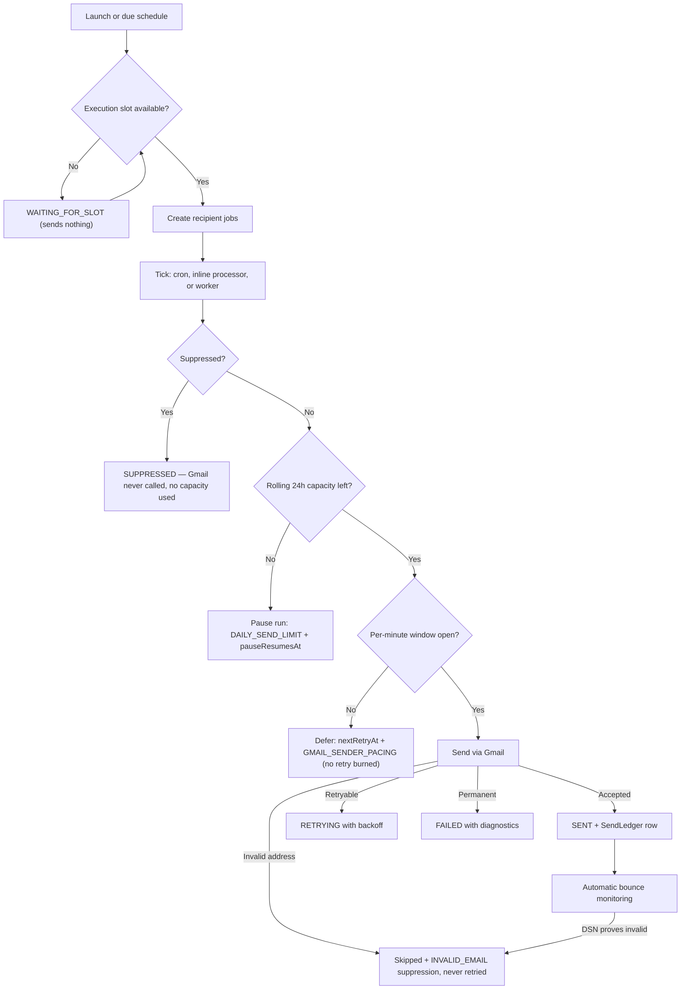

Pacing waits and safety pauses delay work; they never mark a recipient failed. Only address-quality outcomes produce the Skipped disposition.

## 31. Navigation And Shared Page Shell

### 31.1 Sidebar

`AppNav` (`src/components/nav.tsx`) renders the brand block, a collapse toggle, the nav list, and the session controls footer.

**Collapsed state** persists in both a cookie (`sendloom_sidebar_collapsed`, one year) and `localStorage` (`sendloom.sidebarCollapsed`). The cookie lets the server render the correct initial width, avoiding a flash; the client reconciles on mount and writes both, plus a `data-sidebar-collapsed` attribute on the document element for CSS. Either storage failing degrades to an in-memory state rather than breaking the sidebar.

**Active state** is matched from the current pathname: exact match or a `/<href>/` prefix, except for admin Overview, which is exact-only so it does not light up on every admin sub-page. The active row is drawn with a left accent bar and a coloured icon and label on a transparent row background — the solid-fill treatment and the wider layout variant were both evaluated and reverted.

**Analysis navigation** is nested. When the sidebar is expanded, Analysis renders as a `button` with `aria-expanded` and `aria-controls` pointing at a submenu containing Summary, Engagement, Sequences, Reliability, and Senders. The submenu opens automatically when the route is under `/analysis` and follows the route on navigation, but a manual toggle is respected while the user stays on the same path. Child links match exactly, so only the visible page is marked `aria-current="page"`. When the sidebar is collapsed the submenu is not rendered; Analysis becomes a plain link to `/analysis` with a `title` tooltip, as every other collapsed item does.

**Account** is deliberately outside the product nav. It is passed to `SessionControls` as a utility item and appears in the footer below the theme control and above logout, for non-admin users only.

On desktop widths (≥961px) with the sidebar expanded, the nav list gets its own vertical scroll region, so a long nav — including the open Analysis submenu — never pushes the theme or logout controls out of reach. The sidebar itself is sticky and full height.

### 31.2 Page headings

Main list and dashboard pages use `WorkspacePageHeader` for a consistent title, subtitle, and action cluster. Overview and Analysis render their own headers because they carry different controls (workspace actions; date range and export). Sequence detail uses a page-specific overview block rather than the shared header, because its title sits alongside a status pill and meta chips.

### 31.3 Back navigation

Back controls use the shared back-navigation helper rather than raw `history.back()`, so a deep link opened directly still returns somewhere sensible inside the app. The Sequences dashboard encodes its full filtered state into a `returnTo` parameter on every detail link, so returning from a sequence lands on the same filter, sender, search, and page. The Imports workflow exits with `router.replace` specifically so that a Back press does not re-enter the workflow the user just left.
