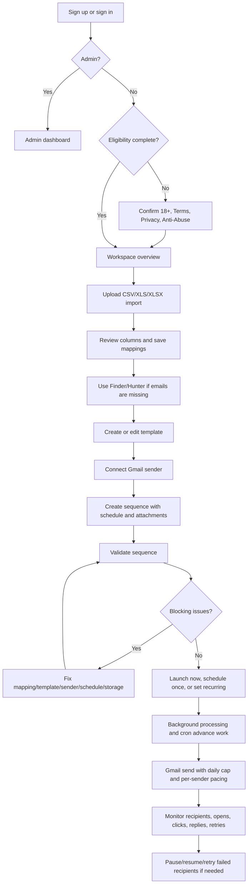
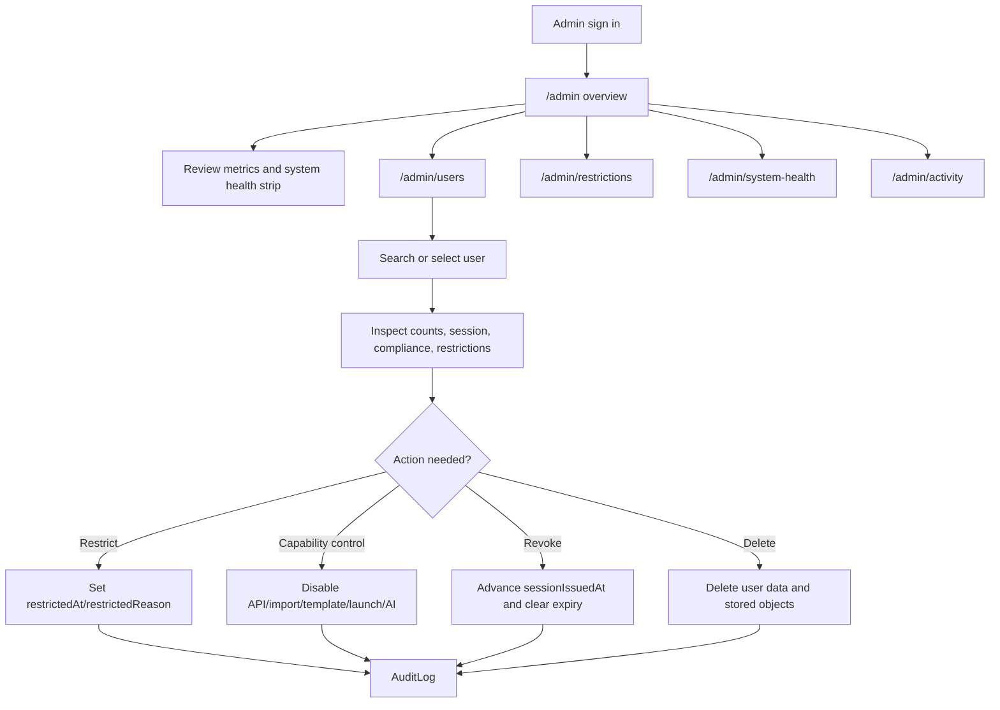
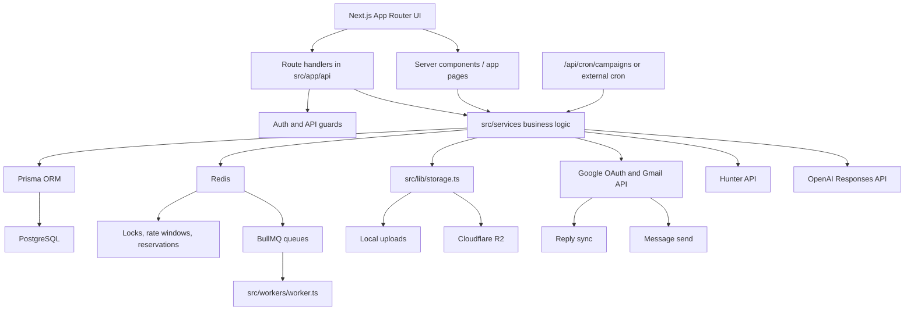

# Sendloom Production Documentation

## Table Of Contents

- [1. Executive Summary](#1-executive-summary)
- [2. Product Purpose](#2-product-purpose)
- [3. Version History](#3-version-history)
- [4. Current Product Surface](#4-current-product-surface)
- [5. User Journey](#5-user-journey)
- [6. Admin Journey](#6-admin-journey)
- [7. Architecture Overview](#7-architecture-overview)
- [8. Route Map](#8-route-map)
- [9. Data Model Documentation](#9-data-model-documentation)
- [10. Gmail Sending System](#10-gmail-sending-system)
- [11. Gmail Safety Controls](#11-gmail-safety-controls)
- [12. Sequence Scheduling](#12-sequence-scheduling)
- [13. Storage System](#13-storage-system)
- [14. Compliance, Eligibility, And Anti-Abuse](#14-compliance-eligibility-and-anti-abuse)
- [15. Security Controls](#15-security-controls)
- [16. UI/UX Documentation](#16-uiux-documentation)
- [17. Environment Variables](#17-environment-variables)
- [18. Local Development](#18-local-development)
- [19. Deployment Notes](#19-deployment-notes)
- [20. Operational Runbook](#20-operational-runbook)
- [21. Known Limitations](#21-known-limitations)
- [22. Roadmap / Future Improvements](#22-roadmap--future-improvements)
- [23. Prospect Graph Backend (Local GraphQL Prototype)](#23-prospect-graph-backend-local-graphql-prototype)
- [24. Dashboard Help System (in-app guided tours)](#24-dashboard-help-system-in-app-guided-tours)
- [25. Error Recovery and Incident Reporting](#25-error-recovery-and-incident-reporting)

## 1. Executive Summary

Sendloom is a full-stack outreach operations platform where users import contacts, write templates, connect Gmail, build sequences, schedule sends, track recipient activity, and manage controlled business outreach.

In production terms, Sendloom is the system of record for a user's outbound run. A sequence is assembled from an import, a mapping, a template, a connected Gmail sender, optional attachments, and a schedule. The platform validates that configuration, creates recipient-level jobs, sends through the user's OAuth-connected Gmail account, records delivery state, applies retry and pacing rules, and surfaces opens, clicks, replies, failures, and safety pauses back into the dashboard.

The current codebase is a Next.js App Router application with React, TypeScript, Prisma, PostgreSQL, Redis, BullMQ-compatible queues, Gmail OAuth, Hunter integration, optional OpenAI template assistance, and local or Cloudflare R2 object storage. The active product surface includes the Overview dashboard, Finder, Imports, Templates, Sequences, Eligibility verification, Legal / Anti-Abuse pages, and Admin workspaces.

The npm package name remains `mergepilot`, but the product, UI, routes, and documentation identify the application as Sendloom.

## 2. Product Purpose

Sendloom exists to reduce the operational mess around personalized outreach. Without a unified tool, users commonly manage leads in spreadsheets, find missing emails in Hunter, draft messages in documents, send manually from Gmail, set reminders elsewhere, and track replies in a separate sheet. Sendloom brings those steps into one controlled workflow.

Target users include founders, students, recruiters, small teams, agencies, and operators who need structured, low-volume to moderate-volume business outreach from their own Gmail account.

The main workflow is:

1. Create an account and complete eligibility confirmation.
2. Upload a CSV/XLS/XLSX contact list.
3. Map spreadsheet columns into reserved fields and merge variables.
4. Use Finder/Hunter if contact emails are missing.
5. Create a template in plain text, HTML, or JSON.
6. Connect a Gmail sender through Google OAuth.
7. Create, validate, launch, schedule, or retry a sequence.
8. Monitor progress, replies, opens, clicks, failures, and safety pauses.

Sendloom is not:

- An email warming tool.
- A spam, blast, or anonymous mail relay.
- A product for minors. Current onboarding requires 18+ confirmation.
- A native lead database. It stores user-provided imports and Hunter search history, but it does not ship with a built-in lead database.
- A guarantee of deliverability. Gmail, recipient servers, recipient behavior, and email clients can still reject, throttle, or hide activity.

## 3. Version History

The repository contains formal tags `V1.0`, `V1.1`, and `V1.2`. No formal `V2` git tag was found. This document therefore treats `V2/current` as an inferred production-hardening era reconstructed from commit order, tag ranges, and the current codebase state.

Required history inspection was performed with:

```bash
git tag --list --sort=creatordate
git log --reverse --oneline
git log --reverse --stat
git log --decorate --oneline --all --graph --max-count=100
git show --stat 59c71c6
git show --stat V1.0
git show --stat V1.1
git show --stat V1.2
git show --stat 99e1bae
git show --stat afaf337
```

### Formal Tags

| Tag | Tag / Commit Date | Commit | Commit Subject | Notes |
| --- | --- | --- | --- | --- |
| `V1.0` | 2026-04-20 10:46:56 -0400 | `6432744` | Reset template assist state when switching templates | Lightweight tag on a template-assist fix. The broader V1 product is reconstructed from earlier commits. |
| `V1.1` | 2026-05-01 19:59:04 -0400 | `455cc35` | Fix manual help tooltip tail | Lightweight tag near the workflow manual/onboarding period. |
| `V1.2` | 2026-05-21 11:16:24 -0700 | `e84bacb` | Fix Mermaid parse error in sequence diagram | Lightweight tag immediately after Cloudflare R2, security, admin, route, and README diagram work. |
| Current `master` | 2026-06-15 15:42:29 -0700 | `afaf337` | Merge pull request #9 from `fix-past-scheduled-sequence-relaunch` | Current head at documentation time. Inferred V2/current state. |

### Timeline

| Version / Commit Range | Area | What Changed | Production Impact |
| --- | --- | --- | --- |
| `59c71c6` initial project, 2026-03-25 | Foundation | Created the core Sendloom app with imports, mappings, templates, campaigns, sender profiles, tracking routes, suppressions, PostgreSQL/Prisma, Redis/BullMQ helpers, services, workers, and upload support. | Established the first usable product: upload contacts, map fields, create templates, connect senders, build campaigns, send, track, and suppress recipients. |
| `60ce739` through `8536588` | Vercel processing | Fixed deployment/storage issues, Redis client usage, and refactored campaign processing for Vercel/serverless execution with `/api/cron/campaigns`. | Made campaign processing viable outside a single long-running local worker. |
| `52476d4` through `c65ccd9` | Landing and theme | Added a Three.js marketing landing page, dark/system theme behavior, theme switcher movement, and landing navbar theme toggle. | Shifted the product from bare app screens toward a public branded site. |
| `37b47a8` and `d62def8` | Auth/legal | Added signup, auth-safe 404, privacy page, and terms page. | Created a public account flow and baseline legal surface. |
| `a6e6368` through `8bdf11a` | Sequence detail and attachments | Redesigned campaign detail and added attachment preview/download route with back buttons. | Improved sequence monitoring and allowed attached files in outreach. |
| Pre-`V1.0` through `6432744` | Templates, UI, scheduling, AI, imports | Added saved template editing, sequence builder polish, timezone selection, inline AI template enhancement, inline spam checks, template pagination, template format modes, import management polish, recipient activity pagination, and Gmail reply metrics. | V1.0 represents the first broad, usable Sendloom product: imports, templates, sequences, scheduling, AI copy help, and operator dashboards. |
| `V1.0..V1.1` | Per-user send limits, replies, dashboard, manual | Expanded README, scoped send windows per user, hid active suppression UI, improved reply sync and reply matching, refreshed overview analytics, and added a workflow manual/onboarding system. | Made the app more coherent for real operators and reduced cross-user send-window leakage. |
| `V1.1..V1.2` | Admin, scheduling, security, R2, diagrams | Improved admin scalability, added schedule editing, fixed server-side scheduled processing, supported external cron on Hobby deployments, supported multiple weekdays for recurring schedules, added CSRF/rate limits, added Cloudflare R2 storage, bumped Node runtime to 22.x, and added sequence diagrams. | Turned V1 into a more production-oriented system with safer API boundaries, object storage, route docs, and better scheduled sends. |
| `0714f10` through `0963316` | Landing/admin redesign | Redesigned landing page, moved admin sections into sidebar navigation, added system health recheck, and updated README for admin routes. | Clarified product positioning and improved admin workflows. |
| `99e1bae` through `6688f29` | Gmail daily safety cap | Added `SendLedger`, rolling 24-hour Gmail send safety limit, backfills, missing-table tolerance, safety-pause UI, fixed window counting, and confirmed send-time counting. | Prevented runaway Gmail sends and paused runs before daily sender caps are exceeded. |
| `377b738` and `7053605` | Large-sequence reliability | Added Gmail error diagnostics, retryable throttle/temporary classification, safer pacing, bounded sender concurrency, and recipient activity states for retrying/paused sends. | Reduced mass permanent failures on 100+ recipient sequences when Gmail throttles mid-run. |
| `031bc2e` and `0a04145` | Retry failed recipients | Added a manual retry action that requeues only eligible failed recipients through the same safe send pipeline. | Operators can recover transient failures without duplicating successful sends. |
| `c98fa9f` through `c2a5b0d` | Per-sender Gmail pacing | Added `GMAIL_SENDS_PER_MINUTE` default 3/minute per sender, atomic Redis per-minute windows, fair sharing across parallel sequences for one sender, and waiting-not-failing behavior. | Large sequences now wait for sender capacity instead of burning retry budget or marking paced recipients permanent. |
| `3b705d0` and PR #5 | Admin activity log | Added `AuditLog` expansion, admin activity workspace, user search, user summaries, and audit logging across auth/import/template/sequence/finder/admin actions. | Admins gained operational visibility and per-user audit trails. |
| `3b86e52` and PR #6 | Dependency security | Upgraded dependencies to resolve Dependabot alerts, including Next.js, Nodemailer, SheetJS, Vitest, Vite, Prisma, BullMQ, sanitize-html, and PostCSS override. | Reduced known dependency risk. |
| `bc43aef`, `cde970b`, `8f4b1b4`, `d3b7f17` | Eligibility and anti-abuse | Added 18+ verification, policy acceptance, ineligible-account blocking, `/abuse`, updated `/terms` and `/privacy`, API enforcement, and admin restriction/unrestriction flows. | Made responsible-use controls part of the access path, not only public copy. |
| `179d654` and PR #8 | Auth redesign | Redesigned auth pages, added pointer effects/video preview, and added password visibility toggles. | Improved onboarding presentation without changing core auth rules. |
| `6d227d0` through `4e129e0` | Footer/legal presentation | Replaced inline marketing/legal footers with a reusable animated glass `MarketingFooter`, full-width behavior, and theme-aware styling. | Unified public/legal navigation and presentation. |
| `d97c3b4`, `0ce62cf`, `cad7688`, `afaf337` | Past schedule relaunch and overview filters | Added confirmation for relaunching past one-time schedules, conversion to immediate on opt-in, launch tests, schedule-type filter for Recent Sequences, and dropdown layout fixes. | Prevented stale past schedules from blocking relaunch and improved recent-sequence scanning. |

### Inferred Version Summary

| Inferred Version | Meaning | Representative State |
| --- | --- | --- |
| V1 | Initial usable Sendloom product | Import files, map fields, create templates, connect Gmail, build sequences, track opens/clicks/replies, and monitor dashboards. |
| V1.x | Workflow expansion | Finder/Hunter, saved templates, template formats, AI/spam assistance, admin controls, manual onboarding, schedule editing, R2, CSRF/rate limiting, and improved dashboards. |
| V2/current | Production hardening | Gmail daily cap, per-sender pacing, large-sequence resilience, retry failed recipients, audit log, eligibility/anti-abuse controls, redesigned auth/landing/legal surfaces, admin health/activity, and past schedule relaunch fixes. |

## 4. Current Product Surface

### Overview

The operator overview lives at `/workspace`. It shows aggregate metrics, live-refreshing recent sequence cards, recent recipient activity, send-window status, and quick entry points back into the current work. Recent sequences can be filtered by search, status, focus, schedule type, and sort order.

Important routes:

- UI: `/workspace`
- API: `/api/send-window`, `/api/campaigns/[id]/status`
- Data: `Campaign`, `CampaignRun`, `RecipientJob`, `SendLedger`, `SenderProfile`, `Import`, `Template`

Production notes:

- Active runs can trigger background processing during status refreshes.
- Send-window status is per connected Gmail sender plus a user rollup.
- Schedule type is normalized to `immediate`, `once`, or `recurring`; legacy null values fall back to immediate in dashboard display.

### Finder

Finder lives at `/finder` and uses Hunter through server-side API routes. Users can save their own Hunter API key, find one email by name and domain, run domain searches, review saved domain search history, group domain results by inferred department, select contacts, and export selected contacts to CSV in the browser.

Important routes:

- UI: `/finder`
- API: `/api/save-api-key`, `/api/email-finder`, `/api/domain-search`, `/api/domain-search/[id]`
- Data: `User.hunterApiKeyEncrypted`, `User.hunterApiKeyLast4`, `HunterDomainSearch`

Production notes:

- Hunter keys are AES-256-GCM encrypted with `HUNTER_KEY_ENCRYPTION_SECRET` in production.
- Domain search history is stored per user when the `HunterDomainSearch` table exists.
- The code gracefully returns empty history if the saved-search table is missing, which helps during partial migrations.

### Imports

Imports are the contact-ingestion module. Users upload CSV/XLS/XLSX files, preview rows, inspect columns, choose template fields, and save field mappings.

Important routes:

- UI: `/imports`
- API: `/api/imports`, `/api/imports/[id]`, `/api/imports/[id]/columns`, `/api/imports/[id]/mapping`, `/api/imports/[id]/template-fields`
- Data: `Import`, `ImportColumn`, `ImportRow`, `Mapping`

Production notes:

- Uploads are limited to 25 MB.
- Allowed extensions are `.csv`, `.xlsx`, and `.xls`.
- Import object keys are scoped as `users/<userId>/imports/<importId>/<filename>`.
- Import deletion removes dependent mappings/campaigns and best-effort deletes the stored import object.

### Templates

Templates live at `/templates`. Users can create or edit saved templates with subject, body, merge variables, preview payload, and body format.

Current formats:

- `PLAIN_TEXT`
- `HTML`
- `JSON`

Important routes:

- UI: `/templates`
- API: `/api/templates`, `/api/templates/enhance`
- Data: `Template`

Production notes:

- Plain-text rendering preserves paragraphs, unordered lists, and ordered lists.
- JSON templates are validated as JSON and rendered into email HTML from structured values.
- Preview HTML is sanitized with `sanitize-html`.
- AI enhancement uses OpenAI Responses API when `OPENAI_API_KEY` is configured.
- Spam-risk scoring is local heuristic analysis; AI fix-spam uses the latest spam signals as prompt context.

### Sequences

The active sequence workspace is `/campaigns`. `/sequences` and `/sequences/[id]` act as aliases/redirect surfaces.

A sequence is built from:

- Import
- Mapping
- Template
- Sender profile
- Schedule rule
- Optional attachments

Important routes:

- UI: `/campaigns`, `/campaigns/[id]`, `/sequences`, `/sequences/[id]`
- API: `/api/campaigns`, `/api/campaigns/[id]`, `/api/campaigns/[id]/validate`, `/api/campaigns/[id]/launch`, `/api/campaigns/[id]/pause`, `/api/campaigns/[id]/resume`, `/api/campaigns/[id]/retry-failed`, `/api/campaigns/[id]/status`, `/api/campaigns/[id]/recipient-activity`, `/api/campaigns/[id]/attachments/[attachmentIndex]`
- Data: `Campaign`, `CampaignRun`, `RecipientJob`, `InboundReply`, `ProviderEvent`, `Suppression`, `SendLedger`

Production notes:

- Attachments are limited to 10 MB each.
- Setup editing is blocked while a run is actively sending.
- Validation checks system health, sender connection, mapping, template variables, invalid recipients, suppressions, schedule validity, and attachment readability.
- Relaunching a past one-time schedule returns `PAST_SCHEDULE_CONFIRMATION_REQUIRED` until the user confirms conversion to immediate send.

### Eligibility Verification

Non-admin users must complete `/verify-eligibility` before using the app shell. The page requires 18+ confirmation, Terms/Privacy acceptance, and Anti-Abuse acceptance. Users can self-report ineligibility, which blocks the account and clears the session.

Important routes:

- UI: `/verify-eligibility`
- API: `/api/auth/eligibility-status`, `/api/auth/verify-eligibility`, `/api/auth/report-ineligible`
- Data: `User.adultVerifiedAt`, `termsAcceptedAt`, `privacyAcceptedAt`, `antiAbuseAcceptedAt`, `policyVersion`, `ageGateVersion`, `eligibilityBlockedAt`, `restrictedAt`

Production notes:

- `requireApiUser()` blocks unverified, blocked, restricted, or capability-disabled users from protected API routes.
- Admin users are not redirected to eligibility verification.

### Legal / Anti-Abuse

Public legal pages live at `/terms`, `/privacy`, and `/abuse`. These pages include 18+ requirements, lawful-use language, recipient-data expectations, Google data boundaries, anti-abuse rules, and legal review notices.

Production note: this document describes product behavior and repository contents. It is not legal advice.

### Admin

Admin users are routed to the admin surface and see admin navigation in the sidebar.

Current admin routes:

- `/admin`
- `/admin/users`
- `/admin/restrictions`
- `/admin/system-health`
- `/admin/activity`

Admin capabilities include user listing, account restrictions, per-capability disables, session revocation, account data deletion, system health inspection, user activity search, and audit-log review.

## 5. User Journey



Normal user flow:

1. The user signs up with email/password or Google, or logs in.
2. Non-admin users are redirected to `/verify-eligibility` until they confirm adult eligibility and accept policies.
3. The user uploads a CSV/XLS/XLSX import at `/imports`.
4. Sendloom parses columns, sample rows, normalized rows, and creates an initial mapping.
5. The user maps reserved fields and template variables.
6. The user uses Finder if needed, saving a Hunter key and running email/domain searches.
7. The user creates a template in `/templates`, optionally using spam analysis and AI enhancement.
8. The user connects Gmail through `/api/auth/google/connect`.
9. The user creates a sequence in `/campaigns`.
10. Sendloom validates sender, import, mapping, template, schedule, suppression, storage, and system health.
11. The user launches immediately, schedules once, or configures recurring sends.
12. `processPendingCampaignWork()` creates recipient jobs, sends due jobs, handles pacing/caps, retries transient errors, and finalizes runs.
13. The user monitors Overview and sequence detail pages.
14. Reply sync checks connected Gmail inboxes and matches replies back to recipient jobs.
15. If a finished run has eligible failures, the user can retry failed recipients without resending successful recipients.

## 6. Admin Journey



Admin overview shows aggregate metrics, user status, sender-domain breakdowns, and a system health strip.

User management lets an admin inspect account state, session state, counts, compliance fields, and restriction flags. Admins can:

- Disable all API access.
- Disable import writes.
- Disable template writes.
- Disable campaign launches.
- Disable AI enhancements.
- Revoke user sessions.
- Restrict or unrestrict accounts with a reason.
- Delete all account data for a non-admin user.

Admin-only enforcement:

- Admin page access uses `requireAdminUser()`.
- Admin API access uses `requireAdminApiUser()`.
- Admin authority comes from `User.isAdmin`, not an environment-email match at request time.
- Admin accounts and the acting admin's own account are protected from restriction/deletion flows.
- Non-admin admin API attempts are audit logged as security events.

Activity logs:

- `/admin/activity` uses user search, summaries, and paginated audit events.
- `AuditLog` metadata is sanitized on write and again on read.
- Legacy audit rows may lack newer fields; activity lookup matches by `actorUserId` or legacy `actorEmail`.

## 7. Architecture Overview



Runtime shape:

| Layer | Current Technology | Notes |
| --- | --- | --- |
| Web app | Next.js 15 App Router, React 19 | Server and client components under `src/app` and `src/components`. |
| Language | TypeScript | Shared route, service, lib, and UI types. |
| Database | PostgreSQL with Prisma | `prisma/schema.prisma` and migrations under `prisma/migrations`. |
| Redis | ioredis | Locks, rate limits, daily reservations, and BullMQ connection. |
| Queues | BullMQ | `validation`, `launch`, `send`, and `webhook` queues exist; serverless path also processes inline/cron. |
| Email sending | Gmail API via OAuth2 and Nodemailer `MailComposer` | Current production sending path is Gmail-centered. |
| Reply sync | Gmail readonly API | Lists inbox messages and matches replies by references/thread fallback. |
| Finder | Hunter API | User-provided API keys encrypted at rest. |
| AI assistance | OpenAI Responses API | Optional subject/body enhancement and spam copy cleanup. |
| Storage | Local filesystem or Cloudflare R2 | Separate buckets/key namespaces for imports and attachments. |
| Security | JWT sessions, CSRF, Redis rate limits, CSP/security headers | Details in [Security Controls](#15-security-controls). |

## 8. Route Map

### Public Routes

| Route | Purpose | Auth | Notes |
| --- | --- | --- | --- |
| `/` | Marketing landing page | Public | Product narrative, workflow, capabilities, trust points, CTA. |
| `/signup` | Account creation | Public; redirects if already signed in | Email/password signup plus Google path via auth page. |
| `/login` | Account sign-in | Public; redirects if already signed in | Email/password and Google sign-in. |
| `/faq` | Frequently asked questions | Public | Uses marketing/legal nav and footer. |
| `/privacy` | Privacy Policy | Public | Includes Google data, 18+ policy, minimization, legal review notice. |
| `/terms` | Terms of Service | Public | Includes lawful-use, sender responsibility, age requirement. |
| `/abuse` | Anti-Abuse Policy | Public | Prohibited uses, enforcement, reporting, minors prohibition. |
| `/verify-eligibility` | Eligibility confirmation | Signed-in user expected | Redirects unauthenticated users to login through API status check. |
| `/track/open/[token]` | Open pixel | Public signed token | Invalid tokens still return a pixel without DB update. |
| `/track/click/[token]` | Click redirect | Public signed token | Redirect is constrained to same-origin URL. |
| `/unsubscribe/[token]` | Legacy unsubscribe route | Public signed token | Adds suppression for the campaign owner if token is valid. |

### Authenticated Operator Routes

| Route | Purpose | Auth | Notes |
| --- | --- | --- | --- |
| `/workspace` | Overview dashboard | Verified non-admin user | Admin users redirect to admin surface. |
| `/finder` | Hunter Finder | Verified user | Requires saved Hunter key for searches. |
| `/prospects` | Prospect Finder | Verified user | User-facing dashboard to review discovered people and inferred work emails. Feature-flagged by `PROSPECT_GRAPH_ENABLED`; consumes `POST /api/graphql`; search history and people are separate server-paginated tables at 10/page; no backend/debug status shown. |
| `/imports` | Import and mapping workflow | Verified user | CSV/XLS/XLSX upload and mapping. |
| `/templates` | Template workspace | Verified user | Plain text, HTML, JSON, AI/spam assistance. |
| `/campaigns` | Sequence list and builder | Verified user | Main sequence surface. |
| `/campaigns/[id]` | Sequence detail | Verified owner | Setup editor, schedule editor, launch controls, activity, replies. |
| `/sequences` | Alias to campaigns | Verified user | Redirect/alias surface. |
| `/sequences/[id]` | Alias to campaign detail | Verified owner | Redirect/alias surface. |
| `/suppressions` | Hidden/internal suppression UI | Verified user | Redirects to `/workspace`; backend APIs remain. |

The app shell also blocks compact touch devices for the dashboard with a desktop-only guidance screen.

### Admin Routes

| Route | Purpose | Auth | Notes |
| --- | --- | --- | --- |
| `/admin` | Admin overview | Admin only | Metrics, user-status chart, health strip. |
| `/admin/users` | User management | Admin only | Searchable/paginated users, inspector, controls, deletion. |
| `/admin/restrictions` | Restriction management | Admin only | Dedicated restriction picker and panel. |
| `/admin/system-health` | System health UI | Admin only | Database, Redis, storage, OAuth, mail provider, cron checks. |
| `/admin/activity` | User activity logs | Admin only | Search users and inspect audit events. |

### API Routes

| Route | Purpose | Auth Requirement | Notes |
| --- | --- | --- | --- |
| `POST /api/auth/signup` | Email/password account creation | Public + CSRF + rate limit | 5/hour per IP. |
| `POST /api/auth/login` | Email/password login | Public + CSRF + rate limit | 10/min IP and 5/min email. |
| `POST /api/auth/logout` | Logout and session revocation | Session best effort + CSRF | 30/min IP. |
| `GET /api/auth/google/login` | Start Google sign-in | Public | Uses state cookie. |
| `GET /api/auth/google/login/callback` | Finish Google sign-in | Public with state | Rejects unverified Google email and password-account merge. |
| `GET /api/auth/google/connect` | Start Gmail sender connect | Signed-in user | Same-origin navigation defense plus state cookie. |
| `GET /api/auth/google/callback` | Store connected Gmail sender | Signed-in user with state | Upserts `SenderProfile`. |
| `GET /api/auth/eligibility-status` | Read eligibility state | Signed-in user | Used by verification page. |
| `POST /api/auth/verify-eligibility` | Accept 18+/policies | Signed-in user + CSRF | Writes compliance timestamps. |
| `POST /api/auth/report-ineligible` | Self-report under 18 | Signed-in user + CSRF | Blocks user and clears session. |
| `POST /api/imports` | Upload import | Verified user + `importsWrite` | 25 MB, CSV/XLS/XLSX, 10/min user. |
| `PATCH /api/imports/[id]` | Rename import | Verified owner + `importsWrite` | Audit logged. |
| `DELETE /api/imports/[id]` | Delete import | Verified owner + `importsWrite` | Deletes dependent sequences and object. |
| `GET /api/imports/[id]/columns` | Inspect import columns | Verified owner | Returns sample rows/columns. |
| `POST /api/imports/[id]/mapping` | Save mapping | Verified owner + `importsWrite` | Audit logged. |
| `POST /api/imports/[id]/template-fields` | Save template fields | Verified owner + `importsWrite` | Up to 10 selected columns. |
| `GET /api/templates` | List templates | Verified user | User-scoped. |
| `POST /api/templates` | Create/update template | Verified user + `templatesWrite` | 30/min user. |
| `POST /api/templates/enhance` | AI enhance/fix spam | Verified user + `aiEnhance` | 20/min user; requires `OPENAI_API_KEY`. |
| `POST /api/campaigns` | Create sequence | Verified user | Upload attachments, optionally auto-launch/schedule. |
| `PATCH /api/campaigns/[id]` | Update setup or schedule | Verified owner | Schedule updates require launch permission. |
| `DELETE /api/campaigns/[id]` | Delete sequence | Verified owner | Audit logged. |
| `POST /api/campaigns/[id]/validate` | Validate sequence | Verified owner | Stores validation snapshot. |
| `POST /api/campaigns/[id]/launch` | Launch/relaunch | Verified owner + `campaignLaunch` | Handles past once-schedule confirmation. |
| `POST /api/campaigns/[id]/pause` | Pause run | Verified owner | Audit logged. |
| `POST /api/campaigns/[id]/resume` | Resume run | Verified owner | Schedule-aware resume behavior. |
| `POST /api/campaigns/[id]/retry-failed` | Retry eligible failed recipients | Verified owner + `campaignLaunch` | Does not duplicate successful recipients. |
| `GET /api/campaigns/[id]/status` | Read/advance status | Verified owner | Ownership checked before background work. |
| `GET /api/campaigns/[id]/recipient-activity` | Paginated recipient activity | Verified owner | Requires run id. |
| `GET /api/campaigns/[id]/attachments/[attachmentIndex]` | Authenticated attachment download | Verified owner | Private/no-store, safe content disposition. |
| `GET /api/send-window` | Gmail daily send windows | Verified user | Per sender plus user rollup. |
| `POST /api/send` | Test email to own account | Verified user | Locked to authenticated user's email, not a relay. |
| `POST /api/save-api-key` | Save Hunter API key | Verified user | 10/min user, encrypted at rest. |
| `POST /api/email-finder` | Hunter email finder | Verified user | 60/min user. |
| `POST /api/domain-search` | Hunter domain search | Verified user | 30/min user, saves history. |
| `GET /api/domain-search/[id]` | Load saved domain search | Verified owner | User-scoped. |
| `GET /api/suppressions` | List suppressions | Verified user | Backend remains although UI is hidden. |
| `POST /api/suppressions` | Add suppression | Verified user | Manual/internal use. |
| `DELETE /api/suppressions/[id]` | Delete suppression | Verified owner | Manual/internal use. |
| `GET /api/admin/users` | List users | Admin API | Admin only. |
| `PATCH /api/admin/users/[id]` | Update controls/restrict/unrestrict | Admin API | Rate limited and audit logged. |
| `DELETE /api/admin/users/[id]` | Delete account data | Admin API | Protected against self/admin deletion. |
| `GET /api/admin/users/search` | Search users for activity | Admin API | 60/min admin. |
| `GET /api/admin/users/[id]/summary` | User activity summary | Admin API | Audit logs view action. |
| `GET /api/admin/users/[id]/activity` | Paginated activity events | Admin API | Filters category/severity/type/search/date. |
| `GET /api/admin/system-health` | Detailed health report | Admin API | Detailed checks hidden from public health. |
| `GET /api/health` | Public health | Public | Returns only `{ status: "ok" }`. |
| `GET /api/csrf` | Issue CSRF cookie/token | Public | Used by fetch patch and verification page. |

### Cron, Webhook, Tracking

| Route | Purpose | Auth Requirement | Notes |
| --- | --- | --- | --- |
| `GET /api/cron/campaigns` | Process campaign work and reply sync | `Authorization: Bearer <CRON_SECRET>` or `x-cron-secret` | Fails closed in production when missing secret. |
| `POST /api/cron/campaigns` | Same as GET | Same | Useful for external cron services. |
| `POST /api/webhooks/resend` | Normalize Resend events | HMAC signature with `RESEND_WEBHOOK_SECRET` | Present even though current send path is Gmail-centered. |
| `GET /track/open/[token]` | Open tracking pixel | Signed tracking token | Updates `RecipientJob` to `OPENED`. |
| `GET /track/click/[token]` | Click tracking redirect | Signed tracking token | Updates `RecipientJob` to `CLICKED`; same-origin redirect only. |
| `GET /unsubscribe/[token]` | Unsubscribe/suppress | Signed tracking token | Adds `UNSUBSCRIBED` suppression. |

## 9. Data Model Documentation

| Model | Purpose | Key Relationships | Production Notes |
| --- | --- | --- | --- |
| `User` | Account, auth state, admin flag, Hunter key metadata, restrictions, eligibility/policy timestamps. | Owns senders, imports, mappings, templates, campaigns, suppressions, Hunter searches. | Admin authority is `isAdmin`. Eligibility fields gate app/API access for non-admins. Hunter key is encrypted in `hunterApiKeyEncrypted`. |
| `SenderProfile` | Connected Gmail sender identity. | Belongs to `User`; used by `Campaign`; has `InboundReply` records. | `fromEmail` is unique. `oauthRefreshToken` null means reconnect required. Stores reply sync timestamps/errors. |
| `Import` | Uploaded spreadsheet metadata and storage pointer. | Belongs to `User`; has `ImportColumn`, `ImportRow`, `Mapping`, `Campaign`. | `storagePath` points to local/R2 key. `status` is `UPLOADING`, `PROCESSED`, or `FAILED`. |
| `ImportColumn` | Column metadata from uploaded file. | Belongs to `Import`. | Stores original source name, normalized name, sample type, sample value. |
| `ImportRow` | Row-level audience data. | Belongs to `Import`; referenced by recipient jobs via `importRowId`. | Stores raw payload and normalized JSON. Indexed by import/row and import/email. |
| `Mapping` | Field mapping between import columns and template variables. | Belongs to `User` and `Import`; used by `Campaign`. | Contains `reservedFieldMap` and `variableMap`; latest mapping is used in setup edits. |
| `Template` | Saved subject/body template. | Belongs to `User`; used by `Campaign`. | Supports `format` text values: `PLAIN_TEXT`, `HTML`, `JSON`. `version` increments on edit. |
| `Campaign` | Sequence definition. | Belongs to `User`; references `Import`, `Mapping`, `Template`, `SenderProfile`; has `CampaignRun`. | Stores snapshots of template/mapping/sender at creation/update so runs are stable. `scheduleType` and `scheduleConfig` drive scheduling. |
| `CampaignRun` | One execution of a sequence. | Belongs to `Campaign`; has many `RecipientJob`. | Tracks status, scheduled time, counts, `progressSnapshot`, and replied count. Safety pauses are stored in `progressSnapshot`. |
| `RecipientJob` | Per-recipient delivery unit. | Belongs to `CampaignRun`; can have `InboundReply`. | Stores rendered subject/body, unique dedupe key, status, retry count, next retry, provider id, reply count, and diagnostics metadata. |
| `InboundReply` | Gmail reply matched back to a sent recipient job. | Belongs to `SenderProfile`; optionally belongs to `RecipientJob`. | `gmailMessageId` unique prevents duplicate reply records. |
| `ProviderEvent` | Normalized provider webhook events. | Matched to `RecipientJob` by provider message id. | Deduped by provider/message/event type. Used mostly for Resend webhook compatibility and tracking states. |
| `Suppression` | Suppressed recipient email per user. | Belongs to `User`. | Unique per `(userId, email)`. UI hidden but backend used for unsubscribe, hard bounce, complaint, invalid/manual block. |
| `RateLimitWindow` | Legacy/model support for rate windows. | No direct current service dependency for Redis-backed limits. | Present in schema; Redis is the active rate-limit backend. |
| `SendLedger` | Source of truth for confirmed Gmail sends. | Stores optional user/sender/campaign/run/recipient references. | Used for rolling 24-hour daily safety cap. Indexed by sender/time and user/time. |
| `AuditLog` | Admin-grade operational and security audit trail. | References actors by `actorUserId` and/or `actorEmail`. | Metadata is sanitized; older rows may only have legacy fields. |
| `HunterDomainSearch` | Saved Hunter domain search history. | Belongs to `User`. | Unique by `(userId, domain)` and stores result JSON. Code handles missing table gracefully. |

### Important Migrations

| Migration | What It Adds | Operational Importance |
| --- | --- | --- |
| `20260324154336_init` | Core enums and tables: users, senders, imports, mappings, templates, campaigns, runs, jobs, provider events, suppressions, audit log. | First database foundation. |
| `20260324200000_google_oauth_senders` | Sender `userId`, OAuth refresh token/scope, sender user index. | Connected Gmail sender ownership and sending. |
| `20260324213000_user_scoped_data` | `userId` on imports, mappings, templates, campaigns, suppressions; scoped suppression uniqueness. | Multi-user ownership boundaries. |
| `20260327143000_template_format_modes` | `Template.format`. | Plain text / HTML / JSON template modes. |
| `20260328193000_admin_dashboard_controls` | Admin flag, restriction flags, session timestamps. | Admin controls and session visibility. |
| `20260330173000_gmail_reply_sync` | Reply sync columns and `InboundReply`. | Gmail reply matching and reply metrics. |
| `20260404132000_user_hunter_api_keys` | Encrypted Hunter key columns. | Per-user Hunter integration. |
| `20260419140500_hunter_domain_search_history` | `HunterDomainSearch`. | Saved domain search history. |
| `20260524090000_send_ledger` | `SendLedger`. | Rolling Gmail daily safety cap. |
| `20260524113500_backfill_send_ledger` | Legacy ledger backfill from sent recipient jobs. | Makes safety windows aware of older successful sends. |
| `20260525013000_repair_send_ledger_timestamps` | Repairs legacy ledger sent times from recipient metadata. | Improves accuracy of rolling 24-hour window. |
| `20260609170000_audit_event_log` | Admin-grade audit fields, indexes, backfill/categorization. | User activity logs and admin audit UI. |
| `20260612235800_user_compliance_fields` | Eligibility, policy, block, and restriction columns. | 18+ gate, policy acceptance, anti-abuse enforcement. |

## 10. Gmail Sending System

### Connected Sender Profiles

Users connect Gmail through Google OAuth:

- Login scopes: `openid`, `email`, `profile`.
- Gmail connect scopes: login scopes plus `https://www.googleapis.com/auth/gmail.send` and `https://www.googleapis.com/auth/gmail.readonly`.
- Connect route: `/api/auth/google/connect`.
- Connect callback: `/api/auth/google/callback`.

The connect callback verifies the OAuth state cookie, exchanges the code, reads Google user info, and upserts a `SenderProfile` with `provider = "google_oauth"`, `providerRef`, `fromEmail`, `name`, `oauthRefreshToken`, `oauthScope`, and profile metadata.

### Gmail Send Path

The main send path is:

1. `launchCampaign()` creates or resumes a `CampaignRun`.
2. `ensureRecipientJobs()` creates one `RecipientJob` per eligible import row.
3. Templates are rendered with the mapping payload.
4. An open-tracking pixel is appended to rendered HTML.
5. `processPendingCampaignWork()` or the BullMQ send worker picks due jobs.
6. Daily capacity is reserved with `reserveSendCapacity()`.
7. Per-sender send window is consumed with `consumeSendWindow()`.
8. Attachments are loaded from R2/local storage if present.
9. `sendEmail()` builds a raw MIME message with Nodemailer `MailComposer`.
10. A Google access token is refreshed from the stored refresh token.
11. Gmail API `users/me/messages/send` sends the base64url raw message.
12. The recipient job is marked `SENT`.
13. `recordSendOnLedger()` writes the confirmed send and releases the Redis reservation.

### Attachment Handling

Attachments can be uploaded with sequences and stored as object keys in the `templateSnapshot.attachments` array. At send time, `src/lib/provider.ts` resolves each attachment either from `contentBase64` or from object storage using `getObjectBuffer("attachments", storagePath)`.

Authenticated downloads use `/api/campaigns/[id]/attachments/[attachmentIndex]`. The route verifies campaign ownership, reads the stored object, derives a conservative content type, sets `Cache-Control: private, no-store`, sets `X-Content-Type-Options: nosniff`, and forces download for unsafe MIME types.

### Reply Sync

Reply sync runs through `src/services/replies.ts`:

- Candidate senders are Gmail OAuth senders with refresh tokens and prior sends.
- Sync is throttled per sender with Redis locks and minimum intervals.
- Gmail inbox messages are fetched after the last sync time, with overlap.
- Metadata headers are read for `From`, `Subject`, `Date`, `In-Reply-To`, and `References`.
- Replies are matched first by referenced message ids and then by Gmail thread fallback.
- Matched replies create `InboundReply` records and increment `RecipientJob.replyCount`.
- Touched run counts are resynced.

The cron route also calls `syncConnectedSenderReplies()` after campaign processing.

### Tracking

Open tracking:

- `appendTrackingMarkup()` adds a 1x1 pixel URL.
- `/track/open/[token]` verifies the signed token and updates the recipient job to `OPENED`.
- Invalid open tokens return a transparent pixel without mutating state.

Click tracking:

- `/track/click/[token]` verifies the signed token and updates status to `CLICKED`.
- Redirect destinations must resolve to the same origin as `APP_BASE_URL`, preventing open redirects.

Unsubscribe:

- `/unsubscribe/[token]` verifies a token and upserts an `UNSUBSCRIBED` suppression for the campaign owner.
- The operator-facing suppression page is hidden, but backend suppression still affects validation and recipient job creation.

### Error Classification And Diagnostics

Gmail errors are classified by `src/lib/retry-policy.ts` and `src/lib/gmail-errors.ts`.

Retryable categories include:

- `GMAIL_RATE_LIMITED`
- `GMAIL_TEMPORARY_FAILURE`
- queue/database/reply/tracking transient failures

Reconnect categories include:

- expired/revoked token
- invalid grant
- refresh-token failure
- missing required Gmail send permission

Permanent/rejected categories include true recipient rejections or non-retryable Gmail send rejection.

Provider diagnostics are written to `RecipientJob.metadata` with redaction for token/secret-shaped strings. The system intentionally stores provider status/code/reason/message, retryability, attempt timestamps, and next retry data, but not OAuth tokens or raw message bodies in audit logs.

## 11. Gmail Safety Controls

Sendloom has two separate Gmail protections:

1. Rolling 24-hour daily safety cap.
2. Per-minute per-sender pacing.

They are independent and both are enforced.

### Daily Rolling 24-Hour Cap

| Setting | Value |
| --- | --- |
| Env var | `GMAIL_DAILY_SEND_SAFETY_LIMIT` |
| Default | `450` |
| Scope | Prefer `SenderProfile`; fallback to user/global only when sender scope is missing |
| Window | Rolling 24 hours from now, not midnight reset |
| Source of truth | `SendLedger` plus legacy confirmed recipient data |

Before every Gmail call, `reserveSendCapacity()` checks the ledger-backed rolling count and atomically reserves one Redis slot. If no capacity remains, the run is paused with `progressSnapshot.pauseReason = "DAILY_SEND_LIMIT"`, the in-flight recipient stays `PENDING`, and the UI can display an automatic resume time.

What counts:

- Confirmed Gmail sends recorded via `recordSendOnLedger()`.
- Initial sends and future follow-up send kinds if recorded.
- Successful recipient states that remain confirmed sent/opened/clicked in the rolling ledger logic.

What does not count:

- Failed send attempts.
- Suppressed recipients.
- Invalid recipients.
- Skipped recipients with unresolved template variables.
- Per-minute pacing waits, because Gmail is not called.

If the ledger table is missing during partial deployment, the code reports the ledger unavailable rather than silently over-sending.

### Per-Minute Gmail Pacing

| Setting | Value |
| --- | --- |
| Env var | `GMAIL_SENDS_PER_MINUTE` |
| Default | `3` |
| Scope | Per connected sender (`SenderProfile`) |
| Redis key | `gmail-send-rate:sender:<id>` |
| Concurrency env | `GMAIL_SENDER_CONCURRENCY` |
| Concurrency default | `2` |

The pacing window is an atomic Redis per-minute counter. When the sender window is full:

- Gmail is not called.
- Daily send reservation is released.
- Recipient job stays `PENDING`.
- `retryCount` is not incremented.
- `nextRetryAt` is set to the next send window.
- Metadata includes `blockedBy: "GMAIL_SENDER_PACING"`.
- UI can show the recipient as queued/waiting, not failed/permanent.

Fairness:

- Parallel sequences using the same sender share the sender's minute window.
- Processing groups due runs by sender and splits the sender's capacity across competing runs.
- A sender that fills its window does not block other senders.

Throttle handling:

- Gmail may still return 429, quota, backend, or temporary errors.
- Retryable throttles are retried with backoff or cause a sender-limit pause.
- The documentation must not be read as a guarantee that Gmail errors can never happen.

## 12. Sequence Scheduling

Supported schedule types:

| Schedule Type | Stored Value | Behavior |
| --- | --- | --- |
| Send immediately | `immediate` | Launch queues a run for immediate processing. |
| Schedule once | `once` | Requires future `scheduledFor`; creates one due run. |
| Repeat schedule | `recurring` | Supports daily or weekly schedules, time, timezone, and multiple weekdays for weekly schedules. |

Scheduling implementation:

- `src/lib/schedule.ts` converts local date/time and timezone into UTC run dates.
- Recurring weekly schedules normalize `daysOfWeek`.
- `src/lib/campaign-scheduling.ts` decides whether a scheduled campaign needs a run.
- `queueScheduledRuns()` scans schedulable campaigns and creates due runs under a Redis lock.
- `processPendingCampaignWork()` processes due queued/running runs.

Validation before launch checks:

- Sender ownership and reconnect state.
- Import existence and row count.
- Mapping ownership and missing mapped columns.
- Template subject/body and unmapped variables.
- Unresolved variables per row.
- Invalid, duplicate, suppressed, and unsubscribed recipients.
- Schedule validity and future one-time schedules.
- Attachment metadata, readability, and 10 MB limit.
- System health for database, Redis, app base URL, session secret, cron, and Google OAuth.

Relaunch behavior:

- If a paused run exists, launch resumes it.
- If a one-time schedule is in the past, launch returns `PAST_SCHEDULE_CONFIRMATION_REQUIRED`.
- If the user confirms, the route converts the schedule to immediate and launches.
- Completed sequences can have their schedule edited; new scheduled runs can be created when the latest run is terminal.

Pause/resume:

- Manual pause sets active run and campaign status to `PAUSED`.
- Resume is schedule-aware:
  - immediate queues now
  - one-time uses original future time if still future, otherwise queues now
  - recurring advances to next occurrence instead of sending immediately

Background processing:

- The current code supports serverless-style processing through `after()` callbacks and `/api/cron/campaigns`.
- `npm run scheduler` runs a 60-second local loop for long-running environments.
- `npm run worker` starts BullMQ workers for launch/send/webhook queues.

## 13. Storage System

Sendloom supports two object storage modes:

| Mode | Env | Behavior |
| --- | --- | --- |
| Local | `OBJECT_STORAGE_MODE=local` | Writes under `LOCAL_UPLOAD_DIR`; on Vercel local path resolves under `/tmp`. |
| Cloudflare R2 | `OBJECT_STORAGE_MODE=r2` | Uses S3-compatible Cloudflare endpoint and separate imports/attachments buckets. |

Important functions:

- `buildImportKey(userId, importId, fileName)`
- `buildAttachmentKey(userId, fileName)`
- `uploadObject()`
- `getObjectBuffer()`
- `deleteObject()`
- `assertSafeStorageKey()`

Storage keys are sanitized and scoped. Absolute paths, drive-letter paths, traversal segments, empty path segments, and unsafe local resolved paths are rejected.

R2 buckets:

- Imports bucket: `CLOUDFLARE_R2_IMPORTS_BUCKET`
- Attachments bucket: `CLOUDFLARE_R2_ATTACHMENTS_BUCKET`

Authenticated downloads:

- Attachments are not served directly from R2 by default.
- The app downloads attachment bytes server-side after ownership checks.
- `CLOUDFLARE_R2_PUBLIC_BASE_URL` is optional and only used by `getObjectUrl()`, not as the primary secure download path.

Production recommendation:

- Use R2 for production and Vercel-style deployments because local filesystem storage is ephemeral.
- Keep imports and attachments in separate R2 buckets as required by current env validation.

## 14. Compliance, Eligibility, And Anti-Abuse

This section documents implemented product controls. It is not legal advice.

Eligibility controls:

- Non-admin authenticated users without acceptance timestamps are redirected to `/verify-eligibility`.
- Users must confirm:
  - age 18+
  - Terms of Service acceptance
  - Privacy Policy acceptance
  - Anti-Abuse Policy acceptance
- The verification API writes timestamps and version fields to `User`.
- Users who select "I am not eligible" get `eligibilityBlockedAt` and `eligibilityBlockedReason = "self_reported_underage"`.
- Blocked users cannot sign in/use APIs and are shown access unavailable messaging.

Anti-abuse controls:

- `/abuse` lists prohibited uses, including spam, harassment, contacting minors, deception, phishing, credential theft, malware, hate/threat content, child-safety violations, unlawful scraping, suppression bypass, and Google policy violations.
- `requireApiUser()` blocks restricted or unverified users on protected APIs.
- Admins can restrict/unrestrict accounts with an audit trail.
- Admins can disable specific capabilities: API, imports, templates, launches, and AI enhancement.
- Suppression records are still applied in validation and job creation.

Data minimization and retention signals in code/content:

- The Privacy page states Sendloom does not collect exact date of birth, unnecessary location data, device fingerprints, or behavioral analytics from users who have not completed eligibility verification.
- It also states incomplete/unverified onboarding records may be purged after 30 days. The current repository documents this policy language, but no automated purge worker was found in the inspected code.

## 15. Security Controls

### Authentication And Sessions

- Session cookie name: `mergepilot_session`.
- Session token: JWT signed with `SESSION_SECRET`.
- Audience: `sendloom-session`.
- Type claim: `session`.
- Duration: 30 days.
- Cookie: HTTP-only, SameSite Lax, Secure in production.
- DB session timestamps (`sessionIssuedAt`, `sessionExpiresAt`) allow revocation/freshness checks.
- Logout clears the cookie and advances `sessionIssuedAt` to invalidate older JWTs.

### Admin Authority

- Admin status comes from `User.isAdmin`.
- `ADMIN_EMAIL` and `ADMIN_PASSWORD` only bootstrap the first admin through `ensureBootstrapData()`.
- Signup never grants admin based on email.
- Runtime email equality to `ADMIN_EMAIL` does not grant admin.

### API Guards

- `requireApiUser()` requires a valid session and checks:
  - global API disabled
  - capability disabled
  - eligibility blocked
  - restricted account
  - missing eligibility/policy confirmation
- `requireAdminApiUser()` requires a valid admin user and logs denied admin attempts.
- Many service methods use `findFirstOrThrow` with `userId` filters for ownership.

### CSRF

- Middleware enforces CSRF on unsafe same-origin `/api/*` methods except `/api/cron` and `/api/webhooks`.
- Token cookie: `sendloom_csrf`, readable by client, SameSite Lax, Secure in production.
- Header: `x-csrf-token`.
- `CsrfFetchPatch` adds the token to same-origin unsafe fetches.

### Rate Limiting

Redis-backed rate limits protect:

| Area | Key Scope | Limit |
| --- | --- | --- |
| Signup | IP | 5/hour |
| Login | IP | 10/min |
| Login | email | 5/min |
| Logout | IP | 30/min |
| Imports create | user | 10/min |
| Templates write | user | 30/min |
| Template AI enhance | user | 20/min |
| Campaign create/update/delete/validate/pause/resume | user | route-specific 10 to 30/min |
| Campaign launch/retry failed | user | 10/min |
| Finder email search | user | 60/min |
| Domain search | user | 30/min |
| Save Hunter key | user | 10/min |
| Admin user update/delete/search/activity | admin user | route-specific 10 to 120/min |

In production, Redis rate-limit failures throw instead of silently allowing. In development, the code may allow through if Redis is unavailable.

### OAuth State And Google Security

- Google login and Gmail connect both use random state cookies.
- Gmail connect callback requires a signed-in Sendloom user.
- Google login rejects unverified Google emails.
- Google login does not silently merge into an existing password account.
- Gmail connect prevents a Gmail account from being connected to a different Sendloom user if already owned.

### Secrets And Token Separation

- Session tokens use `SESSION_SECRET`.
- Tracking tokens use `TRACKING_SECRET` in production.
- Hunter keys use `HUNTER_KEY_ENCRYPTION_SECRET` in production.
- Cron uses `CRON_SECRET`.
- Resend webhooks use `RESEND_WEBHOOK_SECRET`.

The code intentionally avoids reusing session secrets for tracking/Hunter keys in production.

### Upload And Storage Protections

- Import file extension allowlist: CSV/XLS/XLSX.
- Import size limit: 25 MB.
- Attachment size limit: 10 MB.
- Storage key validation rejects traversal and absolute paths.
- Attachment downloads derive safe content types and force download for risky MIME types.

### Security Headers

`next.config.mjs` configures:

- Strict-Transport-Security
- X-Content-Type-Options: `nosniff`
- Referrer-Policy: `strict-origin-when-cross-origin`
- Permissions-Policy disabling camera, microphone, geolocation
- X-Frame-Options: `DENY`
- Content-Security-Policy with self defaults and specific external connect targets

## 16. UI/UX Documentation

### Landing Page

The landing page is a branded marketing page with:

- Animated email path background.
- Landing pointer effects.
- Glass/floating nav that changes on scroll.
- Product story around Import, Enrich, Template, Sequence, Follow-up, Track.
- Capability cards for imports, Hunter, templates, Gmail, scheduling, and tracking.
- Responsible-outreach trust points.
- Theme switcher.

History shows multiple landing iterations, including Three.js marketing, later premium landing redesigns, and a major current landing update around "Cold outreach that feels crafted, not sprayed."

### Navbar And Footer

Marketing/legal navigation:

- `LandingNav` supports desktop links, mobile panel, theme switcher, Login and Try it CTAs.
- Legal pages pass specific nav items for Home, Privacy, Terms, Abuse, Contact.

Footer:

- `MarketingFooter` is a reusable public/legal footer.
- It includes Product, Company, Resources columns.
- It includes badges: 18+ only, Google OAuth, User-owned sender, Safe pacing, Anti-abuse controls.
- Motion is progressive enhancement and respects reduced motion.

### Auth Pages

Auth pages use `AuthPage` with:

- Back-to-home control.
- Animated email path.
- Auth pointer effects.
- Preview video panel.
- Google sign-in button.
- Email/password forms.
- Password visibility controls in form code.
- Legal links.

### Dashboard Sidebar

The app sidebar:

- Persists collapsed state in cookie/localStorage.
- Uses different nav items for admin vs operator users.
- Blocks compact touch dashboard usage via `AppMobileGate`.

Operator nav:

- Overview
- Finder
- Imports
- Templates
- Sequences

Admin nav:

- Overview
- Users
- Restrictions
- System Health
- Activity Logs

### Sequence Detail UI

The sequence detail surface includes setup state, schedule labels, validation blockers, launch controls, pause/resume, retry failed, attachments, recipient activity, replies, and delivery metrics. Recent updates added:

- Past scheduled relaunch confirmation modal.
- Schedule editing for completed/eligible sequences.
- Locking setup while active runs are sending.
- Recipient activity pagination.
- Better action hierarchy and dropdown controls.

### Light/Dark Theme

Theme support appears across landing, legal pages, dashboard, auth, footer, and loader surfaces through global CSS/theme scripts and `ThemeSwitcher`.

## 17. Environment Variables

| Variable | Required | Purpose | Default | Production Warning |
| --- | --- | --- | --- | --- |
| `DATABASE_URL` | Yes | Prisma/PostgreSQL pooled/runtime connection. | None | Required for app startup and Prisma. |
| `DATABASE_URL_UNPOOLED` | Recommended/Prisma direct URL | Direct database connection used by Prisma schema `directUrl`. | None | Set for managed Postgres migrations when pooling is used. |
| `REDIS_URL` | Yes | Redis for rate limits, locks, reservations, BullMQ. | None | Production rate limits and pacing depend on Redis. |
| `SESSION_SECRET` | Yes | JWT session signing. | None | Must be high entropy and separate from tracking/Hunter secrets. |
| `TRACKING_SECRET` | Required in production | JWT tracking token signing. | Falls back to `SESSION_SECRET` only in dev | Set before sending production tracking links. |
| `MAIL_PROVIDER` | Optional | Provider selector. Current active send path is Gmail. | `gmail` | `resend` is not a complete current sending path in `sendEmail()`. |
| `GOOGLE_CLIENT_ID` | Required for Google login/Gmail | OAuth client id. | None | Configure both login and Gmail connect callbacks. |
| `GOOGLE_CLIENT_SECRET` | Required for Google login/Gmail | OAuth client secret. | None | Enable Gmail API in the Google Cloud project. |
| `OPENAI_API_KEY` | Optional | Template AI enhancement and spam fix. | None | AI endpoint fails with a user error if missing. |
| `HUNTER_KEY_ENCRYPTION_SECRET` | Required in production | Encrypts stored Hunter API keys. | Dev fallback to `SESSION_SECRET` derived key | Set before saving production Hunter keys; rotation requires planning. |
| `CRON_SECRET` | Required in production | Protects `/api/cron/campaigns`. | Dev can run without it | Production cron route fails closed if missing. |
| `RESEND_API_KEY` | Optional | Reserved/provider expansion. | None | Current Gmail send path does not require it. |
| `RESEND_WEBHOOK_SECRET` | Required for Resend webhooks in production | HMAC verification for `/api/webhooks/resend`. | None | Webhook fails closed in production when missing. |
| `APP_BASE_URL` | Yes | Redirects, OAuth callback base, tracking links. | None | Must be exact deployed origin. |
| `OBJECT_STORAGE_MODE` | Optional | `local` or `r2`. | `local` | Use `r2` for production/serverless. |
| `LOCAL_UPLOAD_DIR` | Optional | Local upload root. | `./uploads` | Local storage is ephemeral on Vercel-style platforms. |
| `CLOUDFLARE_R2_ACCOUNT_ID` | Required when R2 | Cloudflare account id. | None | Required when `OBJECT_STORAGE_MODE=r2`. |
| `CLOUDFLARE_R2_IMPORTS_BUCKET` | Required when R2 | Imports bucket. | None | Keep imports separate from attachments. |
| `CLOUDFLARE_R2_ATTACHMENTS_BUCKET` | Required when R2 | Attachments bucket. | None | Keep attachments separate from imports. |
| `CLOUDFLARE_R2_ACCESS_KEY_ID` | Required when R2 | R2 access key id. | None | Server-side only. |
| `CLOUDFLARE_R2_SECRET_ACCESS_KEY` | Required when R2 | R2 secret key. | None | Server-side only. |
| `CLOUDFLARE_R2_PUBLIC_BASE_URL` | Optional | Public URL helper for object keys. | None | Not required for authenticated downloads. |
| `DEFAULT_FROM_EMAIL` | Optional | Default sender metadata. | None | Current Gmail sender profiles usually provide sender address. |
| `DEFAULT_FROM_NAME` | Optional | Default sender display name. | None | Used by test-send fallback. |
| `ADMIN_EMAIL` | Optional | Bootstrap admin email. | None | Does not grant admin at request time. |
| `ADMIN_PASSWORD` | Optional | Bootstrap admin password. | None | Required with admin email for seed/upsert path. |
| `GMAIL_DAILY_SEND_SAFETY_LIMIT` | Optional | Rolling 24-hour successful sends per sender. | `450` | Raising it can exceed Gmail limits. |
| `GMAIL_SENDS_PER_MINUTE` | Optional | Per-minute sends per connected sender. | `3` | Keep conservative. Higher values can mass-fail large sequences. |
| `GMAIL_SENDER_CONCURRENCY` | Optional | Simultaneous Gmail sends in worker. | `2` | Concurrency never bypasses per-minute pacing. |

## 18. Local Development

Prerequisites:

- Node.js 22.x (`.nvmrc` contains `22`; `package.json` requires Node `22.x` and npm `>=10.0.0`).
- PostgreSQL.
- Redis.
- Google OAuth credentials for Google login/Gmail sending.
- Optional Hunter and OpenAI credentials.

Install and run:

```bash
npm install
npm run prisma:generate
npm run prisma:migrate
npm run dev
```

Useful scripts:

| Script | Command | Purpose |
| --- | --- | --- |
| Dev server | `npm run dev` | Start Next.js dev server. |
| Build | `npm run build` | Runs `prisma migrate deploy`, `prisma generate`, and `next build`. |
| Start | `npm run start` | Start production Next.js server. |
| Prisma generate | `npm run prisma:generate` | Generate Prisma client. |
| Prisma migrate | `npm run prisma:migrate` | Run development migrations. |
| Worker | `npm run worker` | Start BullMQ workers. |
| Scheduler | `npm run scheduler` | Run campaign/reply scheduler loop every 60 seconds. |
| Tests | `npm test` | Run Vitest once. |
| Test watch | `npm run test:watch` | Run Vitest watch mode. |

Development notes:

- The app can process campaign work inline during launches/status refreshes.
- A separate worker/scheduler is useful for long-running local testing.
- Local uploads default to `./uploads`.
- Do not commit `.env` files; the repository intentionally has no current `.env.example`.

## 19. Deployment Notes

Hosting assumptions:

- The codebase is compatible with Vercel-style serverless deployment and long-running Node deployment patterns.
- `npm run build` deploys migrations before build through `prisma migrate deploy`.
- No `vercel.json` is present in the current repository, so cron scheduling must be configured in the host dashboard or with an external cron service.

Deployment order:

1. Provision PostgreSQL.
2. Provision Redis.
3. Configure environment variables.
4. Configure Cloudflare R2 if using production object storage.
5. Configure Google OAuth callbacks:
   - `<APP_BASE_URL>/api/auth/google/login/callback`
   - `<APP_BASE_URL>/api/auth/google/callback`
6. Enable Gmail API for the Google Cloud project.
7. Deploy migrations.
8. Deploy app.
9. Configure cron/external scheduler to call `/api/cron/campaigns` with `CRON_SECRET`.
10. Create/bootstrap admin with `ADMIN_EMAIL` and `ADMIN_PASSWORD`, then verify `User.isAdmin`.

Cron:

- Call `GET` or `POST /api/cron/campaigns`.
- Send either `Authorization: Bearer <CRON_SECRET>` or `x-cron-secret: <CRON_SECRET>`.
- The route advances scheduled campaigns, processes recipient jobs, auto-resumes safety pauses, and syncs replies.

R2:

- Set `OBJECT_STORAGE_MODE=r2`.
- Create imports and attachments buckets.
- Use an R2 API token with object read/write permissions for both buckets.
- Do not rely on local uploads in production serverless deployments.

Secrets rotation:

- Rotate `SESSION_SECRET` carefully because it invalidates sessions.
- Rotate `TRACKING_SECRET` carefully because old email tracking/unsubscribe links become invalid.
- Rotate `HUNTER_KEY_ENCRYPTION_SECRET` only with a plan to re-encrypt or invalidate stored Hunter keys.
- Rotate Google OAuth client secret in both app environment and Google Cloud console.

## 20. Operational Runbook

| Issue | Symptom | Likely Cause | Where To Inspect | Safe Remediation |
| --- | --- | --- | --- | --- |
| Sequence stuck queued | Run stays `QUEUED`; no recipient progress. | Cron not running, Redis lock stuck briefly, scheduled time not due, sender disconnected, import not processed. | `/admin/system-health`, `/api/cron/campaigns` response, `CampaignRun.scheduledFor`, `SenderProfile.oauthRefreshToken`. | Trigger cron manually with secret, verify Redis, reconnect sender, confirm schedule is due. |
| Gmail daily cap reached | Sequence shows paused by Gmail safety limit. | Rolling 24-hour `SendLedger` count reached `GMAIL_DAILY_SEND_SAFETY_LIMIT`. | `/api/send-window`, `CampaignRun.progressSnapshot.pauseReason`, `SendLedger`. | Wait for `pauseResumesAt`; do not manually mark recipients failed. Lower send volume or use another sender. |
| Per-minute pacing waits | Recipient activity says queued/waiting for send window. | `GMAIL_SENDS_PER_MINUTE` window is full for that sender. | `RecipientJob.nextRetryAt`, metadata `blockedBy`, Redis key `gmail-send-rate:sender:<id>`. | Wait. Pacing is not failure. Increase env only after testing mailbox tolerance. |
| Gmail rate limit despite pacing | Run pauses or recipients retry with Gmail rate-limit metadata. | Gmail returned throttle/quota/temporary error anyway. | `RecipientJob.metadata.lastInternalError`, logs `[campaign-send] Gmail send failed`. | Let backoff/auto-resume run. Consider lower `GMAIL_SENDS_PER_MINUTE`. |
| Sender disconnected | Launch fails or queued jobs fail with reconnect message. | Google refresh token revoked/expired or missing scopes. | `SenderProfile.oauthRefreshToken`, `lastError`, user-facing Gmail reconnect errors. | User reconnects Gmail through `/api/auth/google/connect`. |
| Redis down | Rate limits fail in production; scheduler locks/reservations fail. | Redis outage or bad `REDIS_URL`. | `/admin/system-health`, app logs, Redis provider status. | Restore Redis before sending; production should fail closed for pacing/rate-limit critical paths. |
| R2 upload failure | Import or attachment upload fails. | Missing R2 env, bad bucket/token, storage outage. | `/admin/system-health`, storage env vars, R2 dashboard, route response. | Fix R2 credentials/buckets; retry upload. Local mode can be used only where filesystem persistence is acceptable. |
| Cron not running | Scheduled sequences do not start; replies not syncing. | External cron/Vercel cron not configured or wrong secret. | `/admin/system-health` cron check, host cron logs, `/api/cron/campaigns` status. | Configure cron with correct `CRON_SECRET`; test GET/POST manually. |
| OpenAI unavailable | AI enhance/fix-spam returns error. | Missing/invalid `OPENAI_API_KEY` or API outage. | `/api/templates/enhance` response, logs. | Save template manually; retry later; verify key. |
| Hunter unavailable | Finder returns Hunter errors. | Missing key, invalid key, Hunter 429/5xx, malformed domain. | Finder UI error, `/api/email-finder`, `/api/domain-search`, Hunter dashboard. | Update Hunter key, wait out rate limit, retry with normalized domain. |
| Admin restriction issue | User cannot call APIs or launch sequences. | Admin toggled restriction/capability or `restrictedAt` set. | `/admin/users`, `/admin/restrictions`, `User` flags, `AuditLog`. | Admin unrestricts or re-enables specific capability. |
| Eligibility gate issue | User loops to `/verify-eligibility` or API returns forbidden. | Missing acceptance timestamps, self-reported ineligible, or restricted. | `User` compliance fields, `/api/auth/eligibility-status`, audit logs. | If eligible, complete gate; if incorrectly restricted, admin reviews and unrestricts. Blocked under-18 self-report should not be bypassed casually. |
| Tracking not updating | Opens/clicks do not appear. | Email client blocks images, token expired/invalid, tracking secret rotated, click target rejected. | Tracking route logs, `RecipientJob.status`, `TRACKING_SECRET`, recipient email client behavior. | Do not rely on tracking as definitive; verify secret rotation impact. |
| Replies not syncing | Reply count remains zero. | Gmail readonly scope missing/revoked, sync interval, Gmail API issue, reply lacks reference headers/thread match. | `SenderProfile.lastReplySyncAt`, `lastReplySyncError`, `InboundReply`, cron response `replySync`. | Reconnect sender with readonly scope, run cron, inspect sync error. |
| Retry failed unavailable | Retry button returns no failures/run active/sender disconnected. | Latest run active/paused, no eligible failed jobs, sender disconnected, daily cap active. | `/api/campaigns/[id]/retry-failed` response, latest `CampaignRun`, `RecipientJob.metadata`. | Wait for active run, resume paused sequence, reconnect sender, or wait for daily cap reset. |
| Validation blocks launch | Launch returns 409 with validation report. | Missing sender/import/mapping/template/schedule/storage/system config. | Validation UI, `validationSnapshot`, `/api/campaigns/[id]/validate`. | Fix primary blocker and revalidate. |
| Attachment download 404 | User cannot preview/download attachment. | Wrong owner, missing object, unsafe key, attachment index changed. | Campaign `templateSnapshot.attachments`, storage bucket, route response. | Re-upload attachment through sequence setup. |

## 21. Known Limitations

- No formal `V2` git tag exists. Current V2/current history is inferred from commits after `V1.2`.
- Gmail can still throttle, reject, or delay messages even with daily caps and per-minute pacing.
- Sendloom cannot guarantee deliverability, inbox placement, opens, clicks, or replies.
- Reply sync depends on Gmail access, Gmail API availability, message headers, and thread matching.
- Open tracking depends on the recipient's email client loading images.
- Click tracking depends on links being generated through same-origin tracking URLs; current code mainly shows the route and token support.
- Finder depends on the user's Hunter API key and Hunter's provider limits/data.
- Suppression backend exists, but the operator suppression UI is hidden and `/suppressions` redirects to `/workspace`.
- Public legal pages include retention/minimization language, but no automated 30-day purge worker was found in the current code.
- Old historical audit logs may not include newer actor/category/severity/IP/user-agent fields.
- Local filesystem uploads are not suitable for durable production storage on ephemeral hosts.
- The app workspace is intentionally blocked on compact touch/mobile layouts.
- `MAIL_PROVIDER` includes `resend`, and a Resend webhook exists, but current `sendEmail()` throws for `MAIL_PROVIDER=resend`; Gmail is the active send path.
- `RateLimitWindow` remains in the schema, while active rate limiting uses Redis.
- Admin activity logs sanitize metadata, but audit completeness begins only when events were actually recorded by the code at that time.

## 22. Roadmap / Future Improvements

Grounded future work that is not currently claimed as done:

- Add a stronger audit-log export and retention UI for admins.
- Re-introduce a polished suppression/unsubscribe management workspace if compliance workflows need an operator-facing surface.
- Add deeper analytics for reply rate, domain performance, template performance, and sender pacing history.
- Add sender reputation guidance and pre-launch capacity recommendations based on historical Gmail throttling.
- Add better retry controls, including retry-by-failure-category and retry preview before action.
- Add team/workspace support if multi-seat collaboration becomes a goal.
- Add explicit data-retention cleanup jobs for unverified accounts if the privacy policy retention language becomes an enforceable product requirement.
- Add R2 object lifecycle policies and admin storage diagnostics.
- Add production smoke tests for cron, Gmail OAuth, R2, Redis, and database after deployment.
- Add legal review and counsel-approved policy text before relying on policy pages in regulated contexts.
- Add SOC 2/security readiness work: access reviews, secret rotation playbooks, backup/restore drills, incident response, logging retention, and vendor inventory.

## 23. Prospect Graph Backend (Local GraphQL Prototype)

> **Phase status: local-first prototype, disabled by default (and in
> production).** It now has a read-only review dashboard at `/prospects` (see
> 23.8), but still does no CSV export, no sequence creation, no imports, and no
> automatic outreach. It is exercised through the dashboard, GraphiQL, Vitest, and
> a local CLI script. See the README's
> [Prospect Graph Backend](./README.md#prospect-graph-backend-local-graphql-prototype)
> and [Prospects dashboard](./README.md#prospects-dashboard) sections for the
> walkthrough and full environment variable list.

### 23.1 Purpose

Given a company name, job titles, and locations, the backend discovers
professional profiles and exposes them as a graph:

```text
Company → Position category → People (with an inferred, never verified, business email)
```

GraphQL is the Sendloom backend API layer; it **calls** Apify and OpenAI rather
than replacing them. The `/prospects` frontend consumes it for local review and
company graph cleanup (see 23.8).

### 23.2 Pipeline

`createProspectSearch` → resolve company website identity → run Apify actor →
normalize + de-duplicate profiles → exclude current-company mismatches →
classify unique titles into position categories → upsert position nodes and
assign people → infer the employee email domain and email pattern from evidence
→ generate each person's email deterministically → mark search `READY`.
Ownership/not-found errors throw;
provider/AI failures are persisted as a structured `FAILED` search (with
`errorCode`) rather than crashing the request. A timeout bounds the synchronous
run.

### 23.2.2 Add 10 more (search expansion)

`addMoreDiscoverPeople(searchId, idempotencyKey)` extends an existing **READY**
search with up to `DISCOVER_EXPANSION_BATCH_SIZE` (10) **new unique** people.
`DiscoverExpansionService` runs the workflow (the resolver stays thin): load +
own the search → confirm READY with canonical company/roles/locations → create an
idempotent `DiscoverSearchExpansion` record → reserve **one** daily Discover slot
(the existing quota service, idempotent on the expansion id) → materialize unused
people from the shared cache **before** any provider call → if still short and not
exhausted, continue Apify from the saved `providerNextPage` → dedupe → add only
new people to the same search → extend the shared cache → update the search People
count. Order, idempotency, and concurrency guarantees:

- **No new history row.** It extends the selected search; existing people,
  selections, and pagination (10/page) are untouched — new people land on later
  pages.
- **Quota.** One slot per request (cached or not). Retries reuse the expansion id
  so they never double-charge; a failed expansion can be retried without another
  charge. The internal/unlimited exemption is unchanged.
- **Provider continuation.** Continuation state (`providerNextPage`,
  `providerPagesFetched`, `providerExhausted`, `lastProviderFetchAt`) lives on the
  shared `DiscoverSearchCache` entry. Add More never restarts at page 1; a
  `DISCOVER_EXPANSION_MAX_PROVIDER_PAGES` (5) cap bounds one expansion. Provider
  people are appended to the cache (not capped at 10) for reuse by other users.
- **Identity / dedupe.** Stable identity is the normalized provider profile id,
  then the normalized LinkedIn URL (never the name), enforced server-side by the
  `ProspectPerson (userId, sourceProfileId)` unique key.
- **Concurrency.** A per-search lock (`discover:expansion:{searchId}`) allows one
  active expansion per search; the existing per-fingerprint shared-cache lock
  ensures at most one provider continuation runs for an identical canonical query,
  and the cache is re-checked after the lock is acquired.
- **Exhaustion.** When the provider confirms no further pages/unique results,
  `providerExhausted` is persisted; the search reports `exhausted: true` and the
  UI hides Add 10 more. New people use the existing role classification and the
  company-level email format (no email-format AI re-run); emails stay inferred.

### 23.2.1 Email-format discovery (GPT-5.5 web search)

The primary email-format discovery path is **AI web search**. When
`PROSPECT_EMAIL_DISCOVERY_PROVIDER=openai_web_search` (default),
`PROSPECT_EMAIL_FORMAT_WEB_SEARCH_ENABLED=true`, `PROSPECT_AI_ENABLED=true`, and
`OPENAI_API_KEY` is set, `OpenAIEmailFormatDiscoveryService` calls **GPT-5.5 via
the OpenAI Responses API with the built-in `web_search` tool** (model overridable
with `PROSPECT_AI_MODEL`; defaults to `gpt-5.5`). It is the only place an OpenAI
HTTP request is made for this feature — never inside a resolver, never via Chat
Completions, and no Serper/Brave/Google CSE is added for it.

The model is asked to find PUBLIC work email-format evidence and return strict
structured JSON only (`OPENAI_EMAIL_FORMAT_JSON_SCHEMA`): a `selectedEmailDomain`,
`selectedPattern`, `confidence`, `reasonSummary`, and an `evidence[]` array of
`{ sourceName, sourceUrl, sourceType, patternRaw, normalizedPattern, exampleEmail,
emailDomain, percentage, quote }`. The developer prompt instructs it to extract
the email domain from example work emails (not assume the website domain), prefer
RocketReach/Hunter-style format pages, never fabricate a percentage or URL, never
return personal domains, and never mark anything verified. It runs **once per
company**, never per person.

`validateDiscoveryResult` then validates the model output before it is trusted:
public pattern notation is normalized (`[first_initial][last]` → `flast`,
`[first]_[last]` → `first_last`), the example email domain wins over the website
domain, unsupported patterns and personal/aggregator domains (gmail, yahoo,
outlook, icloud, rocketreach.co, hunter.io, linkedin.com, …) are dropped, a
selected domain/pattern must actually appear in the evidence, and `HIGH`
confidence requires a sourced row that also has a percentage or example email.
The cleaned evidence is mapped to the standard evidence bundle and the existing
deterministic selector in `EmailDomainService` makes the final choice — so Esri
resolves to `flast@esri.com` and Applied Materials to `first_last@amat.com`
(website `appliedmaterials.com`, email domain `amat.com`) when public evidence
supports it.

Cost controls: the web search consumes the per-search `email_pattern` AI budget
(so the deterministic selector, not a second model call, decides), HIGH-confidence
results are cached on `ProspectCompany.emailFormatDiscoveredAt` for 7 days (the
"Find with AI" path skips re-paying unless `force` is set), and each user is rate
limited per hour and per day (`PROSPECT_EMAIL_FORMAT_AI_HOURLY_LIMIT` /
`PROSPECT_EMAIL_FORMAT_AI_DAILY_LIMIT`, default 5/20). Logs record only safe
metadata (company id/name, model, `webSearchUsed`, evidence count, selected
domain/pattern, confidence, latency) — never the API key, prompt, raw page
content, tokens, generated people, or personal emails.

**Fallbacks.** Pasting a specific public **source URL** routes to the deterministic
`EmailFormatDiscoveryService` parser (no web search runs); a **manual override**
sets the format by hand; and the legacy `WEB_SEARCH_PROVIDER=serper|brave`
scraper can still supply evidence if configured. The legacy/source-URL fetcher is
conservative: only `http`/`https`, no localhost, loopback, private/metadata IPs,
credentials, cookies, JavaScript, browser automation, or Google HTML scraping;
redirects are capped, responses time out after ~9 seconds, and only small
text/HTML responses are parsed. If AI discovery is unavailable (no key or the
flag is off), the UI surfaces a clear message and the manual/source-URL paths
still work.

### 23.2.2 Daily usage limits (Discover quota)

Discover enforces a fixed, server-side product quota that is independent of (and
runs alongside) normal API rate limiting:

- **Result count is fixed.** Each processed search returns up to
  `DISCOVER_RESULTS_PER_SEARCH` people (default 10). The user can never choose
  the count: the modal has no "Max results" field, `createProspectSearch`
  discards any supplied `maxResults` (validation + `createSearch` force the
  value, persisting `10`), and the Apify call always runs with `maxItems: 10`,
  `takePages: 1` — even when re-processing a legacy record persisted with a
  larger `maxResults`. A hand-crafted GraphQL request with `maxResults: 1000`
  therefore cannot raise the ceiling.
- **Searches per day.** Ordinary users get `DISCOVER_DAILY_SEARCH_LIMIT`
  processed searches per daily window (default 4) — a maximum of 40 requested
  people/day.
- **Drafts are free; processing consumes the quota.** `createProspectSearch`
  never touches the quota. `processProspectSearch` reserves one slot atomically
  **after** ownership/state validation and **before** the paid pipeline starts
  (`reserveDiscoverSearchSlot` in `src/lib/discover-quota.ts`, a single Lua eval
  so concurrent requests cannot exceed the limit).
- **Idempotent per search.** A `discover:quota:search:{searchId}` marker means
  the same search can be reserved repeatedly without consuming a second slot —
  double clicks, browser/network retries, refreshing a `READY` search, and
  re-processing a `FAILED` search are all free. Pagination, Excel export, Add to
  Imports, and the email-format AI refresh do not consume a Discover slot.
- **Window + reset.** The counter is a UTC calendar-day fixed window
  (`discover:quota:{userId}:{quotaDate}`) whose key expires at the next UTC
  midnight; `resetAt` is exposed so the UI can show when access returns.
- **Limit error.** When the daily quota is spent, `processProspectSearch`
  returns a structured `DISCOVER_DAILY_LIMIT_REACHED` GraphQL error whose
  message carries only the limit and reset time — never Redis keys, counters,
  user ids, stack traces, or provider details.
- **Status query.** `discoverQuota` (authenticated) returns
  `{ resultsPerSearch, dailySearchLimit, searchesUsed, searchesRemaining,
  resetAt, unlimited }` for the dashboard indicator. `unlimited` is
  presentation-only — the backend re-decides exemption during processing.
- **Owner exemption (daily only).** Accounts whose authenticated session email
  is in the **server-only** `DISCOVER_QUOTA_EXEMPT_EMAILS` allowlist
  (comma-separated, compared after trim + lowercase) bypass the daily limit only.
  The email is resolved from the session/user record — never from a request
  body, GraphQL input, or local storage — so a request cannot claim the
  exemption. The allowlist is never sent to the client (no `NEXT_PUBLIC_`
  prefix). Exempt accounts still use the fixed per-search count and remain
  subject to authentication, ownership, CSRF, suppression, and normal rate
  limiting. `kush.ahir2024@gmail.com` is the configured owner account.

### 23.2.3 Shared 30-day result cache

To avoid paying Apify for the same search many times, identical canonical
Discover searches share an internal cross-user result cache
(`DiscoverSearchCache` + `DiscoverSearchCachePerson`,
`src/services/prospects/discover-cache-service.ts`).

- **Canonical fingerprint** (`discover-cache-fingerprint.ts`). The cache key is a
  SHA-256 of `{ companyKey, roles, locations, resultLimit, cacheVersion }`.
  `companyKey` prefers the resolved LinkedIn company slug, then the official
  domain, then the normalized name — so "Apple"/"Apple Inc."/"APPLE" share an
  entry once resolution confirms the same identity, but similarly-named different
  companies never merge. Roles use the same `normalizeTitle` normalization used
  elsewhere; locations are trimmed/casefolded; both are de-duplicated and sorted
  before hashing, so order and duplicates never split entries. `resultLimit` (10)
  and `cacheVersion` (`DISCOVER_SHARED_CACHE_VERSION`, default `v1`) are part of
  the key. Matching is exact: a different company, role, or location — including
  `California` vs `United States` — is a different entry. No broad fuzzy or
  geographic equivalence is applied.
- **Lifecycle.** `DiscoverSearchCacheService.getOrRefresh` returns a fresh
  (`status = READY`, `expiresAt > now`) entry without calling Apify, or runs the
  provider behind an atomic lock. Freshness is computed from the entry's own
  `fetchedAt`/`expiresAt` (= `fetchedAt + DISCOVER_SHARED_CACHE_TTL_DAYS`,
  default 30), never the requester's search date. `cleanupExpired` drops entries
  abandoned more than one TTL past expiry (cascade-removing their people); it is
  called opportunistically after a provider refresh and is safe to wire to a
  cron.
- **Stampede prevention.** A Redis lock (`discover:shared-cache-lock:{fingerprint}`,
  `SET … NX EX`, owner-token release in `finally`, TTL-bounded so a crashed
  worker can't block forever) ensures only the lock owner calls Apify. Other
  concurrent requests poll (bounded) for the entry to become `READY` and reuse
  it; if the holder never finishes, the waiter falls back to running the provider
  so the request never hangs.
- **Atomic refresh.** New rows are written inside a transaction that upserts the
  entry (`status = READY`, new `fetchedAt`/`expiresAt`/`resultCount`) and
  replaces the people rows, so readers never see an empty cache mid-refresh. A
  provider failure marks the entry `FAILED` with a safe `lastErrorCode`, **keeps
  the previous rows**, and never marks stale data fresh; the user's search then
  fails through the normal provider-failure path.
- **Privacy / tenancy.** The shared rows hold only normalized public people data
  and evidence-backed company email-format metadata — no requester user id, no
  search history, selections, exports, imports, manual overrides, or suppression.
  On every search the resolved dataset (cache or provider) is **materialized**
  into the requesting user's own `ProspectCompany`/`ProspectCompanyPosition`/
  `ProspectPerson` records (deduped by the existing `userId + sourceProfileId`
  rule), and the user's `ProspectSearch` records the provenance
  (`resultSource = CACHE | PROVIDER`, `sharedCacheId`, `cacheFingerprint`,
  `cacheFetchedAt` — internal, never in the GraphQL schema). Per-user suppression
  continues to be applied at export time, so one user's suppression never affects
  another's cached result.
- **Quota.** The daily quota slot is reserved in `processSearch` **before** the
  cache check, so a cache hit, a provider call, and a wait-then-reuse all consume
  exactly one slot; retrying the same search id stays idempotent (it never
  consumes another). The cache cannot be used to get a free search.
- **Observability.** `processProspectSearch` emits structured, privacy-safe logs
  (`DISCOVER_CACHE_HIT` / `_MISS` / `_REFRESHED` / `_REFRESH_FAILED`) with only
  safe metadata (search id, user id, fingerprint-hash prefix, `cacheHit`,
  `cacheAgeDays`, `resultCount`, `providerCalled`, latency) — never people lists,
  generated emails, provider payloads, the requester email, or prompts.

### 23.2.4 Retrying a failed search and safe error handling

A `FAILED` Discover search can be **retried**, and a retry runs the **real
backend pipeline again** against the **same** user-owned `ProspectSearch` record
— it never re-renders the old failure, never creates a duplicate Search History
row, and never creates a duplicate company/person.

- **A retry is a real run.** `FAILED` is deliberately *not* a terminal status, so
  `processSearch` re-runs company resolution and (when there is no valid reusable
  result) calls the provider again. Company resolution is re-evaluated every time
  — there is no negative-resolution cache, and `COMPANY_UNRESOLVED` is never
  written to the 30-day shared cache (only successful normalized results are).
- **Failed / negative / empty cache never blocks a retry.** Only a genuinely
  successful, reusable entry short-circuits the provider:
  `getFreshDataset` returns a hit only when the entry is `READY`, unexpired, **and
  has at least one person**. A `FAILED`/`REFRESHING` entry, an expired entry, or a
  **zero-result** entry all return `null`, so the retry re-runs the provider. A
  valid non-empty cache is still reused (a retry does not waste a provider call).
- **Stale processing state self-heals.** The shared-cache Redis lock is
  TTL-bounded with owner-token release in `finally`; a crashed holder's lock
  expires and a later retry re-acquires it (waiters fall back to running the
  provider so a request never hangs). Discover processing is **synchronous** —
  there is no queue/job id that could permanently deduplicate a retry.
- **Processing attempts + idempotency.** Each run is a tracked attempt on the
  search (`attemptCount`, `lastAttemptId`, `lastAttemptStartedAt`,
  `lastAttemptCompletedAt` — internal only, never in the GraphQL schema). A
  deliberate Retry click sends a fresh `idempotencyKey` (a **new** attempt); a
  browser/network replay of the same key reuses the current attempt (so it is
  never double-counted). The daily quota stays idempotent per search id, so a
  retry — click, replay, or refresh — never consumes a second slot, and the
  per-fingerprint lock means two rapid clicks still trigger at most one provider
  run.
- **Users only ever see safe product errors.** Internal codes
  (`COMPANY_UNRESOLVED`, `PROVIDER_TIMEOUT`, `APIFY_RUN_FAILED`,
  `CACHE_REFRESH_FAILED`, …), provider names, stack traces, cache keys, and queue
  details are **never** returned to the client. `src/lib/discover-public-error.ts`
  is the single source of truth that maps a raw internal code to a safe public
  category (`COMPANY_NOT_FOUND`, `TRY_AGAIN_LATER`, `INVALID_SEARCH`,
  `LIMIT_REACHED`, `NOT_AVAILABLE`, `UNKNOWN`) plus a clean title/message and a
  `retryable` flag. The GraphQL `ProspectSearch.errorCode`/`errorTitle`/
  `errorMessage`/`retryable` fields are resolved through this mapper; the **raw**
  internal code stays in the database, server logs (`[discover-process]`), and
  audit events (`discover.retry_started`/`_completed`/`_failed`) for engineers.

### 23.3 AI responsibilities and cost controls

AI is used only for company resolution (≤1 call, skipped when a website domain is
provided), one **batched** title-classification call, and one company-level
email-domain/pattern ranking call — roughly **three calls per search, never one
per person**.
Deterministic title rules and a database cache
(`ProspectTitleClassification`) avoid repeat model calls; `AiCallBudget` enforces
the `PROSPECT_AI_MAX_*` ceilings. `PROSPECT_AI_MODEL` selects the model for these
tasks and `PROSPECT_AI_REASONING_EFFORT` defaults to `low` (`none`, `low`,
`medium`, `high`, and `xhigh` are accepted; legacy `minimal` is coerced to
`low`). Every AI response is re-validated with Zod and coerced to the allowed
enums. For email inference, the one company-level AI call is GPT-5.5 web search
that returns public evidence (see §23.2.1); the backend — not the model —
selects the format, and the selected email domain and pattern must already
appear in collected evidence, with website domain alone never enough. Candidate
emails are produced with deterministic TypeScript (`generateEmail`) from
`ProspectCompany.emailDomain` plus `emailPattern`. AI logs record only safe task
metadata such as search id, model, evidence/input counts, selected domain/pattern,
latency, and success — never prompts, personal data, candidate emails, raw
payloads, or keys.

### 23.4 Data model

New Prisma models (migration
`prisma/migrations/20260617120000_add_prospect_graph_backend`):

| Model | Purpose |
| --- | --- |
| `ProspectCompany` | Resolved company node. `officialWebsiteDomain`/`officialDomain` track the public website, while `emailDomain`, `emailDomainEvidence`, `emailPattern`, and `patternEvidence` are evidence-backed employee email inference fields. Unique per `(userId, normalizedName)`. |
| `ProspectCompanyPosition` | One node per position category under a company. Unique per `(companyId, category)`. |
| `ProspectPerson` | A discovered professional, assigned to one position node, with inferred-email metadata. Unique per `(userId, sourceProfileId)`. |
| `ProspectSearch` | A discovery request, its status, Apify run references, and counts. |
| `ProspectTitleClassification` | Global cache of title→category classifications. |

Category, status, and confidence values are stored as strings (mirroring the
`AuditLog` pattern) and validated against GraphQL enums at the API boundary.

### 23.5 Code map

```text
src/graphql/                     GraphQL layer
  schema.ts                      SDL (enums, types, queries, mutations)
  context.ts                     per-request context (session-based auth)
  loaders.ts                     user-scoped DataLoaders (no N+1)
  pagination.ts                  cursor pagination + max page size (100)
  security.ts                    depth limit, field-count limit, no-introspection
  server.ts                      executable schema + Yoga factory
  resolvers/                     company / person / prospect-search / scalars
src/services/prospects/          provider + business logic (no resolver calls providers directly)
  prospect-search-service.ts     pipeline orchestrator
  apify-profile-search.ts        Apify actor wrapper + profile normalization
  company-resolution-service.ts  AI task 1
  role-classification-service.ts deterministic map + cache + AI task 2
  email-domain-service.ts        email-domain/pattern evidence ranking + AI task 3
  email-pattern-service.ts       compatibility export for email-domain service
  email-generation-service.ts    deterministic email generation
  prospect-validation.ts         create-search input validation
src/app/api/graphql/route.ts     POST /api/graphql (Yoga), feature-flagged
```

### 23.6 Security and compliance

Every operation requires a valid Sendloom session (reuses `getSessionUser()` plus
the REST API restriction/verification checks). All data is user-scoped, so
cross-user access is impossible. Mutations are CSRF-protected by the existing
global middleware. Depth/complexity limits, a max page size of 100, and a hard
feature flag (returns 404 when disabled) apply; introspection is disabled in
production. Only professional fields are stored — photos, phone numbers, personal
emails, education, full employment history, biographies, posts, and connections
are discarded at ingestion. No email is ever sent and no sequence is created in
this phase.

### 23.7 Testing

`npm test` covers the deterministic pieces and provider integration with Apify
and OpenAI mocked (no live calls): normalization, email generation, input
validation, Apify input mapping/normalization/dedupe/company-match, title
classification (batching, deterministic rules, caching, enum coercion), the
full pipeline (positions upserted, people assigned, Applied Materials website
domain `appliedmaterials.com` kept separate from email domain `amat.com`, no
high-confidence emails without email-domain evidence, manual override
regeneration, ~3 AI calls regardless of people count, structured provider
failures), and the GraphQL layer
(authentication, depth limit, pagination bound, cross-user isolation, DataLoader
batching, disabled-feature rejection). Use `npm run prospect:test` for a live
end-to-end smoke test against the real providers.

### 23.8 Frontend dashboard (`/prospects`) — "Prospect Finder"

The page at `/prospects` is the user-facing **Prospect Finder** dashboard for
reviewing discovered people and inferred work emails. It is intentionally a
product surface, not a debug tool: it never shows backend/debug language (no
"Prospect Graph" or "Graph enabled"); when the backend is off it shows a clean
"Prospect Finder is not available right now." card. Layout is a single
responsive column — full-width summary cards, a compact horizontal search-history
strip, and a full-width people table — that holds up with the app sidebar open or
closed in both themes. New searches open in a modal (`Create prospect search`),
never inline (the single primary New search action lives in the header). Search
history and people are two separate full-width tables that each paginate
**10 per page** with compact chevron controls (`Showing 1–10 of N`, `Page X of
Y`) and independent pagination state; the page creates no sequences/imports and
sends nothing.

It is a client component (`src/components/prospects/prospects-dashboard.tsx`) that
calls the existing `POST /api/graphql` endpoint through a small typed helper
(`src/components/prospects/prospect-graphql.ts`); CSRF is handled by the global
`window.fetch` patch, so no token is attached by hand and CSRF is never bypassed.
Pure presentation/branching logic lives in
`src/components/prospects/prospect-view.ts` and is unit-tested (node env, no DOM).

Behavior:

- Lists previous searches; selecting a `READY` search loads the company summary,
  separate website/email domains, position-category breakdown (empty categories
  hidden), and people.
- Search history and people are **two separate full-width tables**, each
  server-paginated at **10 per page** (`first: 10`) with **independent** cursor
  stacks — paging one never affects the other, and the selected company survives
  history paging. The people table stays 10/page for every `positionCategory`.
- Inferred emails are labelled **inferred, not verified** — only a real
  `VERIFIED` status uses the green badge — with a persistent banner above the
  table. Copy controls render only when an address is present; missing addresses
  show "Unavailable". LinkedIn links open in a new tab with `rel="noopener noreferrer"`.
- If the website domain differs from the employee email domain, both are shown
  clearly. Applied Materials is the regression example: website
  `appliedmaterials.com`, employee email domain `amat.com`, pattern
  `first_last`.
- The company card exposes three email-format controls: **Find with AI**
  (`discoverCompanyEmailFormat`, GPT-5.5 web search — the primary path; relabelled
  **Refresh with AI** once a format exists, which forces past the cache), **Use
  source URL** (a direct public page such as
  `https://rocketreach.co/esri-email-format_b5c60d6df42e0c51` calls
  `refreshCompanyEmailFormat`, parses the source deterministically with no web
  search), and **Fix manually**. On success the card shows the email domain,
  pattern, confidence, evidence source, and a reason summary; when unavailable it
  shows "No email format found yet. Use AI web search, paste a public source URL,
  or set it manually." All three paths regenerate existing people emails as
  inferred (never `VERIFIED`). Rate-limit / not-configured errors surface as safe
  messages.
- Handles the disabled flag (clean "not enabled" card), processing/failed/
  canceled searches (safe `errorCode`/message, never raw GraphQL errors), and
  empty states. It creates **no** sequences or imports and sends nothing.
  Optional, clearly-gated create/process/cancel/delete controls reuse existing
  mutations. Delete removes the owned company prospect graph and related
  prospect searches only.
- Matches the dashboard theme (glass panels, green/teal accents, dark/light) and
  is responsive with the sidebar open or collapsed (the people table collapses to
  stacked cards on narrow viewports).

## 24. Dashboard Help System (in-app guided tours)

Every authenticated dashboard route shares one premium Help button and one
tested coachmark engine. There is **no** per-page tour engine — pages only
register a config and add stable target attributes.

### 24.1 Architecture

```
Authenticated layout (ManualProvider, mounted once in src/app/layout.tsx)
  → ManualButton          floating premium Help button (route-aware label)
  → ManualOverlay         spotlight + coachmark, rendered via createPortal(document.body)
  → getManualForPathname  resolves the current route to a ManualConfig
  → overlayPosition       pure, collision-aware fixed positioning (unit-tested)
```

- `src/components/manual/` — shared engine: `ManualProvider` (context, persistence,
  scroll-lock, focus return), `ManualButton` (premium pill + guide menu),
  `ManualOverlay` (body-portal spotlight + coachmark), `overlayPosition.ts` (pure
  placement math), `manualSteps.ts` (`filterAvailableManualSteps`), `manual.module.css`.
- `src/manuals/` — one `ManualConfig` per route area plus the registry in
  `src/manuals/index.ts` (`getManualForPathname`).

### 24.2 Route registry

`getManualForPathname(pathname)` returns the config for: `/workspace` (Overview),
`/finder`, `/imports`, `/templates`, `/campaigns` (Sequences), `/campaigns|/sequences/[id]`
(Sequence detail), `/prospects` + `/prospects/[id]` (Discover list/detail), and every
`/admin*` route (one adaptive admin guide). Public/auth/legal routes return `null`,
so the button never appears off the dashboard.

### 24.3 Premium Help button

`ManualButton` renders the premium variant for every config (set
`helpVariant: "simple"` to opt back to the plain circular control). It is a
fixed-position glass icon that expands into a "&lt;Page&gt; guide" pill on
hover/focus and exposes `aria-label="Help with &lt;Page&gt;"`. Clicking opens a
guide menu when there is more than one action (Quick start when
`helpQuickStart` is set, Full page tour, and What changed when a page publishes
`document.documentElement.dataset.tourChangedStage`); otherwise it starts the full
tour directly. A restrained breathing accent runs until the page's first-time
guide is complete and is disabled under `prefers-reduced-motion`.

### 24.4 Coachmark (layout-safe, non-negotiable)

The spotlight + coachmark render through `createPortal(…, document.body)` — never
inside a card, grid, table, or the target — so opening a guide has **zero layout
impact**. The overlay only reads the target's `getBoundingClientRect()` and scrolls
it with `block: "nearest"`; it never mutates the target. `overlayPosition.ts`
places the card beside the target on the first side with genuine room (≥16px gap),
clamps it ≥20px inside the viewport (`document.documentElement.clientWidth`,
scrollbar-safe), and drops to a detached top/bottom-centre fallback when no side
fits — never covering the target when a clear spot exists. The card is a flex
column (`min(25rem, calc(100vw - 40px))`, `box-sizing: border-box`) whose body is
the only scroll region, so text wraps and the close/Skip/Next controls are always
visible. Placement re-runs on resize, scroll, and a `ResizeObserver` (sidebar
toggle, font load, content reflow); observers are cleaned up on close.

### 24.5 State-aware steps + contextual phases

Steps mark state-dependent targets `optional: true`; `filterAvailableManualSteps`
drops any whose target is missing/hidden, so a tour never points at an absent
control (empty states skip data-only steps; pagination/selection steps appear only
when present). Configs may add `resolveStage`/`resolveSteps` to vary the guide by
page state (Overview, Discover, Admin). Contextual phases (e.g. Overview's
foundations / first-sequence / attention) auto-open once when new data appears,
driven by a small client launcher that reads already-loaded page state — Help
never issues backend requests.

### 24.6 Persistence + accessibility

Completion is stored in `localStorage` under
`sendloom.manual.completed.{id}[.{stage}][.{version}]` — booleans only, no PII,
metrics, or API data. Manual Help clicks always replay the current guide. The
coachmark is a `role="dialog"`; Escape closes it, focus moves into it on open and
returns to the Help button on close.

### 24.7 Adding Help to a new dashboard route

```
1. Register the route → ManualConfig in src/manuals/index.ts
2. Define page state (reuse data already loaded; no new backend calls)
3. Add stable targets: data-<area>-tour="..." (never Tailwind/text/nth-child selectors)
4. Add quick-start steps (helpQuickStart + a "starter" stage) — keep it short
5. Add full-tour steps (mark state-dependent ones optional)
6. Add contextual phases if new data unlocks controls
7. Add focused tests (registration, label, step builders, optional filtering)
8. Verify zero layout shift (the shared portal guarantees it)
```

## 25. Error Recovery and Incident Reporting

A centralized system that turns unexpected operational failures into a polished, context-appropriate recovery experience and (only when the user chooses) a privacy-preserving incident report an admin can triage — without ever exposing the reporter's identity or any personal data.

### Eligible error categories

Normalized in `src/lib/incident/app-error.ts` (`AppErrorCategory`). Operational/unexpected failures are eligible incidents; normal validation is **not**.

| Category | Example | Default recovery |
| --- | --- | --- |
| `NETWORK_OFFLINE` | browser offline | Try again (disabled while offline) + Report |
| `NETWORK_REQUEST_FAILED` | fetch threw | Try again + Report |
| `REQUEST_TIMEOUT` | aborted/timed out | Try again + Report |
| `SERVER_ERROR` / `SERVICE_UNAVAILABLE` | HTTP 500–599 / 503 | Try again + Report |
| `GMAIL_CONNECTION` / `GMAIL_AUTHORIZATION` | reconnect/refresh failed | Reconnect Gmail + Report |
| `GMAIL_SEND` | send failed | Try again + Report |
| `SEQUENCE_CREATE` / `SEQUENCE_LAUNCH` / `SEQUENCE_RELAUNCH` | run could not start | Try again + Report |
| `IMPORT_PROCESSING`, `TEMPLATE_SAVE`, `DISCOVER_PROCESSING` | feature failed unexpectedly | Try again + Report |
| `CLIENT_RENDER` | React render crash | Reload section + Report |
| `UNKNOWN` | unclassified failure | Try again + Report |

**Never an incident** (keep normal validation messages): empty/invalid input, lacking authorization, a record that genuinely does not exist, a documented limit reached, a prohibited duplicate, or a user cancellation. `categoryFromHttpStatus` returns `null` for all 4xx, and `isReportableCode` marks validation-shaped codes non-reportable.

### Centralized error normalization

`normalizeAppError()` always supplies the user-facing title/message from a hardcoded copy table — a raw backend message, stack, SQL, or provider name can never become the visible text. The client maps failures with `normalizeThrownError` / `normalizeResponseError` (`src/lib/incident/normalize-client-error.ts`). Reuse, never rebuild: this mirrors the existing `discover-public-error.ts` mapper pattern.

### Retry integration rules

- `ErrorRecoveryPanel` receives an `onRetry` callback that re-runs the caller's **existing idempotent** operation — the panel never contains business logic.
- Retry is single-flight (disabled + "Retrying…" while running), and disabled while offline.
- Retry must not create a duplicate run/import/template/report or re-send a Gmail message; rely on existing server-side idempotency/eligibility guards (e.g. the launch API's "already running" guard).
- A successful retry clears the panel locally; it does **not** auto-resolve the admin report.

### Report submission lifecycle

1. An eligible failure auto-captures one sanitized `AppErrorEvent` (`POST /api/incidents/events`, deduped by fingerprint, guarded so re-renders don't recapture).
2. Opening the report dialog creates **nothing**.
3. Clicking **Send report** creates/dedupes an `IncidentReport` (`POST /api/incidents`) and returns `INC-XXXXXX`. The button then reads "Reported"; repeat clicks are no-ops (a per-open idempotency key also makes a double-submit idempotent server-side).
4. Offline: Send is disabled with a clear "you need a connection" message — reporting is never faked.

### Anonymous reporter pseudonyms

`reporterPseudonym(userId) = HMAC_SHA256(userId, REPORT_PSEUDONYM_SECRET)`, shown as `U-7F2A-91C4`. Stable per user, different across users, not reversible without the secret, derived **server-side only**. Never the email, never a bare SHA-256, never the raw DB id. It is the only identity an admin sees.

### Encrypted identity references

If a reversible link is needed for internal follow-up, the raw user id is stored AES-256-GCM encrypted (`encryptReporterRef`, keyed by `REPORT_IDENTITY_ENCRYPTION_KEY`, unique IV + auth tag per row, cloning the `hunter-crypto.ts` pattern). The admin-facing DTOs in `src/services/incident-reports.ts` **omit** the `encryptedReporter*` columns entirely; there is no admin "reveal identity" action and plaintext ids are never logged.

### Diagnostic allow-listing and redaction

The stored `sanitizedContext` is **built** from an explicit allow-list (`buildSafeDiagnostics`), not scraped-then-cleaned. Free-text notes pass through `redactFreeText` (emails/phones/tokens removed, ≤1000 chars, no HTML) and a final `sanitizeAuditMetadata` pass. Stored fields are limited to: feature, operation, route pathname (query stripped), HTTP status, safe category/code, correlation id, app version, browser/OS family, online flag, retry count, `gmailConnected` boolean, allow-listed sequence state, sanitized feature flags, and fingerprints. **Never stored:** name, email, raw user id, Gmail address, tokens/cookies/headers, IP, contacts/recipients, subjects/bodies/attachments, raw request bodies, raw provider responses, or SQL.

### Report deduplication

A `diagnosticFingerprint` (category + feature + operation + internal code + route template + stack fingerprint + app version — no PII) groups occurrences. An identical failure from the same pseudonym within **15 minutes** updates the existing report (`occurrenceCount++`, `lastSeenAt` advances, `firstSeenAt` preserved, severity re-derived) instead of creating a new admin row.

### Report rate limits

Per pseudonym (never email/IP): **5 reports/hour, 20/day**; auto error-event capture has its own separate, looser limit. When limited the user sees "This issue has already been recorded. You do not need to submit it again." — no counters or keys are exposed.

### Correlation IDs

GraphQL already mints a per-request UUID (`src/graphql/context.ts`); REST error paths use `newRequestId()` (`req_…`, `src/lib/request-id.ts`). The safe id is returned to the client, captured into the normalized error, and stored on the report so an admin can find the matching server logs without seeing the user.

### Admin incident workflow

`/admin/incidents` (admin nav → "Incident Reports", `requireAdminUser`). The list + detail modal show only safe fields and the anonymous code. Statuses: `NEW → INVESTIGATING → RESOLVED → IGNORED` (reopen supported); admins can add internal notes (never returned to the reporter). Severity (`CRITICAL/HIGH/MEDIUM/LOW`) is derived server-side from category + occurrence count — the client cannot set it. Admin actions audit `incident.viewed`, `incident.status_changed`, `incident.note_added` via the existing `recordAuditEvent` (audit metadata excludes the encrypted reporter identity).

### Privacy guarantees (summary)

Admins never see name, email, username, phone, raw user id, Gmail address, imported-contact identity, IP/geolocation, tokens, message content, or the encrypted-identity columns. Reporter identity is HMAC-pseudonymized; any reversible reference is authenticated-encrypted, server-only, and omitted from every client response.

### Developer integration

Wire a feature's operational failures to the shared panel with the `useErrorRecovery` hook + `ErrorRecoveryPanel`. Validation/4xx keeps its own message; only offline/timeout/5xx escalate.

```tsx
const recovery = useErrorRecovery({ feature: "Sequences", operation: "Launch sequence" });

async function launch() {
  try {
    const res = await fetch(`/api/campaigns/${id}/launch`, { method: "POST" });
    if (!res.ok) {
      const body = await res.json().catch(() => ({}));
      // 5xx → incident panel; 4xx stays your existing inline/toast message.
      if (!recovery.failFromResponse(res, body)) {
        showError(body.error ?? "Could not launch the sequence.");
      }
      return;
    }
    recovery.clear();
    router.refresh();
  } catch (error) {
    recovery.failFromThrown(error); // offline / timeout / network
  }
}

return (
  <>
    <button onClick={() => void launch()}>Launch</button>
    {recovery.error ? <ErrorRecoveryPanel error={recovery.error} variant="inline" onRetry={launch} /> : null}
  </>
);
```

For Gmail authorization failures, render the panel (or `GmailReconnectNotice`) with `category: "GMAIL_AUTHORIZATION"` and pass a sender-specific `reconnectHref`. As a route-level fallback, the app + global error boundaries already render a Report option for `CLIENT_RENDER`.

**Rule:** never pass raw request bodies, user emails, access/refresh tokens, recipient lists, or message content into `context`/`onRetry`. Provide only safe labels (feature, operation) — the backend derives identity, severity, correlation, and the encrypted reference.

### Configuration

`REPORT_PSEUDONYM_SECRET` and `REPORT_IDENTITY_ENCRYPTION_KEY` are server-only (never `NEXT_PUBLIC_`), required in production, and fall back to `SESSION_SECRET` in development. New Prisma models: `AppErrorEvent` and `IncidentReport` (migration `20260627120000_add_incident_reporting`).
