# Sendloom

Sendloom is a full-stack outreach operations app for small teams that want one place to import a list, find missing emails, write the message, connect Gmail, launch the sequence, and watch the run move.

## Documentation

For the full production documentation, architecture notes, operational runbook, and version history, see [DOCUMENTATION.md](./DOCUMENTATION.md).

The live product surface today is organized around:

- `Overview`
- `Finder`
- `Imports`
- `Templates`
- `Sequences`
- `Eligibility verification`
- `Legal / Anti-Abuse`
- `Admin` for admin users

The UI is branded as **Sendloom**. The npm package name in `package.json` is still `mergepilot`, and that mismatch is expected in the current codebase.

## Product Surface Today

### Overview

The operator landing surface is `/workspace`.

It shows:

- high-level metrics for active sequences, imports, and templates
- recent sequence cards with progress, delivery state, and last activity
- live-refresh behavior while runs are queued or running
- quick entry points back into the current work

#### Recent sequences filters

The "Recent sequences" panel ("Jump into the work that moved last") exposes a row
of client-side filters that narrow the visible sequence cards without a page
reload:

- **Search** — matches against the sequence name and its `list · template · sender` summary.
- **Status** — running, completed, needs attention, scheduled, draft.
- **Focus** — all recent, running now, validated, needs attention.
- **Type** — schedule type of the sequence (see below).
- **Sort** — latest activity, progress, or name.

**Type (schedule-type) filter.** Filters cards by how the sequence was scheduled:

| Option | Shows |
| --- | --- |
| All types | every sequence (default) |
| Send immediately | sequences launched right away / immediate mode |
| Schedule once | sequences scheduled to send one time |
| Repeat schedule | recurring / repeating scheduled sequences |

How it combines: all five filters are applied together (logical AND) and then the
result is sorted. The Type filter stacks with Search, Status, Focus, and Sort, and
changing any filter resets pagination to the first page. Relaunch, remove, and
open-detail row actions are unaffected.

Implementation notes / data assumptions:

- The filter reads `Campaign.scheduleType` (`"immediate" | "once" | "recurring"`),
  the same column written by the campaign builder and scheduling APIs.
- Values are normalized in the dashboard data layer by `normalizeScheduleType`
  (`src/components/dashboard/overview-command-center.tsx`) into the closed
  `SequenceScheduleType` union (`src/components/dashboard/types.ts`). Legacy or
  missing values (`null`) fall back to `"immediate"`, so older sequences group
  under **Send immediately** and never break the UI.
- The filtering itself lives in `SequencePanel`
  (`src/components/dashboard/sequence-panel.tsx`) and reuses the existing toolbar
  dropdown styles, so light and dark mode and spacing stay consistent with the
  other filters.

### Finder

The Finder workspace is a first-class part of the current nav and appears before Imports.

It supports:

- Hunter-powered email finder lookups by name and domain
- Hunter-powered domain search
- per-user Hunter API key storage
- domain search history

### Imports

Imports are still the first operational step for most users.

The current imports flow supports:

- CSV/XLSX upload
- column detection
- lightweight preview rows
- template-field selection
- mapping review and edits

### Templates

Templates are created and edited inside `/templates`.

Current template capabilities:

- `PLAIN_TEXT`, `HTML`, and `JSON` formats
- live preview
- merge-variable detection
- AI help for subject/body enhancement
- spam-risk cleanup flow
- plain-text body rendering that preserves paragraphs, bullet lists, and numbered lists when users paste email copy directly into the editor

### Sequences

The active sequence workspace lives under `/campaigns`, with `/sequences` acting as an alias/redirect surface.

Current sequence behavior includes:

- sequence creation from import + mapping + template + sender
- immediate, one-time, and recurring schedules
- Gmail sender selection through Google OAuth-connected profiles
- validation before launch
- launch, pause, resume, relaunch, and delete actions
- attachment support
- recipient-level activity with pagination
- replies, delivery state, opens, and failures on the detail screen

### Admin

Admin users access a dedicated control center through sidebar sub-navigation that appears automatically when signed in as an admin. The admin area is split into four focused sub-pages:

- **Overview** (`/admin`) — aggregate metrics (total users, active sessions, restricted accounts, admin count), a user-status donut chart, top domains by sender count, and a live system health strip with a shortcut to the full health report.
- **User Management** (`/admin/users`) — searchable, paginated user table with a sticky inspector panel. Click any user row to inspect their account details, session status, data counts, and apply per-user controls (restrict API access, imports, templates, launches, and AI enhancements) or delete the account.
- **Restrictions** (`/admin/restrictions`) — a dedicated picker-and-panel view for managing per-user access restrictions and reviewing which controls are active on each account.
- **System Health** (`/admin/system-health`) — live runtime check cards for Database, Redis, Storage/R2, Google OAuth, Mail Provider, and Cron. Includes a **Recheck** button that re-fetches all service statuses on demand without a page reload.

### Eligibility Verification And Anti-Abuse

Sendloom now gates the authenticated operator app behind an eligibility and policy confirmation step for non-admin users.

Current behavior:

- new or unverified non-admin users are redirected from the app shell to `/verify-eligibility`
- users must confirm they are 18 or older
- users must accept the Terms of Service, Privacy Policy, and Anti-Abuse Policy before accessing the operator workspace
- ineligible users can self-report through the verification screen, which marks the account as blocked
- blocked or restricted accounts are denied authenticated API access with user-facing error messages
- verification, ineligibility, restriction, and unrestriction events are recorded in the audit log

The public legal surface now includes:

- `/terms` with adult eligibility and lawful-use language
- `/privacy` with age/eligibility data handling notes
- `/abuse` with prohibited-use, enforcement, reporting, and no-minors rules

### Hidden/Internal Surfaces

The codebase still contains suppression models, APIs, and UI components, but suppression management is not part of the active operator navigation anymore.

Current behavior:

- `/suppressions` redirects to `/workspace`
- suppression data and APIs still exist in the backend
- provider events and invalid-recipient handling can still feed suppression data internally

## Typical Operator Flow

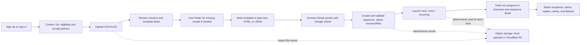

## What Feels Different In The Current App

- One calm operator surface instead of separate list, finder, sender, and launch tools.
- Gmail-based sending stays central to the current product story.
- Overview cards refresh while launches are active, so recent sequence progress does not depend on a manual reload.
- Replies are matched back from connected Gmail accounts and surfaced on sequence detail pages.
- Plain-text templates now behave more like real email composition, including paragraph, ordered-list, and unordered-list handling.
- Finder is a main workflow surface, not an afterthought.
- Eligibility, policy acceptance, and anti-abuse enforcement are now part of the core onboarding and access-control path.

## Notable Current Behaviors

### Sending and tracking

- Gmail sending currently goes through connected Google OAuth sender profiles.
- The send pipeline appends an open-tracking pixel to rendered HTML email output.
- Open and click tracking routes still exist in the app.
- Unsubscribe and suppression plumbing still exists in the codebase, but the operator-facing suppression dashboard is hidden from the active app flow.

### Eligibility, policy acceptance, and account restrictions

- Non-admin users must complete `/verify-eligibility` before entering the app shell.
- Verification records `adultVerifiedAt`, `termsAcceptedAt`, `privacyAcceptedAt`, `antiAbuseAcceptedAt`, `policyVersion`, and `ageGateVersion` on the `User`.
- Users who select "I am not eligible" are marked with `eligibilityBlockedAt` and `eligibilityBlockedReason = "self_reported_underage"`.
- `requireApiUser()` denies API access when the account is globally API-disabled, blocked for ineligibility, restricted by an admin, or missing policy confirmation.
- Capability-specific API gates still apply for imports, templates, campaign launches, and AI enhancement.
- Admins can restrict or unrestrict non-admin users through `PATCH /api/admin/users/[id]` using `action: "restrict"` or `action: "unrestrict"`.
- Admin accounts and the acting admin's own account are protected from restriction/deletion flows in the dashboard APIs.
- Restricted accounts store `restrictedAt` and `restrictedReason`; admin, restriction, unrestriction, and policy-acceptance actions are audit logged.
- The database migration `20260612235800_user_compliance_fields` adds the compliance and restriction columns required by Prisma and the auth flow.

### Gmail daily send safety limit

Sendloom stops sending before Gmail starts rejecting. Each successful Gmail send is
recorded in the `SendLedger` table; before every send attempt the worker checks the
rolling 24-hour count for that sender and blocks if the safety cap is hit.

- **Default cap**: 450 successful sends per rolling 24 hours.
- **Override**: set `GMAIL_DAILY_SEND_SAFETY_LIMIT` in your environment (e.g. `GMAIL_DAILY_SEND_SAFETY_LIMIT=450`). Missing or invalid values fall back to 450.
- **Scope**: tracked per connected Gmail sender (`SenderProfile`), because Gmail's
  quota is per-mailbox. A user-level rollup is also surfaced on the Overview page.
- **Rolling window**, not midnight reset: the system looks at the last 24 hours from
  now. `resetAt` is the oldest counted successful send + 24 hours — at that moment
  enough capacity frees up for sending to resume.
- **What counts**: confirmed Gmail sends (initial and follow-up) recorded via
  `recordSendOnLedger`. Failed sends, retry attempts that failed, suppressed,
  invalid, or skipped recipients are **not** counted.

### Gmail send pacing (large sequences)

The daily safety cap above protects the rolling 24h volume; pacing protects the
per-minute rate. The two are **separate and both enforced** — pacing only
delays/requeues jobs, it never changes how the rolling 24h cap is counted. Gmail's
anti-abuse limiter trips well below the API's documented per-second quota, so each
connected sender is paced independently:

- **Rate**: `GMAIL_SENDS_PER_MINUTE` (default `3`) — Sendloom sends at most this
  many Gmail emails **per minute per connected sender** (`SenderProfile`). Enforced
  by an atomic Redis per-minute window (`gmail-send-rate:sender:<id>`) so concurrent
  workers/processes can never over-send. Missing/invalid values fall back to 3.
- **Shared across parallel sequences**: every active sequence for the same sender
  shares that sender's 3/min window. Different senders get their own independent
  windows (sender A sending does not slow sender B).
- **Fair scheduling**: when several sequences for one sender compete, the scheduler
  splits the window round-robin (≈1 send per sequence per minute at 3/min with 3
  active sequences) and rotates which sequence goes first, so no sequence starves.
- **Waiting, not failing**: when the per-minute window is full, the recipient stays
  queued with a future `nextRetryAt` and a `GMAIL_SENDER_PACING` marker (shown as
  "Queued / waiting for the send window"). Gmail is **not** called, `retryCount` is
  **not** incremented, and the job is **never** marked failed or permanent — it
  simply sends in the next window.
- **Concurrency**: `GMAIL_SENDER_CONCURRENCY` (default `2`) — caps simultaneous
  worker sends so a single mailbox never bursts concurrent requests. Concurrency
  never bypasses pacing: the per-sender window gate is atomic.
- **On throttle**: even with pacing, Gmail may occasionally return a rate/quota/
  temporary error (HTTP 429/5xx, `userRateLimitExceeded`, `quotaExceeded`,
  `Backend Error`, "try again later", etc.). It is classified as retryable — the
  recipient is retried with backoff or the run is paused, **never** marked as a
  permanent recipient rejection. The real provider code/reason/status is stored in
  the recipient job's diagnostic metadata (never tokens or message bodies).

This dramatically reduces Gmail throttling on large sequences and protects sender
reputation, but does not guarantee Gmail will never rate-limit.

> Earlier builds used 120/min, then 30/min — both still let large sequences
> (100+ recipients) trip Gmail's rate limiter partway through. 3/min keeps a single
> mailbox far under the limit. Raise `GMAIL_SENDS_PER_MINUTE` only if you have
> verified headroom for the sending mailbox.
- **Blocking behavior**: when the cap is hit during a send, the affected
  `CampaignRun` is set to `PAUSED` with `progressSnapshot.pauseReason = "DAILY_SEND_LIMIT"`
  and `pauseResumesAt = <resetAt ISO>`. The in-flight recipient job stays `PENDING`
  (not `FAILED`) so it picks up automatically on resume.
- **Auto-resume**: `processPendingCampaignWork` (run on every Overview render and
  every scheduler tick) calls `resumeCampaignRunsBlockedByDailyLimit`, which releases
  any run whose `pauseResumesAt` has passed. Manual pauses are left alone — they
  carry no `DAILY_SEND_LIMIT` reason.
- **Concurrency safety**: a Redis sorted-set + Lua script reserves capacity
  atomically before the Gmail call, so the 10 worker fibers cannot collectively
  blow past the cap. The DB ledger remains the source of truth; Redis only
  guards the race window between "decide to send" and "ledger write".
- **UI surfaces**: Overview has a dedicated send-window card (per sender);
  blocked sequences show "Paused by Gmail safety limit · resumes …" on the row
  and a compact alert on the sequence detail page. No recipient is marked
  "Failed/Permanent" because of the safety limit.

### Replies

- Reply counts are part of the sequence detail view.
- Reply syncing is tied to connected Gmail senders.
- The cron flow also syncs replies when it processes campaign work.

### Template rendering

- Plain text supports pasted email body structure better than before.
- Blank lines become paragraphs.
- Lines starting with `-`, `*`, or `•` render as bullet lists.
- Lines starting with `1.`, `2.`, `3.` or `1)` render as ordered lists.

### Sequence monitoring

- Overview cards show processed-recipient progress and refresh while a run is live.
- Sequence detail pages show recipient activity, replies, delivered totals, and attention states.

## Architecture Overview

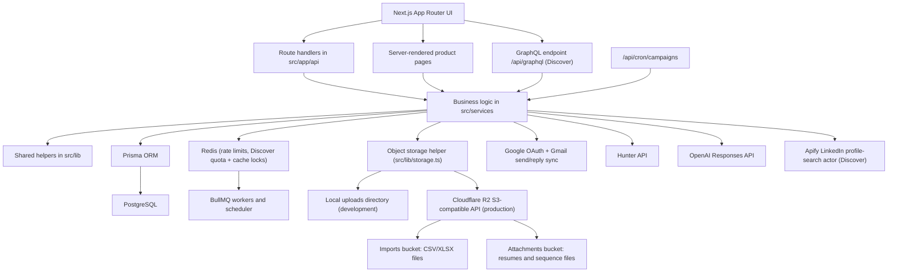

### Runtime shape

- **Frontend:** Next.js App Router + React
- **API:** route handlers in `src/app/api`
- **Domain logic:** `src/services`
- **Shared infrastructure/domain helpers:** `src/lib`
- **Persistence:** Prisma + PostgreSQL
- **Rate limiting and queueing:** Redis + BullMQ
- **Object storage:** Local uploads in development or Cloudflare R2 in production
- **Email transport:** Gmail OAuth through Nodemailer
- **Enrichment:** Hunter
- **AI assistance:** OpenAI Responses API

## Sequence Diagrams

These diagrams trace the main flows the app performs, from the browser through the API routes, services, and external systems.

### Sign up and log in

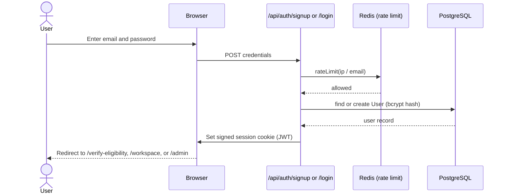

### Confirm eligibility and policies

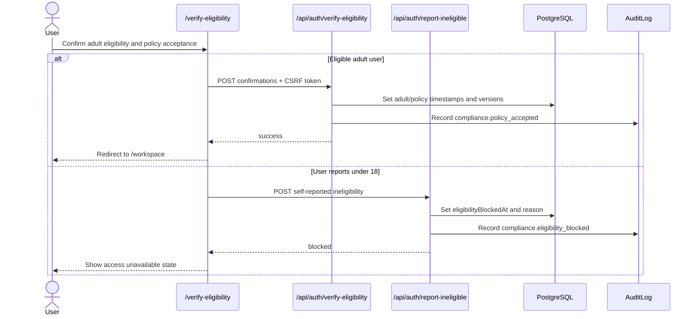

### Connect a Gmail sender (Google OAuth)

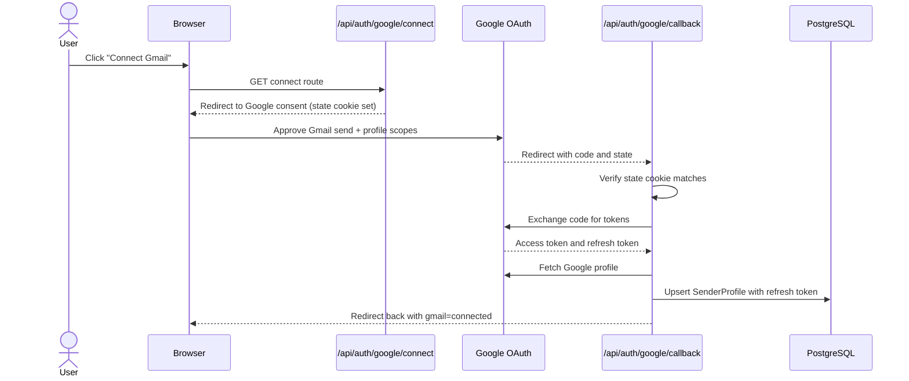

### Import a CSV/XLSX audience

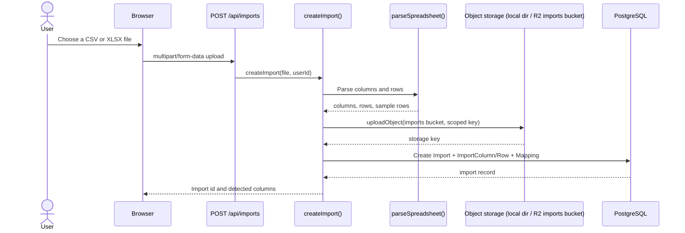

### Find a missing email (Finder)

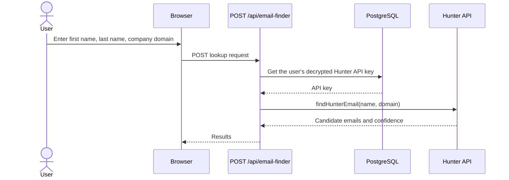

### Write a template with AI assistance

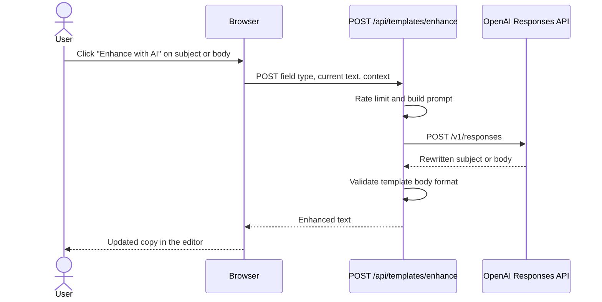

### Create a sequence with attachments

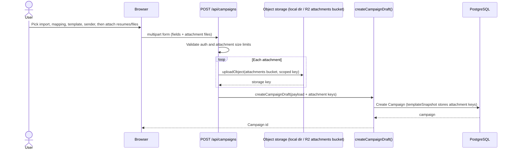

### Launch a sequence and send email

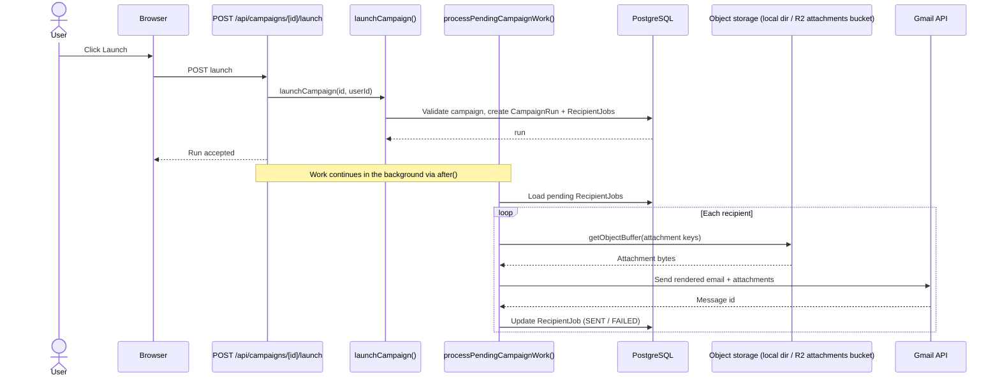

### Download a sequence attachment

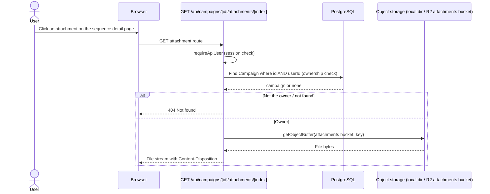

### Track an email open

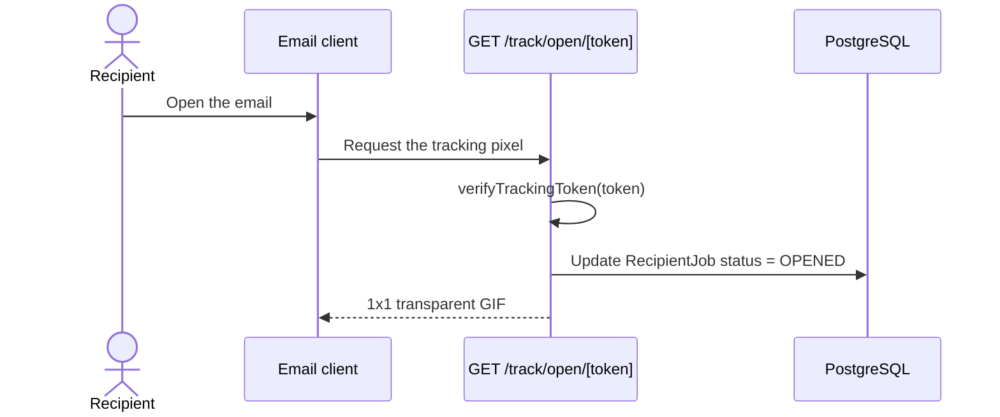

### Scheduled processing and reply sync (cron)

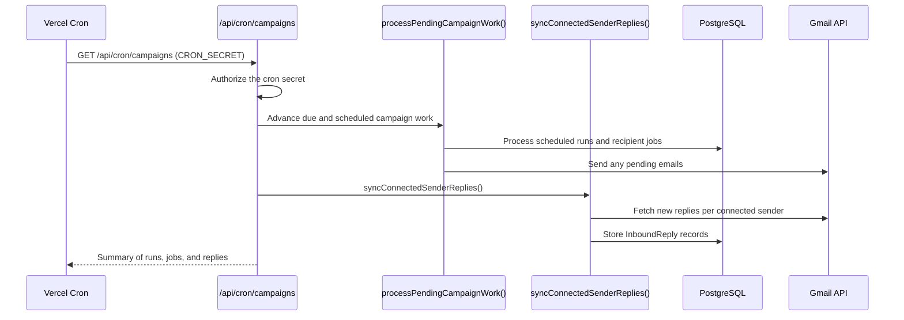

### Process a Discover search

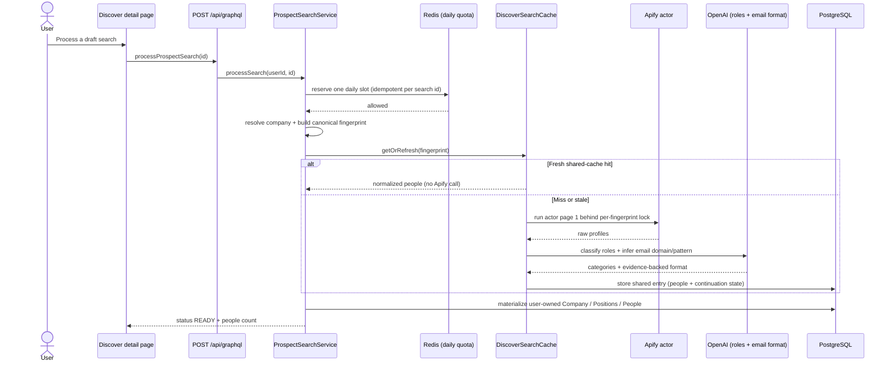

### Add 10 more people to a search

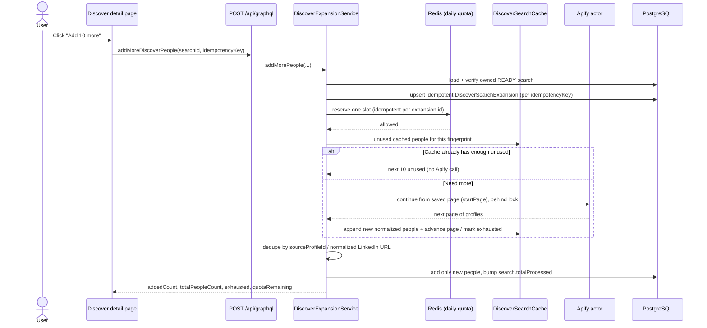

## Tech Stack

| Layer | Technology | Why it is here |
| --- | --- | --- |
| Web app | Next.js 15 + React 19 | App Router pages, SSR, and route handlers |
| Language | TypeScript | Shared types and logic across UI and backend |
| Database | PostgreSQL + Prisma | Campaign, import, template, sender, reply, and tracking data |
| Queueing | Redis + BullMQ | Rate-window support and background processing hooks |
| Auth | JWT session cookie + bcrypt + Google OAuth | Local auth plus Google login/sender connection |
| Sending | Nodemailer + Gmail OAuth2 | Send from connected Gmail accounts |
| AI | OpenAI Responses API | Subject/body enhancement and spam cleanup |
| Enrichment | Hunter API | Finder and domain search |
| File ingest | `xlsx` + CSV parsing | Spreadsheet upload and normalization |
| File/object storage | Local filesystem (development) or Cloudflare R2 (production) | Stores import spreadsheets and sequence attachments/resumes |
| Tests | Vitest | Library-level regression coverage |

## Main Routes

### Public routes

| Route | Purpose |
| --- | --- |
| `/` | Landing page |
| `/signup` | Account creation |
| `/login` | Sign in |
| `/faq` | Frequently asked questions |
| `/privacy` | Privacy page |
| `/terms` | Terms page |
| `/abuse` | Anti-Abuse Policy |
| `/track/open/[token]` | Open tracking pixel |
| `/track/click/[token]` | Click tracking redirect |
| `/unsubscribe/[token]` | Legacy unsubscribe/compliance route |

### Authenticated routes

| Route | Purpose |
| --- | --- |
| `/workspace` | Overview dashboard / operator command center |
| `/finder` | Finder and domain search |
| `/prospects` | **Discover** — Search History list: create searches and open one (feature-flagged) |
| `/prospects/[searchId]` | **Discover** search detail — company, email format, people, and Add 10 more for one search |
| `/imports` | Audience upload and mapping workflow |
| `/templates` | Template editor and preview workspace |
| `/campaigns` | Main sequence list and builder |
| `/campaigns/[id]` | Sequence detail, setup, monitoring, and launch controls |
| `/verify-eligibility` | Adult eligibility, terms/privacy, and anti-abuse confirmation gate |
| `/sequences` | Redirect alias to `/campaigns` |
| `/sequences/[id]` | Alias for sequence detail |
| `/admin` | Admin overview — metrics, user-status chart, and health strip |
| `/admin/users` | User management — searchable table and per-user inspector panel |
| `/admin/restrictions` | Restrictions — per-user access control picker and panel |
| `/admin/system-health` | System health — live runtime check cards with Recheck button |
| `/suppressions` | Redirects to `/workspace` |

## API Surface

### Authentication

- `POST /api/auth/signup`
- `POST /api/auth/login`
- `POST /api/auth/logout`
- `GET /api/auth/google/login`
- `GET /api/auth/google/login/callback`
- `GET /api/auth/google/connect`
- `GET /api/auth/google/callback`
- `GET /api/auth/eligibility-status`
- `POST /api/auth/verify-eligibility`
- `POST /api/auth/report-ineligible`

### Imports

- `POST /api/imports`
- `PATCH /api/imports/[id]`
- `DELETE /api/imports/[id]`
- `GET /api/imports/[id]/columns`
- `POST /api/imports/[id]/mapping`
- `POST /api/imports/[id]/template-fields`

### Templates

- `GET /api/templates`
- `POST /api/templates`
- `POST /api/templates/enhance`

### Sequences / campaigns

- `POST /api/campaigns`
- `PATCH /api/campaigns/[id]`
- `DELETE /api/campaigns/[id]`
- `POST /api/campaigns/[id]/validate`
- `POST /api/campaigns/[id]/launch`
- `GET /api/campaigns/[id]/status`
- `GET /api/campaigns/[id]/attachments/[attachmentIndex]`

### Finder

- `POST /api/email-finder`
- `POST /api/domain-search`
- `GET /api/domain-search/[id]`
- `POST /api/save-api-key`

### Background processing and webhooks

- `POST /api/send`
- `GET /api/cron/campaigns`
- `POST /api/cron/campaigns`
- `POST /api/webhooks/resend`

### Prospect graph (local backend prototype, disabled by default)

- `POST /api/graphql` — GraphQL endpoint for the Company → Position → People graph. Gated behind `PROSPECT_GRAPH_ENABLED`; see [Prospect Graph Backend](#prospect-graph-backend-local-graphql-prototype).

### Health

- `GET /api/health`

### Admin

- `GET /api/admin/users`
- `PATCH /api/admin/users/[id]` — updates per-user controls, restricts, or unrestricts users
- `DELETE /api/admin/users/[id]`
- `GET /api/admin/system-health`

### Legacy/internal suppressions surface

- `GET /api/suppressions`
- `POST /api/suppressions`
- `DELETE /api/suppressions/[id]`

## Data Model Summary

| Model | Purpose |
| --- | --- |
| `User` | Operator/admin account plus auth state, policy acceptance timestamps, eligibility blocks, and per-user restrictions/settings |
| `SenderProfile` | Connected Gmail sender identity |
| `Import` | Uploaded spreadsheet metadata |
| `ImportColumn` | Normalized column definitions |
| `ImportRow` | Row-level imported audience data |
| `Mapping` | Import-to-template field mapping |
| `Template` | Subject/body, format, preview payload, and variable manifest |
| `Campaign` | Sequence definition tying import, mapping, template, sender, and schedule together |
| `CampaignRun` | A specific execution of a sequence |
| `RecipientJob` | Per-recipient delivery state, retry/error metadata, and provider references |
| `InboundReply` | Reply records matched back to sent outreach |
| `ProviderEvent` | Normalized provider webhook event data |
| `Suppression` | Legacy/internal suppression records |
| `RateLimitWindow` | Per-user send guardrails |
| `AuditLog` | Admin and operational audit records |
| `HunterDomainSearch` | Stored Finder domain search history |
| `ProspectCompany` | Resolved company node in the prospect graph (website domain, evidence-backed email domain, email pattern, confidence) |
| `ProspectCompanyPosition` | Position-category node under a company (e.g. `SOFTWARE_ENGINEERING`) |
| `ProspectPerson` | A discovered professional assigned to one position node, with an inferred business email |
| `ProspectSearch` | A prospect discovery request and its pipeline status |
| `ProspectTitleClassification` | Global cache of AI title→category classifications (avoids re-calling the model) |

## Repository Guide

```text
.
├── .nvmrc
├── README.md
├── next.config.mjs
├── package.json
├── prisma
│   ├── migrations
│   └── schema.prisma
├── src
│   ├── app
│   │   ├── (app)
│   │   │   ├── admin
│   │   │   │   ├── restrictions
│   │   │   │   ├── system-health
│   │   │   │   ├── users
│   │   │   │   ├── admin-workspace.tsx
│   │   │   │   ├── page.module.css
│   │   │   │   └── page.tsx
│   │   │   ├── campaigns
│   │   │   ├── finder
│   │   │   ├── imports
│   │   │   ├── sequences
│   │   │   ├── suppressions
│   │   │   ├── templates
│   │   │   └── workspace
│   │   ├── api
│   │   ├── abuse
│   │   ├── faq
│   │   ├── login
│   │   ├── signup
│   │   ├── track
│   │   ├── unsubscribe
│   │   ├── privacy
│   │   ├── terms
│   │   └── verify-eligibility
│   ├── components
│   │   ├── dashboard
│   │   ├── suppressions
│   │   ├── campaign-builder.tsx
│   │   ├── hunter-dashboard.tsx
│   │   ├── mapping-library.tsx
│   │   └── templates-workspace.tsx
│   ├── lib
│   ├── services
│   └── workers
├── uploads
├── tsconfig.json
└── vitest.config.ts
```

### Important directories

- `src/app/page.tsx`: marketing landing page
- `src/app/verify-eligibility`: adult eligibility and policy confirmation screen
- `src/app/abuse/page.tsx`: Anti-Abuse Policy page
- `src/app/api/auth/verify-eligibility/route.ts`: records adult, terms, privacy, and anti-abuse acceptance
- `src/app/api/auth/report-ineligible/route.ts`: records self-reported under-18/ineligible accounts
- `src/app/api/auth/eligibility-status/route.ts`: returns verification, blocked, restricted, and policy status
- `src/app/(app)/workspace`: overview dashboard
- `src/app/(app)/campaigns`: active sequence list and detail surface
- `src/app/(app)/templates`: template workspace
- `src/app/(app)/finder`: Finder workspace
- `src/app/(app)/imports`: import/mapping workflow
- `src/app/(app)/admin/admin-workspace.tsx`: all admin client components — `AdminOverviewSection`, `AdminUsersSection`, `AdminRestrictionsSection`, `AdminSystemHealthSection`
- `src/app/(app)/admin/page.tsx`: admin overview page (server component, fetches metrics)
- `src/app/(app)/admin/users/page.tsx`: user management page
- `src/app/(app)/admin/restrictions/page.tsx`: restrictions management page
- `src/app/(app)/admin/system-health/page.tsx`: system health page
- `src/components/nav.tsx`: app sidebar — shows admin sub-navigation when `isAdmin=true`
- `src/components/dashboard`: overview cards, activity, and sequence panels
- `src/lib/templates.ts`: template parsing, rendering, and preview logic
- `src/services/campaigns.ts`: sequence launch and processing logic
- `src/services/replies.ts`: Gmail reply sync and matching
- `src/services/hunter-keys.ts`: Hunter key storage
- `src/services/hunter-domain-searches.ts`: Finder history layer
- `prisma/migrations/20260612235800_user_compliance_fields`: adds the user compliance and restriction columns used by the eligibility/admin flows

## Environment Variables

Create a local `.env` file at the repo root with the values below. Secrets and sample env files are intentionally not committed to the repo.

| Variable | Required | Purpose |
| --- | --- | --- |
| `DATABASE_URL` | Yes | Prisma/PostgreSQL connection |
| `DATABASE_URL_UNPOOLED` | Recommended | Direct Prisma connection for migrations |
| `REDIS_URL` | Yes | Redis/BullMQ/rate-limit backend |
| `SESSION_SECRET` | Yes | JWT signing for session cookies ONLY. Must NOT be reused for any other purpose. |
| `TRACKING_SECRET` | Required in production | JWT signing for open/click/unsubscribe tracking tokens. Must be different from `SESSION_SECRET` — tracking tokens are sent in every email and are not secret. |
| `MAIL_PROVIDER` | Yes | Mail backend selector, typically `gmail` |
| `GOOGLE_CLIENT_ID` | For Google auth | Google OAuth client id |
| `GOOGLE_CLIENT_SECRET` | For Google auth | Google OAuth client secret |
| `OPENAI_API_KEY` | Optional | AI enhancement and spam cleanup |
| `HUNTER_KEY_ENCRYPTION_SECRET` | Required in production | Encrypts stored Hunter API keys. Must NOT be the same as `SESSION_SECRET`. |
| `CRON_SECRET` | Required in production | Protects `/api/cron/campaigns`. With this unset, the cron route fails closed in production. |
| `RESEND_WEBHOOK_SECRET` | Required in production for Resend | HMAC secret. Webhook fails closed in production when unset. |
| `APP_BASE_URL` | Yes | Base URL used for redirects and tracking links |
| `OBJECT_STORAGE_MODE` | Yes | Storage backend: `local` for the local filesystem, `r2` for Cloudflare R2 |
| `LOCAL_UPLOAD_DIR` | Yes | Local upload destination, used when `OBJECT_STORAGE_MODE=local` |
| `CLOUDFLARE_R2_ACCOUNT_ID` | When `OBJECT_STORAGE_MODE=r2` | Cloudflare account id used for the R2 S3-compatible endpoint |
| `CLOUDFLARE_R2_IMPORTS_BUCKET` | When `OBJECT_STORAGE_MODE=r2` | R2 bucket name for import spreadsheets (CSV/XLSX) |
| `CLOUDFLARE_R2_ATTACHMENTS_BUCKET` | When `OBJECT_STORAGE_MODE=r2` | R2 bucket name for sequence attachments/resumes |
| `CLOUDFLARE_R2_ACCESS_KEY_ID` | When `OBJECT_STORAGE_MODE=r2` | R2 API access key id (server-side only) |
| `CLOUDFLARE_R2_SECRET_ACCESS_KEY` | When `OBJECT_STORAGE_MODE=r2` | R2 API secret access key (server-side only) |
| `CLOUDFLARE_R2_PUBLIC_BASE_URL` | Optional | Public base URL for a bucket; only set if objects are served publicly |
| `DEFAULT_FROM_EMAIL` | Optional | Default sender metadata |
| `DEFAULT_FROM_NAME` | Optional | Default sender display name |
| `ADMIN_EMAIL` | Optional | Bootstrap admin email |
| `ADMIN_PASSWORD` | Optional | Bootstrap admin password |
| `RESEND_API_KEY` | Optional | Reserved for provider/webhook expansion |
| `GMAIL_DAILY_SEND_SAFETY_LIMIT` | Optional | Successful Gmail sends allowed per sender per rolling 24h. Defaults to `450`. |
| `GMAIL_SENDS_PER_MINUTE` | Optional | Max Gmail sends per minute **per connected sender**. Defaults to `3`. Parallel sequences for the same sender share this window; it is separate from the rolling 24h daily cap. Keep this conservative — Gmail throttles sustained API sends well below its documented per-second quota, and a higher value can mass-fail large sequences. |
| `GMAIL_SENDER_CONCURRENCY` | Optional | Max simultaneous Gmail sends the worker runs. Defaults to `2`. Prevents bursts of concurrent requests from one mailbox. |
| `PROSPECT_GRAPH_ENABLED` | Optional | Master flag for the prospect GraphQL backend. Defaults to `false`. Keep `false` in production. |
| `GRAPHQL_GRAPHIQL_ENABLED` | Optional | Enables the GraphiQL playground locally. Defaults to `false`; never serves in production regardless of value. |
| `APIFY_API_TOKEN` | For prospect search | Token for the Apify LinkedIn profile-search actor. |
| `APIFY_PROSPECT_ACTOR_ID` | Optional | Actor id/slug. Defaults to `harvestapi/linkedin-profile-search`. |
| `PROSPECT_EMAIL_DISCOVERY_PROVIDER` | Optional | Primary email-format discovery provider. `openai_web_search` (default) uses GPT-5.5 + the OpenAI Responses `web_search` tool; `none` disables AI discovery (manual / source-URL only). |
| `PROSPECT_EMAIL_FORMAT_WEB_SEARCH_ENABLED` | Optional | Master switch for the AI web search. Defaults to `true`; when `false`, web search never runs. |
| `PROSPECT_EMAIL_FORMAT_MAX_WEB_RESULTS` | Optional | Public results the model is asked to weigh per company. Defaults to `5`. |
| `PROSPECT_EMAIL_FORMAT_AI_HOURLY_LIMIT` | Optional | Per-user hourly cap on AI email-format searches. Defaults to `5`. |
| `PROSPECT_EMAIL_FORMAT_AI_DAILY_LIMIT` | Optional | Per-user daily cap on AI email-format searches. Defaults to `20`. |
| `WEB_SEARCH_PROVIDER` | Optional | Legacy/secondary public email-format scraper. Supported values: `none`, `serper`, `brave`. Defaults to `none`; the AI path above is primary and direct source URL refresh always works. |
| `SERPER_API_KEY` | When `WEB_SEARCH_PROVIDER=serper` | Serper API key used only for public email-format search queries. |
| `BRAVE_SEARCH_API_KEY` | When `WEB_SEARCH_PROVIDER=brave` | Brave Search API key used only for public email-format search queries. |
| `LOCAL_PROSPECT_MAX_RESULTS` | Optional | Hard local cap on results per search. Defaults to `25`. |
| `DISCOVER_RESULTS_PER_SEARCH` | Optional | Fixed people per processed Discover search (users cannot choose this). Defaults to `10`; enforced server-side. |
| `DISCOVER_DAILY_SEARCH_LIMIT` | Optional | Processed Discover searches allowed per user per daily (UTC) window. Defaults to `4` (so ordinary users request at most 40 people/day). |
| `DISCOVER_QUOTA_EXEMPT_EMAILS` | Optional | Server-only, comma-separated, case-insensitive allowlist of accounts exempt from the **daily** Discover quota only. Resolved from the authenticated session; never trust a request body. Do **not** prefix with `NEXT_PUBLIC_`. |
| `DISCOVER_SHARED_CACHE_TTL_DAYS` | Optional | Freshness window (days) for the shared cross-user Discover result cache. Identical canonical searches reuse cached results instead of calling Apify again. Defaults to `30`; absent/invalid falls back to `30`. |
| `DISCOVER_SHARED_CACHE_VERSION` | Optional | Cache schema version included in the fingerprint. Bump to invalidate all existing entries. Defaults to `v1`. |
| `DISCOVER_EXPANSION_BATCH_SIZE` | Optional | New unique people added per **Add 10 more** request. Defaults to `10`; the enforced product value stays `10`. |
| `DISCOVER_EXPANSION_MAX_PROVIDER_PAGES` | Optional | Safety cap on provider continuation pages fetched in a single expansion. Defaults to `5`. Cached unused people are used before any provider call, and continuation resumes after previously fetched pages (never restarts at page 1). |
| `PROSPECT_AI_ENABLED` | Optional | Enables the AI company/role/pattern steps. Defaults to `true`. |
| `PROSPECT_AI_MODEL` | Optional | Override the prospect AI model. Blank uses the per-task defaults (company/role: `gpt-5`; AI email-format web search: `gpt-5.5`). |
| `PROSPECT_AI_REASONING_EFFORT` | Optional | Reasoning effort for prospect AI calls. Defaults to `low`. Supported values are `none`, `low`, `medium`, `high`, and `xhigh`; legacy `minimal` is coerced to `low` for GPT-5.5 compatibility. |
| `PROSPECT_AI_MAX_COMPANY_CALLS_PER_SEARCH` | Optional | Per-search company-resolution AI call cap. Defaults to `2`. |
| `PROSPECT_AI_MAX_ROLE_CALLS_PER_SEARCH` | Optional | Per-search title-classification AI call cap. Defaults to `1`. |
| `PROSPECT_AI_MAX_PATTERN_CALLS_PER_SEARCH` | Optional | Per-search email-domain/pattern ranking AI call cap. Defaults to `1`. |
| `PROSPECT_AI_MAX_UNIQUE_TITLES` | Optional | Max unique titles sent to the model in one batch. Defaults to `100`. |
| `PROSPECT_ALLOW_LOW_CONFIDENCE_EMAILS` | Optional | When `true`, generate emails even for LOW-confidence email-domain/pattern inference (local testing only). Defaults to `false`. |

### Security deployment notes

- Generate each secret with `openssl rand -hex 32`.
- Deploy Prisma migration `20260612235800_user_compliance_fields` before serving the age-safety build; without it Prisma will query missing `User` columns such as `adultVerifiedAt`.
- **Rotate `SESSION_SECRET` after deploying this release.** Tracking tokens that were issued in older releases were signed with `SESSION_SECRET`; rotating it invalidates any leaked tracking tokens that could have been replayed as session cookies.
- Set `TRACKING_SECRET` to a separate value from `SESSION_SECRET` before issuing the first new tracking link.
- Set `CRON_SECRET` before deploying to production — the cron route refuses to run without it.
- Set `HUNTER_KEY_ENCRYPTION_SECRET` before any user saves their first Hunter API key, otherwise existing keys cannot be decrypted after a future rotation.
- Confirm response security headers are returned by the deployed host (HSTS, CSP, X-Frame-Options, etc. are emitted by `next.config.mjs`).
- Admin privileges are sourced from the DB `users.isAdmin` flag only. Use `ADMIN_EMAIL` + `ADMIN_PASSWORD` to bootstrap the first admin via the seed; later changes must go through DB-level updates.

## Local Development

### Prerequisites

- Node.js `20.x`
- npm `10+`
- PostgreSQL
- Redis

### Setup

```bash
npm install
# create a local .env using the variables listed above
npm run prisma:generate
npm run prisma:migrate
npm run dev
```

The Node version is pinned in `.nvmrc` (`20`).

### Useful extra processes

```bash
npm run worker
npm run scheduler
```

### Tests

Vitest covers the `src/lib` regression surface (auth, scheduling, templates, validation, retry policy, spam analysis, and friends).

```bash
npm test            # one-shot run
npm run test:watch  # watch mode
```

### Notes

- The app can process campaign work inline during launches and status refreshes, so local development still works even without a fully separate worker setup.
- `/api/cron/campaigns` can also advance pending campaign work and trigger reply sync.
- Uploads default to the local `uploads/` directory. With `OBJECT_STORAGE_MODE=local`, import spreadsheets and sequence attachments are written under `LOCAL_UPLOAD_DIR`.
- Production deployments (for example on Vercel) can set `OBJECT_STORAGE_MODE=r2` to store the same files in Cloudflare R2 instead. Existing local upload records keep working in either mode.
- Linting is configured through `next lint`. Type checks run via `npx tsc --noEmit`.

## Prospect Graph Backend (Local GraphQL Prototype)

> **Local prototype.** This is a local-first GraphQL backend for prospect
> discovery, now with a read-only review dashboard at `/prospects` (see
> [Prospects dashboard](#prospects-dashboard)). It still performs **no sequence
> creation**, **no imports**, and **no automatic sending** — the dashboard is for
> reviewing company, position, and people results in-app. It is disabled by
> default (and in production) behind `PROSPECT_GRAPH_ENABLED`, and can also be
> exercised through GraphiQL, automated tests, and the local CLI script.

### What it does

A user creates a prospect search for a company + job titles + locations. The
backend then:

1. resolves the company (official name, public website domain, LinkedIn URL),
2. discovers professional profiles via the Apify LinkedIn profile-search actor,
3. normalizes + de-duplicates profiles and drops anyone not currently at the company,
4. classifies each unique job title into a position category,
5. separately infers the employee email domain and email pattern from evidence,
6. generates each person's candidate email **deterministically** from that selected email domain and pattern.

The result is exposed as a graph:

```text
Company
  └── Position category (SOFTWARE_ENGINEERING, HUMAN_RESOURCES, …)
        └── People (with an inferred — never verified — business email)
```

### Add 10 more (search expansion)

A READY search can be extended in place with **Add 10 more** (the `UserPlus`
action by the People heading; GraphQL `addMoreDiscoverPeople(searchId, idempotencyKey)`).
Each request appends **up to 10 new unique people** to the **same** search — it
never creates a new Search History row, never resets or reorders existing
people, and the People table stays at **10 rows per page** (new people appear on
later pages). Key behavior:

- **One daily slot per request.** Each Add More uses one Discover daily slot
  (the same quota as an initial search), reusing the existing quota service. A
  cached expansion still consumes a slot; **retries are idempotent** (keyed on a
  client-generated `idempotencyKey` → the expansion id), so a double-click,
  network retry, or retry of a failed expansion never charges a second slot. The
  internal/unlimited exemption is unchanged.
- **Cache before provider.** Unused people already in the shared cache for the
  exact canonical query (company + normalized roles + normalized locations) are
  materialized first; Apify is only called when more are still needed.
- **Provider continuation.** When the provider is needed it **resumes after the
  pages already fetched** (the actor's `startPage`), persisting the next page,
  pages fetched, and an exhausted flag on the shared cache entry — it never
  restarts at page 1. A configurable safety cap
  (`DISCOVER_EXPANSION_MAX_PROVIDER_PAGES`, default 5) bounds one expansion.
- **Deduplicated by stable identity** (provider profile id → normalized LinkedIn
  URL, never by name), enforced server-side, so the same person is never added
  twice and two different people who share a name are never merged.
- **Exhaustion.** Once the shared results are exhausted the button is hidden and
  the search reports `exhausted: true`; the provider is not called again.
- New people go through the **same** role classification and the existing
  company-level email format (no email-format AI re-run); inferred emails are
  never marked verified.

### AI usage (strictly bounded)

AI is used only where semantic reasoning helps, **never once per person**. A
typical search makes about **three** model calls total:

| Task | Calls | Notes |
| --- | --- | --- |
| Company resolution | ≤ 1 | Skipped entirely when a valid company domain is supplied. |
| Title classification | ≤ 1 | One **batched** call for all unique unknown titles; deterministic map + DB cache handle the rest. |
| Email domain + pattern | ≤ 1 | One call per company. GPT-5.5 web search finds public email-format evidence (or, in the legacy path, ranks scraped evidence); the selected domain and pattern must already appear in evidence. |

Per-search ceilings are enforced in code (`AiCallBudget`) and configured via
`PROSPECT_AI_MAX_*`. Every AI response is re-validated server-side with Zod and
coerced to the allowed enums — AI output is never trusted directly. AI ranks
evidence only; it cannot invent an employee email domain or pattern. Candidate
emails are then generated with deterministic TypeScript (`generateEmail`) from
`ProspectCompany.emailDomain` plus `emailPattern`, so AI cost does not scale with
the number of people.

Website domain and employee email domain are separate fields. For example,
Applied Materials can resolve to website `appliedmaterials.com` while using
employee email domain `amat.com` and pattern `first_last`. If email-domain or
pattern evidence is missing or conflicting, the result stays `LOW` or
`UNAVAILABLE` and high-confidence emails are not generated.

#### Email-format discovery with GPT-5.5 web search (primary path)

The primary way the employee email format is found is **AI web search**. When
`PROSPECT_EMAIL_DISCOVERY_PROVIDER=openai_web_search` (the default) and
`OPENAI_API_KEY` is set, `EmailDomainService` calls **GPT-5.5 via the OpenAI
Responses API with the built-in `web_search` tool** (`PROSPECT_AI_MODEL`
overrides the model). The model searches public sources such as
RocketReach/Hunter-style email-format pages and returns **structured evidence
only** — `{ sourceUrl, sourceType, patternRaw, normalizedPattern, exampleEmail,
emailDomain, percentage }` rows plus a proposed selection. It runs **once per
company**, never per person.

The backend then validates that evidence before trusting it: unsupported
patterns, personal/aggregator domains (gmail, rocketreach.co, hunter.io,
linkedin.com, …), and any selection not actually present in the evidence are
rejected; `HIGH` confidence requires a sourced, quantified row; and the example
email domain wins over the website domain. So Esri resolves to `flast@esri.com`
and Applied Materials resolves to `first_last@amat.com` (website
`appliedmaterials.com`, email domain `amat.com`) **when public evidence supports
it**. Inferred addresses are never marked `VERIFIED`.

Cost is controlled: the web search consumes the same per-search `email_pattern`
AI budget (so the deterministic selector — not a second model call — makes the
final choice), high-confidence results are cached on the company for 7 days, and
each user is rate limited (`PROSPECT_EMAIL_FORMAT_AI_HOURLY_LIMIT` /
`PROSPECT_EMAIL_FORMAT_AI_DAILY_LIMIT`).

Fallbacks remain: pasting a specific public **source URL** parses that page
deterministically (no web search), a **manual override** sets the format by
hand, and the legacy `WEB_SEARCH_PROVIDER=serper|brave` scraper can still supply
evidence if configured. If AI discovery is unavailable (no key or
`PROSPECT_EMAIL_FORMAT_WEB_SEARCH_ENABLED=false`), the UI surfaces a clear
message and the manual/source-URL paths still work.

### Architecture

```text
GraphQL resolvers (thin)
   → ProspectSearchService            (src/services/prospects/prospect-search-service.ts)
   |   → CompanyResolutionService     (AI task 1)
   |   → ApifyProfileSearchService    (Apify actor + normalization, supports startPage)
   |   → RoleClassificationService    (deterministic map + cache + AI task 2)
   |   → EmailDomainService           (evidence collection + validation + selection)
   |       → OpenAIEmailFormatDiscoveryService   (GPT-5.5 + web_search, AI task 3)
   |       → EmailFormatDiscoveryService         (source-URL / legacy scraper fallback)
   |   → email-generation-service     (deterministic, no AI)
   |   → DiscoverSearchCacheService   (shared 30-day result cache + per-fingerprint lock)
   |   → discover-quota               (Redis daily slot reservation, idempotent)
   → DiscoverExpansionService         ("Add 10 more": src/services/prospects/discover-expansion-service.ts)
       → discover-quota               (one slot per expansion, idempotent on expansion id)
       → DiscoverSearchCacheService   (reuse unused cached people, then provider continuation)
       → ApifyProfileSearchService    (continue from saved startPage; never page 1)
       → RoleClassificationService    (classify newly fetched people)
```

- GraphQL is the Sendloom backend API layer; it **calls** Apify/OpenAI, it does
  not replace them.
- Resolvers never call providers directly — all business logic lives in services
  so it can later move to BullMQ / the existing cron. The `addMoreDiscoverPeople`
  resolver delegates entirely to `DiscoverExpansionService`.
- `src/graphql/` holds the schema, context, DataLoaders, resolvers, and security
  rules; `src/app/api/graphql/route.ts` is the Yoga endpoint.

#### Discover data model (UML)

User-owned records (`ProspectSearch` → `ProspectCompany` → positions/people) are
materialized per user. The shared cache (`DiscoverSearchCache` /
`DiscoverSearchCachePerson`) holds no requester identity and is matched by a
canonical fingerprint, not a foreign key. `DiscoverSearchExpansion` is the
durable idempotency/audit record for each "Add 10 more" request.

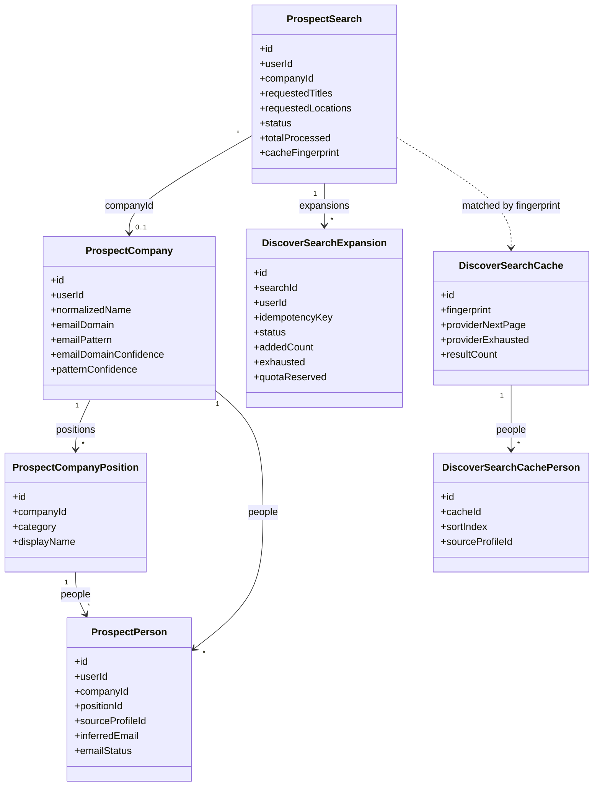

### Security controls

- Every operation requires a valid Sendloom session (reuses `getSessionUser()` /
  the same restriction + verification checks as the REST API — no GraphQL-only auth).
- All data is user-scoped (DataLoaders and queries filter by `userId`), so one
  user can never read another's company graph.
- Mutations are CSRF-protected by the existing global middleware (`POST /api/graphql`).
- Query depth and field-count (complexity) limits, a max page size of 100, and
  SSRF-safe inputs are enforced; introspection is disabled in production.
- Provider tokens, AI prompts, and raw Apify payloads are never exposed in
  responses or logs.

### Data minimization

Only professional fields are stored (name, current title, current company,
professional location, LinkedIn URL, inferred business-email metadata). Profile
photos, phone numbers, personal emails, education, full employment history,
biographies, posts, and connections are discarded at the ingestion boundary.

### Enabling it locally

Set in `.env` (see [`.env.example`](./.env.example) for the full list):

```bash
PROSPECT_GRAPH_ENABLED=true
GRAPHQL_GRAPHIQL_ENABLED=true
APIFY_API_TOKEN=...      # required to actually run the pipeline
OPENAI_API_KEY=...       # required for the AI steps
```

Then open `http://localhost:3000/api/graphql` in the browser (while logged in)
to use GraphiQL. The endpoint pre-fills the `x-csrf-token` header from your
`sendloom_csrf` cookie so mutations work; on a brand-new session, reload the page
once so the cookie is present.

### Prospect Finder dashboard

**Discover** uses a master/detail flow across two routes (no backend/debug status
such as "Prospect Graph" is shown to users). Both consume the same
`POST /api/graphql` endpoint from the client — reusing the global CSRF fetch
patch, so no CSRF protection is bypassed.

**List page — `/prospects`** is the entry point. It shows only:

- the Discover header, the **daily quota** chip, **Refresh**, and **New search**,
- a full-width, **server-paginated Search History table** (10 per page) — company, requested roles, location, people count, status, created date — where each row links to that search's detail page,
- a premium empty state when you have no searches.
- **New search** opens in a modal (the single primary action). The modal has **no "Max results" field** — every search returns up to 10 people — and shows a compact usage panel ("Up to 10 people per search", remaining searches, and the reset time). Creating a draft opens its detail page so you can process it there.

**Detail page — `/prospects/[searchId]`** is the dedicated workspace for one
user-owned search. It loads entirely from the route id (direct load, refresh, and
new tab all work; an unknown/non-owned id shows a safe "no longer available"
state) and lets you:

- review compact **summary cards** (company, people found, email format, status) and the full company + email-format details/evidence,
- **Add 10 more** unique people to this exact search (see [Add 10 more](#add-10-more-search-expansion)),
- filter people by role group, filter the visible page, select people, and copy individual inferred emails,
- **Find with AI** — discover the email format with GPT-5.5 web search, paste a specific public source URL, or fix it manually; the card shows the email domain, pattern, confidence, evidence source, and a reason summary,
- export the selection to Excel or add it to Imports,
- delete the owned company and its related searches.

Back navigation reuses the app shell's global back button (it returns to the
Search History list); the detail page adds no second in-page back control.

#### Daily usage limits

Ordinary users get a fixed, server-enforced quota: **10 people per processed
search** (the result count is never client-controlled) and **4 processed
searches per daily UTC window** — at most 40 requested people per day. Creating a
draft is free; the quota is consumed atomically the moment a draft is
**processed**, right before the paid Apify/AI pipeline runs. The same search id
can only consume one slot, so retries — double clicks, browser/network retries,
refreshes, or re-processing a `FAILED` search — never cost a second slot.
Pagination, Excel export, Add to Imports, and the email-format AI refresh do not
consume a Discover slot. When the daily quota is spent the **Process** action is
disabled and shows the reset time; the GraphQL mutation also returns a structured
`DISCOVER_DAILY_LIMIT_REACHED` error (never raw counters/keys). The header and
modal indicator refresh immediately after a search begins processing — no full
reload. Quota state lives in Redis and the key expires at the next daily window.
Accounts in the server-only `DISCOVER_QUOTA_EXEMPT_EMAILS` allowlist (resolved
from the authenticated session, compared case-insensitively) bypass the **daily**
limit only — they still use the fixed per-search count and remain subject to
authentication, ownership, CSRF, and normal rate limiting. Historical search
records keep their old `maxResults` value, but re-processing any search uses the
fixed server-side count.

#### Shared 30-day result cache

To cut Apify cost, identical Discover searches share an internal cross-user
result cache. When a search is processed, the backend builds a canonical
fingerprint from the **resolved company identity** (LinkedIn slug → official
domain → normalized name), the **normalized + sorted role set**, the
**normalized + sorted location set**, the fixed 10-result limit, and a cache
version. If a fresh (≤ `DISCOVER_SHARED_CACHE_TTL_DAYS`, default 30 days) entry
matches that exact fingerprint, its normalized people are reused and **Apify is
not called**; otherwise Apify runs behind an atomic per-fingerprint lock (so ten
simultaneous identical searches trigger only one Apify run — the rest wait and
reuse the populated entry) and the shared entry is refreshed transactionally
(old rows are never dropped before new results are ready, and a failed refresh
preserves the previous rows and never marks stale data fresh). Stale entries
(`expiresAt ≤ now`) are refreshed on the next search; abandoned entries are
cleaned up opportunistically.

Matching is exact: `Apple + Software Engineer + United States` does **not** match
`Apple + Recruiter + United States`, `Apple + Software Engineer + California`, or
`Microsoft + …` (no broad company/role/geographic equivalence). Role order,
duplicates, and casing never create separate entries.

The cache is an **internal provider-result cache, not a search-history page**. It
stores only the normalized public professional dataset plus evidence-backed
company email-format metadata — never a requester's user id, search history,
selections, exports, imports, manual email-format overrides, or suppression
decisions. Each requesting user still gets their **own** user-owned company,
people, and `ProspectSearch` records (materialized separately from the shared
data), their own exports/imports, and their own per-user suppression applied at
export time. Every processed search — cache hit or provider call — still
consumes one of the user's daily Discover quota slots, and retrying the same
search id never consumes another. The result source (`CACHE`/`PROVIDER`) is
recorded internally on the search and is not surfaced in the UI.

Both the Search History table (list page) and the People table (detail page)
paginate **server-side at exactly 10 rows per page**, using compact chevron
(`‹` / `›`) controls that show `Showing 1–10 of N` and `Page X of Y`. The people
table keeps its 10-per-page size for **every** role group. Its columns are
container-aware: long names, roles, and inferred emails **wrap** instead of being
truncated with `…` or forcing a horizontal scrollbar, and the selection and
LinkedIn columns keep clear edge spacing. Every address is clearly labelled
**inferred, not verified** (only a real `VERIFIED` status uses the green badge),
and a persistent banner reinforces that generated emails are inferred from the
selected email domain and pattern. Each page is a single responsive column that
holds up with the app sidebar open or closed, in dark and light themes; it
handles loading (skeletons), processing/failed/canceled searches, and empty
states gracefully — and it **never** creates sequences, imports, or sends
anything. Deleting a company only removes the local prospect rows for that
company. When the backend is off, the GraphQL route returns 404 and the page
shows a clean "Discover is not available right now." card instead of erroring or
exposing backend terms.

### GraphiQL examples

Check your Discover quota (read-only; never consumes a slot):

```graphql
query {
  discoverQuota {
    resultsPerSearch
    dailySearchLimit
    searchesUsed
    searchesRemaining
    resetAt
    unlimited
  }
}
```

Create a search (the result count is fixed at 10 server-side — any `maxResults`
sent here is ignored, so it is omitted):

```graphql
mutation {
  createProspectSearch(input: {
    companyName: "Apple"
    jobTitles: ["Software Engineer", "Technical Recruiter", "Data Analyst"]
    locations: ["United States"]
  }) { id status requestedCompany requestedTitles requestedLocations }
}
```

Process it (runs the pipeline):

```graphql
mutation ($id: ID!) {
  processProspectSearch(id: $id) {
    id status peopleCount
    company {
      id name
      officialWebsiteDomain
      emailDomain
      emailPattern
      emailDomainConfidence
      patternConfidence
    }
  }
}
```

Add 10 more unique people to a READY search (`idempotencyKey` is a client-generated
UUID; resending the same key never charges a second daily slot or adds a second
batch):

```graphql
mutation AddMoreDiscoverPeople($searchId: ID!, $idempotencyKey: String!) {
  addMoreDiscoverPeople(searchId: $searchId, idempotencyKey: $idempotencyKey) {
    id
    status
    addedCount
    totalPeopleCount
    quotaRemaining
    exhausted
    message
  }
}
```

Query the company graph:

```graphql
query ($companyId: ID!) {
  company(id: $companyId) {
    id name officialWebsiteDomain emailDomain emailPattern
    emailDomainEvidence { sourceName sourceUrl sourceType confidence }
    patternEvidence { pattern sourceName sourceUrl sourceType confidence }
    positions {
      category displayName peopleCount
      people { firstName lastName currentTitle location inferredEmail emailStatus }
    }
  }
}
```

Manual correction for local testing:

```graphql
mutation SetCompanyEmailInferenceOverride($companyId: ID!) {
  setCompanyEmailInferenceOverride(
    companyId: $companyId
    emailDomain: "amat.com"
    emailPattern: "first_last"
    confidence: HIGH
    reason: "Manual correction based on verified company email-format evidence"
  ) {
    id
    name
    officialWebsiteDomain
    emailDomain
    emailPattern
    patternConfidence
  }
}
```

Discover the email format with GPT-5.5 web search (the "Find with AI" button).
Pass `force: true` to bypass the 7-day high-confidence cache:

```graphql
mutation DiscoverCompanyEmailFormat($companyId: ID!) {
  discoverCompanyEmailFormat(companyId: $companyId, force: false) {
    id
    emailDomain
    emailPattern
    patternConfidence
    emailFormatReason
    patternEvidence { sourceName sourceUrl percentage confidence }
  }
}
```

Refresh from a public email-format source URL (deterministic parse, no web search):

```graphql
mutation RefreshCompanyEmailFormat($companyId: ID!) {
  refreshCompanyEmailFormat(
    companyId: $companyId
    sourceUrl: "https://rocketreach.co/esri-email-format_b5c60d6df42e0c51"
  ) {
    id
    emailDomain
    emailPattern
    patternConfidence
    patternEvidence { sourceName sourceUrl percentage confidence }
  }
}
```

Delete a local company prospect graph:

```graphql
mutation DeleteCompany($companyId: ID!) {
  deleteCompany(companyId: $companyId)
}
```

Filter people by category (cursor-paginated, `first` ≤ 100):

```graphql
query ($companyId: ID!) {
  people(companyId: $companyId, positionCategory: SOFTWARE_ENGINEERING, first: 25) {
    edges { node { id fullName currentTitle inferredEmail emailConfidence } }
    pageInfo { hasNextPage endCursor }
  }
}
```

### Local CLI smoke test

```bash
npm run prospect:test -- --user <userId> --company "Apple" \
  --titles "Software Engineer,Technical Recruiter,Data Analyst" \
  --locations "United States" --max 8
```

Prints only counts and the Company → Positions → People structure; email local
parts are redacted and no tokens are printed.

### Current limitations

- No CSV export, no sequence creation, and no automatic outreach.
- Synchronous processing is intended for small result sets (≤ 25 locally, capped
  by `LOCAL_PROSPECT_MAX_RESULTS`); the pipeline has a timeout and returns a
  structured `FAILED` status on provider errors.
- A person has a single current-position category (no multi-position history yet).

## Cloudflare R2 Object Storage

Sendloom can store import spreadsheets and sequence attachments/resumes in Cloudflare R2 instead of the local filesystem. R2 is recommended for production and Vercel deployments, where the local filesystem is ephemeral. All R2 access happens server-side; credentials are never exposed to the browser.

Two separate R2 buckets are used so import spreadsheets and sequence attachments are kept apart:

- **Imports bucket** — CSV/XLSX files uploaded through the import workflow.
- **Attachments bucket** — resume/attachment files uploaded for sequences.

Local development continues to use the local filesystem with `OBJECT_STORAGE_MODE=local`.

### Setup steps

1. **Create two R2 buckets.** In the Cloudflare dashboard, open **R2** and create one bucket for import spreadsheets and another for sequence attachments (for example, `sendloom-imports` and `sendloom-attachments`).
2. **Create an R2 API token.** Under **R2 → Manage R2 API Tokens**, create a token with object read/write permissions for both buckets. Note the **Access Key ID** and **Secret Access Key**.
3. **Set the environment variables** (in Vercel project settings, or your hosting environment):
   - `OBJECT_STORAGE_MODE=r2`
   - `CLOUDFLARE_R2_ACCOUNT_ID` — your Cloudflare account id
   - `CLOUDFLARE_R2_IMPORTS_BUCKET` — the bucket name for import spreadsheets
   - `CLOUDFLARE_R2_ATTACHMENTS_BUCKET` — the bucket name for sequence attachments
   - `CLOUDFLARE_R2_ACCESS_KEY_ID` — the token's access key id
   - `CLOUDFLARE_R2_SECRET_ACCESS_KEY` — the token's secret access key
   - `CLOUDFLARE_R2_PUBLIC_BASE_URL` — optional; only set if a bucket is served publicly
4. **Deploy.** Sendloom uses Cloudflare's S3-compatible endpoint (`https://<account-id>.r2.cloudflarestorage.com`, region `auto`). When `OBJECT_STORAGE_MODE=r2`, the five required `CLOUDFLARE_R2_*` variables (account id, both bucket names, access key id, and secret) must be present or the server will fail fast on startup.

Attachments are still downloaded through the authenticated `/api/campaigns/[id]/attachments/[attachmentIndex]` route, so ownership checks remain in force regardless of storage mode.
