# Sendloom

Sendloom is a full-stack outreach operations app for small teams that want one place to import a list, find missing emails, write the message, connect Gmail, launch the sequence, and watch the run move.

The live product surface today is organized around:

- `Overview`
- `Finder`
- `Imports`
- `Templates`
- `Sequences`
- `Admin` for admin users

The UI is branded as **Sendloom**. The npm package name in `package.json` is still `mergepilot`, and that mismatch is expected in the current codebase.

## Product Surface Today

### Overview

The operator landing surface is `/workspace`.

It shows:

- high-level metrics for active sequences, imports, and templates
- recent sequence cards with progress, delivery state, and last activity
- live-refresh behavior while runs are queued or running
- quick entry points back into the current work

### Finder

The Finder workspace is a first-class part of the current nav and appears before Imports.

It supports:

- Hunter-powered email finder lookups by name and domain
- Hunter-powered domain search
- per-user Hunter API key storage
- domain search history

### Imports

Imports are still the first operational step for most users.

The current imports flow supports:

- CSV/XLSX upload
- column detection
- lightweight preview rows
- template-field selection
- mapping review and edits

### Templates

Templates are created and edited inside `/templates`.

Current template capabilities:

- `PLAIN_TEXT`, `HTML`, and `JSON` formats
- live preview
- merge-variable detection
- AI help for subject/body enhancement
- spam-risk cleanup flow
- plain-text body rendering that preserves paragraphs, bullet lists, and numbered lists when users paste email copy directly into the editor

### Sequences

The active sequence workspace lives under `/campaigns`, with `/sequences` acting as an alias/redirect surface.

Current sequence behavior includes:

- sequence creation from import + mapping + template + sender
- immediate, one-time, and recurring schedules
- Gmail sender selection through Google OAuth-connected profiles
- validation before launch
- launch, pause, resume, relaunch, and delete actions
- attachment support
- recipient-level activity with pagination
- replies, delivery state, opens, and failures on the detail screen

### Admin

Admin users access a dedicated control center through sidebar sub-navigation that appears automatically when signed in as an admin. The admin area is split into four focused sub-pages:

- **Overview** (`/admin`) — aggregate metrics (total users, active sessions, restricted accounts, admin count), a user-status donut chart, top domains by sender count, and a live system health strip with a shortcut to the full health report.
- **User Management** (`/admin/users`) — searchable, paginated user table with a sticky inspector panel. Click any user row to inspect their account details, session status, data counts, and apply per-user controls (restrict API access, imports, templates, launches, and AI enhancements) or delete the account.
- **Restrictions** (`/admin/restrictions`) — a dedicated picker-and-panel view for managing per-user access restrictions and reviewing which controls are active on each account.
- **System Health** (`/admin/system-health`) — live runtime check cards for Database, Redis, Storage/R2, Google OAuth, Mail Provider, and Cron. Includes a **Recheck** button that re-fetches all service statuses on demand without a page reload.

### Hidden/Internal Surfaces

The codebase still contains suppression models, APIs, and UI components, but suppression management is not part of the active operator navigation anymore.

Current behavior:

- `/suppressions` redirects to `/workspace`
- suppression data and APIs still exist in the backend
- provider events and invalid-recipient handling can still feed suppression data internally

## Typical Operator Flow

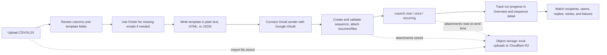

## What Feels Different In The Current App

- One calm operator surface instead of separate list, finder, sender, and launch tools.
- Gmail-based sending stays central to the current product story.
- Overview cards refresh while launches are active, so recent sequence progress does not depend on a manual reload.
- Replies are matched back from connected Gmail accounts and surfaced on sequence detail pages.
- Plain-text templates now behave more like real email composition, including paragraph, ordered-list, and unordered-list handling.
- Finder is a main workflow surface, not an afterthought.

## Notable Current Behaviors

### Sending and tracking

- Gmail sending currently goes through connected Google OAuth sender profiles.
- The send pipeline appends an open-tracking pixel to rendered HTML email output.
- Open and click tracking routes still exist in the app.
- Unsubscribe and suppression plumbing still exists in the codebase, but the operator-facing suppression dashboard is hidden from the active app flow.

### Replies

- Reply counts are part of the sequence detail view.
- Reply syncing is tied to connected Gmail senders.
- The cron flow also syncs replies when it processes campaign work.

### Template rendering

- Plain text supports pasted email body structure better than before.
- Blank lines become paragraphs.
- Lines starting with `-`, `*`, or `•` render as bullet lists.
- Lines starting with `1.`, `2.`, `3.` or `1)` render as ordered lists.

### Sequence monitoring

- Overview cards show processed-recipient progress and refresh while a run is live.
- Sequence detail pages show recipient activity, replies, delivered totals, and attention states.

## Architecture Overview

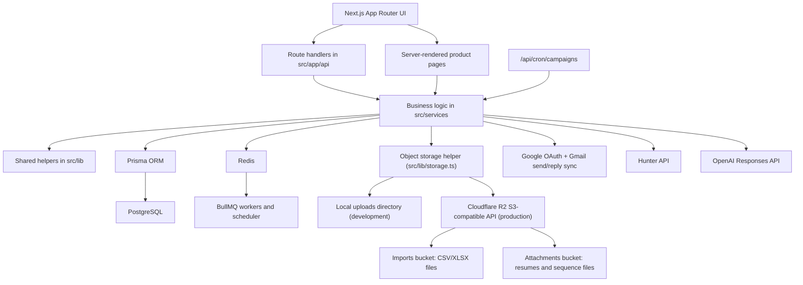

### Runtime shape

- **Frontend:** Next.js App Router + React
- **API:** route handlers in `src/app/api`
- **Domain logic:** `src/services`
- **Shared infrastructure/domain helpers:** `src/lib`
- **Persistence:** Prisma + PostgreSQL
- **Rate limiting and queueing:** Redis + BullMQ
- **Object storage:** Local uploads in development or Cloudflare R2 in production
- **Email transport:** Gmail OAuth through Nodemailer
- **Enrichment:** Hunter
- **AI assistance:** OpenAI Responses API

## Sequence Diagrams

These diagrams trace the main flows the app performs, from the browser through the API routes, services, and external systems.

### Sign up and log in

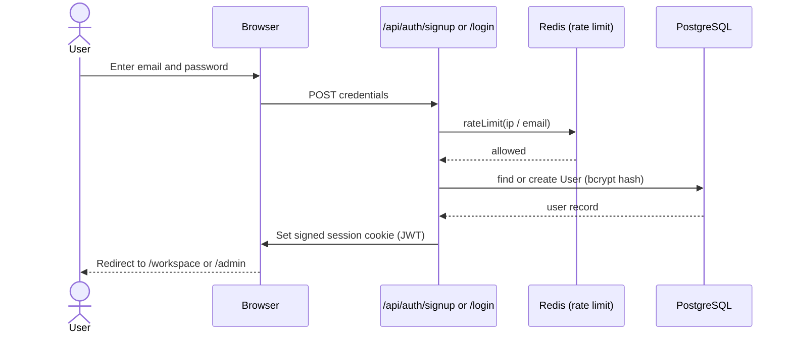

### Connect a Gmail sender (Google OAuth)

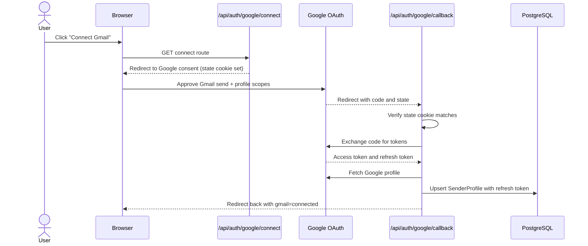

### Import a CSV/XLSX audience

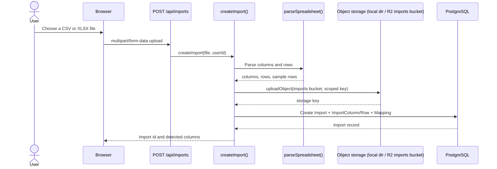

### Find a missing email (Finder)

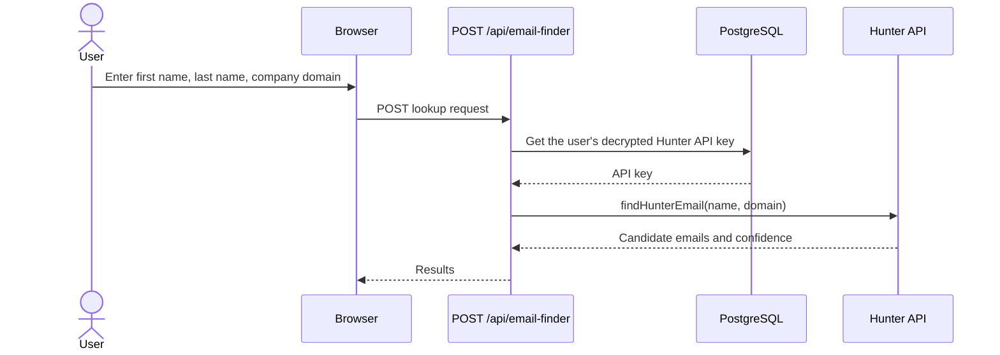

### Write a template with AI assistance

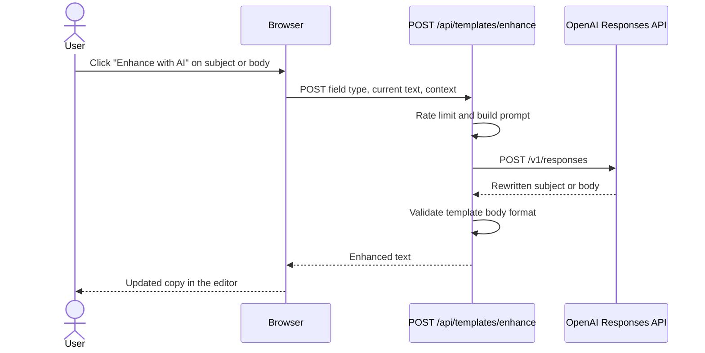

### Create a sequence with attachments

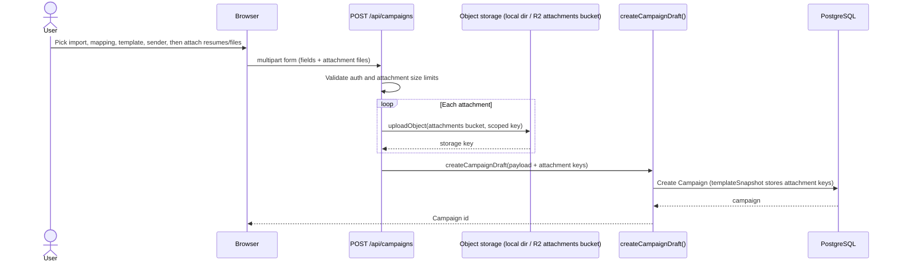

### Launch a sequence and send email

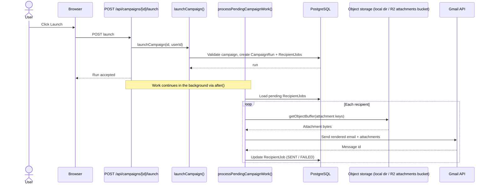

### Download a sequence attachment

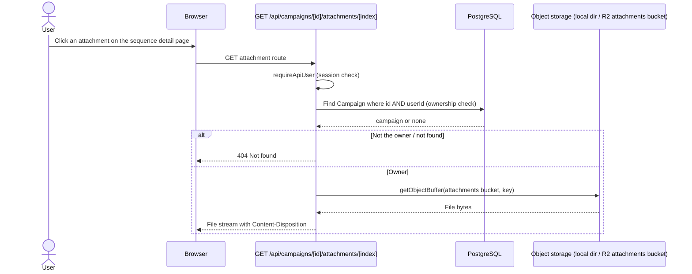

### Track an email open

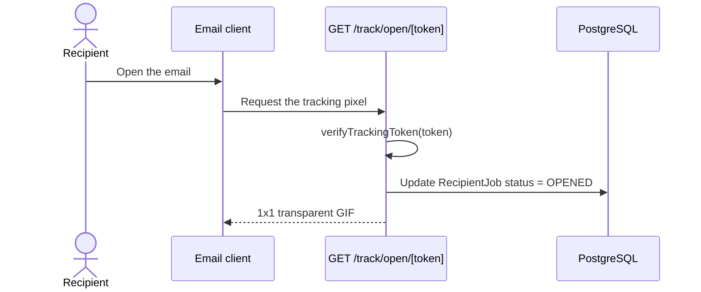

### Scheduled processing and reply sync (cron)

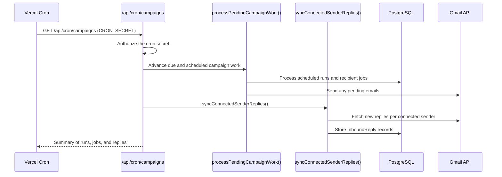

## Tech Stack

| Layer | Technology | Why it is here |
| --- | --- | --- |
| Web app | Next.js 15 + React 19 | App Router pages, SSR, and route handlers |
| Language | TypeScript | Shared types and logic across UI and backend |
| Database | PostgreSQL + Prisma | Campaign, import, template, sender, reply, and tracking data |
| Queueing | Redis + BullMQ | Rate-window support and background processing hooks |
| Auth | JWT session cookie + bcrypt + Google OAuth | Local auth plus Google login/sender connection |
| Sending | Nodemailer + Gmail OAuth2 | Send from connected Gmail accounts |
| AI | OpenAI Responses API | Subject/body enhancement and spam cleanup |
| Enrichment | Hunter API | Finder and domain search |
| File ingest | `xlsx` + CSV parsing | Spreadsheet upload and normalization |
| File/object storage | Local filesystem (development) or Cloudflare R2 (production) | Stores import spreadsheets and sequence attachments/resumes |
| Tests | Vitest | Library-level regression coverage |

## Main Routes

### Public routes

| Route | Purpose |
| --- | --- |
| `/` | Landing page |
| `/signup` | Account creation |
| `/login` | Sign in |
| `/faq` | Frequently asked questions |
| `/privacy` | Privacy page |
| `/terms` | Terms page |
| `/track/open/[token]` | Open tracking pixel |
| `/track/click/[token]` | Click tracking redirect |
| `/unsubscribe/[token]` | Legacy unsubscribe/compliance route |

### Authenticated routes

| Route | Purpose |
| --- | --- |
| `/workspace` | Overview dashboard / operator command center |
| `/finder` | Finder and domain search |
| `/imports` | Audience upload and mapping workflow |
| `/templates` | Template editor and preview workspace |
| `/campaigns` | Main sequence list and builder |
| `/campaigns/[id]` | Sequence detail, setup, monitoring, and launch controls |
| `/sequences` | Redirect alias to `/campaigns` |
| `/sequences/[id]` | Alias for sequence detail |
| `/admin` | Admin overview — metrics, user-status chart, and health strip |
| `/admin/users` | User management — searchable table and per-user inspector panel |
| `/admin/restrictions` | Restrictions — per-user access control picker and panel |
| `/admin/system-health` | System health — live runtime check cards with Recheck button |
| `/suppressions` | Redirects to `/workspace` |

## API Surface

### Authentication

- `POST /api/auth/signup`
- `POST /api/auth/login`
- `POST /api/auth/logout`
- `GET /api/auth/google/login`
- `GET /api/auth/google/login/callback`
- `GET /api/auth/google/connect`
- `GET /api/auth/google/callback`

### Imports

- `POST /api/imports`
- `PATCH /api/imports/[id]`
- `DELETE /api/imports/[id]`
- `GET /api/imports/[id]/columns`
- `POST /api/imports/[id]/mapping`
- `POST /api/imports/[id]/template-fields`

### Templates

- `GET /api/templates`
- `POST /api/templates`
- `POST /api/templates/enhance`

### Sequences / campaigns

- `POST /api/campaigns`
- `PATCH /api/campaigns/[id]`
- `DELETE /api/campaigns/[id]`
- `POST /api/campaigns/[id]/validate`
- `POST /api/campaigns/[id]/launch`
- `GET /api/campaigns/[id]/status`
- `GET /api/campaigns/[id]/attachments/[attachmentIndex]`

### Finder

- `POST /api/email-finder`
- `POST /api/domain-search`
- `GET /api/domain-search/[id]`
- `POST /api/save-api-key`

### Background processing and webhooks

- `POST /api/send`
- `GET /api/cron/campaigns`
- `POST /api/cron/campaigns`
- `POST /api/webhooks/resend`

### Health

- `GET /api/health`

### Admin

- `GET /api/admin/users`
- `PATCH /api/admin/users/[id]`
- `DELETE /api/admin/users/[id]`
- `GET /api/admin/system-health`

### Legacy/internal suppressions surface

- `GET /api/suppressions`
- `POST /api/suppressions`
- `DELETE /api/suppressions/[id]`

## Data Model Summary

| Model | Purpose |
| --- | --- |
| `User` | Operator/admin account plus per-user restrictions and settings |
| `SenderProfile` | Connected Gmail sender identity |
| `Import` | Uploaded spreadsheet metadata |
| `ImportColumn` | Normalized column definitions |
| `ImportRow` | Row-level imported audience data |
| `Mapping` | Import-to-template field mapping |
| `Template` | Subject/body, format, preview payload, and variable manifest |
| `Campaign` | Sequence definition tying import, mapping, template, sender, and schedule together |
| `CampaignRun` | A specific execution of a sequence |
| `RecipientJob` | Per-recipient delivery state, retry/error metadata, and provider references |
| `InboundReply` | Reply records matched back to sent outreach |
| `ProviderEvent` | Normalized provider webhook event data |
| `Suppression` | Legacy/internal suppression records |
| `RateLimitWindow` | Per-user send guardrails |
| `AuditLog` | Admin and operational audit records |
| `HunterDomainSearch` | Stored Finder domain search history |

## Repository Guide

```text
.
├── .nvmrc
├── README.md
├── next.config.mjs
├── package.json
├── prisma
│   ├── migrations
│   └── schema.prisma
├── src
│   ├── app
│   │   ├── (app)
│   │   │   ├── admin
│   │   │   │   ├── restrictions
│   │   │   │   ├── system-health
│   │   │   │   ├── users
│   │   │   │   ├── admin-workspace.tsx
│   │   │   │   ├── page.module.css
│   │   │   │   └── page.tsx
│   │   │   ├── campaigns
│   │   │   ├── finder
│   │   │   ├── imports
│   │   │   ├── sequences
│   │   │   ├── suppressions
│   │   │   ├── templates
│   │   │   └── workspace
│   │   ├── api
│   │   ├── faq
│   │   ├── login
│   │   ├── signup
│   │   ├── track
│   │   ├── unsubscribe
│   │   ├── privacy
│   │   └── terms
│   ├── components
│   │   ├── dashboard
│   │   ├── suppressions
│   │   ├── campaign-builder.tsx
│   │   ├── hunter-dashboard.tsx
│   │   ├── mapping-library.tsx
│   │   └── templates-workspace.tsx
│   ├── lib
│   ├── services
│   └── workers
├── uploads
├── tsconfig.json
└── vitest.config.ts
```

### Important directories

- `src/app/page.tsx`: marketing landing page
- `src/app/(app)/workspace`: overview dashboard
- `src/app/(app)/campaigns`: active sequence list and detail surface
- `src/app/(app)/templates`: template workspace
- `src/app/(app)/finder`: Finder workspace
- `src/app/(app)/imports`: import/mapping workflow
- `src/app/(app)/admin/admin-workspace.tsx`: all admin client components — `AdminOverviewSection`, `AdminUsersSection`, `AdminRestrictionsSection`, `AdminSystemHealthSection`
- `src/app/(app)/admin/page.tsx`: admin overview page (server component, fetches metrics)
- `src/app/(app)/admin/users/page.tsx`: user management page
- `src/app/(app)/admin/restrictions/page.tsx`: restrictions management page
- `src/app/(app)/admin/system-health/page.tsx`: system health page
- `src/components/nav.tsx`: app sidebar — shows admin sub-navigation when `isAdmin=true`
- `src/components/dashboard`: overview cards, activity, and sequence panels
- `src/lib/templates.ts`: template parsing, rendering, and preview logic
- `src/services/campaigns.ts`: sequence launch and processing logic
- `src/services/replies.ts`: Gmail reply sync and matching
- `src/services/hunter-keys.ts`: Hunter key storage
- `src/services/hunter-domain-searches.ts`: Finder history layer

## Environment Variables

Create a local `.env` file at the repo root with the values below. Secrets and sample env files are intentionally not committed to the repo.

| Variable | Required | Purpose |
| --- | --- | --- |
| `DATABASE_URL` | Yes | Prisma/PostgreSQL connection |
| `DATABASE_URL_UNPOOLED` | Recommended | Direct Prisma connection for migrations |
| `REDIS_URL` | Yes | Redis/BullMQ/rate-limit backend |
| `SESSION_SECRET` | Yes | JWT signing for sessions and tracking tokens |
| `MAIL_PROVIDER` | Yes | Mail backend selector, typically `gmail` |
| `GOOGLE_CLIENT_ID` | For Google auth | Google OAuth client id |
| `GOOGLE_CLIENT_SECRET` | For Google auth | Google OAuth client secret |
| `OPENAI_API_KEY` | Optional | AI enhancement and spam cleanup |
| `HUNTER_KEY_ENCRYPTION_SECRET` | For Finder | Encrypts stored Hunter API keys |
| `CRON_SECRET` | Recommended in production | Protects `/api/cron/campaigns` |
| `APP_BASE_URL` | Yes | Base URL used for redirects and tracking links |
| `OBJECT_STORAGE_MODE` | Yes | Storage backend: `local` for the local filesystem, `r2` for Cloudflare R2 |
| `LOCAL_UPLOAD_DIR` | Yes | Local upload destination, used when `OBJECT_STORAGE_MODE=local` |
| `CLOUDFLARE_R2_ACCOUNT_ID` | When `OBJECT_STORAGE_MODE=r2` | Cloudflare account id used for the R2 S3-compatible endpoint |
| `CLOUDFLARE_R2_IMPORTS_BUCKET` | When `OBJECT_STORAGE_MODE=r2` | R2 bucket name for import spreadsheets (CSV/XLSX) |
| `CLOUDFLARE_R2_ATTACHMENTS_BUCKET` | When `OBJECT_STORAGE_MODE=r2` | R2 bucket name for sequence attachments/resumes |
| `CLOUDFLARE_R2_ACCESS_KEY_ID` | When `OBJECT_STORAGE_MODE=r2` | R2 API access key id (server-side only) |
| `CLOUDFLARE_R2_SECRET_ACCESS_KEY` | When `OBJECT_STORAGE_MODE=r2` | R2 API secret access key (server-side only) |
| `CLOUDFLARE_R2_PUBLIC_BASE_URL` | Optional | Public base URL for a bucket; only set if objects are served publicly |
| `DEFAULT_FROM_EMAIL` | Optional | Default sender metadata |
| `DEFAULT_FROM_NAME` | Optional | Default sender display name |
| `ADMIN_EMAIL` | Optional | Bootstrap admin email |
| `ADMIN_PASSWORD` | Optional | Bootstrap admin password |
| `RESEND_API_KEY` | Optional | Reserved for provider/webhook expansion |
| `RESEND_WEBHOOK_SECRET` | Optional | Used by the Resend webhook route |

## Local Development

### Prerequisites

- Node.js `20.x`
- npm `10+`
- PostgreSQL
- Redis

### Setup

```bash
npm install
# create a local .env using the variables listed above
npm run prisma:generate
npm run prisma:migrate
npm run dev
```

The Node version is pinned in `.nvmrc` (`20`).

### Useful extra processes

```bash
npm run worker
npm run scheduler
```

### Tests

Vitest covers the `src/lib` regression surface (auth, scheduling, templates, validation, retry policy, spam analysis, and friends).

```bash
npm test            # one-shot run
npm run test:watch  # watch mode
```

### Notes

- The app can process campaign work inline during launches and status refreshes, so local development still works even without a fully separate worker setup.
- `/api/cron/campaigns` can also advance pending campaign work and trigger reply sync.
- Uploads default to the local `uploads/` directory. With `OBJECT_STORAGE_MODE=local`, import spreadsheets and sequence attachments are written under `LOCAL_UPLOAD_DIR`.
- Production deployments (for example on Vercel) can set `OBJECT_STORAGE_MODE=r2` to store the same files in Cloudflare R2 instead. Existing local upload records keep working in either mode.
- Linting is configured through `next lint`. Type checks run via `npx tsc --noEmit`.

## Cloudflare R2 Object Storage

Sendloom can store import spreadsheets and sequence attachments/resumes in Cloudflare R2 instead of the local filesystem. R2 is recommended for production and Vercel deployments, where the local filesystem is ephemeral. All R2 access happens server-side; credentials are never exposed to the browser.

Two separate R2 buckets are used so import spreadsheets and sequence attachments are kept apart:

- **Imports bucket** — CSV/XLSX files uploaded through the import workflow.
- **Attachments bucket** — resume/attachment files uploaded for sequences.

Local development continues to use the local filesystem with `OBJECT_STORAGE_MODE=local`.

### Setup steps

1. **Create two R2 buckets.** In the Cloudflare dashboard, open **R2** and create one bucket for import spreadsheets and another for sequence attachments (for example, `sendloom-imports` and `sendloom-attachments`).
2. **Create an R2 API token.** Under **R2 → Manage R2 API Tokens**, create a token with object read/write permissions for both buckets. Note the **Access Key ID** and **Secret Access Key**.
3. **Set the environment variables** (in Vercel project settings, or your hosting environment):
   - `OBJECT_STORAGE_MODE=r2`
   - `CLOUDFLARE_R2_ACCOUNT_ID` — your Cloudflare account id
   - `CLOUDFLARE_R2_IMPORTS_BUCKET` — the bucket name for import spreadsheets
   - `CLOUDFLARE_R2_ATTACHMENTS_BUCKET` — the bucket name for sequence attachments
   - `CLOUDFLARE_R2_ACCESS_KEY_ID` — the token's access key id
   - `CLOUDFLARE_R2_SECRET_ACCESS_KEY` — the token's secret access key
   - `CLOUDFLARE_R2_PUBLIC_BASE_URL` — optional; only set if a bucket is served publicly
4. **Deploy.** Sendloom uses Cloudflare's S3-compatible endpoint (`https://<account-id>.r2.cloudflarestorage.com`, region `auto`). When `OBJECT_STORAGE_MODE=r2`, the five required `CLOUDFLARE_R2_*` variables (account id, both bucket names, access key id, and secret) must be present or the server will fail fast on startup.

Attachments are still downloaded through the authenticated `/api/campaigns/[id]/attachments/[attachmentIndex]` route, so ownership checks remain in force regardless of storage mode.
