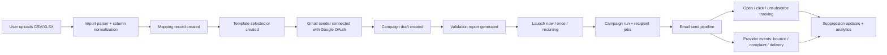
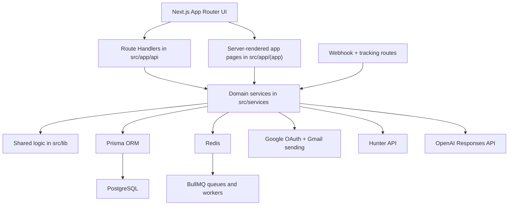

# Sendloom

Sendloom is a full-stack outreach operations platform for small teams that want to go from a raw spreadsheet to a real email sequence without juggling five separate tools.

It combines:

- audience imports from CSV/XLSX
- column detection and field mapping
- template authoring in plain text, HTML, or structured JSON
- AI-assisted copy enhancement and spam-risk cleanup
- Google OAuth sender connection for Gmail-based sending
- campaign creation, validation, launch, scheduling, and monitoring
- open, click, unsubscribe, bounce, and complaint handling
- suppression management and admin controls
- Hunter-powered email finding and domain search

The UI calls it **Sendloom**. The package name in `package.json` is still `mergepilot`, so that mismatch is expected in the current codebase.

## What This Project Does

Sendloom is designed for founders, operators, agencies, and lean GTM teams that still do a lot of outreach from spreadsheets but need more discipline than "upload CSV, blast, and hope."

Instead of splitting the workflow across separate import tools, template tools, sender tools, and tracking spreadsheets, Sendloom keeps the full outreach loop in one product:

1. Import lead data.
2. Detect and map the important fields.
3. Build a reusable template with merge variables.
4. Connect a Gmail sender.
5. Validate the campaign before launch.
6. Launch now, schedule once, or run on a recurring cadence.
7. Track delivery, opens, clicks, failures, retries, and suppressions.
8. Keep future sends safer with unsubscribe and webhook-driven suppression updates.

## How It Helps Users

This project helps users by making outreach more operationally sane:

- **Less context switching:** imports, templates, senders, finder, and campaign status live in one app.
- **Fewer sending mistakes:** validation catches missing emails, duplicates, suppressed contacts, and missing merge fields before launch.
- **Better deliverability discipline:** unsubscribe links, suppression logic, retries, and rate limiting are part of the flow.
- **Cleaner sender setup:** users can connect Gmail through Google OAuth instead of pasting SMTP credentials everywhere.
- **Faster message iteration:** templates support multiple formats, previews, attachments, and optional AI enhancement.
- **More visibility after launch:** runs, recipient status, opens, clicks, failures, and admin controls are all represented in the system.

## Core Product Areas

### 1. Imports

Users can upload CSV or XLSX files. The app parses the spreadsheet, stores the raw rows, infers column types, normalizes headers, and creates an initial field mapping.

What the code supports:

- local upload storage
- sample row extraction
- automatic detection of likely `email`, `name`, and `company` fields
- editable mapping for merge-variable generation

### 2. Templates

Templates can be authored in three formats:

- `PLAIN_TEXT`
- `HTML`
- `JSON`

Sendloom extracts merge variables, validates template bodies, stores preview payloads, and renders preview output before sending.

It also includes an AI enhancement route that can:

- improve subject lines
- rewrite body copy
- reduce spam-risk language

### 3. Finder

The Finder workspace integrates with Hunter so operators can:

- run email-finder lookups by name + domain
- run domain searches for company-wide email discovery
- store a per-user Hunter API key securely on the server

### 4. Campaigns and Sequences

Campaigns bring together:

- an import
- a mapping
- a template
- a sender profile
- a schedule rule

Before launch, a validation report checks for bad data and missing prerequisites. After launch, Sendloom tracks campaign runs and recipient jobs so the operator can see how the sequence is moving.

### 5. Tracking and Suppressions

Outgoing messages get unsubscribe and open-tracking markup added during send preparation. Provider events and unsubscribe actions can create suppressions automatically.

Suppression sources include:

- unsubscribe link
- provider webhook
- manual admin/operator action
- invalid email handling

### 6. Admin Controls

The admin area allows user-level operational controls such as disabling:

- API access
- imports
- template edits
- launches
- AI enhancements

It also records audit information for admin actions.

## End-to-End Workflow



## Architecture Overview



### Request/Runtime Shape

- **Frontend/UI:** Next.js App Router pages and React components.
- **API layer:** route handlers in `src/app/api`.
- **Business logic:** service modules in `src/services`.
- **Reusable infrastructure/domain logic:** `src/lib`.
- **Database:** Prisma + PostgreSQL.
- **Queueing/rate control:** Redis + BullMQ.
- **Background execution:** worker and scheduler scripts in `src/workers`.
- **External integrations:** Google OAuth, Gmail send transport, Hunter, OpenAI, optional Resend webhook ingestion.

## Tech Stack

| Layer | Technology | Why it is here |
| --- | --- | --- |
| Web app | Next.js 15 + React 19 | App Router UI, SSR pages, route handlers |
| Language | TypeScript | Shared types across UI, API, and services |
| Database | PostgreSQL + Prisma | Persistent campaign, import, template, sender, and tracking data |
| Queueing | Redis + BullMQ | Launch/send queues and retry-oriented background work |
| Auth | JWT session cookie + bcrypt + Google OAuth | Email/password auth plus Google sign-in/sender connection |
| Email sending | Nodemailer with Gmail OAuth2 | Send from connected Gmail accounts |
| AI | OpenAI Responses API | Subject/body enhancement and spam-safe rewrites |
| Enrichment | Hunter API | Email finder and domain search |
| File ingest | `xlsx` + CSV parsing | Spreadsheet upload and normalization |
| Tests | Vitest | Logic-level coverage for core library behavior |

## Main User-Facing Routes

### Public routes

| Route | Purpose |
| --- | --- |
| `/` | Landing page and product marketing surface |
| `/signup` | Account creation |
| `/login` | Sign in |
| `/setup` | Local environment/setup verification page |
| `/privacy` | Privacy page |
| `/terms` | Terms page |
| `/unsubscribe/[token]` | One-click unsubscribe endpoint |
| `/track/open/[token]` | Open tracking pixel route |
| `/track/click/[token]` | Click tracking redirect route |

### Authenticated operator routes

| Route | Purpose |
| --- | --- |
| `/workspace` | Operator command center / overview dashboard |
| `/campaigns` | Campaign builder and campaign list |
| `/campaigns/[id]` | Campaign detail, status, launch, and monitoring |
| `/sequences` | Sequence overview |
| `/sequences/[id]` | Sequence detail |
| `/imports` | Import management |
| `/templates` | Template workspace |
| `/finder` | Hunter-powered email finder/domain search |
| `/suppressions` | Suppression management |
| `/admin` | Admin dashboard and user controls |

## API Surface

### Authentication

- `POST /api/auth/signup`
- `POST /api/auth/login`
- `POST /api/auth/logout`
- `GET /api/auth/google/login`
- `GET /api/auth/google/login/callback`
- `GET /api/auth/google/connect`
- `GET /api/auth/google/callback`

### Imports

- `POST /api/imports`
- `PATCH /api/imports/[id]`
- `DELETE /api/imports/[id]`
- `GET /api/imports/[id]/columns`
- `POST /api/imports/[id]/mapping`
- `POST /api/imports/[id]/template-fields`

### Templates

- `GET /api/templates`
- `POST /api/templates`
- `POST /api/templates/enhance`

### Campaigns

- `POST /api/campaigns`
- `PATCH /api/campaigns/[id]`
- `DELETE /api/campaigns/[id]`
- `POST /api/campaigns/[id]/validate`
- `POST /api/campaigns/[id]/launch`
- `GET /api/campaigns/[id]/status`
- `GET /api/campaigns/[id]/attachments/[attachmentIndex]`

### Finder / enrichment

- `POST /api/email-finder`
- `POST /api/domain-search`
- `POST /api/save-api-key`

### Sending, automation, and webhooks

- `POST /api/send`
- `GET /api/cron/campaigns`
- `POST /api/cron/campaigns`
- `POST /api/webhooks/resend`

### Admin

- `GET /api/admin/users`
- `PATCH /api/admin/users/[id]`
- `DELETE /api/admin/users/[id]`

### Suppressions

- `GET /api/suppressions`
- `POST /api/suppressions`
- `DELETE /api/suppressions/[id]`

## Data Model Summary

The Prisma schema models the outreach system in layers.

| Model | Purpose |
| --- | --- |
| `User` | Operator/admin account, session metadata, per-user permissions, Hunter key storage |
| `SenderProfile` | Connected sender identity, currently centered on Gmail OAuth |
| `Import` | Uploaded spreadsheet metadata |
| `ImportColumn` | Normalized column definitions for an import |
| `ImportRow` | Row-level imported data |
| `Mapping` | Reserved fields and variable mapping derived from imports |
| `Template` | Message template, format, subject, preview data, versioning |
| `Campaign` | Ties import + mapping + template + sender + schedule together |
| `CampaignRun` | A specific execution of a campaign |
| `RecipientJob` | Per-recipient send state, retries, provider ids, and errors |
| `ProviderEvent` | Normalized webhook event record |
| `Suppression` | Unsubscribe/bounce/complaint/manual suppression data |
| `RateLimitWindow` | Send window tracking |
| `AuditLog` | Admin and operational audit trail |

## Sending and Scheduling Model

Sendloom supports both app-driven processing and worker-based processing.

### Inline/app-driven flow

The app can process campaign work directly through `processPendingCampaignWork()` during launch and status refresh flows. This keeps the system usable even when the operator is working locally.

### Queue/worker flow

The codebase also includes BullMQ workers:

- `src/workers/worker.ts`
  - launch worker
  - send worker
  - webhook worker scaffold
- `src/workers/scheduler.ts`
  - recurring run queueing
  - retry requeueing
  - completion checks

### Rate limiting

`src/lib/rate-limit.ts` enforces a `120/minute` send window using Redis.

### Tracking behavior

During send preparation, the system appends:

- an unsubscribe link
- an open tracking pixel

Clicks and opens are mapped back to recipient jobs through signed tracking tokens.

## Folder and File Guide

Here is the important shape of the repo:

```text
.
├── .env.example
├── README.md
├── next.config.mjs
├── package.json
├── prisma
│   ├── migrations
│   └── schema.prisma
├── src
│   ├── app
│   │   ├── (app)
│   │   │   ├── admin
│   │   │   ├── campaigns
│   │   │   ├── finder
│   │   │   ├── imports
│   │   │   ├── sequences
│   │   │   ├── suppressions
│   │   │   ├── templates
│   │   │   └── workspace
│   │   ├── api
│   │   ├── login
│   │   ├── signup
│   │   ├── setup
│   │   ├── track
│   │   └── unsubscribe
│   ├── components
│   │   ├── dashboard
│   │   ├── suppressions
│   │   ├── campaign-builder.tsx
│   │   ├── forms.tsx
│   │   ├── hunter-dashboard.tsx
│   │   └── templates-workspace.tsx
│   ├── lib
│   ├── services
│   ├── types
│   └── workers
├── uploads
├── vercel.json
└── vitest.config.ts
```

### Top-level files

| Path | Why it matters |
| --- | --- |
| `package.json` | Scripts, dependencies, runtime expectations |
| `.env.example` | Required environment template |
| `next.config.mjs` | Next.js configuration |
| `vercel.json` | Deployment/runtime hints for Vercel |
| `vitest.config.ts` | Test runner configuration |
| `README.md` | Project documentation |

### `prisma/`

- `schema.prisma` defines the database models for users, imports, templates, campaigns, runs, jobs, suppressions, rate limits, and audits.
- `migrations/` contains the evolution of the schema over time.

### `src/app/`

This is the App Router entrypoint.

- `src/app/page.tsx`: landing page
- `src/app/layout.tsx`: global layout, fonts, theme bootstrap, animated load screen
- `src/app/(app)/`: authenticated application surface
- `src/app/api/`: HTTP route handlers
- `src/app/login`, `signup`, `setup`: auth/setup screens
- `src/app/track` and `unsubscribe`: tracking and compliance routes

### `src/app/(app)/`

This route group contains the actual product workspace after login.

- `workspace/`: overview dashboard
- `campaigns/`: campaign builder, list, and detail views
- `imports/`: import management
- `templates/`: template authoring and preview
- `finder/`: Hunter workflows
- `suppressions/`: suppression table and form
- `sequences/`: sequence-oriented views
- `admin/`: admin-only controls

### `src/components/`

Reusable UI building blocks live here.

Important examples:

- `campaign-builder.tsx`: campaign assembly UI
- `templates-workspace.tsx`: template editing workspace
- `hunter-dashboard.tsx`: Finder UI
- `forms.tsx`: login/signup forms
- `nav.tsx`: authenticated navigation
- `dashboard/`: overview widgets, activity feed, metric cards, sequence panels
- `suppressions/`: suppression-specific UI

### `src/lib/`

This is the shared logic layer. It contains the lower-level building blocks the services and routes rely on.

Important modules:

- `auth.ts`: session creation, validation, route guards, admin checks
- `api-auth.ts`: API authorization helpers and per-capability restrictions
- `env.ts`: environment loading and validation
- `db.ts`: Prisma client
- `google.ts`: Google OAuth URL creation, token exchange, profile retrieval
- `provider.ts`: Gmail/Nodemailer sending transport
- `hunter.ts`: Hunter API integration and response normalization
- `templates.ts`: template validation, rendering, variable extraction
- `validation.ts`: campaign validation reporting
- `tracking.ts`: signed tracking token generation and tracking URLs
- `storage.ts`: local upload persistence
- `rate-limit.ts`: Redis-backed send-window guardrail
- `queue.ts`: BullMQ queue definitions
- `schedule.ts`: scheduling utilities
- `spam-analysis.ts`: spam-related helpers

### `src/services/`

This is the business logic layer.

Important modules:

- `campaigns.ts`: draft creation, validation, launch, run processing, provider event handling
- `imports.ts`: spreadsheet ingestion, column detection, mapping persistence
- `templates.ts`: template create/update/list/preview behavior
- `senders.ts`: Gmail sender upsert/list/reconnect handling
- `suppressions.ts`: suppression CRUD and lookup
- `hunter-keys.ts`: encrypted Hunter key storage and lookup
- `admin.ts`: user controls, deletion, audit logging
- `seed.ts`: bootstrap/seed support

### `src/workers/`

Background execution entrypoints:

- `worker.ts`: BullMQ workers for launch/send/webhook jobs
- `scheduler.ts`: recurring and retry-oriented loop

### `uploads/`

This is the default local storage target for uploaded files and attachments. In production, this is the place you would likely swap for S3, Vercel Blob, or another object storage layer.

## Environment Variables

Minimum local setup comes from `.env.example`.

| Variable | Required | Purpose |
| --- | --- | --- |
| `DATABASE_URL` | Yes | Prisma/Postgres connection |
| `DATABASE_URL_UNPOOLED` | Recommended | Direct Prisma connection for migrations |
| `REDIS_URL` | Yes | Redis/BullMQ/rate-limit backend |
| `SESSION_SECRET` | Yes | JWT signing for sessions and tracking tokens |
| `MAIL_PROVIDER` | Yes | Mail backend selector, typically `gmail` |
| `GOOGLE_CLIENT_ID` | For Google auth | Google OAuth client id |
| `GOOGLE_CLIENT_SECRET` | For Google auth | Google OAuth client secret |
| `OPENAI_API_KEY` | Optional | AI template enhancement and spam fixes |
| `HUNTER_KEY_ENCRYPTION_SECRET` | For Finder | Encrypts stored Hunter API keys |
| `CRON_SECRET` | Recommended in production | Protects `/api/cron/campaigns` |
| `APP_BASE_URL` | Yes | Base URL used for redirects and tracking links |
| `OBJECT_STORAGE_MODE` | Yes | Storage mode, currently `local` |
| `LOCAL_UPLOAD_DIR` | Yes | Local upload destination |
| `DEFAULT_FROM_EMAIL` | Optional | Default sender metadata |
| `DEFAULT_FROM_NAME` | Optional | Default sender display name |
| `ADMIN_EMAIL` | Optional | Bootstrap admin email |
| `ADMIN_PASSWORD` | Optional | Bootstrap admin password |
| `RESEND_API_KEY` | Optional | Present for provider/webhook expansion |
| `RESEND_WEBHOOK_SECRET` | Optional | Used by the Resend webhook route |

## Local Development

### Prerequisites

- Node.js `20.x`
- npm `10+`
- PostgreSQL
- Redis

### Setup

```bash
npm install
cp .env.example .env
npm run prisma:generate
npm run prisma:migrate
npm run dev
```

Open:

- `http://localhost:3000/` for the landing page
- `http://localhost:3000/setup` to verify environment configuration

### Useful scripts

```bash
npm run dev
npm run build
npm run test
npm run worker
npm run scheduler
```

## Testing

The repo currently includes Vitest coverage for key library behavior, including:

- auth
- schedule logic
- template rendering/validation
- spam analysis
- validation rules
- campaign attachment handling

Run tests with:

```bash
npm test
```

## Production and Deployment Notes

### Scheduled sends

For scheduled sequences to run while no operator is sitting in the UI, point an external scheduler at:

- `GET /api/cron/campaigns`

Protect it with:

- `X-Cron-Secret: <CRON_SECRET>`
- or `Authorization: Bearer <CRON_SECRET>`

### Upload storage

Uploads default to local disk. For production, replacing `src/lib/storage.ts` with an object-storage adapter is the obvious next step.

### Gmail sending

Current sending is centered on Gmail OAuth and Nodemailer. Sender reconnect handling is already built in for revoked/expired tokens.

### Resend

The codebase includes a Resend webhook route and environment variables, but `src/lib/provider.ts` currently throws for Resend in the local send path. In other words: webhook/event plumbing exists, but the active send implementation is still Gmail-first.

## Why This README Matters for New Contributors

If you are opening this repo for the first time, the most important mental model is:

- **`src/app`** is where the user enters the system.
- **`src/services`** is where product behavior is orchestrated.
- **`src/lib`** is where the lower-level rules and integrations live.
- **`prisma/schema.prisma`** tells you what the product considers important enough to persist.
- **`src/workers`** is where asynchronous delivery processing lives.

If you learn those five zones first, the rest of the codebase gets much easier to navigate.
