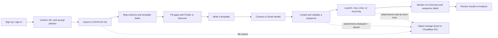
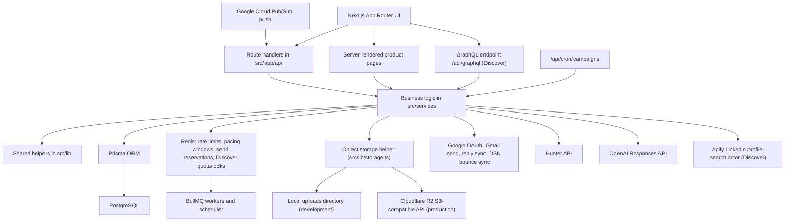
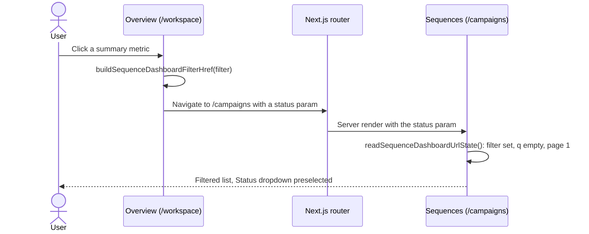

# Sendloom

Sendloom is a full-stack outreach operations app. One workspace covers the whole loop: import a list, find missing addresses, write the message, connect a Gmail sender, launch a sequence, watch it send, and analyse what came back.

Sending happens through the user's own Google OAuth-connected Gmail account. Sendloom never acts as an anonymous relay.

> **Full reference:** architecture, per-page behavior, API contracts, data model, security controls, and the operational runbook live in [DOCUMENTATION.md](./DOCUMENTATION.md). This README is the entry point and stays deliberately shorter.

The UI is branded **Sendloom**. The npm package name in `package.json` is still `mergepilot`; that mismatch is expected in the current codebase.

---

## Contents

- [Current product surface](#current-product-surface)
- [Key capabilities](#key-capabilities)
- [Typical operator workflow](#typical-operator-workflow)
- [Architecture overview](#architecture-overview)
- [Main authenticated pages](#main-authenticated-pages)
- [Main public pages](#main-public-pages)
- [Important operational behavior](#important-operational-behavior)
- [Tech stack](#tech-stack)
- [Route summary](#route-summary)
- [API summary](#api-summary)
- [Data-model summary](#data-model-summary)
- [Repository guide](#repository-guide)
- [Environment variables](#environment-variables)
- [Local development](#local-development)
- [Where to go next](#where-to-go-next)

---

## Current product surface

The operator sidebar (`src/components/nav.tsx`) is the authoritative list of live surfaces:

| Nav item | Route | What it is |
| --- | --- | --- |
| Overview | `/workspace` | Workspace landing: summary strip, quick actions, Gmail send window, recent sequences, recent activity |
| Finder | `/finder` | Hunter-backed single-email lookup and domain search |
| Discover | `/prospects` | Company/role prospect discovery (feature-flagged by `PROSPECT_GRAPH_ENABLED`) |
| Imports | `/imports` | CSV/XLSX upload, column mapping, template fields |
| Templates | `/templates` | Plain-text, HTML, and JSON template editor with AI assistance |
| Sequences | `/campaigns` | Sequence dashboard, creation wizard, and per-sequence detail |
| Analysis | `/analysis` + 4 sub-pages | Reporting workspace: Summary, Engagement, Sequences, Reliability, Senders |

Two more surfaces sit outside the primary nav:

- **Account** (`/account`) — profile, password, and connected Gmail senders. Rendered in the sidebar footer (below the theme control, above logout), not in the product nav.
- **Admin** (`/admin` and sub-pages) — replaces the operator nav entirely for `isAdmin` accounts.

Non-admin users must complete the eligibility gate at `/verify-eligibility` (18+, Terms, Privacy, Anti-Abuse) before the app shell opens.

## Key capabilities

- **Imports** — CSV/XLS/XLSX upload (25 MB cap), column detection, preview rows, template-field selection, and a three-step Upload → Map fields → Review workflow whose position is encoded in the URL.
- **Templates** — `PLAIN_TEXT`, `HTML`, and `JSON` formats, live sanitized preview, merge-variable detection, OpenAI-backed subject/body enhancement, and local spam-risk scoring.
- **Sequences** — built from an import + mapping + template + Gmail sender + schedule, with optional attachments. Immediate, one-time, and recurring schedules. Validate, launch, pause, resume, relaunch, retry-failed, and delete.
- **Gmail safety** — a rolling 24-hour per-sender send cap plus a per-minute per-sender pacing window. Both delay work; neither marks recipients as failed.
- **Delivery health** — Gmail delivery-status notifications (DSNs) are parsed, classified, and used to reclassify invalid recipients as *Skipped*, both automatically on every backend tick and on demand from the sequence detail page.
- **Analysis** — five reporting pages over user-scoped stored data with 7-day and 30-day presets, prior-period comparisons, per-metric information tooltips, and per-page CSV export.
- **Discover** — company + role + location prospect search with a shared cross-user result cache, a fixed 10 people per search, a daily search quota, "Add 10 more" expansion, and evidence-backed email-format inference.
- **Finder** — Hunter email finder and domain search with per-user encrypted API keys and saved history.
- **Account** — password set/change (session-rotating) and connected-sender removal with server-enforced safety rules.
- **Guided help** — every dashboard route has a Help button with a page-specific coachmark tour, plus a "Report issue" dialog that files a privacy-preserving incident report.

## Typical operator workflow



Every step is optional after the eligibility gate — Discover, Finder, and attachments are additive, not required.

## Architecture overview



Runtime shape:

- **Frontend:** Next.js 15 App Router + React 19
- **API:** route handlers in `src/app/api`
- **Domain logic:** `src/services`
- **Shared helpers and pure logic:** `src/lib`
- **Persistence:** Prisma + PostgreSQL
- **Rate limiting, pacing, queueing:** Redis + BullMQ
- **Object storage:** local `uploads/` in development, Cloudflare R2 in production
- **Email transport:** Gmail API via OAuth2 (Nodemailer `MailComposer` builds the MIME)
- **Charts:** Recharts (Analysis)

The live send path is the cron/inline processor (`processPendingCampaignWork`). BullMQ workers exist and share the same safety gates, but the polling processor is what production runs.

## Main authenticated pages

### Overview — `/workspace`

Header with **Create Sequence** and **Import List**, then a four-cell summary strip, quick actions, a recent-sequences preview, the Gmail send-window card, and a recent-activity feed.

- Summary cells: **Active sequences**, **Sent (24h)**, **Needs attention**, **Lists ready**. The first three link into the Sequences dashboard with a preselected status filter; "Lists ready" links to Imports.
- Recent sequences shows the **3** most recently updated sequences, with a client-side search over name and summary, plus row actions (view, pause/resume, relaunch, delete). "View all sequences" opens `/campaigns`.
- The panel auto-refreshes every 4 seconds while a run is live and pauses while the tab is hidden.
- The Gmail send-window card shows the rolling 24-hour usage for the combined user window plus the primary connected sender.
- Recent activity is derived from domain tables (runs, imports, templates, Discover searches and expansions, Finder lookups, confirmed delivery failures) — not from the admin audit console.

Metric → filter navigation:



The status parameters are `active`, `sent`, and `needs-attention`. Because the link carries no `q` or `page`, search resets to empty and pagination resets to page 1; browser Back returns to Overview.

### Sequences — `/campaigns`

Four summary cards (Active, Replies, Sent in the last 24h, Scheduled runs), a **Sequences health** panel listing at most two attention items, and the sequence list.

The list has a control bar — result count, debounced search, a Status dropdown, and an Email accounts dropdown — over a table of **5 rows per page**. Search, status, sender, and page are all reflected in the URL (`q`, `status`, `sender`, `page`) via `history.replaceState`, so the state survives reload and deep links but does not spam browser history.

`/campaigns/new` is the creation wizard. `/campaigns/[id]` is the detail page: setup summary, validation state, schedule, attachments, delivery metrics, paginated recipient activity, and the action bar (launch, revalidate, **Check bounces**, pause/resume, edit schedule, retry failed, delete). `/sequences`, `/sequences/new`, and `/sequences/[id]` are aliases.

### Analysis — `/analysis`

Five pages sharing one workspace shell (header, date-range control, Export button, tab bar):

| Page | Route | Question it answers |
| --- | --- | --- |
| Summary | `/analysis` | How is outreach performing overall? |
| Engagement | `/analysis/engagement` | How do recipients interact, and when? |
| Sequences | `/analysis/sequences` | Which sequences and templates perform best? |
| Reliability | `/analysis/reliability` | What failed, what is retryable, what is waiting? |
| Senders | `/analysis/senders` | How healthy is each connected Gmail sender? |

Only **7-day** and **30-day** presets are supported. Any other requested range — reversed, future, arbitrary custom, or longer than 30 days — normalizes back to the last 7 UTC calendar days. Every page compares against the immediately preceding equal-length period, and rankings require at least **20** confirmed sends. Export produces a client-side CSV of the current page and range.

See [DOCUMENTATION.md → Analysis workspace](./DOCUMENTATION.md#27-analysis-workspace) for per-page metric definitions.

### Imports — `/imports`

Two modes on one route. The **library** lists finalized imports with search and per-import editing; the **workflow** is the three-step Upload → Map fields → Review flow. The workflow is URL-identifiable (an import context id or `step=upload`), and leaving it uses `router.replace` so a Back press does not re-enter it.

### Templates — `/templates`

Library plus create/edit wizard, with format switching, sanitized preview, merge-variable detection, AI enhancement, and spam-risk cleanup.

### Discover — `/prospects`

`/prospects` is the Search History list (one row per company). `/prospects/[searchId]` is the detail workspace: company summary, email-format editor, role groups, people table, inline "Search this company", **Add 10 more**, and XLSX export. Feature-flagged by `PROSPECT_GRAPH_ENABLED`.

### Finder — `/finder`

Hunter email finder, domain search, per-user encrypted key storage, and saved domain-search history.

### Account — `/account`

Profile card (email, account type, created/last-login/last-seen), password set or change, and the connected-sender list with a remove action. Removal is refused server-side when the sender is the only one or when active/scheduled sequences reference it.

### Admin — `/admin`, `/admin/users`, `/admin/restrictions`, `/admin/system-health`, `/admin/activity`, `/admin/incidents`

Aggregate metrics, per-user inspection and restrictions, live runtime health checks, audit-log search, and incident triage.

## Main public pages

`/` (landing), `/login`, `/signup`, `/faq`, `/privacy`, `/terms`, `/abuse`, `/verify-eligibility`, plus the token routes `/track/open/[token]`, `/track/click/[token]`, and `/unsubscribe/[token]`.

Visitors with a valid session are redirected from the landing and auth pages straight to `/workspace`.

## Important operational behavior

### Confirmed sends, not delivered mail

Sendloom records a **confirmed send** — Gmail accepted the message — in the `SendLedger` table. It does not observe inbox placement. Everywhere the product says "Sent", it means confirmed sends. Opens are *tracked* opens (pixel loads, affected by image blocking), and replies are *matched* replies (Gmail messages correlated back to a recipient job by references/thread).

### Gmail rolling 24-hour cap

- Default **450** confirmed sends per connected sender per rolling 24 hours; override with `GMAIL_DAILY_SEND_SAFETY_LIMIT`.
- Rolling window, not a midnight reset: `resetAt` is the oldest counted send + 24 hours.
- Hitting the cap pauses the `CampaignRun` with `progressSnapshot.pauseReason = "DAILY_SEND_LIMIT"` and `pauseResumesAt`. The in-flight recipient stays `PENDING`, never `FAILED`.
- `resumeCampaignRunsBlockedByDailyLimit` releases those runs once the reset passes. Manual pauses are left alone.
- A Redis sorted-set reservation guards the race between "decide to send" and "write the ledger row"; the DB ledger remains the source of truth.

### Gmail per-minute pacing

- `GMAIL_SENDS_PER_MINUTE` (default **3**) per connected sender, enforced by an atomic Redis per-minute window.
- Parallel sequences for one sender share that window round-robin so no sequence starves; different senders are independent.
- A full window defers the recipient with a future `nextRetryAt` and a `GMAIL_SENDER_PACING` marker. Gmail is not called, `retryCount` is not incremented, and nothing is marked failed.
- `GMAIL_SENDER_CONCURRENCY` (default **2**) caps simultaneous sends; it never bypasses pacing.

### Delivery failures and invalid recipients

- A Gmail mailbox watch plus a Cloud Pub/Sub push endpoint feeds delivery-status notifications into `src/lib/gmail-dsn.ts`, which classifies each as permanent or temporary.
- Invalid addresses become the **Skipped** outcome with an exact-email `INVALID_EMAIL` suppression — never a generic `FAILED` row, and never retried.
- Send-time rejections that look like a bad recipient address are classified as `HARD_BOUNCE_RECIPIENT` and take the same path.
- Automatic monitoring runs on every cron/scheduler tick after send work: at most one check per 5 minutes while a run is `RUNNING`, then one final check and one delayed follow-up after completion. The cadence checkpoint lives in `CampaignRun.progressSnapshot.bounceMonitor`.
- The **Check bounces** button on sequence detail runs the same shared service on demand.

### Engagement tracking never resurrects a terminal outcome

Open and click tracking use conditional `updateMany` writes: opens only advance `SENT`, clicks only advance `SENT` or `OPENED`. A pixel or link fetched from a quoted bounce report can no longer flip a confirmed invalid address back to "Opened".

### Attachment deduplication

Attachments are content-addressed. `findOrCreateAttachmentAsset` hashes the bytes (SHA-256), looks for an existing `AttachmentAsset` for that user keyed on `(userId, sha256, sizeBytes, contentType)`, and uploads to `users/<userId>/attachments/<sha256>` only on a miss. Campaign `templateSnapshot.attachments` entries keep the per-upload display name and `storagePath`, so legacy snapshots that predate dedupe keep working unchanged. Downloads still go through the authenticated, ownership-checked route.

### Free sequence limits and the waiting queue

- Free accounts retain up to **50** sequences and may have up to **10** concurrently in the send pipeline. The owner account is exempt through a server-only entitlement helper.
- Retention is enforced under a per-user PostgreSQL advisory lock in the same transaction as `Campaign.create`, and attachment uploads are deferred until the gate passes.
- A run consumes a slot only while `QUEUED`/`RUNNING` **and** holding a durable `executionSlotClaimedAt`. `WAITING_FOR_SLOT` sends nothing and is promoted FIFO by `waitingForSlotAt ASC, id ASC`.
- The final processor and the BullMQ workers both re-check the claim, so a direct API call or stale job cannot bypass it.

### Replies

Reply sync runs against connected Gmail senders on cron ticks and surfaces on sequence detail, the Sequences dashboard, and Analysis. Only replies matched back to a recipient job count — not all mailbox traffic.

## Tech stack

| Layer | Technology | Why it is here |
| --- | --- | --- |
| Web app | Next.js 15 + React 19 | App Router pages, server components, route handlers |
| Language | TypeScript | Shared types across UI, services, and libs |
| Database | PostgreSQL + Prisma | Sequences, imports, templates, senders, replies, ledger, prospects |
| Redis | ioredis | Rate limits, pacing windows, send reservations, Discover quota and locks |
| Queues | BullMQ | Background worker path (the cron processor is the live send path) |
| Auth | JWT session cookie + bcrypt + Google OAuth | Password accounts, Google login, Gmail sender connection |
| Sending | Gmail API via OAuth2 + Nodemailer MIME building | Send from the user's own mailbox |
| Charts | Recharts | Analysis visualizations |
| AI | OpenAI Responses API | Template enhancement and Discover email-format web search |
| Enrichment | Hunter API, Apify actor | Finder lookups and Discover profile search |
| File ingest | `xlsx` + `csv-parse` | Spreadsheet upload and normalization |
| Object storage | Local filesystem or Cloudflare R2 | Import files and sequence attachments |
| Tests | Vitest | Library, service, and source-assertion coverage |

## Route summary

### Public routes

| Route | Purpose |
| --- | --- |
| `/` | Landing page (redirects signed-in visitors to `/workspace`) |
| `/signup`, `/login` | Account creation and sign-in |
| `/faq` | Frequently asked questions |
| `/privacy`, `/terms`, `/abuse` | Legal and anti-abuse policy pages |
| `/verify-eligibility` | 18+, Terms, Privacy, Anti-Abuse confirmation gate |
| `/track/open/[token]` | Open-tracking pixel |
| `/track/click/[token]` | Click-tracking redirect (same-origin only) |
| `/unsubscribe/[token]` | Unsubscribe / suppression route |

### Authenticated operator routes

| Route | Purpose |
| --- | --- |
| `/workspace` | Overview |
| `/finder` | Finder and domain search |
| `/prospects` | Discover — Search History list |
| `/prospects/[searchId]` | Discover — one search's company, roles, people, and export |
| `/imports` | Import library and Upload → Map → Review workflow |
| `/templates` | Template library and editor |
| `/campaigns` | Sequences dashboard |
| `/campaigns/new` | Sequence creation wizard |
| `/campaigns/[id]` | Sequence detail and controls |
| `/analysis` | Analysis — Summary |
| `/analysis/engagement` | Analysis — Engagement |
| `/analysis/sequences` | Analysis — Sequences |
| `/analysis/reliability` | Analysis — Reliability |
| `/analysis/senders` | Analysis — Senders |
| `/account` | Profile, password, connected senders |
| `/sequences`, `/sequences/new`, `/sequences/[id]` | Aliases for the `/campaigns` surfaces |
| `/suppressions` | Redirects to `/workspace` (backend suppression APIs remain) |

### Admin routes

`/admin`, `/admin/users`, `/admin/restrictions`, `/admin/system-health`, `/admin/activity`, `/admin/incidents`.

## API summary

All operator endpoints require an authenticated, eligible, unrestricted session; unsafe methods additionally require the CSRF double-submit token.

### Authentication and account

- `POST /api/auth/signup`, `POST /api/auth/login`, `POST /api/auth/logout`
- `GET /api/auth/google/login`, `GET /api/auth/google/login/callback`
- `GET /api/auth/google/connect`, `GET /api/auth/google/callback`
- `GET /api/auth/eligibility-status`, `POST /api/auth/verify-eligibility`, `POST /api/auth/report-ineligible`
- `GET /api/account` — profile + connected senders (never returns hashes or tokens)
- `POST /api/account/password` — set or change the password; rotates the session
- `DELETE /api/account/senders/[id]` — remove or disconnect a connected sender
- `GET /api/csrf`

### Imports and templates

- `POST /api/imports`, `PATCH /api/imports/[id]`, `DELETE /api/imports/[id]`
- `GET /api/imports/[id]/columns`, `POST /api/imports/[id]/mapping`, `POST /api/imports/[id]/template-fields`
- `GET /api/templates`, `POST /api/templates`, `POST /api/templates/enhance`

### Sequences

- `POST /api/campaigns`, `PATCH /api/campaigns/[id]`, `DELETE /api/campaigns/[id]`
- `POST /api/campaigns/[id]/validate`, `/launch`, `/wait-for-slot`, `/pause`, `/resume`, `/retry-failed`
- `POST /api/campaigns/[id]/sync-bounces` — manual delivery-status check (6/min per user)
- `GET /api/campaigns/[id]/status`, `GET /api/campaigns/[id]/recipient-activity`
- `GET /api/campaigns/[id]/attachments/[attachmentIndex]`
- `GET /api/send-window`, `POST /api/send` (test email to the authenticated user only)

### Analysis

- `GET /api/analysis/[page]?from=YYYY-MM-DD&to=YYYY-MM-DD` — `page` is one of `overview`, `engagement`, `sequences`, `reliability`, `senders`. Returns a normalized page payload with `private, no-store` caching. Unknown pages return 404; unsupported ranges normalize to the last 7 days rather than erroring.

### Finder and Discover

- `POST /api/save-api-key`, `POST /api/email-finder`, `POST /api/domain-search`, `GET /api/domain-search/[id]`
- `POST /api/graphql` — Discover graph (gated by `PROSPECT_GRAPH_ENABLED`)
- `GET`/`DELETE /api/prospects/exports/[id]` — prepared XLSX export download

### Delivery health, background, and webhooks

- `POST /api/senders/[id]/sync-bounces`
- `GET`/`POST /api/cron/campaigns` — send work, reply sync, watch renewal, bounce sync, disposition repair, automatic bounce monitoring
- `POST /api/webhooks/gmail-pubsub`, `POST /api/webhooks/resend`

### Incidents, admin, health

- `POST /api/incidents`, `POST /api/incidents/events`
- `GET /api/admin/users`, `PATCH`/`DELETE /api/admin/users/[id]`, `GET /api/admin/users/search`, `/[id]/summary`, `/[id]/activity`
- `GET /api/admin/incidents`, `PATCH /api/admin/incidents/[id]`, `GET /api/admin/system-health`
- `GET /api/health`
- `GET`/`POST /api/suppressions`, `DELETE /api/suppressions/[id]` (internal; no operator UI)

## Data-model summary

| Model | Purpose |
| --- | --- |
| `User` | Account, auth state, admin flag, eligibility/policy timestamps, per-user restrictions, encrypted Hunter key |
| `SenderProfile` | Connected Gmail sender identity, OAuth refresh token, reply-sync and bounce-watch state |
| `Import`, `ImportColumn`, `ImportRow` | Uploaded spreadsheet metadata, column definitions, row-level audience data |
| `Mapping` | Import-column → reserved-field and merge-variable mapping |
| `Template` | Subject/body, format, preview payload, variable manifest |
| `Campaign` | Sequence definition plus template/mapping/sender snapshots and schedule config |
| `CampaignRun` | One execution: status, counts, `progressSnapshot` (pause reason, bounce-monitor checkpoint) |
| `RecipientJob` | Per-recipient delivery state, retry/error metadata, provider message id |
| `AttachmentAsset` | Content-addressed attachment dedupe row, unique per `(userId, sha256, sizeBytes, contentType)` |
| `SendLedger` | Source of truth for confirmed Gmail sends; backs the rolling 24-hour cap and Analysis |
| `InboundReply` | Gmail reply matched back to a recipient job |
| `ProviderEvent` | Normalized provider/tracking events (opens, clicks, webhook events) |
| `Suppression` | Per-user suppressed address (unsubscribe, hard bounce, invalid, complaint, manual) |
| `AuditLog` | Operational and security audit trail |
| `IncidentReport` | Privacy-preserving error and manual issue reports |
| `HunterDomainSearch` | Saved Finder domain-search history |
| `ProspectCompany` | Discover company node with canonical key, email domain, pattern, and discovery status |
| `ProspectCompanyPosition` | Role-category node under a company |
| `ProspectPerson` | Discovered professional with an inferred (never verified) business email |
| `ProspectSearch` | One Discover request and its pipeline status |
| `ProspectSearchPerson` | Per-search allocation grant — the ownership boundary between the shared cache and what a user receives |
| `DiscoverSearchCache` / `DiscoverSearchExpansion` | Shared cross-user result cache and "Add 10 more" expansion records |
| `ProspectTitleClassification` | Global cache of AI title → category classifications |
| `RateLimitWindow` | Legacy table; active rate limiting is Redis-backed |

Full field-level notes and the migration history are in [DOCUMENTATION.md → Data Model Documentation](./DOCUMENTATION.md#9-data-model-documentation).

## Repository guide

```text
.
├── .env.example
├── .nvmrc                     # 22
├── README.md
├── DOCUMENTATION.md
├── prisma
│   ├── migrations
│   └── schema.prisma
├── scripts                    # one-off repair/backfill scripts (tsx)
├── src
│   ├── app
│   │   ├── (app)              # authenticated shell
│   │   │   ├── account
│   │   │   ├── admin
│   │   │   ├── analysis       # page.tsx + engagement/sequences/reliability/senders
│   │   │   ├── campaigns      # dashboard, new, [id]
│   │   │   ├── finder
│   │   │   ├── imports
│   │   │   ├── prospects      # Discover list + [searchId]
│   │   │   ├── sequences      # aliases
│   │   │   ├── templates
│   │   │   └── workspace      # Overview
│   │   ├── api
│   │   ├── track
│   │   ├── unsubscribe
│   │   └── (public pages: login, signup, faq, privacy, terms, abuse, verify-eligibility)
│   ├── components
│   │   ├── account            # account-dashboard
│   │   ├── analysis           # analysis-workspace, analysis-charts, analysis-ui
│   │   ├── dashboard          # Overview command center, send window, sequence panel, activity feed
│   │   ├── incident           # help-report-dialog
│   │   ├── manual             # shared help/tour engine
│   │   └── prospects          # Discover list/detail views
│   ├── graphql                # Discover schema, resolvers, loaders
│   ├── lib                    # pure helpers and shared domain logic
│   ├── manuals                # one ManualConfig per route area + registry
│   ├── services               # business logic
│   └── workers                # BullMQ worker + standalone scheduler
├── uploads                    # local object storage in development
└── vitest.config.ts
```

Notable files:

- `src/components/nav.tsx` — sidebar, collapsed persistence, nested Analysis navigation, Account footer item
- `src/components/workspace-page-header.tsx` — the shared page header used by list/dashboard pages
- `src/components/dashboard/overview-command-center.tsx` — Overview server component
- `src/app/(app)/campaigns/sequence-dashboard.tsx` — Sequences control bar, table, and pagination
- `src/lib/sequence-dashboard.ts` / `src/lib/sequence-dashboard-url.ts` — pure filter/pagination logic and URL-state encoding
- `src/lib/analysis.ts`, `src/lib/analysis-types.ts`, `src/lib/analysis-export.ts`, `src/services/analysis.ts` — Analysis range normalization, payload types, CSV builder, aggregation
- `src/lib/account.ts` / `src/services/account.ts` — account view types and sender-removal rules
- `src/lib/daily-send-limit.ts` — rolling 24-hour window and confirmed-send reader
- `src/services/attachment-assets.ts` — content-addressed attachment dedupe
- `src/services/sequence-bounce-check.ts` / `sequence-bounce-monitor.ts` — manual and automatic delivery-health checks
- `src/lib/gmail-dsn.ts` — DSN detection, parsing, and classification
- `src/manuals/index.ts` — route → guided-tour registry

## Environment variables

Copy `.env.example` to `.env` and fill it in. Never commit real secrets.

### Core

| Variable | Required | Purpose |
| --- | --- | --- |
| `DATABASE_URL` | Yes | Prisma/PostgreSQL connection |
| `DATABASE_URL_UNPOOLED` | Recommended | Direct connection used by Prisma `directUrl` for migrations |
| `REDIS_URL` | Yes | Rate limits, pacing windows, reservations, BullMQ |
| `SESSION_SECRET` | Yes | JWT signing for session cookies **only** |
| `TRACKING_SECRET` | Production | JWT signing for open/click/unsubscribe tokens. Must differ from `SESSION_SECRET` — tracking tokens travel in every email |
| `APP_BASE_URL` | Yes | Base URL for redirects and tracking links |
| `CRON_SECRET` | Production | Protects `/api/cron/campaigns`; the route fails closed without it |

### Mail and Gmail safety

| Variable | Required | Purpose |
| --- | --- | --- |
| `MAIL_PROVIDER` | Yes | Backend selector; `gmail` is the active path |
| `GOOGLE_CLIENT_ID` / `GOOGLE_CLIENT_SECRET` | For Google auth | OAuth client credentials |
| `DEFAULT_FROM_EMAIL` / `DEFAULT_FROM_NAME` | Optional | Default sender metadata |
| `GMAIL_DAILY_SEND_SAFETY_LIMIT` | Optional | Confirmed sends per sender per rolling 24h. Default `450` |
| `GMAIL_SENDS_PER_MINUTE` | Optional | Sends per minute per connected sender. Default `3`. Raise only with verified mailbox headroom |
| `GMAIL_SENDER_CONCURRENCY` | Optional | Simultaneous Gmail sends. Default `2` |
| `RESEND_API_KEY` | Optional | Reserved for provider expansion |
| `RESEND_WEBHOOK_SECRET` | Production, if Resend used | HMAC secret; the webhook fails closed without it |

### Gmail bounce monitoring (Pub/Sub push)

| Variable | Required | Purpose |
| --- | --- | --- |
| `GMAIL_PUBSUB_TOPIC` | For bounce monitoring | Topic the Gmail mailbox watch publishes to |
| `GMAIL_PUBSUB_VERIFICATION_TOKEN` | One of these two | Shared secret appended to the push endpoint URL |
| `GMAIL_PUBSUB_AUDIENCE` | One of these two | Expected audience of the Pub/Sub OIDC push token |
| `GMAIL_PUBSUB_SERVICE_ACCOUNT` | Optional | Service-account email the OIDC token must carry |

Without either the verification token or the OIDC audience, the webhook rejects everything.

### Storage

| Variable | Required | Purpose |
| --- | --- | --- |
| `OBJECT_STORAGE_MODE` | Yes | `local` or `r2` |
| `LOCAL_UPLOAD_DIR` | When `local` | Local upload destination |
| `CLOUDFLARE_R2_ACCOUNT_ID` | When `r2` | Cloudflare account id for the S3-compatible endpoint |
| `CLOUDFLARE_R2_IMPORTS_BUCKET` | When `r2` | Bucket for import spreadsheets |
| `CLOUDFLARE_R2_ATTACHMENTS_BUCKET` | When `r2` | Bucket for sequence attachments |
| `CLOUDFLARE_R2_ACCESS_KEY_ID` / `CLOUDFLARE_R2_SECRET_ACCESS_KEY` | When `r2` | Server-side R2 API credentials |
| `CLOUDFLARE_R2_PUBLIC_BASE_URL` | Optional | Only if a bucket is served publicly |

With `OBJECT_STORAGE_MODE=r2`, the five required `CLOUDFLARE_R2_*` values must be present or the server fails fast at startup.

### Integrations and AI

| Variable | Required | Purpose |
| --- | --- | --- |
| `OPENAI_API_KEY` | Optional | Template enhancement and Discover email-format web search |
| `HUNTER_KEY_ENCRYPTION_SECRET` | Production | Encrypts stored Hunter API keys. Must differ from `SESSION_SECRET` |
| `APIFY_API_TOKEN` | For Discover | Apify LinkedIn profile-search actor token |
| `APIFY_PROSPECT_ACTOR_ID` | Optional | Actor id/slug. Default `harvestapi/linkedin-profile-search` |

### Incident reporting

| Variable | Required | Purpose |
| --- | --- | --- |
| `REPORT_PSEUDONYM_SECRET` | Production | HMAC key for the anonymous reporter pseudonym. Server-only |
| `REPORT_IDENTITY_ENCRYPTION_KEY` | Production | AES-256-GCM key for the reversible internal reporter reference. Server-only |

Both fall back to `SESSION_SECRET` in development. Never prefix either with `NEXT_PUBLIC_`.

### Discover and prospect graph

| Variable | Required | Purpose |
| --- | --- | --- |
| `PROSPECT_GRAPH_ENABLED` | Optional | Master flag for Discover / the GraphQL backend. Default `false` |
| `GRAPHQL_GRAPHIQL_ENABLED` | Optional | GraphiQL playground locally. Default `false`; never serves in production |
| `LOCAL_PROSPECT_MAX_RESULTS` | Optional | Hard cap on results per search. Default `25` |
| `PROSPECT_EXPORT_MAX_ROWS` | Optional | Max rows in one prospect export. Default `5000` |
| `DISCOVER_RESULTS_PER_SEARCH` | Optional | Fixed people per processed search. Default `10` |
| `DISCOVER_DAILY_SEARCH_LIMIT` | Optional | Processed searches per user per UTC day. Default `4` |
| `DISCOVER_QUOTA_EXEMPT_EMAILS` | Optional | Server-only allowlist exempt from the **daily** quota only. Resolved from the session, never a request body |
| `DISCOVER_SHARED_CACHE_TTL_DAYS` | Optional | Freshness window for the shared result cache. Default `30` |
| `DISCOVER_SHARED_CACHE_VERSION` | Optional | Cache schema version in the fingerprint. Default `v1` |
| `DISCOVER_EXPANSION_BATCH_SIZE` | Optional | New people per "Add 10 more". Default `10` |
| `DISCOVER_EXPANSION_MAX_PROVIDER_PAGES` | Optional | Provider continuation pages per expansion. Default `5` |
| `PROSPECT_EMAIL_DISCOVERY_PROVIDER` | Optional | `openai_web_search` (default) or `none` |
| `PROSPECT_EMAIL_FORMAT_WEB_SEARCH_ENABLED` | Optional | Master switch for AI web search. Default `true` |
| `PROSPECT_EMAIL_FORMAT_MAX_WEB_RESULTS` | Optional | Public results weighed per company. Default `5` |
| `PROSPECT_EMAIL_FORMAT_AI_HOURLY_LIMIT` / `..._DAILY_LIMIT` | Optional | Per-user AI email-format search caps. Defaults `5` / `20` |
| `WEB_SEARCH_PROVIDER` | Optional | Legacy scraper: `none` (default), `serper`, `brave` |
| `SERPER_API_KEY` / `BRAVE_SEARCH_API_KEY` | With that provider | Keys for the legacy scraper path |
| `PROSPECT_AI_ENABLED` | Optional | Enables AI company/role/pattern steps. Default `true` |
| `PROSPECT_AI_MODEL` | Optional | Overrides both per-task defaults; blank keeps them |
| `PROSPECT_AI_REASONING_EFFORT` | Optional | `none`\|`low`\|`medium`\|`high`\|`xhigh`. Default `low` |
| `PROSPECT_AI_MAX_COMPANY_CALLS_PER_SEARCH` | Optional | Default `2` |
| `PROSPECT_AI_MAX_ROLE_CALLS_PER_SEARCH` | Optional | Default `1` |
| `PROSPECT_AI_MAX_PATTERN_CALLS_PER_SEARCH` | Optional | Default `1` |
| `PROSPECT_AI_MAX_UNIQUE_TITLES` | Optional | Default `100` |
| `PROSPECT_ALLOW_LOW_CONFIDENCE_EMAILS` | Optional | Local testing only. Default `false` |

### Admin bootstrap

`ADMIN_EMAIL` and `ADMIN_PASSWORD` bootstrap the first admin. Admin authority afterwards comes only from the `users.isAdmin` column.

> **Security notes.** Generate each secret with `openssl rand -hex 32`. Keep `SESSION_SECRET`, `TRACKING_SECRET`, `HUNTER_KEY_ENCRYPTION_SECRET`, and the two `REPORT_*` secrets distinct. Set `CRON_SECRET` before deploying — the cron route refuses to run without it in production. Response security headers (HSTS, CSP, X-Frame-Options) are emitted by `next.config.mjs`; confirm the deployed host returns them.

## Local development

### Prerequisites

- Node.js **22.x** (pinned in `.nvmrc`; `package.json` requires `22.x` and npm `>=10`)
- npm 10+
- PostgreSQL
- Redis

### Setup

```bash
npm install
```

```bash
cp .env.example .env
```

```bash
npm run prisma:generate
```

```bash
npm run prisma:migrate
```

```bash
npm run dev
```

### Extra processes

```bash
npm run worker
```

```bash
npm run scheduler
```

### Checks

```bash
npm test
```

```bash
npm run typecheck
```

> `npm run build` runs `prisma migrate deploy` first, so it mutates the database pointed at by `DATABASE_URL`. Use `npx next build` when you only want to compile.

### Notes

- The app processes campaign work inline during launches and status refreshes, so local development works without a separate worker.
- `/api/cron/campaigns` advances pending campaign work, syncs replies, renews Gmail watches, and runs automatic bounce monitoring.
- Uploads default to the local `uploads/` directory with `OBJECT_STORAGE_MODE=local`. Production should use `r2`.
- Vitest covers pure library logic, service behavior, and source assertions that pin UI structure; some tests deliberately assert on component source text rather than rendering.

## Where to go next

[DOCUMENTATION.md](./DOCUMENTATION.md) is the exhaustive reference. Frequently used sections:

- [Current Product Surface](./DOCUMENTATION.md#4-current-product-surface)
- [Route Map](./DOCUMENTATION.md#8-route-map)
- [Data Model Documentation](./DOCUMENTATION.md#9-data-model-documentation)
- [Gmail Sending System](./DOCUMENTATION.md#10-gmail-sending-system) and [Gmail Safety Controls](./DOCUMENTATION.md#11-gmail-safety-controls)
- [Storage System](./DOCUMENTATION.md#13-storage-system)
- [Security Controls](./DOCUMENTATION.md#15-security-controls)
- [Environment Variables](./DOCUMENTATION.md#17-environment-variables)
- [Operational Runbook](./DOCUMENTATION.md#20-operational-runbook)
- [Prospect Graph Backend / Discover](./DOCUMENTATION.md#23-prospect-graph-backend-local-graphql-prototype)
- [Dashboard Help System](./DOCUMENTATION.md#24-dashboard-help-system-in-app-guided-tours)
- [Error Recovery and Incident Reporting](./DOCUMENTATION.md#25-error-recovery-and-incident-reporting)
- [Automatic Delivery-Failure Detection](./DOCUMENTATION.md#26-automatic-delivery-failure-detection-gmail-bounce-monitoring)
- [Analysis Workspace](./DOCUMENTATION.md#27-analysis-workspace)
- [Account Workspace And Sender Management](./DOCUMENTATION.md#28-account-workspace-and-sender-management)
- [Attachment Lifecycle](./DOCUMENTATION.md#29-attachment-lifecycle)
